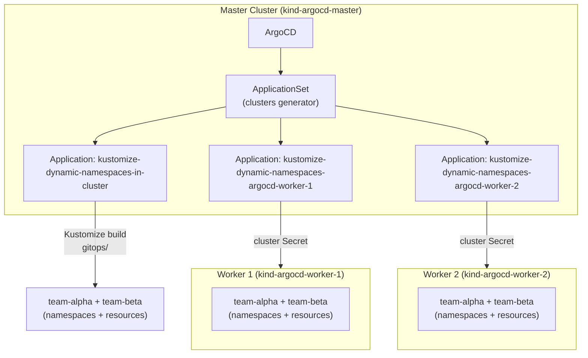
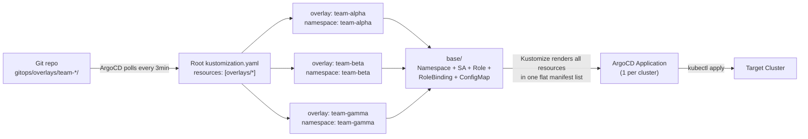

# ArgoCD Kustomize Dynamic Namespaces

A hands-on experiment demonstrating how to manage multiple namespaces (and their resources) as a single ArgoCD Application per cluster, using Kustomize's base/overlay pattern with a glob in the root `kustomization.yaml`.

**What you will see:**

- 1 ArgoCD Application per cluster (3 total), each tracking **all** namespaces on that cluster
- A Kustomize `base` defining reusable resource templates (Namespace, ServiceAccounts, RBAC, ConfigMap)
- Per-namespace overlays that each reference the base and declare only what differs (namespace name, team labels)
- A root `kustomization.yaml` that lists all overlays — adding a namespace requires one new overlay directory + one line appended to the root file
- Adding a new namespace = 2 file changes, commit, push — ArgoCD syncs it automatically to all three clusters

---

## Prerequisites

- `kind` installed
- `kubectl` installed
- `docker` running
- Repo pushed to a remote (ArgoCD pulls manifests from Git over HTTPS)

---

## Architecture

```
gitops/
  kustomization.yaml        ← ROOT: lists all overlays explicitly
  base/
    kustomization.yaml
    namespace.yaml          ← placeholder resources (DRY templates)
    serviceaccounts.yaml
    rbac.yaml
    configmap.yaml
  overlays/
    team-alpha/
      kustomization.yaml    ← namespace: team-alpha, labels: {team: alpha}
    team-beta/
      kustomization.yaml    ← namespace: team-beta,  labels: {team: beta}
    team-gamma/             ← ADD THIS + 1 line in root kustomization.yaml
      kustomization.yaml
```

### How Kustomize renders each overlay

When ArgoCD runs `kustomize build gitops/`, it processes the root kustomization which includes all overlays via the glob. For each overlay, Kustomize:

1. Loads the base resources (Namespace, SA, Role, RoleBinding, ConfigMap)
2. Applies the overlay's `namespace:` field — sets `metadata.name` on the Namespace resource and `metadata.namespace` on all other resources (including `subjects[].namespace` in RoleBinding)
3. Applies `commonLabels` to add team-specific labels to all resources

The result is a single flat manifest list containing all resources for all namespaces — synced by one ArgoCD Application per cluster.



---

## Setup

```bash
cd argocd/02-kustomize-dynamic-namespaces
bash setup.sh
```

`setup.sh` does the following automatically:

1. Creates `kind-argocd-master`, `kind-argocd-worker-1`, `kind-argocd-worker-2`
2. Installs ArgoCD `v3.3.8` on the master cluster
3. Patches `argocd-server` service to NodePort on port `30080`
4. Registers both workers as ArgoCD external cluster Secrets (using Docker bridge IPs)
5. Creates and labels the `in-cluster` Secret so the ApplicationSet also targets master
6. Detects the Git remote URL and current branch, substitutes into the ApplicationSet, and applies it

---

## Experiment Steps

### Step 1 — Verify the three ArgoCD Applications are Synced

```bash
❯ kubectl get applications -n argocd --context kind-argocd-master
NAME                                           SYNC STATUS   HEALTH STATUS
kustomize-dynamic-namespaces-argocd-worker-1   Synced        Healthy
kustomize-dynamic-namespaces-argocd-worker-2   Synced        Healthy
kustomize-dynamic-namespaces-in-cluster        Synced        Healthy
```

### Step 2 — Verify initial namespaces on the master cluster

```bash
❯ kubectl get namespaces --context kind-argocd-master | grep team
team-alpha           Active   79s
team-beta            Active   79s
```

Inspect resources in one of them:

```bash
❯ kubectl get serviceaccounts,role,rolebinding,configmap \
  -n team-alpha --context kind-argocd-master
NAME                           AGE
serviceaccount/app-sa          100s
serviceaccount/default         100s
serviceaccount/monitoring-sa   100s

NAME                                      CREATED AT
role.rbac.authorization.k8s.io/app-role   2026-05-01T05:06:21Z

NAME                                                   ROLE            AGE
rolebinding.rbac.authorization.k8s.io/app-sa-binding   Role/app-role   100s

NAME                         DATA   AGE
configmap/app-config         2      100s
configmap/kube-root-ca.crt   1      100s
```

Verify the team label was applied:

```bash
❯ kubectl get namespace team-alpha --context kind-argocd-master --show-labels -L team
NAME         STATUS   AGE     TEAM    LABELS
team-alpha   Active   2m24s   alpha   env=prod,experiment=kustomize-dynamic-namespaces,kubernetes.io/metadata.name=team-alpha,managed-by=argocd,team=alpha
```

### Step 3 — Add a new namespace (the key experiment)

This simulates what a GitHub Action or API service would do.

**1.** Create `gitops/overlays/team-gamma/kustomization.yaml`:

```yaml
resources:
  - ../../base
namespace: team-gamma
labels:
  - pairs:
      team: gamma
      env: dev
```

**2.** Append the new overlay to `gitops/kustomization.yaml`:

```yaml
resources:
  - overlays/team-alpha
  - overlays/team-beta
  - overlays/team-gamma   # ← add this line
```

Verify the build is correct before committing:

```bash
kustomize build gitops/
```

Commit and push:

```bash
git add argocd/02-kustomize-dynamic-namespaces/gitops/
git commit -m "feat: add team-gamma namespace overlay"
git push
```

Wait ~3 minutes for ArgoCD's poll cycle, then verify on all clusters:

```bash
❯ for ctx in kind-argocd-master kind-argocd-worker-1 kind-argocd-worker-2; do
  echo "=== ${ctx} ==="
  kubectl get namespace team-gamma --context "${ctx}" 2>/dev/null \
    && kubectl get sa,role,rolebinding -n team-gamma --context "${ctx}" \
    || echo "  not yet synced"
done

=== kind-argocd-master ===
NAME         STATUS   AGE
team-gamma   Active   8s
NAME                           AGE
serviceaccount/app-sa          8s
serviceaccount/default         8s
serviceaccount/monitoring-sa   8s

NAME                                      CREATED AT
role.rbac.authorization.k8s.io/app-role   2026-05-01T05:15:06Z

NAME                                                   ROLE            AGE
rolebinding.rbac.authorization.k8s.io/app-sa-binding   Role/app-role   8s
=== kind-argocd-worker-1 ===
NAME         STATUS   AGE
team-gamma   Active   14s
NAME                           AGE
serviceaccount/app-sa          15s
serviceaccount/default         15s
serviceaccount/monitoring-sa   15s

NAME                                      CREATED AT
role.rbac.authorization.k8s.io/app-role   2026-05-01T05:15:00Z

NAME                                                   ROLE            AGE
rolebinding.rbac.authorization.k8s.io/app-sa-binding   Role/app-role   15s
=== kind-argocd-worker-2 ===
NAME         STATUS   AGE
team-gamma   Active   10s
NAME                           AGE
serviceaccount/app-sa          10s
serviceaccount/default         10s
serviceaccount/monitoring-sa   10s

NAME                                      CREATED AT
role.rbac.authorization.k8s.io/app-role   2026-05-01T05:15:05Z

NAME                                                   ROLE            AGE
rolebinding.rbac.authorization.k8s.io/app-sa-binding   Role/app-role   10s
```

Expected: `team-gamma` namespace with all resources present on all three clusters.

### Step 4 — Verify the root kustomization only changes when a namespace is added

```bash
git log --oneline -- argocd/02-kustomize-dynamic-namespaces/gitops/kustomization.yaml
```

Each commit in the log corresponds to exactly one namespace being added. The only content change per commit is one appended line.

### Step 5 — Access the ArgoCD UI

```bash
# Get the admin password
kubectl get secret argocd-initial-admin-secret \
  -n argocd \
  --context kind-argocd-master \
  -o jsonpath='{.data.password}' | base64 -d && echo

open http://localhost:30080
```

Login with `admin` and the printed password. You will see 3 Applications — each one tracks all namespaces for its cluster. Drill into an Application to see `team-alpha`, `team-beta`, and `team-gamma` resources grouped together.

---

## Key Observations

| What to observe | Command |
|---|---|
| 1 Application per cluster (not 1 per namespace) | `kubectl get applications -n argocd --context kind-argocd-master` |
| All namespaces on master | `kubectl get ns --context kind-argocd-master \| grep team` |
| All namespaces on worker-1 | `kubectl get ns --context kind-argocd-worker-1 \| grep team` |
| team label on each namespace | `kubectl get ns team-alpha --show-labels --context kind-argocd-master` |
| Root kustomization unchanged | `git log --oneline -- gitops/kustomization.yaml` |
| New namespace synced after overlay added | Steps 3–4 above |

---

## How It Works



The root `kustomization.yaml` lists each overlay explicitly. Adding a namespace is exactly 2 file changes — one new overlay directory and one appended line in the root — both mechanical and fully automatable by a GitHub Action or API service. Kustomize does not support glob patterns in the `resources` field, so explicit listing is required.

---

## Cleanup

```bash
bash teardown.sh
```

---

## References

- [Kustomize bases and overlays](https://kubectl.docs.kubernetes.io/guides/config_management/bases_and_variants/)
- [Kustomize namespace transformer](https://kubectl.docs.kubernetes.io/references/kustomize/kustomization/namespace/)
- [ArgoCD ApplicationSet Cluster Generator](https://argo-cd.readthedocs.io/en/stable/operator-manual/applicationset/Generators-Cluster/)
- [ArgoCD + Kustomize](https://argo-cd.readthedocs.io/en/stable/user-guide/kustomize/)
