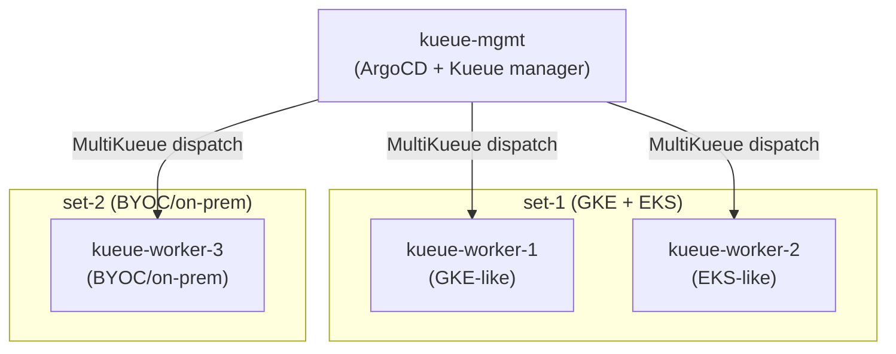

# MultiKueue + Multi-Set ArgoCD/Kustomize POC

Demonstrates Kustomize's base/overlay pattern for managing Kueue resources across a management cluster and 3 worker clusters split into two independent worker sets, delivered via ArgoCD ApplicationSets.

## Scenario



### What each cluster gets

| Object | worker-1<br>(set-1) | worker-2<br>(set-1) | worker-3<br>(set-2) | mgmt |
|---|:---:|:---:|:---:|:---:|
| Namespace: team-a | ✓ | ✓ | – | ✓ |
| Namespace: team-b | ✓ | ✓ | – | ✓ |
| Namespace: team-c | – | – | ✓ | ✓ |
| LQ: default (team-a) | ✓ | ✓ | – | ✓ |
| LQ: default (team-b) | ✓ | ✓ | – | ✓ |
| LQ: default (team-c) | – | – | ✓ | ✓ |
| CQ-1 (RF-A quota) | 100 `[OVERRIDE]` | 200 `[OVERRIDE]` | – | 300 |
| CQ-2 (RF-A / RF-B quota) | – | – | 500 / 100 | 500 / 100 |
| Cohort: cohort-set-1 | 100 `[OVERRIDE]` | 200 `[OVERRIDE]` | – | 300 |
| Cohort: cohort-set-2 | – | – | 500 `[OVERRIDE]` | 500 |
| ResourceFlavor: RF-A | GKE selector `[OVERRIDE]` | EKS selector `[OVERRIDE]` | DC selector `[OVERRIDE]` | (any/default) |
| ResourceFlavor: RF-B | – | – | DC selector `[OVERRIDE]` | (any/default) |
| WorkloadPriorityClasses | ✓ (shared) | ✓ (shared) | ✓ (shared) | ✓ |
| MultiKueueConfig (set-1) | – | – | – | ✓ (worker-1 + worker-2) |
| MultiKueueConfig (set-2) | – | – | – | ✓ (worker-3) |
| AdmissionCheck → CQ-1 | – | – | – | ✓ → set-1 |
| AdmissionCheck → CQ-2 | – | – | – | ✓ → set-2 |

`[OVERRIDE]` = present on all clusters in the set but patched per-cluster

---

## Repository Structure

```
04-multikueue-poc/
├── base/
│   ├── shared/                 ← RF-A (no selectors) + WorkloadPriorityClasses
│   ├── set-1/                  ← CQ-1 (quota=300), cohort-set-1, LQ team-a/b, NS team-a/b
│   └── set-2/                  ← CQ-2, cohort-set-2, LQ team-c, NS team-c, RF-B (no selector)
├── components/
│   ├── manager-set-1/          ← AdmissionCheck ac-set-1, MultiKueueConfig/Cluster worker-1+2
│   │                             patches CQ-1 admissionChecks
│   └── manager-set-2/          ← AdmissionCheck ac-set-2, MultiKueueConfig/Cluster worker-3
│                                 patches CQ-2 admissionChecks
├── overlays/
│   ├── mgmt/                   ← shared + set-1 + set-2 + manager-set-1 + manager-set-2
│   ├── worker-1/               ← shared + set-1; RF-A GKE selector; CQ-1/cohort quota=100
│   ├── worker-2/               ← shared + set-1; RF-A EKS selector; CQ-1/cohort quota=200
│   └── worker-3/               ← shared + set-2; RF-A/RF-B DC selectors; cohort quota=500
├── argocd/
│   └── applicationsets.yaml    ← 4 ApplicationSets, one per overlay/cluster
├── kind-mgmt.yaml
├── kind-worker-1.yaml
├── kind-worker-2.yaml
├── kind-worker-3.yaml
├── kueue-values-manager.yaml
├── kueue-values-worker.yaml
├── setup.sh
└── teardown.sh
```

### Key design decisions

**Set isolation via selective base inclusion** — worker-1/2 pull only `base/set-1`, so they never receive CQ-2, RF-B, or team-c resources. worker-3 pulls only `base/set-2`. Kustomize's additive model means there is no "exclude" mechanism; instead each overlay declares exactly the bases it needs.

**RF-B in `base/set-2`, not `base/shared`** — RF-B is set-scoped (only set-2 clusters). If it were in `base/shared`, it would appear on worker-1 and worker-2 too.

**Quota in base = mgmt's view** — The canonical quota (300 / 500) lives in the base files. Worker overlays patch `spec.resourceGroups` down to their local share via strategic merge patch.

**`admissionChecks` added by components, not base** — Workers never need `admissionChecks` on ClusterQueues. The `manager-set-1` and `manager-set-2` components add them only when the `mgmt` overlay pulls in those components.

**One ApplicationSet per overlay** — Each ApplicationSet uses a distinct label selector (`kueue-poc-role=mgmt|worker-1|worker-2|worker-3`) on the cluster Secret, ensuring each overlay is synced only to its intended cluster.

---

## Prerequisites

- `kind`
- `kubectl`
- `helm`
- `docker`
- Repo pushed to a GitHub remote (ArgoCD pulls from Git over HTTPS)

---

## Step 1 — Bootstrap clusters, Kueue, and ArgoCD

```bash
cd argocd/04-multikueue-poc
bash setup.sh
```

`setup.sh` does the following:

1. Creates 4 Kind clusters: `kueue-mgmt`, `kueue-worker-1`, `kueue-worker-2`, `kueue-worker-3`
2. Installs Kueue on all 4 clusters (manager values on mgmt, worker values on workers)
3. Creates MultiKueue kubeconfig Secrets on mgmt for each worker (`worker-1-secret`, `worker-2-secret`, `worker-3-secret`)
4. Installs ArgoCD on `kueue-mgmt`, exposes UI on `http://localhost:30080`
5. Creates the `in-cluster` Secret labelled `kueue-poc-role=mgmt` so mgmt targets itself
6. Registers worker-1/2/3 as ArgoCD external cluster Secrets, labelled with their respective `kueue-poc-role`
7. Substitutes `__REPO_URL__` and `__TARGET_REVISION__` into `argocd/applicationsets.yaml` and applies it

At the end, the script prints the ArgoCD admin password.

---

## Step 2 — Verify clusters are ready

```bash
for ctx in kind-kueue-mgmt kind-kueue-worker-1 kind-kueue-worker-2 kind-kueue-worker-3; do
  echo "=== ${ctx} ==="
  kubectl get nodes --context "${ctx}"
done
```

Verify Kueue is running on all clusters:

```bash
for ctx in kind-kueue-mgmt kind-kueue-worker-1 kind-kueue-worker-2 kind-kueue-worker-3; do
  echo "=== ${ctx} ==="
  kubectl get deploy -n kueue-system --context "${ctx}"
done
```

Verify MultiKueue worker Secrets exist on mgmt:

```bash
kubectl get secrets -n kueue-system --context kind-kueue-mgmt | grep worker
# worker-1-secret   ...
# worker-2-secret   ...
# worker-3-secret   ...
```

---

## Step 3 — Open the ArgoCD UI

```bash
open http://localhost:30080
```

Login: `admin` / (printed by setup.sh, or retrieve with):

```bash
kubectl get secret argocd-initial-admin-secret \
  -n argocd --context kind-kueue-mgmt \
  -o jsonpath='{.data.password}' | base64 -d && echo
```

You should see **4 Applications** in the UI — one per cluster:

```
kueue-poc-mgmt-in-cluster        Synced   Healthy
kueue-poc-worker-1-kueue-worker-1   Synced   Healthy
kueue-poc-worker-2-kueue-worker-2   Synced   Healthy
kueue-poc-worker-3-kueue-worker-3   Synced   Healthy
```

Or verify from the CLI:

```bash
kubectl get applications -n argocd --context kind-kueue-mgmt
```

---

## Step 4 — Verify set isolation in the ArgoCD UI

Click into each Application and observe the resource tree:

### `kueue-poc-mgmt-in-cluster`

Expected resources:
- Namespaces: `team-a`, `team-b`, `team-c`
- ClusterQueues: `cq-1` (quota=300), `cq-2` (quota=500/100)
- Cohorts: `cohort-set-1` (300), `cohort-set-2` (500)
- LocalQueues: `default` in `team-a`, `team-b`, `team-c`
- ResourceFlavors: `rf-a` (no selectors), `rf-b` (no selectors)
- AdmissionChecks: `ac-set-1`, `ac-set-2`
- MultiKueueConfigs: `set-1`, `set-2`
- MultiKueueClusters: `worker-1`, `worker-2`, `worker-3`
- WorkloadPriorityClasses: `p0-realtime`, `p1-urgent`, `p2-research`, `p3-batch`

### `kueue-poc-worker-1-kueue-worker-1` (set-1, GKE)

Expected resources:
- Namespaces: `team-a`, `team-b` — **no** `team-c`
- ClusterQueue: `cq-1` only — **no** `cq-2`
- Cohort: `cohort-set-1` only — **no** `cohort-set-2`
- LocalQueues: `default` in `team-a`, `team-b` — **no** `team-c`
- ResourceFlavor `rf-a` with `nodeLabels: cloud.google.com/gke-nodepool: gpu-pool`
- **No** `rf-b`
- **No** `AdmissionCheck`, `MultiKueueConfig`, `MultiKueueCluster`

### `kueue-poc-worker-2-kueue-worker-2` (set-1, EKS)

Same structure as worker-1 but `rf-a` has `nodeLabels: eks.amazonaws.com/nodegroup: gpu-nodegroup` and CQ-1 quota=200.

### `kueue-poc-worker-3-kueue-worker-3` (set-2, BYOC)

Expected resources:
- Namespace: `team-c` only — **no** `team-a`, `team-b`
- ClusterQueue: `cq-2` only — **no** `cq-1`
- Cohort: `cohort-set-2` only
- LocalQueue: `default` in `team-c` only
- ResourceFlavors: `rf-a` (DC selector) **and** `rf-b` (DC selector)

---

## Step 5 — Verify Kueue objects from the CLI

### mgmt: MultiKueue connectivity

```bash
kubectl get multikueuecluster -o wide --context kind-kueue-mgmt
# NAME       CONNECTED   AGE
# worker-1   True        ...
# worker-2   True        ...
# worker-3   True        ...
```

### mgmt: AdmissionChecks are Active

```bash
kubectl get admissioncheck --context kind-kueue-mgmt
# NAME       ACTIVE   AGE
# ac-set-1   True     ...
# ac-set-2   True     ...
```

### mgmt: ClusterQueues have correct admissionChecks

```bash
kubectl get clusterqueue cq-1 -o jsonpath='{.spec.admissionChecks}' --context kind-kueue-mgmt
# ["ac-set-1"]

kubectl get clusterqueue cq-2 -o jsonpath='{.spec.admissionChecks}' --context kind-kueue-mgmt
# ["ac-set-2"]
```

### worker-1: CQ quota is 100, no admissionChecks

```bash
kubectl get clusterqueue cq-1 -o jsonpath='{.spec.resourceGroups[0].flavors[0].resources[0].nominalQuota}' \
  --context kind-kueue-worker-1
# 100

kubectl get clusterqueue cq-1 -o jsonpath='{.spec.admissionChecks}' --context kind-kueue-worker-1
# (empty — workers have no admissionChecks)
```

### worker-2: CQ quota is 200

```bash
kubectl get clusterqueue cq-1 -o jsonpath='{.spec.resourceGroups[0].flavors[0].resources[0].nominalQuota}' \
  --context kind-kueue-worker-2
# 200
```

### worker-3: has rf-b, no cq-1

```bash
kubectl get resourceflavor --context kind-kueue-worker-3
# NAME   AGE
# rf-a   ...
# rf-b   ...

kubectl get clusterqueue --context kind-kueue-worker-3
# NAME   AGE
# cq-2   ...
```

### RF-A node selectors per cluster

```bash
kubectl get resourceflavor rf-a -o jsonpath='{.spec.nodeLabels}' --context kind-kueue-worker-1
# {"cloud.google.com/gke-nodepool":"gpu-pool"}

kubectl get resourceflavor rf-a -o jsonpath='{.spec.nodeLabels}' --context kind-kueue-worker-2
# {"eks.amazonaws.com/nodegroup":"gpu-nodegroup"}

kubectl get resourceflavor rf-a -o jsonpath='{.spec.nodeLabels}' --context kind-kueue-worker-3
# {"topology.kubernetes.io/zone":"dc-zone-a"}

kubectl get resourceflavor rf-a -o jsonpath='{.spec.nodeLabels}' --context kind-kueue-mgmt
# {} (empty — mgmt uses default/any)
```

---

## Step 6 — Test ArgoCD self-healing (optional)

Manually delete a resource on a worker to verify ArgoCD re-creates it:

```bash
kubectl delete clusterqueue cq-1 --context kind-kueue-worker-1

# Wait ~30s for ArgoCD's self-heal cycle, then verify it's back:
kubectl get clusterqueue cq-1 --context kind-kueue-worker-1
```

In the UI you can watch the Application briefly go `OutOfSync` → `Synced` automatically.

---

## Step 7 — Test a GitOps change

To observe a live sync, make a quota change on worker-2 — for example change `nominalQuota` from `"200"` to `"250"` in `overlays/worker-2/kustomization.yaml`, commit and push:

```bash
git add argocd/04-multikueue-poc/overlays/worker-2/kustomization.yaml
git commit -m "feat: bump worker-2 set-1 quota to 250"
git push
```

ArgoCD polls every 3 minutes. In the UI, watch `kueue-poc-worker-2-kueue-worker-2` go `OutOfSync` → `Syncing` → `Synced`. Then verify:

```bash
kubectl get clusterqueue cq-1 \
  -o jsonpath='{.spec.resourceGroups[0].flavors[0].resources[0].nominalQuota}' \
  --context kind-kueue-worker-2
# 250
```

---

## Cleanup

```bash
bash teardown.sh
```

---

## References

- [Kueue MultiKueue](https://kueue.sigs.k8s.io/docs/concepts/multikueue/)
- [Kueue Cohort](https://kueue.sigs.k8s.io/docs/concepts/cohort/)
- [ArgoCD ApplicationSet Cluster Generator](https://argo-cd.readthedocs.io/en/stable/operator-manual/applicationset/Generators-Cluster/)
- [Kustomize Components](https://kubectl.docs.kubernetes.io/guides/config_management/components/)
