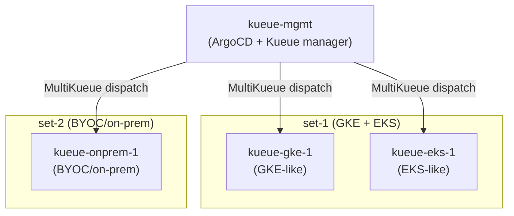
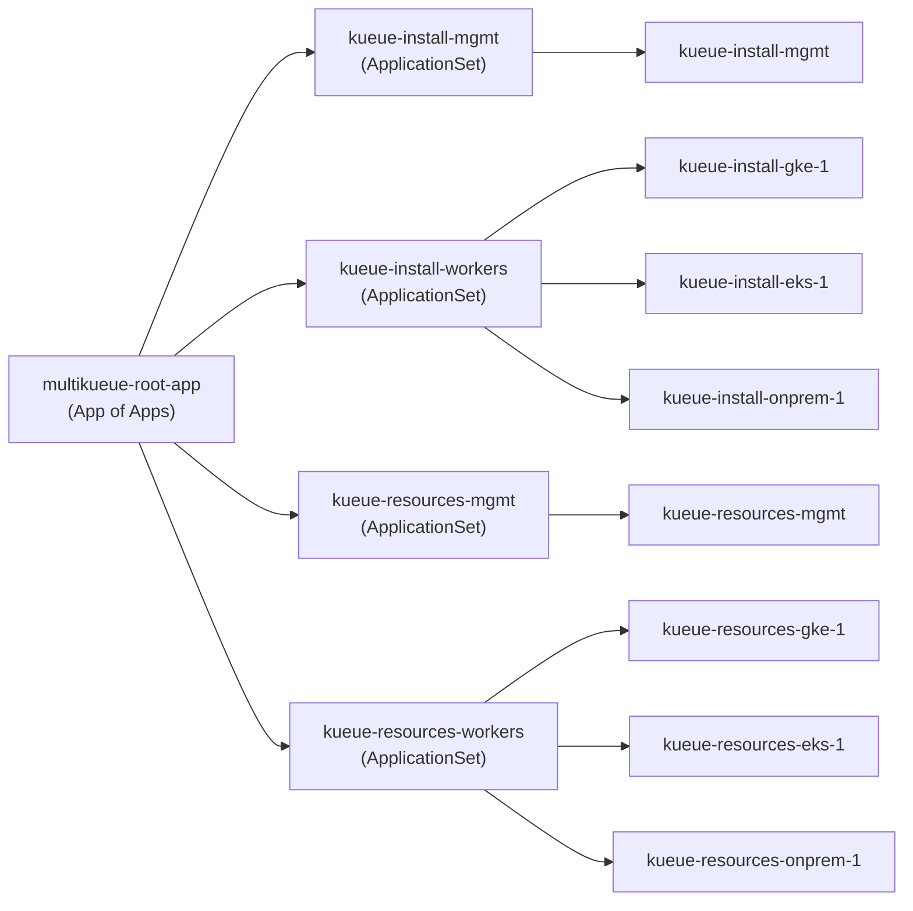

# MultiKueue + Multi-Set ArgoCD/Helm POC

Demonstrates the Helm approach for managing Kueue resources across a management cluster and 3 worker clusters split into two independent worker sets, delivered via ArgoCD ApplicationSets.

Same scenario as `04-multikueue-poc` (kustomize) — this POC is a direct comparison using Helm instead.

## Scenario



### What each cluster gets

| Object | gke-1<br>(set-1) | eks-1<br>(set-1) | onprem-1<br>(set-2) | mgmt |
|---|:---:|:---:|:---:|:---:|
| Namespace: team-a | ✓ | ✓ | – | ✓ |
| Namespace: team-b | ✓ | ✓ | – | ✓ |
| Namespace: team-c | – | – | ✓ | ✓ |
| LQ: default (team-a) | ✓ | ✓ | – | ✓ |
| LQ: default-team-b (team-b) | ✓ | ✓ | – | ✓ |
| LQ: default (team-c) | – | – | ✓ | ✓ |
| CQ-1 (RF-A quota) | 100 `[OVERRIDE]` | 200 `[OVERRIDE]` | – | 300 |
| CQ-2 (RF-A / RF-B quota) | – | – | 500 / 100 | 500 / 100 |
| Cohort: cohort-set-1 | 100 `[OVERRIDE]` | 200 `[OVERRIDE]` | – | 300 |
| Cohort: cohort-set-2 | – | – | 500 / 100 | 500 / 100 |
| ResourceFlavor: RF-A | GKE selector `[OVERRIDE]` | EKS selector `[OVERRIDE]` | DC selector `[OVERRIDE]` | (any/default) |
| ResourceFlavor: RF-B | – | – | DC selector `[OVERRIDE]` | (any/default) |
| WorkloadPriorityClasses | ✓ (shared) | ✓ (shared) | ✓ (shared) | ✓ |
| MultiKueueConfig (set-1) | – | – | – | ✓ (gke-1 + eks-1) |
| MultiKueueConfig (set-2) | – | – | – | ✓ (onprem-1) |
| AdmissionCheck → CQ-1 | – | – | – | ✓ → set-1 |
| AdmissionCheck → CQ-2 | – | – | – | ✓ → set-2 |

---

## ArgoCD App Hierarchy

`multikueue-root-app` is an App of Apps that owns 4 ApplicationSets, which expand into 8 Applications:



---

## Repository Structure

```
05-multikueue-helm-poc/
├── chart/                          ← Local Helm chart: kueue-resources
│   ├── Chart.yaml
│   ├── values.yaml                 ← Skeleton defaults (all real values come from values/)
│   └── templates/
│       ├── _helpers.tpl
│       ├── resourceflavor.yaml
│       ├── cohort.yaml             ← Role + clusterSet scoping logic
│       ├── clusterqueue.yaml       ← Role + clusterSet scoping; injects admissionChecks on mgmt
│       ├── multikueue.yaml         ← AdmissionCheck + MultiKueueConfig/Cluster (mgmt only)
│       └── workloadpriorityclass.yaml
├── kueue-install/
│   ├── manager.yaml                ← Upstream Kueue chart values for mgmt (MultiKueue gate on)
│   └── worker.yaml                 ← Upstream Kueue chart values for workers (no MultiKueue gate)
├── values/
│   ├── base.yaml                   ← Shared topology: clusterSetMembers, CQ configs, cohorts, WPCs
│   ├── mgmt.yaml                   ← role=manager, RF-A + RF-B (no selectors)
│   ├── gke-1.yaml               ← role=worker, RF-A GKE selector, CQ-1/cohort quota=100
│   ├── eks-1.yaml               ← role=worker, RF-A EKS selector, CQ-1/cohort quota=200
│   └── onprem-1.yaml            ← role=worker, RF-A/RF-B DC selectors, CQ-2 quota=500/100
├── argocd/
│   └── applicationsets.yaml        ← 4 ApplicationSets (2 install + 2 resources)
├── kind-mgmt.yaml
├── kind-gke-1.yaml
├── kind-eks-1.yaml
├── kind-onprem-1.yaml
├── setup.sh
└── teardown.sh
```

### Key design decisions vs. the kustomize POC

**Helm valuesFiles layering instead of kustomize patches** — `base.yaml` carries the full shared topology. Each per-cluster file overrides only what differs (RF selectors, per-worker quota). Direct replacement of kustomize strategic merge patches.

**Single chart, role-aware rendering** — Templates inspect `role` (`manager` vs `worker`) and `clusterSetMembers` to decide which objects to emit. Workers never see MultiKueue objects or other sets' queues.

**admissionChecks injected by the chart** — On `role=manager`, `clusterqueue.yaml` adds `admissionChecksStrategy` automatically. Replaces kustomize `components/manager-set-*/`.

**Kueue controller installed via ArgoCD** — `kueue-install-mgmt` and `kueue-install-workers` ApplicationSets install `oci://registry.k8s.io/kueue/charts/kueue` on all clusters. Multi-source Applications (`sources`) combine the OCI chart with Git-hosted values files.

---

## Prerequisites

- `kind`, `kubectl`, `helm`, `docker`
- Repo pushed to a GitHub remote (ArgoCD pulls from Git over HTTPS)

---

## Step 1 — Bootstrap

```bash
cd argocd/05-multikueue-helm-poc
bash setup.sh
```

`setup.sh`:
1. Creates 4 Kind clusters: `kueue-mgmt`, `kueue-gke-1`, `kueue-eks-1`, `kueue-onprem-1`
2. Creates MultiKueue kubeconfig Secrets on mgmt for each worker
3. Installs ArgoCD on `kueue-mgmt`, exposes UI on `http://localhost:30080`
4. Labels the in-cluster Secret (`multikueue-role=mgmt`, `multikueue-cluster=true`) and registers workers as ArgoCD cluster Secrets
5. Substitutes `__REPO_URL__`, `__TARGET_REVISION__`, `__KUEUE_VERSION__` into `argocd/applicationsets.yaml` and applies it

ArgoCD then installs Kueue on all clusters and syncs all Kueue resources.

---

## Step 2 — Open the ArgoCD UI

```bash
open http://localhost:30080
```

Login: `admin` / (printed by setup.sh, or retrieve with):

```bash
kubectl get secret argocd-initial-admin-secret \
  -n argocd --context kind-kueue-mgmt \
  -o jsonpath='{.data.password}' | base64 -d && echo
```

You should see **8 Applications** (4 ApplicationSets × their targets):

```bash
kubectl get applications -n argocd --context kind-kueue-mgmt
# NAME                       SYNC STATUS   HEALTH STATUS
# kueue-install-mgmt         Synced        Healthy
# kueue-install-gke-1        Synced        Healthy
# kueue-install-eks-1        Synced        Healthy
# kueue-install-onprem-1     Synced        Healthy
# multikueue-root-app        Synced        Healthy
# kueue-resources-mgmt       Synced        Healthy
# kueue-resources-gke-1      Synced        Healthy
# kueue-resources-eks-1      Synced        Healthy
# kueue-resources-onprem-1   Synced        Healthy
```

---

## Step 3 — Verify set isolation

### mgmt: full resource inventory

```bash
kubectl get resourceflavor,clusterqueue,cohort,admissioncheck,multikueueconfig,multikueuecluster \
  --context kind-kueue-mgmt
```

Expected:
- ResourceFlavors: `rf-a`, `rf-b` (no node selectors)
- ClusterQueues: `cq-1` (quota=300), `cq-2` (quota=500/100)
- Cohorts: `cohort-set-1`, `cohort-set-2`
- AdmissionChecks: `ac-set-1`, `ac-set-2`
- MultiKueueConfigs: `set-1`, `set-2`
- MultiKueueClusters: `gke-1`, `eks-1`, `onprem-1`

### mgmt: AdmissionChecks are Active

```bash
kubectl get admissioncheck --context kind-kueue-mgmt
# NAME       ACTIVE   AGE
# ac-set-1   True     ...
# ac-set-2   True     ...
```

### mgmt: ClusterQueues have correct admissionChecks

```bash
kubectl get clusterqueue cq-1 \
  -o jsonpath='{.spec.admissionChecksStrategy.admissionChecks}' --context kind-kueue-mgmt
# ["ac-set-1"]

kubectl get clusterqueue cq-2 \
  -o jsonpath='{.spec.admissionChecksStrategy.admissionChecks}' --context kind-kueue-mgmt
# ["ac-set-2"]
```

### mgmt: MultiKueue connectivity

```bash
kubectl get multikueuecluster -o wide --context kind-kueue-mgmt
# NAME       CONNECTED   AGE
# gke-1      True        ...
# eks-1      True        ...
# onprem-1   True        ...
```

### gke-1 (set-1, GKE)

Expected: `team-a`/`team-b` namespaces, `cq-1`, `cohort-set-1`, `rf-a` with GKE selector. No `cq-2`, `rf-b`, `team-c`, AdmissionCheck, or MultiKueue objects.

```bash
kubectl get resourceflavor,clusterqueue,cohort --context kind-kueue-gke-1

kubectl get resourceflavor rf-a \
  -o jsonpath='{.spec.nodeLabels}' --context kind-kueue-gke-1
# {"cloud.google.com/gke-nodepool":"gpu-pool"}

kubectl get clusterqueue cq-1 \
  -o jsonpath='{.spec.resourceGroups[0].flavors[0].resources[0].nominalQuota}' \
  --context kind-kueue-gke-1
# 100

kubectl get clusterqueue cq-1 \
  -o jsonpath='{.spec.admissionChecksStrategy.admissionChecks}' --context kind-kueue-gke-1
# (empty — workers have no admissionChecks)
```

### eks-1 (set-1, EKS)

Same structure as gke-1, with EKS selector and quota=200.

```bash
kubectl get resourceflavor rf-a \
  -o jsonpath='{.spec.nodeLabels}' --context kind-kueue-eks-1
# {"eks.amazonaws.com/nodegroup":"gpu-nodegroup"}

kubectl get clusterqueue cq-1 \
  -o jsonpath='{.spec.resourceGroups[0].flavors[0].resources[0].nominalQuota}' \
  --context kind-kueue-eks-1
# 200
```

### onprem-1 (set-2, BYOC)

Expected: `team-c` namespace only, `cq-2`, `cohort-set-2`, `rf-a` + `rf-b` with DC selectors. No `cq-1`, `team-a`, `team-b`.

```bash
kubectl get resourceflavor,clusterqueue,cohort --context kind-kueue-onprem-1
# NAME   ...
# rf-a
# rf-b
# cq-2
# cohort-set-2

kubectl get resourceflavor rf-a \
  -o jsonpath='{.spec.nodeLabels}' --context kind-kueue-onprem-1
# {"topology.kubernetes.io/zone":"dc-zone-a"}

kubectl get resourceflavor rf-b \
  -o jsonpath='{.spec.nodeLabels}' --context kind-kueue-onprem-1
# {"topology.kubernetes.io/zone":"dc-zone-b"}
```

---

## Step 4 — Test a GitOps change

Change eks-1's quota in `values/eks-1.yaml` (e.g. `nominalQuota: "250"`), commit and push:

```bash
git add argocd/05-multikueue-helm-poc/values/eks-1.yaml
git commit -m "feat: bump eks-1 set-1 quota to 250"
git push
```

ArgoCD polls every 3 minutes. Watch `kueue-resources-eks-1` go `OutOfSync` → `Syncing` → `Synced`, then verify:

```bash
kubectl get clusterqueue cq-1 \
  -o jsonpath='{.spec.resourceGroups[0].flavors[0].resources[0].nominalQuota}' \
  --context kind-kueue-eks-1
# 250
```

---

## Cleanup

```bash
bash teardown.sh
```

---

## References

- [Kueue Helm chart](https://github.com/kubernetes-sigs/kueue/blob/main/charts/kueue/README.md)
- [Kueue MultiKueue](https://kueue.sigs.k8s.io/docs/concepts/multikueue/)
- [ArgoCD ApplicationSet Cluster Generator](https://argo-cd.readthedocs.io/en/stable/operator-manual/applicationset/Generators-Cluster/)
- [ArgoCD Helm valuesFiles](https://argo-cd.readthedocs.io/en/stable/user-guide/helm/#values-files)
