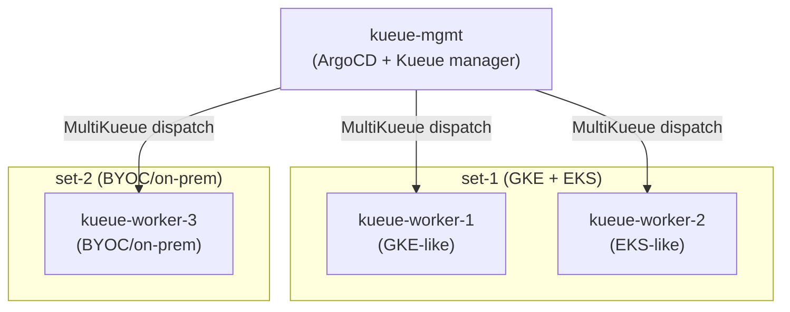

# MultiKueue + Multi-Set ArgoCD/Helm POC

Demonstrates the Helm approach for managing Kueue resources across a management cluster and 3 worker clusters split into two independent worker sets, delivered via ArgoCD ApplicationSets.

Same scenario as `04-multikueue-poc` (kustomize) — this POC is a direct comparison using Helm instead.

## Scenario



### What each cluster gets

| Object | worker-1<br>(set-1) | worker-2<br>(set-1) | worker-3<br>(set-2) | mgmt |
|---|:---:|:---:|:---:|:---:|
| Namespace: team-a | ✓ | ✓ | – | ✓ |
| Namespace: team-b | ✓ | ✓ | – | ✓ |
| Namespace: team-c | – | – | ✓ | ✓ |
| LQ: default (team-a) | ✓ | ✓ | – | ✓ |
| LQ: default-team-b (team-b) | ✓ | ✓ | – | ✓ |
| LQ: default (team-c) | – | – | ✓ | ✓ |
| CQ-1 (RF-A quota) | 100 `[OVERRIDE]` | 200 `[OVERRIDE]` | – | 300 |
| CQ-2 (RF-A / RF-B quota) | – | – | 500 / 100 | 500 / 100 |
| Cohort: cohort-set-1 | 100 `[OVERRIDE]` | 200 `[OVERRIDE]` | – | 300 |
| Cohort: cohort-set-2 | – | – | 500 / 100 | 500 / 100 |
| ResourceFlavor: RF-A | GKE selector `[OVERRIDE]` | EKS selector `[OVERRIDE]` | DC selector `[OVERRIDE]` | (any/default) |
| ResourceFlavor: RF-B | – | – | DC selector `[OVERRIDE]` | (any/default) |
| WorkloadPriorityClasses | ✓ (shared) | ✓ (shared) | ✓ (shared) | ✓ |
| MultiKueueConfig (set-1) | – | – | – | ✓ (worker-1 + worker-2) |
| MultiKueueConfig (set-2) | – | – | – | ✓ (worker-3) |
| AdmissionCheck → CQ-1 | – | – | – | ✓ → set-1 |
| AdmissionCheck → CQ-2 | – | – | – | ✓ → set-2 |

---

## Repository Structure

```
05-multikueue-helm-poc/
├── chart/                          ← Local Helm chart: kueue-resources
│   ├── Chart.yaml
│   ├── values.yaml                 ← Skeleton defaults (all real values come from values/)
│   └── templates/
│       ├── _helpers.tpl
│       ├── resourceflavor.yaml
│       ├── cohort.yaml             ← Role + clusterSet scoping logic
│       ├── clusterqueue.yaml       ← Role + clusterSet scoping; injects admissionChecks on mgmt
│       ├── multikueue.yaml         ← AdmissionCheck + MultiKueueConfig/Cluster (mgmt only)
│       └── workloadpriorityclass.yaml
├── kueue-install/
│   ├── manager.yaml                ← Upstream Kueue chart values for mgmt (MultiKueue gate on)
│   └── worker.yaml                 ← Upstream Kueue chart values for workers (no MultiKueue gate)
├── values/
│   ├── base.yaml                   ← Shared topology: clusterSetMembers, CQ configs, cohorts, WPCs
│   ├── mgmt.yaml                   ← role=manager, RF-A + RF-B (no selectors)
│   ├── worker-1.yaml               ← role=worker, RF-A GKE selector, CQ-1/cohort quota=100
│   ├── worker-2.yaml               ← role=worker, RF-A EKS selector, CQ-1/cohort quota=200
│   └── worker-3.yaml               ← role=worker, RF-A/RF-B DC selectors, CQ-2 quota=500/100
├── argocd/
│   └── applicationsets.yaml        ← 6 ApplicationSets: 2 install Kueue controller, 4 sync resources
├── kind-mgmt.yaml
├── kind-worker-1.yaml
├── kind-worker-2.yaml
├── kind-worker-3.yaml
├── setup.sh
└── teardown.sh
```

### Key design decisions vs. the kustomize POC

**Helm valuesFiles layering instead of kustomize patches** — ArgoCD's `helm.valuesFiles` merges multiple values files in order. `base.yaml` carries the full shared topology (equivalent to `base/set-1/`, `base/set-2/`, `base/shared/`). Each per-cluster file overrides only what differs (RF selectors, per-worker quota). This is a direct replacement of kustomize strategic merge patches.

**Single chart, role-aware rendering** — The chart's templates inspect `role` (`manager` vs `worker`) and `clusterSetMembers` to decide which objects to emit. Workers never see MultiKueue objects or other sets' queues. This replaces kustomize's additive base-inclusion model.

**admissionChecks injected by the chart, not a kustomize component** — On `role=manager`, `clusterqueue.yaml` adds `admissionChecksStrategy` automatically. Workers never get it. This replaces the `components/manager-set-1/` and `components/manager-set-2/` kustomize components.

**Kueue controller installed via ArgoCD, not the bootstrap script** — Two ApplicationSets (`kueue-install-mgmt`, `kueue-install-workers`) install `oci://registry.k8s.io/kueue/charts/kueue` on all clusters using the common label `kueue-poc-cluster=true`. The mgmt AppSet further filters on `kueue-poc-role=mgmt` to apply the manager values (MultiKueue feature gate enabled); the worker AppSet matches `kueue-poc-role in (worker-1, worker-2, worker-3)`. Values files live in `kueue-install/`. Multi-source Applications (`sources`) are used so the OCI chart and the Git-hosted values files can be referenced together.

**One ApplicationSet per cluster for Kueue resources** — Same label-selector strategy as the kustomize POC (`kueue-poc-role=mgmt|worker-1|worker-2|worker-3`), but `source.path` points to `chart/` and `source.helm.valuesFiles` lists `[../values/base.yaml, ../values/<cluster>.yaml]`.

---

## Prerequisites

- `kind`
- `kubectl`
- `helm`
- `docker`
- Repo pushed to a GitHub remote (ArgoCD pulls from Git over HTTPS)

---

## Step 1 — Bootstrap clusters, Kueue, and ArgoCD

```bash
cd argocd/05-multikueue-helm-poc
bash setup.sh
```

`setup.sh` does the following:

1. Creates 4 Kind clusters: `kueue-mgmt`, `kueue-worker-1`, `kueue-worker-2`, `kueue-worker-3`
2. Creates MultiKueue kubeconfig Secrets on mgmt for each worker (`worker-1-secret`, `worker-2-secret`, `worker-3-secret`)
3. Installs ArgoCD on `kueue-mgmt`, exposes UI on `http://localhost:30080`
4. Creates the `in-cluster` Secret labelled `kueue-poc-role=mgmt` and `kueue-poc-cluster=true`
5. Registers worker-1/2/3 as ArgoCD external cluster Secrets with `kueue-poc-role` and `kueue-poc-cluster=true` labels
6. Substitutes `__REPO_URL__`, `__TARGET_REVISION__`, and `__KUEUE_VERSION__` into `argocd/applicationsets.yaml` and applies it

ArgoCD then takes over and installs Kueue on all clusters via the `kueue-install-mgmt` and `kueue-install-workers` ApplicationSets before syncing Kueue resources.

---

## Step 2 — Open the ArgoCD UI

```bash
open http://localhost:30080
```

Login: `admin` / (printed by setup.sh, or retrieve with):

```bash
kubectl get secret argocd-initial-admin-secret \
  -n argocd --context kind-kueue-mgmt \
  -o jsonpath='{.data.password}' | base64 -d && echo
```

You should see **6 Applications** — 2 for Kueue controller installs, 4 for Kueue resource configs:

```bash
kubectl get applications -n argocd --context kind-kueue-mgmt
# NAME                          SYNC STATUS   HEALTH STATUS
# kueue-install-mgmt            Synced        Healthy
# kueue-install-worker-1        Synced        Healthy
# kueue-install-worker-2        Synced        Healthy
# kueue-install-worker-3        Synced        Healthy
# kueue-resources-mgmt          Synced        Healthy
# kueue-resources-worker-1      Synced        Healthy
# kueue-resources-worker-2      Synced        Healthy
# kueue-resources-worker-3      Synced        Healthy
```

---

## Step 3 — Verify set isolation

### mgmt

```bash
kubectl get resourceflavor,clusterqueue,cohort,admissioncheck,multikueueconfig,multikueuecluster \
  --context kind-kueue-mgmt
```

Expected: RF-A + RF-B (no selectors), CQ-1 (quota=300) + CQ-2 (quota=500/100), both cohorts, ac-set-1 + ac-set-2, MultiKueueConfigs set-1/set-2, MultiKueueClusters worker-1/2/3.

### worker-1 (set-1, GKE)

```bash
kubectl get resourceflavor,clusterqueue,cohort --context kind-kueue-worker-1
```

Expected: RF-A with GKE nodepool selector, CQ-1 (quota=100), cohort-set-1 (quota=100). **No** RF-B, CQ-2, cohort-set-2, AdmissionCheck, MultiKueueConfig.

```bash
kubectl get resourceflavor rf-a -o jsonpath='{.spec.nodeLabels}' --context kind-kueue-worker-1
# {"cloud.google.com/gke-nodepool":"gpu-pool"}

kubectl get clusterqueue cq-1 \
  -o jsonpath='{.spec.resourceGroups[0].flavors[0].resources[0].nominalQuota}' \
  --context kind-kueue-worker-1
# 100
```

### worker-2 (set-1, EKS)

```bash
kubectl get resourceflavor rf-a -o jsonpath='{.spec.nodeLabels}' --context kind-kueue-worker-2
# {"eks.amazonaws.com/nodegroup":"gpu-nodegroup"}

kubectl get clusterqueue cq-1 \
  -o jsonpath='{.spec.resourceGroups[0].flavors[0].resources[0].nominalQuota}' \
  --context kind-kueue-worker-2
# 200
```

### worker-3 (set-2, BYOC)

```bash
kubectl get resourceflavor --context kind-kueue-worker-3
# rf-a (dc-zone-a selector), rf-b (dc-zone-b selector)

kubectl get clusterqueue --context kind-kueue-worker-3
# cq-2 only
```

### mgmt: MultiKueue connectivity

```bash
kubectl get multikueuecluster -o wide --context kind-kueue-mgmt
# worker-1   True
# worker-2   True
# worker-3   True
```

---

## Step 4 — Test a GitOps change

To observe a live Helm sync, change worker-2's quota in `values/worker-2.yaml` (e.g. `nominalQuota: "250"`), commit and push:

```bash
git add argocd/05-multikueue-helm-poc/values/worker-2.yaml
git commit -m "feat: bump worker-2 set-1 quota to 250"
git push
```

ArgoCD polls every 3 minutes. Watch `kueue-poc-helm-worker-2-kueue-worker-2` go `OutOfSync` → `Syncing` → `Synced`, then verify:

```bash
kubectl get clusterqueue cq-1 \
  -o jsonpath='{.spec.resourceGroups[0].flavors[0].resources[0].nominalQuota}' \
  --context kind-kueue-worker-2
# 250
```

---

## Cleanup

```bash
bash teardown.sh
```

---

## References

- [Kueue Helm chart](https://github.com/kubernetes-sigs/kueue/blob/main/charts/kueue/README.md)
- [Kueue MultiKueue](https://kueue.sigs.k8s.io/docs/concepts/multikueue/)
- [ArgoCD ApplicationSet Cluster Generator](https://argo-cd.readthedocs.io/en/stable/operator-manual/applicationset/Generators-Cluster/)
- [ArgoCD Helm valuesFiles](https://argo-cd.readthedocs.io/en/stable/user-guide/helm/#values-files)
