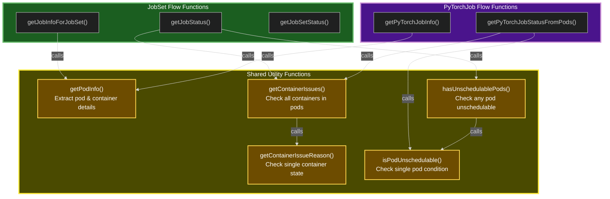

# Function Reuse Map

## Function Reuse Summary

### Shared Functions (Used by Both JobSet and PyTorchJob)

| Function | Purpose | Used By |
|----------|---------|---------|
| `getPodInfo()` | Extract pod and container information from Kubernetes pod list | `getJobInfoForJobSet()`, `getPyTorchJobInfo()` |
| `getContainerIssues()` | Check all containers in pods for issues (ImagePullError, CrashLoopBackOff, etc.) | `getJobStatus()`, `getPyTorchJobStatusFromPods()` |
| `getContainerIssueReason()` | Check individual container state and return issue reason | `getContainerIssues()` |
| `isPodUnschedulable()` | Check if a single pod has unschedulable condition | `hasUnschedulablePods()`, `getPyTorchJobStatusFromPods()` |
| `hasUnschedulablePods()` | Check if any pod in a list is unschedulable | `getJobStatus()` |

### Flow-Specific Functions

**JobSet Flow:**
- `getJobInfoForJobSet()` - Get job information for a JobSet
- `getJobStatus()` - Determine status of a single Job
- `getJobSetStatus()` - Aggregate status from all Jobs

**PyTorchJob Flow:**
- `getPyTorchJobInfo()` - Get PyTorchJob information
- `getPyTorchJobStatusFromPods()` - Aggregate status directly from Pods