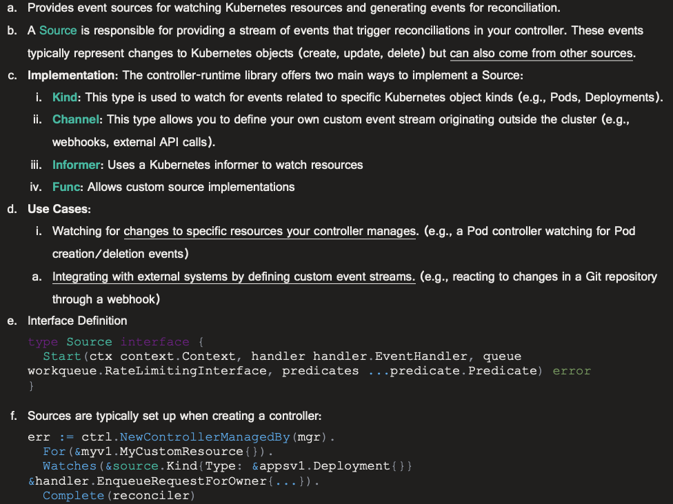
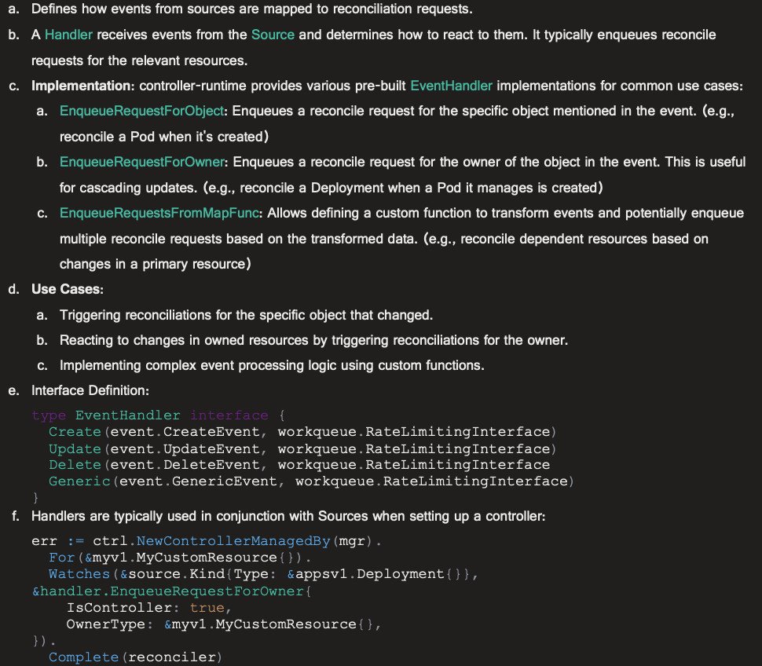
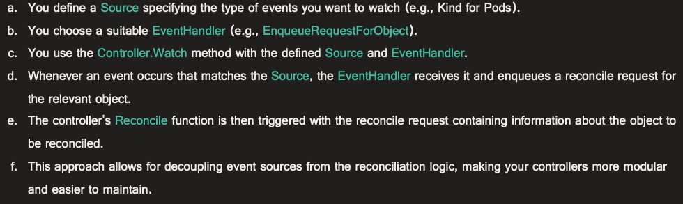

# 1. Custom Source and EventHandler

- [1. Custom Source and EventHandler](#1-custom-source-and-eventhandler)
  - [1.1. Description](#11-description)
  - [1.2. Before we start](#12-before-we-start)
    - [1.2.1. Source](#121-source)
    - [1.2.2. Event Handler](#122-event-handler)
    - [1.2.3. How Source and Handler work together](#123-how-source-and-handler-work-together)
  - [1.3. What are we building?](#13-what-are-we-building)
  - [1.4. Create Cluster](#14-create-cluster)
  - [1.5. Run the manager (and the controller)](#15-run-the-manager-and-the-controller)
  - [1.6. Explanation](#16-explanation)
  - [1.7. Cleanup](#17-cleanup)

## 1.1. Description

Demonstrate the capability of the controller-runtime library's [source](https://github.com/kubernetes-sigs/controller-runtime/tree/main/pkg/source) and [handler](https://github.com/kubernetes-sigs/controller-runtime/tree/main/pkg/handler) package.

## 1.2. Before we start

### 1.2.1. Source



### 1.2.2. Event Handler



### 1.2.3. How Source and Handler work together



## 1.3. What are we building?

Create a (dummy no-op) controller, source and eventhandler based on controller-runtime library.

Together they should be capable of:
1. Watching (simulating) an external api for the events.
2. `Source` should create an `event.GenericEvent` from the external events.
3. `Source` should write `event.GenericEvent` on a channel.
4. `EventHandler` should be capable of handling (deciding which resource to reconcile and enqueue their requests) based on `event.GenericEvent`.
5. `Controller` should use this channel and eventhandler to create a `Watch` and trigger reconciliation based on it.

## 1.4. Create Cluster

```bash
kind version
> kind v0.22.0 go1.21.7 darwin/arm64

kind create cluster --config kind.yaml
```

## 1.5. Run the manager (and the controller)

```bash
go mod tidy
go run .

2024-07-22T20:37:37+09:00       INFO    entrypoint      setting up manager
2024-07-22T20:37:37+09:00       INFO    entrypoint      setting up source and watch
2024-07-22T20:37:37+09:00       INFO    entrypoint      starting manager
2024-07-22T20:37:37+09:00       INFO    controller-runtime.metrics      Starting metrics server
2024-07-22T20:37:37+09:00       INFO    Starting EventSource    {"controller": "batchjob-controller", "source": "channel source: 0x140000fb6c0"}
2024-07-22T20:37:37+09:00       INFO    Starting Controller     {"controller": "batchjob-controller"}
2024-07-22T20:37:37+09:00       INFO    Starting workers        {"controller": "batchjob-controller", "worker count": 1}
2024-07-22T20:37:37+09:00       INFO    controller-runtime.metrics      Serving metrics server  {"bindAddress": ":8080", "secure": false}

2024-07-22T20:37:39+09:00       INFO    source  tick    {"at": "2024-07-22T20:37:39+09:00"}
2024-07-22T20:37:39+09:00       INFO    handler Generic ExternalEventHandler    {"evt": {"Object":{"metadata":{"name":"batch-980d1df7-d85a-4e5e-b77a-c405073922de","namespace":"default"}}}}
2024-07-22T20:37:39+09:00       INFO    reconciler      {"controller": "batchjob-controller", "object": {"name":"batch-980d1df7-d85a-4e5e-b77a-c405073922de","namespace":"default"}, "namespace": "default", "name": "batch-980d1df7-d85a-4e5e-b77a-c405073922de", "reconcileID": "ee13b098-58a3-4499-8440-83ef929a5fab", "incoming req": {"name":"batch-980d1df7-d85a-4e5e-b77a-c405073922de","namespace":"default"}}

2024-07-22T20:37:41+09:00       INFO    source  tick    {"at": "2024-07-22T20:37:41+09:00"}
2024-07-22T20:37:41+09:00       INFO    handler Generic ExternalEventHandler    {"evt": {"Object":{"metadata":{"name":"batch-f8dce82b-3b4b-4703-bb59-348a87a671a6","namespace":"default"}}}}
2024-07-22T20:37:41+09:00       INFO    reconciler      {"controller": "batchjob-controller", "object": {"name":"batch-f8dce82b-3b4b-4703-bb59-348a87a671a6","namespace":"default"}, "namespace": "default", "name": "batch-f8dce82b-3b4b-4703-bb59-348a87a671a6", "reconcileID": "6a072f57-affd-4d64-99d5-72d89a8093a9", "incoming req": {"name":"batch-f8dce82b-3b4b-4703-bb59-348a87a671a6","namespace":"default"}}

2024-07-22T20:37:43+09:00       INFO    source  tick    {"at": "2024-07-22T20:37:43+09:00"}
2024-07-22T20:37:43+09:00       INFO    handler Generic ExternalEventHandler    {"evt": {"Object":{"metadata":{"name":"batch-8c92cd5c-4cbd-4d5b-ab2e-d184c050e117","namespace":"default"}}}}
2024-07-22T20:37:43+09:00       INFO    reconciler      {"controller": "batchjob-controller", "object": {"name":"batch-8c92cd5c-4cbd-4d5b-ab2e-d184c050e117","namespace":"default"}, "namespace": "default", "name": "batch-8c92cd5c-4cbd-4d5b-ab2e-d184c050e117", "reconcileID": "c2808c34-7ab3-404d-9ec8-43e2525c6165", "incoming req": {"name":"batch-8c92cd5c-4cbd-4d5b-ab2e-d184c050e117","namespace":"default"}}

2024-07-22T20:37:44+09:00       INFO    source  context expired, exiting...
2024-07-22T20:37:44+09:00       INFO    Stopping and waiting for non leader election runnables
2024-07-22T20:37:44+09:00       INFO    Stopping and waiting for leader election runnables
2024-07-22T20:37:44+09:00       INFO    Shutdown signal received, waiting for all workers to finish     {"controller": "batchjob-controller"}
2024-07-22T20:37:44+09:00       INFO    All workers finished    {"controller": "batchjob-controller"}
2024-07-22T20:37:44+09:00       INFO    Stopping and waiting for caches
2024-07-22T20:37:44+09:00       INFO    Stopping and waiting for webhooks
2024-07-22T20:37:44+09:00       INFO    Stopping and waiting for HTTP servers
2024-07-22T20:37:44+09:00       INFO    controller-runtime.metrics      Shutting down metrics server with timeout of 1 minute
2024-07-22T20:37:44+09:00       INFO    Wait completed, proceeding to shutdown the manager
```

## 1.6. Explanation

1. `main.go` creates the `manager` and a `controller`.
2. This is a no-op controller since it only prints the request and nothing else (for demonstration purpose).
3. `handler.go` creates a `controller-runtime handler.EventHandler` (named `ExternalEventHandler`) that is capable of handling `event.GenericEvent`. This is a `controller-runtime` requirement.
4. `source.go` creates `ExternalEventSource` that simulates fetching events from external api and converting them into `event.GenericEvent`. This is NOT a `controller-runtime` requirement, but just for convenience.
5. These `event.GenericEvent`s are written on a channel (named `eventsCh`) using the `ExternalEventSource.Fetch()`. This is a `controller-runtime` requirement.
6. `main.go` creates a `controller-runtime source` using `source.Channel()` with the parameter of `eventsCh` and the `ExternalEventHandler`. Then, it integrates this source with the controller using `controller.Watch()`.
7. The logs show the flow `source.Channel()` i.e. `eventsCh` --emits-> `event.GenericEvent` --passed-to-> `ExternalEventHandler` --enqueue-> `Reconciler`.
8. The program exits automatically once the context timeout is hit.

## 1.7. Cleanup

Terminate the program by pressing `Ctrl+C`.

Delete the cluster.

```bash
kind delete cluster
```