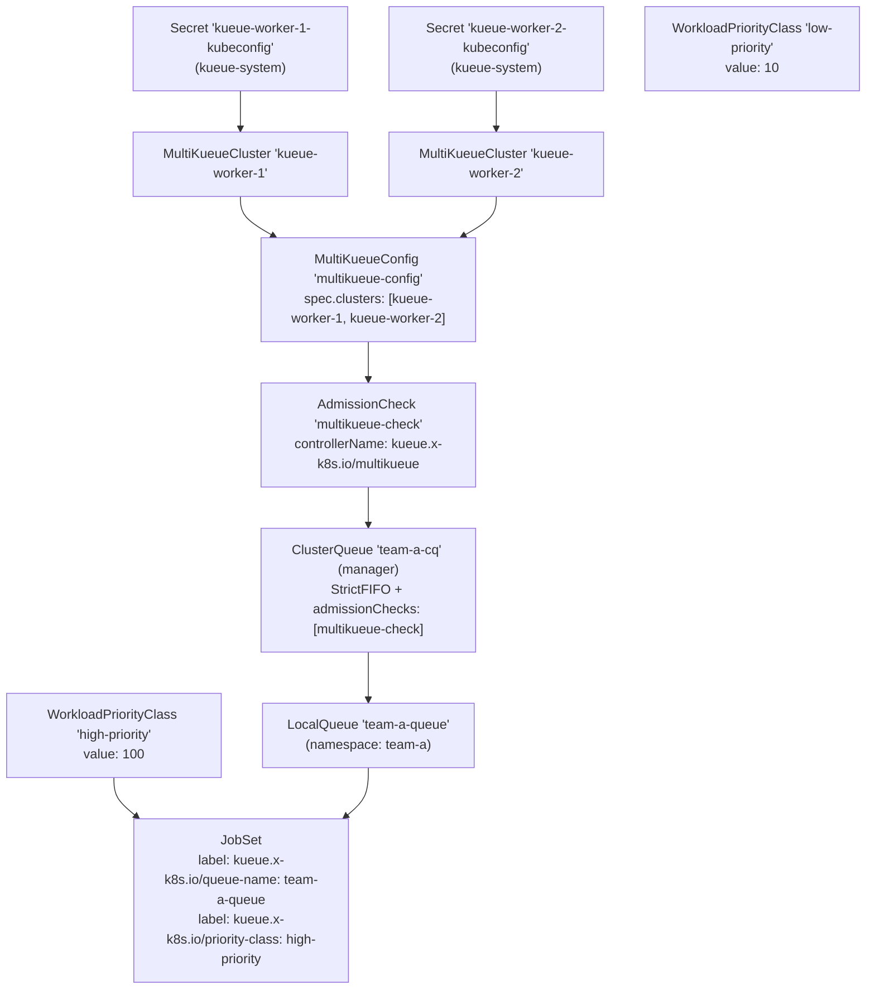
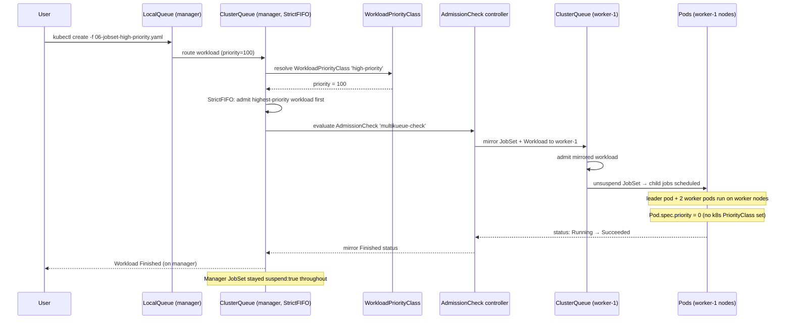

# kueue/06-multikueue-jobset-priority Implementation Plan

> **For agentic workers:** REQUIRED SUB-SKILL: Use superpowers:subagent-driven-development (recommended) or superpowers:executing-plans to implement this plan task-by-task. Steps use checkbox (`- [ ]`) syntax for tracking.

**Goal:** Create experiment `06-multikueue-jobset-priority` — a self-contained Kueue experiment demonstrating JobSet workloads dispatched via MultiKueue to 1 manager + 2 worker clusters, with WorkloadPriorityClass controlling admission ordering (decoupled from Kubernetes PriorityClass).

**Architecture:** Three Kind clusters (`kueue-manager`, `kueue-worker-1`, `kueue-worker-2`). The manager holds all MultiKueue objects, WorkloadPriorityClasses, and the user-facing queue. JobSet workloads are submitted to the manager and mirrored to a worker for execution. Priority ordering is demonstrated using `StrictFIFO` + `WorkloadPriorityClass`.

**Tech Stack:** Kind, Helm, Kueue v0.17.0, JobSet v0.11.1, cert-manager v1.20.2, kubectl, bash.

---

## File Map

All files are new (no existing files modified except the two README files at the end).

| File | Purpose |
|---|---|
| `kueue/06-multikueue-jobset-priority/kind-manager.yaml` | Kind cluster config for `kueue-manager` |
| `kueue/06-multikueue-jobset-priority/kind-worker-1.yaml` | Kind cluster config for `kueue-worker-1` |
| `kueue/06-multikueue-jobset-priority/kind-worker-2.yaml` | Kind cluster config for `kueue-worker-2` |
| `kueue/06-multikueue-jobset-priority/values.yaml` | Kueue Helm values (copied from `05-multikueue/values.yaml`) |
| `kueue/06-multikueue-jobset-priority/setup.sh` | Creates 3 clusters, installs deps, creates kubeconfig Secrets |
| `kueue/06-multikueue-jobset-priority/teardown.sh` | Cleans up all experiment resources |
| `kueue/06-multikueue-jobset-priority/02-multikueue-objects.yaml` | `MultiKueueCluster`×2, `MultiKueueConfig`, `AdmissionCheck` |
| `kueue/06-multikueue-jobset-priority/03-manager-clusterqueue.yaml` | `ResourceFlavor` + manager `ClusterQueue` (with admissionChecks) |
| `kueue/06-multikueue-jobset-priority/04-worker-clusterqueue.yaml` | `ResourceFlavor` + worker `ClusterQueue` (no admissionChecks) |
| `kueue/06-multikueue-jobset-priority/05-namespace-localqueue-priority.yaml` | `Namespace`, `LocalQueue`, `WorkloadPriorityClass`×2 |
| `kueue/06-multikueue-jobset-priority/06-jobset-high-priority.yaml` | `JobSet` (leader+worker) with `high-priority` WorkloadPriorityClass |
| `kueue/06-multikueue-jobset-priority/07-jobset-low-priority.yaml` | `JobSet` (leader+worker) with `low-priority` WorkloadPriorityClass |
| `kueue/06-multikueue-jobset-priority/README.md` | Experiment README |
| `kueue/README.md` | Top-level README (add row + concepts; update pending section) |

---

## Task 1: Create directory and copy values.yaml

**Files:**
- Create: `kueue/06-multikueue-jobset-priority/` (directory)
- Create: `kueue/06-multikueue-jobset-priority/values.yaml` (copy)

- [ ] **Step 1: Create the experiment directory**

```bash
mkdir kueue/06-multikueue-jobset-priority
```

- [ ] **Step 2: Copy values.yaml from experiment 05**

The user explicitly requested using `cp` to copy the existing values file from experiment 05.

```bash
cp kueue/05-multikueue/values.yaml kueue/06-multikueue-jobset-priority/values.yaml
```

No edits are needed — the copied file already has:
- `featureGates: MultiKueue: enabled: true`
- `integrations.frameworks` including `"jobset.x-k8s.io/jobset"` and `"batch/job"`

- [ ] **Step 3: Commit**

```bash
git add kueue/06-multikueue-jobset-priority/values.yaml
git commit -m "feat(kueue/06): add experiment directory and values.yaml"
```

---

## Task 2: Kind cluster configs

**Files:**
- Create: `kueue/06-multikueue-jobset-priority/kind-manager.yaml`
- Create: `kueue/06-multikueue-jobset-priority/kind-worker-1.yaml`
- Create: `kueue/06-multikueue-jobset-priority/kind-worker-2.yaml`

- [ ] **Step 1: Create kind-manager.yaml**

```yaml
---
# Manager cluster — holds the queue, MultiKueue objects, and WorkloadPriorityClasses.
# Jobs are submitted here; MultiKueue dispatches them to worker clusters.
kind: Cluster
apiVersion: kind.x-k8s.io/v1alpha4
name: kueue-manager
kubeadmConfigPatches:
  - |
    kind: ClusterConfiguration
    metadata:
      name: config
    apiServer:
      extraArgs:
        enable-admission-plugins: "NamespaceLifecycle,LimitRanger,ServiceAccount,TaintNodesByCondition,Priority,DefaultTolerationSeconds,DefaultStorageClass,PersistentVolumeClaimResize,MutatingAdmissionWebhook,ValidatingAdmissionWebhook,ResourceQuota"
nodes:
  - role: control-plane
    extraPortMappings:
      - containerPort: 30000
        hostPort: 30000
        listenAddress: "0.0.0.0"
        protocol: tcp

  # Two worker nodes — the manager itself does not run job pods.
  # Jobs are dispatched to the worker clusters by MultiKueue.
  - role: worker
    labels:
      node.kubernetes.io/instance-type: standard-1

  - role: worker
    labels:
      node.kubernetes.io/instance-type: standard-2
---
```

Save to `kueue/06-multikueue-jobset-priority/kind-manager.yaml`.

- [ ] **Step 2: Create kind-worker-1.yaml**

```yaml
---
# Worker cluster 1 — receives and executes JobSets mirrored from the manager.
# Kueue is installed here in "worker mode" — no MultiKueue objects needed.
kind: Cluster
apiVersion: kind.x-k8s.io/v1alpha4
name: kueue-worker-1
kubeadmConfigPatches:
  - |
    kind: ClusterConfiguration
    metadata:
      name: config
    apiServer:
      extraArgs:
        enable-admission-plugins: "NamespaceLifecycle,LimitRanger,ServiceAccount,TaintNodesByCondition,Priority,DefaultTolerationSeconds,DefaultStorageClass,PersistentVolumeClaimResize,MutatingAdmissionWebhook,ValidatingAdmissionWebhook,ResourceQuota"
nodes:
  - role: control-plane

  # Two worker nodes — JobSet pods actually run here.
  - role: worker
    labels:
      node.kubernetes.io/instance-type: standard-1

  - role: worker
    labels:
      node.kubernetes.io/instance-type: standard-2
---
```

Save to `kueue/06-multikueue-jobset-priority/kind-worker-1.yaml`.

- [ ] **Step 3: Create kind-worker-2.yaml**

```yaml
---
# Worker cluster 2 — second worker registered in MultiKueueConfig.
# Provides multi-worker federation alongside kueue-worker-1.
kind: Cluster
apiVersion: kind.x-k8s.io/v1alpha4
name: kueue-worker-2
kubeadmConfigPatches:
  - |
    kind: ClusterConfiguration
    metadata:
      name: config
    apiServer:
      extraArgs:
        enable-admission-plugins: "NamespaceLifecycle,LimitRanger,ServiceAccount,TaintNodesByCondition,Priority,DefaultTolerationSeconds,DefaultStorageClass,PersistentVolumeClaimResize,MutatingAdmissionWebhook,ValidatingAdmissionWebhook,ResourceQuota"
nodes:
  - role: control-plane

  # Two worker nodes.
  - role: worker
    labels:
      node.kubernetes.io/instance-type: standard-1

  - role: worker
    labels:
      node.kubernetes.io/instance-type: standard-2
---
```

Save to `kueue/06-multikueue-jobset-priority/kind-worker-2.yaml`.

- [ ] **Step 4: Commit**

```bash
git add kueue/06-multikueue-jobset-priority/kind-manager.yaml \
        kueue/06-multikueue-jobset-priority/kind-worker-1.yaml \
        kueue/06-multikueue-jobset-priority/kind-worker-2.yaml
git commit -m "feat(kueue/06): add Kind cluster configs (manager + 2 workers)"
```

---

## Task 3: setup.sh

**Files:**
- Create: `kueue/06-multikueue-jobset-priority/setup.sh`

The script extends the pattern from `05-multikueue/setup.sh`: create clusters → install CRDs → install Kueue → extract kubeconfigs → create Secrets. Key differences: three clusters (manager + 2 workers); two kubeconfig Secrets.

- [ ] **Step 1: Create setup.sh**

```bash
#!/usr/bin/env bash
# setup.sh
# Creates three Kind clusters (kueue-manager + kueue-worker-1 + kueue-worker-2)
# and installs cert-manager + Kueue + all job-framework CRDs on all clusters
# for the MultiKueue + JobSet + WorkloadPriorityClass experiment.
# Run from within this directory: bash setup.sh

set -euo pipefail

SCRIPT_DIR="$(cd "$(dirname "${BASH_SOURCE[0]}")" && pwd)"
KUEUE_VERSION="0.17.0"

# ---------------------------------------------------------------------------
# Dependency versions — must match the integrations.frameworks list in
# values.yaml so that Kueue can watch these CRDs on the worker clusters.
# Versions sourced from kueue v0.17.0 go.mod.
# ---------------------------------------------------------------------------
JOBSET_VERSION="v0.11.1"
TRAINING_OPERATOR_VERSION="v1.9.3"
KUBEFLOW_TRAINER_VERSION="v2.2.0"

# ---------------------------------------------------------------------------
# Helper: install cert-manager + Kueue on a given context
# ---------------------------------------------------------------------------
install_kueue() {
  local context="$1"
  local values_file="$2"
  echo ""
  echo "══════════════════════════════════════════════════════════════════"
  echo "  Installing cert-manager + Kueue on context: ${context}"
  echo "══════════════════════════════════════════════════════════════════"

  helm install \
    cert-manager oci://quay.io/jetstack/charts/cert-manager \
    --version v1.20.2 \
    --namespace cert-manager \
    --create-namespace \
    --set crds.enabled=true \
    --kube-context "${context}"

  kubectl wait deploy/cert-manager           -n cert-manager --for=condition=available --timeout=5m --context "${context}"
  kubectl wait deploy/cert-manager-cainjector -n cert-manager --for=condition=available --timeout=5m --context "${context}"
  kubectl wait deploy/cert-manager-webhook   -n cert-manager --for=condition=available --timeout=5m --context "${context}"

  helm install kueue oci://registry.k8s.io/kueue/charts/kueue \
    --version="${KUEUE_VERSION}" \
    --namespace kueue-system \
    --create-namespace \
    --wait --timeout 300s \
    --values "${values_file}" \
    --kube-context "${context}"
}

# ---------------------------------------------------------------------------
# Helper: install all job-framework CRDs on a given context.
# MultiKueue requires that every framework listed in integrations.frameworks
# has its CRDs present on the worker cluster, otherwise the Watch call fails
# with "no matches for kind" and the MultiKueueCluster goes Active=False.
# ---------------------------------------------------------------------------
install_crds() {
  local context="$1"
  echo ""
  echo "══════════════════════════════════════════════════════════════════"
  echo "  Installing job-framework CRDs on context: ${context}"
  echo "══════════════════════════════════════════════════════════════════"

  # ── JobSet ──────────────────────────────────────────────────────────────
  echo "  -> JobSet ${JOBSET_VERSION}"
  helm install jobset oci://registry.k8s.io/jobset/charts/jobset \
    --version "${JOBSET_VERSION#v}" \
    --namespace jobset-system \
    --create-namespace \
    --wait --timeout 300s \
    --kube-context "${context}"

  # ── Kubeflow Training Operator (PyTorchJob, TFJob, XGBoostJob, etc.) ─────
  echo "  -> Kubeflow Training Operator ${TRAINING_OPERATOR_VERSION}"
  kubectl apply --server-side -k \
    "github.com/kubeflow/training-operator.git/manifests/overlays/standalone?ref=${TRAINING_OPERATOR_VERSION}" \
    --context "${context}"

  # ── Kubeflow Trainer (TrainJob) ──────────────────────────────────────────
  echo "  -> Kubeflow Trainer ${KUBEFLOW_TRAINER_VERSION}"
  helm install kubeflow-trainer oci://ghcr.io/kubeflow/charts/kubeflow-trainer \
    --version "${KUBEFLOW_TRAINER_VERSION#v}" \
    --namespace kubeflow \
    --create-namespace \
    --set jobset.install=false \
    --wait --timeout 300s \
    --kube-context "${context}"

  echo "  ✅ CRDs installed on ${context}"
}

# ---------------------------------------------------------------------------
# Helper: extract a worker cluster's kubeconfig, rewrite the API server
# address from 127.0.0.1 to the container's Docker bridge IP, and store it
# as a Secret in kueue-system on the manager cluster.
#
# Why we rewrite the address:
#   Kind writes kubeconfigs with server: https://127.0.0.1:<host-port>.
#   That works from your laptop, but from inside the manager cluster's pods
#   127.0.0.1 refers to the pod itself. We use the worker control-plane
#   container's Docker bridge IP so that Kueue's controller pod can reach
#   the worker API server over the shared "kind" bridge network.
#
# All Kind clusters share the single Docker bridge network named "kind"
# (typically 172.18.0.0/16), so every node container from every cluster can
# reach every other container directly by IP.
# ---------------------------------------------------------------------------
create_worker_secret() {
  local worker_name="$1"        # e.g. kueue-worker-1
  local secret_name="$2"        # e.g. kueue-worker-1-kubeconfig
  local manager_context="kind-kueue-manager"

  echo ""
  echo "==> Extracting kubeconfig for ${worker_name} and creating Secret on manager..."

  local cp_container="${worker_name}-control-plane"
  local worker_cp_ip
  worker_cp_ip=$(docker inspect "${cp_container}" \
    --format '{{range .NetworkSettings.Networks}}{{.IPAddress}}{{end}}')

  echo "   ${worker_name} control-plane IP: ${worker_cp_ip}"

  local tmp_file="/tmp/${secret_name}.yaml"

  kind get kubeconfig --name "${worker_name}" --internal | \
    sed "s|https://${worker_name}-control-plane:6443|https://${worker_cp_ip}:6443|g" \
    > "${tmp_file}"

  kubectl create secret generic "${secret_name}" \
    --from-file=kubeconfig="${tmp_file}" \
    --namespace kueue-system \
    --context "${manager_context}" \
    --dry-run=client -o yaml | \
    kubectl apply -f - --context "${manager_context}"

  rm -f "${tmp_file}"
  echo "   ✅ Secret ${secret_name} created in kueue-system on manager"
}

# ---------------------------------------------------------------------------
# 1. Create the manager cluster
# ---------------------------------------------------------------------------
echo "==> Creating manager cluster (kueue-manager)..."
kind create cluster --name kueue-manager --config "${SCRIPT_DIR}/kind-manager.yaml"
kubectl cluster-info --context kind-kueue-manager
kubectl wait deploy/coredns -n kube-system --for=condition=available --timeout=5m --context kind-kueue-manager

# ---------------------------------------------------------------------------
# 2. Create worker cluster 1
# ---------------------------------------------------------------------------
echo ""
echo "==> Creating worker cluster 1 (kueue-worker-1)..."
kind create cluster --name kueue-worker-1 --config "${SCRIPT_DIR}/kind-worker-1.yaml"
kubectl cluster-info --context kind-kueue-worker-1
kubectl wait deploy/coredns -n kube-system --for=condition=available --timeout=5m --context kind-kueue-worker-1

# ---------------------------------------------------------------------------
# 3. Create worker cluster 2
# ---------------------------------------------------------------------------
echo ""
echo "==> Creating worker cluster 2 (kueue-worker-2)..."
kind create cluster --name kueue-worker-2 --config "${SCRIPT_DIR}/kind-worker-2.yaml"
kubectl cluster-info --context kind-kueue-worker-2
kubectl wait deploy/coredns -n kube-system --for=condition=available --timeout=5m --context kind-kueue-worker-2

# ---------------------------------------------------------------------------
# 4. Install job-framework CRDs on ALL clusters
#    MultiKueue mirrors JobSet objects to workers; the JobSet CRD must exist
#    on the worker clusters or the mirror will fail with "no matches for kind".
# ---------------------------------------------------------------------------
install_crds "kind-kueue-manager"
install_crds "kind-kueue-worker-1"
install_crds "kind-kueue-worker-2"

# ---------------------------------------------------------------------------
# 5. Install Kueue on all clusters
#    - Manager: values.yaml has MultiKueue feature gate enabled
#    - Workers: same values.yaml is fine; MultiKueue feature gate is harmless
#               on workers (they won't create MultiKueue objects there)
# ---------------------------------------------------------------------------
install_kueue "kind-kueue-manager"  "${SCRIPT_DIR}/values.yaml"
install_kueue "kind-kueue-worker-1" "${SCRIPT_DIR}/values.yaml"
install_kueue "kind-kueue-worker-2" "${SCRIPT_DIR}/values.yaml"

# ---------------------------------------------------------------------------
# 6. Extract worker kubeconfigs and store as Secrets on the manager.
#    MultiKueueCluster objects reference these Secrets to connect to workers.
#
# Secret placement rules (from Kueue source):
#   - Namespace : kueue-system  (Kueue always looks in its own config namespace)
#   - Data key  : kubeconfig    (must be exactly "kubeconfig")
#   - location  in MultiKueueCluster: just the Secret NAME
# ---------------------------------------------------------------------------
create_worker_secret "kueue-worker-1" "kueue-worker-1-kubeconfig"
create_worker_secret "kueue-worker-2" "kueue-worker-2-kubeconfig"

echo ""
echo "✅ All three clusters and Kueue are ready."
echo ""
echo "   Manager context  : kind-kueue-manager"
echo "   Worker 1 context : kind-kueue-worker-1"
echo "   Worker 2 context : kind-kueue-worker-2"
echo ""
echo "   Worker kubeconfig Secrets created in kueue-system on manager:"
echo "     kueue-worker-1-kubeconfig"
echo "     kueue-worker-2-kubeconfig"
echo ""
echo "   Next: follow the experiment README.md"
```

Save to `kueue/06-multikueue-jobset-priority/setup.sh`.

- [ ] **Step 2: Make setup.sh executable**

```bash
chmod +x kueue/06-multikueue-jobset-priority/setup.sh
```

- [ ] **Step 3: Commit**

```bash
git add kueue/06-multikueue-jobset-priority/setup.sh
git commit -m "feat(kueue/06): add setup.sh (3-cluster setup with kubeconfig Secrets)"
```

---

## Task 4: teardown.sh

**Files:**
- Create: `kueue/06-multikueue-jobset-priority/teardown.sh`

- [ ] **Step 1: Create teardown.sh**

```bash
#!/usr/bin/env bash
# teardown.sh
# Cleans up all resources created during the MultiKueue + JobSet + Priority experiment.
# Run this after you are done with the experiment.

set -euo pipefail

MANAGER_CTX="kind-kueue-manager"
WORKER1_CTX="kind-kueue-worker-1"
WORKER2_CTX="kind-kueue-worker-2"

# ---------------------------------------------------------------------------
# Clean up manager cluster resources
# ---------------------------------------------------------------------------
echo "==> [manager] Deleting JobSets and Workloads in namespace team-a..."
kubectl delete jobsets --all -n team-a --ignore-not-found --context "${MANAGER_CTX}"
kubectl delete workloads --all -n team-a --ignore-not-found --context "${MANAGER_CTX}"

echo "==> [manager] Deleting LocalQueue..."
kubectl delete localqueue team-a-queue -n team-a --ignore-not-found --context "${MANAGER_CTX}"

echo "==> [manager] Deleting namespace team-a..."
kubectl delete namespace team-a --ignore-not-found --context "${MANAGER_CTX}"

echo "==> [manager] Deleting WorkloadPriorityClasses..."
kubectl delete workloadpriorityclass high-priority low-priority --ignore-not-found --context "${MANAGER_CTX}"

echo "==> [manager] Deleting ClusterQueues..."
kubectl delete clusterqueue --all --context "${MANAGER_CTX}" --ignore-not-found

echo "==> [manager] Deleting ResourceFlavors..."
kubectl delete resourceflavor --all --context "${MANAGER_CTX}" --ignore-not-found

echo "==> [manager] Deleting AdmissionCheck..."
kubectl delete admissioncheck multikueue-check --ignore-not-found --context "${MANAGER_CTX}"

echo "==> [manager] Deleting MultiKueueConfig..."
kubectl delete multikueueconfig multikueue-config --ignore-not-found --context "${MANAGER_CTX}"

echo "==> [manager] Deleting MultiKueueClusters..."
kubectl delete multikueuecluster kueue-worker-1 kueue-worker-2 --ignore-not-found --context "${MANAGER_CTX}"

echo "==> [manager] Deleting worker kubeconfig Secrets from kueue-system..."
kubectl delete secret kueue-worker-1-kubeconfig kueue-worker-2-kubeconfig \
  -n kueue-system --ignore-not-found --context "${MANAGER_CTX}"

# ---------------------------------------------------------------------------
# Clean up worker cluster 1 resources
# ---------------------------------------------------------------------------
echo ""
echo "==> [worker-1] Deleting JobSets and Workloads in namespace team-a..."
kubectl delete jobsets --all -n team-a --ignore-not-found --context "${WORKER1_CTX}"
kubectl delete workloads --all -n team-a --ignore-not-found --context "${WORKER1_CTX}"

echo "==> [worker-1] Deleting LocalQueue..."
kubectl delete localqueue team-a-queue -n team-a --ignore-not-found --context "${WORKER1_CTX}"

echo "==> [worker-1] Deleting namespace team-a..."
kubectl delete namespace team-a --ignore-not-found --context "${WORKER1_CTX}"

echo "==> [worker-1] Deleting ClusterQueues..."
kubectl delete clusterqueue --all --context "${WORKER1_CTX}" --ignore-not-found

echo "==> [worker-1] Deleting ResourceFlavors..."
kubectl delete resourceflavor --all --context "${WORKER1_CTX}" --ignore-not-found

# ---------------------------------------------------------------------------
# Clean up worker cluster 2 resources
# ---------------------------------------------------------------------------
echo ""
echo "==> [worker-2] Deleting JobSets and Workloads in namespace team-a..."
kubectl delete jobsets --all -n team-a --ignore-not-found --context "${WORKER2_CTX}"
kubectl delete workloads --all -n team-a --ignore-not-found --context "${WORKER2_CTX}"

echo "==> [worker-2] Deleting LocalQueue..."
kubectl delete localqueue team-a-queue -n team-a --ignore-not-found --context "${WORKER2_CTX}"

echo "==> [worker-2] Deleting namespace team-a..."
kubectl delete namespace team-a --ignore-not-found --context "${WORKER2_CTX}"

echo "==> [worker-2] Deleting ClusterQueues..."
kubectl delete clusterqueue --all --context "${WORKER2_CTX}" --ignore-not-found

echo "==> [worker-2] Deleting ResourceFlavors..."
kubectl delete resourceflavor --all --context "${WORKER2_CTX}" --ignore-not-found

echo ""
echo "✅ Experiment teardown complete."
echo ""
echo "Kueue is still installed on all three clusters. To remove the clusters entirely:"
echo "  kind delete cluster --name kueue-manager"
echo "  kind delete cluster --name kueue-worker-1"
echo "  kind delete cluster --name kueue-worker-2"
```

Save to `kueue/06-multikueue-jobset-priority/teardown.sh`.

- [ ] **Step 2: Make teardown.sh executable**

```bash
chmod +x kueue/06-multikueue-jobset-priority/teardown.sh
```

- [ ] **Step 3: Commit**

```bash
git add kueue/06-multikueue-jobset-priority/teardown.sh
git commit -m "feat(kueue/06): add teardown.sh"
```

---

## Task 5: 02-multikueue-objects.yaml

**Files:**
- Create: `kueue/06-multikueue-jobset-priority/02-multikueue-objects.yaml`

This file adds both `MultiKueueCluster` objects (one per worker), the `MultiKueueConfig` listing both, and the `AdmissionCheck`. Apply to manager cluster only.

- [ ] **Step 1: Create 02-multikueue-objects.yaml**

```yaml
# MultiKueue objects — manager cluster only
#
# These objects wire up the multi-cluster dispatch pipeline for TWO worker clusters:
#
#   MultiKueueCluster  — one per worker cluster. References a Secret in kueue-system
#                        that holds the worker's kubeconfig (created by setup.sh).
#
#   MultiKueueConfig   — groups both MultiKueueCluster objects. The AdmissionCheck
#                        references this config. MultiKueue picks from this list
#                        using first-available selection.
#
#   AdmissionCheck     — a gate that Kueue evaluates before admitting a workload.
#                        Any ClusterQueue referencing this check will dispatch
#                        admitted workloads to one of the listed worker clusters.
#
# Apply to MANAGER cluster only:
#   kubectl apply -f 02-multikueue-objects.yaml --context kind-kueue-manager

---
# Worker cluster 1 — MultiKueueCluster connects to kueue-worker-1.
# The kubeconfig Secret was created by setup.sh in the kueue-system namespace.
#
# IMPORTANT — how Kueue resolves the Secret:
#   locationType: Secret  → Kueue reads the Secret from its own config namespace
#                           (kueue-system by default).
#   location: <name>      → just the Secret NAME; Kueue always looks in kueue-system.
#   The Secret data key must be exactly "kubeconfig".
apiVersion: kueue.x-k8s.io/v1beta2
kind: MultiKueueCluster
metadata:
  name: kueue-worker-1
spec:
  clusterSource:
    kubeConfig:
      locationType: Secret
      location: kueue-worker-1-kubeconfig

---
# Worker cluster 2 — MultiKueueCluster connects to kueue-worker-2.
apiVersion: kueue.x-k8s.io/v1beta2
kind: MultiKueueCluster
metadata:
  name: kueue-worker-2
spec:
  clusterSource:
    kubeConfig:
      locationType: Secret
      location: kueue-worker-2-kubeconfig

---
# MultiKueueConfig — groups both worker clusters.
# The AdmissionCheck below references this config by name.
# When a workload is dispatched, MultiKueue picks the first available worker
# from this list (not round-robin; first-available selection).
apiVersion: kueue.x-k8s.io/v1beta2
kind: MultiKueueConfig
metadata:
  name: multikueue-config
spec:
  clusters:
    - kueue-worker-1
    - kueue-worker-2

---
# AdmissionCheck — the gate that triggers MultiKueue dispatch.
# Any ClusterQueue that lists this AdmissionCheck in its
# spec.admissionChecksStrategy.admissionChecks[] will route admitted workloads
# to one of the worker clusters listed in the MultiKueueConfig.
apiVersion: kueue.x-k8s.io/v1beta2
kind: AdmissionCheck
metadata:
  name: multikueue-check
spec:
  # controllerName must be exactly "kueue.x-k8s.io/multikueue" — this is the
  # built-in MultiKueue admission-check controller name.
  controllerName: kueue.x-k8s.io/multikueue
  # parameters points to the MultiKueueConfig that lists the worker clusters.
  parameters:
    apiGroup: kueue.x-k8s.io
    kind: MultiKueueConfig
    name: multikueue-config
```

Save to `kueue/06-multikueue-jobset-priority/02-multikueue-objects.yaml`.

- [ ] **Step 2: Commit**

```bash
git add kueue/06-multikueue-jobset-priority/02-multikueue-objects.yaml
git commit -m "feat(kueue/06): add MultiKueueCluster×2, MultiKueueConfig, AdmissionCheck"
```

---

## Task 6: 03-manager-clusterqueue.yaml

**Files:**
- Create: `kueue/06-multikueue-jobset-priority/03-manager-clusterqueue.yaml`

The manager ClusterQueue uses `StrictFIFO` (required for priority demo) and references the `multikueue-check` AdmissionCheck. Apply to manager cluster only.

- [ ] **Step 1: Create 03-manager-clusterqueue.yaml**

```yaml
# ResourceFlavor and ClusterQueue — MANAGER cluster only
#
# The manager ClusterQueue:
#   - Uses StrictFIFO so WorkloadPriorityClass ordering is observable.
#     (BestEffortFIFO may admit out-of-priority-order if quota fits.)
#   - References the multikueue-check AdmissionCheck, which is what makes
#     this a MultiKueue queue — admitted workloads are dispatched to workers.
#
# Apply to MANAGER cluster only:
#   kubectl apply -f 03-manager-clusterqueue.yaml --context kind-kueue-manager

---
# A single shared ResourceFlavor with no nodeLabels — all nodes are equivalent.
# The same name must exist on the worker clusters too (see 04-worker-clusterqueue.yaml).
apiVersion: kueue.x-k8s.io/v1beta2
kind: ResourceFlavor
metadata:
  name: default-flavor
spec: {}

---
# Manager ClusterQueue — users submit JobSets here.
#
# Key differences from earlier experiments:
#   1. queueingStrategy: StrictFIFO — required to observe WorkloadPriorityClass ordering.
#      With BestEffortFIFO, Kueue may admit a lower-priority workload if it fits,
#      even if a higher-priority workload is pending.
#   2. admissionChecksStrategy — the multikueue-check gate triggers MultiKueue dispatch.
#      Without this field, workloads would run locally on the manager.
#
# Apply to MANAGER cluster only.
apiVersion: kueue.x-k8s.io/v1beta2
kind: ClusterQueue
metadata:
  name: team-a-cq
  annotations:
    multikueue.kueue.x-k8s.io/cluster-role: manager
spec:
  namespaceSelector: {}
  queueingStrategy: StrictFIFO

  resourceGroups:
    - coveredResources: ["cpu", "memory"]
      flavors:
        - name: default-flavor
          resources:
            - name: cpu
              nominalQuota: "2"
            - name: memory
              nominalQuota: "2Gi"

  # admissionChecks — this is what makes the ClusterQueue a MultiKueue queue.
  # Kueue will not admit a workload until the named AdmissionCheck is satisfied.
  # The MultiKueue controller satisfies it by successfully mirroring the
  # workload to a worker cluster.
  admissionChecksStrategy:
    admissionChecks:
    - name: multikueue-check
```

Save to `kueue/06-multikueue-jobset-priority/03-manager-clusterqueue.yaml`.

**Note on quota:** Each JobSet requests `500m` CPU and `256Mi` memory (1 leader pod + 2 worker pods). With `nominalQuota: 2 CPU / 2Gi`, only ~3 JobSets can run concurrently — enough to demonstrate queuing and priority ordering.

- [ ] **Step 2: Commit**

```bash
git add kueue/06-multikueue-jobset-priority/03-manager-clusterqueue.yaml
git commit -m "feat(kueue/06): add manager ClusterQueue (StrictFIFO + admissionChecks)"
```

---

## Task 7: 04-worker-clusterqueue.yaml

**Files:**
- Create: `kueue/06-multikueue-jobset-priority/04-worker-clusterqueue.yaml`

The same file is applied to both worker clusters. **Must not** have `admissionChecks` (would cause infinite mirror loop). Must have the same `ResourceFlavor` and `ClusterQueue` names as the manager.

- [ ] **Step 1: Create 04-worker-clusterqueue.yaml**

```yaml
# ResourceFlavor and ClusterQueue — WORKER clusters (apply to both)
#
# The worker ClusterQueue:
#   - Same name ("team-a-cq") as the manager — MultiKueue mirrors workloads
#     to a queue with the same name on the worker.
#   - Same ResourceFlavor name ("default-flavor") — the workload's flavor
#     assignment must resolve on the worker too.
#   - NO admissionChecks — the worker must run jobs locally. If admissionChecks
#     were present, the worker would try to dispatch further (infinite loop).
#
# Apply to BOTH worker clusters:
#   kubectl apply -f 04-worker-clusterqueue.yaml --context kind-kueue-worker-1
#   kubectl apply -f 04-worker-clusterqueue.yaml --context kind-kueue-worker-2

---
# Same ResourceFlavor as on the manager — name must match.
apiVersion: kueue.x-k8s.io/v1beta2
kind: ResourceFlavor
metadata:
  name: default-flavor
spec: {}

---
# Worker ClusterQueue — no admissionChecks, same name as manager CQ.
# The quota here is what controls how many pods can run on this worker cluster.
apiVersion: kueue.x-k8s.io/v1beta2
kind: ClusterQueue
metadata:
  name: team-a-cq
  annotations:
    multikueue.kueue.x-k8s.io/cluster-role: worker
spec:
  namespaceSelector: {}
  queueingStrategy: BestEffortFIFO

  resourceGroups:
    - coveredResources: ["cpu", "memory"]
      flavors:
        - name: default-flavor
          resources:
            - name: cpu
              nominalQuota: "4"
            - name: memory
              nominalQuota: "4Gi"

  # No admissionChecks here — the worker runs jobs locally.
  # If admissionChecks were present, the worker would try to mirror jobs further,
  # creating an infinite dispatch loop.
```

Save to `kueue/06-multikueue-jobset-priority/04-worker-clusterqueue.yaml`.

- [ ] **Step 2: Commit**

```bash
git add kueue/06-multikueue-jobset-priority/04-worker-clusterqueue.yaml
git commit -m "feat(kueue/06): add worker ClusterQueue (no admissionChecks)"
```

---

## Task 8: 05-namespace-localqueue-priority.yaml

**Files:**
- Create: `kueue/06-multikueue-jobset-priority/05-namespace-localqueue-priority.yaml`

This file contains the `Namespace`, `LocalQueue`, and both `WorkloadPriorityClass` objects. The `WorkloadPriorityClass` objects are cluster-scoped and only need to exist on the manager. The `Namespace` and `LocalQueue` must exist on all three clusters.

- [ ] **Step 1: Create 05-namespace-localqueue-priority.yaml**

```yaml
# Namespace, LocalQueue, and WorkloadPriorityClasses
#
# Apply this file to ALL clusters (Namespace + LocalQueue on all three):
#   kubectl apply -f 05-namespace-localqueue-priority.yaml --context kind-kueue-manager
#   kubectl apply -f 05-namespace-localqueue-priority.yaml --context kind-kueue-worker-1
#   kubectl apply -f 05-namespace-localqueue-priority.yaml --context kind-kueue-worker-2
#
# NOTE: WorkloadPriorityClass objects are cluster-scoped and only meaningful
# on the manager cluster. When applied to worker clusters, Kueue will simply
# ignore them (they are not used during local admission on workers).
#
# The Namespace and LocalQueue must exist on the worker clusters because
# MultiKueue mirrors the JobSet (and its Workload) into the same namespace
# using the same LocalQueue name.

---
apiVersion: v1
kind: Namespace
metadata:
  name: team-a
  labels:
    purpose: kueue-experiment

---
# LocalQueue — same name on all clusters.
# On the manager it routes to the CQ that has the AdmissionCheck.
# On the workers it routes to the CQ that runs jobs locally.
apiVersion: kueue.x-k8s.io/v1beta2
kind: LocalQueue
metadata:
  name: team-a-queue
  namespace: team-a
spec:
  clusterQueue: team-a-cq

---
# WorkloadPriorityClass: high-priority
#
# A Kueue-native priority object. Setting this on a JobSet (via the
# kueue.x-k8s.io/priority-class label) tells Kueue to assign value=100 to
# the workload's priority field. With StrictFIFO, higher-value workloads are
# admitted before lower-value ones when quota is limited.
#
# IMPORTANT: WorkloadPriorityClass is SEPARATE from Kubernetes PriorityClass.
#   - WorkloadPriorityClass controls Kueue admission order only.
#   - It does NOT affect the pod's spec.priority or scheduling preemption.
#   - A workload can have high WorkloadPriorityClass but low (or default)
#     Kubernetes PriorityClass — Kueue admits it first, but the pod scheduler
#     treats it like any other normal-priority pod.
#
# Only needs to exist on the manager cluster.
apiVersion: kueue.x-k8s.io/v1beta2
kind: WorkloadPriorityClass
metadata:
  name: high-priority
value: 100
description: "High-priority workloads — admitted before low-priority workloads in the queue."

---
# WorkloadPriorityClass: low-priority
#
# value: 10 — lower than high-priority (100), so these workloads are queued
# behind high-priority ones when quota is exhausted.
#
# Only needs to exist on the manager cluster.
apiVersion: kueue.x-k8s.io/v1beta2
kind: WorkloadPriorityClass
metadata:
  name: low-priority
value: 10
description: "Low-priority workloads — queued behind high-priority workloads."
```

Save to `kueue/06-multikueue-jobset-priority/05-namespace-localqueue-priority.yaml`.

- [ ] **Step 2: Commit**

```bash
git add kueue/06-multikueue-jobset-priority/05-namespace-localqueue-priority.yaml
git commit -m "feat(kueue/06): add Namespace, LocalQueue, WorkloadPriorityClass×2"
```

---

## Task 9: JobSet workload manifests

**Files:**
- Create: `kueue/06-multikueue-jobset-priority/06-jobset-high-priority.yaml`
- Create: `kueue/06-multikueue-jobset-priority/07-jobset-low-priority.yaml`

Each JobSet has two child jobs: `leader` (1 pod) and `worker` (2 pods). Both use `generateName` so multiple instances can be submitted. The only difference between the two files is the `kueue.x-k8s.io/priority-class` label value.

**Critical:** Kueue reads `queue-name` and `priority-class` from **labels**, not annotations.

- [ ] **Step 1: Create 06-jobset-high-priority.yaml**

```yaml
# JobSet — high priority — submit to the MANAGER cluster
#
# This JobSet has two child jobs:
#   leader  — 1 pod, simulates a master/coordinator process
#   worker  — 2 pods, simulate distributed worker processes
#
# Kueue treats the entire JobSet as ONE admission unit:
#   - A single Workload object is created for the whole JobSet.
#   - All child jobs are admitted or queued atomically.
#
# WorkloadPriorityClass:
#   The label kueue.x-k8s.io/priority-class: high-priority assigns value=100
#   to this workload's Kueue priority. With StrictFIFO, this workload is
#   admitted before pending low-priority workloads when quota is available.
#
#   NOTE: This does NOT affect Kubernetes pod scheduling priority. The pods
#   have no Kubernetes PriorityClass set — their scheduling priority is the
#   cluster default (0). Only Kueue admission order is affected.
#
# Submit with:
#   kubectl create -f 06-jobset-high-priority.yaml -n team-a --context kind-kueue-manager
#
# Note: use `kubectl create` (not `kubectl apply`) because the JobSet uses
# generateName — each invocation creates a new uniquely-named JobSet.
---
apiVersion: jobset.x-k8s.io/v1alpha2
kind: JobSet
metadata:
  generateName: jobset-high-
  namespace: team-a
  labels:
    experiment: multikueue-jobset-priority
    # kueue.x-k8s.io/queue-name MUST be a label (not annotation).
    # Kueue's reconciler reads it via object.GetLabels().
    kueue.x-k8s.io/queue-name: team-a-queue
    # kueue.x-k8s.io/priority-class MUST be a label (not annotation).
    # Kueue maps this to the WorkloadPriorityClass named "high-priority" (value: 100).
    kueue.x-k8s.io/priority-class: high-priority
spec:
  # suspend: true is required — Kueue controls when the JobSet starts.
  # Kueue sets suspend: false once the workload is admitted.
  suspend: true
  replicatedJobs:
    - name: leader
      replicas: 1
      template:
        spec:
          # completionMode: Indexed is required for JobSet child jobs.
          completionMode: Indexed
          parallelism: 1
          completions: 1
          template:
            spec:
              restartPolicy: Never
              # No Kubernetes PriorityClassName set — scheduling priority is default (0).
              # This demonstrates that WorkloadPriorityClass (Kueue admission priority)
              # is independent of Kubernetes PriorityClass (pod scheduling priority).
              containers:
                - name: leader
                  image: busybox:1.36
                  command:
                    - sh
                    - -c
                    - |
                      echo "=== JobSet high-priority: LEADER ==="
                      echo "Role   : leader"
                      echo "Node   : $(hostname)"
                      echo "Cluster: this pod is on a WORKER cluster"
                      echo "Sleeping 60 seconds..."
                      sleep 60
                      echo "Leader done."
                  resources:
                    requests:
                      cpu: "100m"
                      memory: "64Mi"
                    limits:
                      cpu: "100m"
                      memory: "64Mi"
    - name: worker
      replicas: 1
      template:
        spec:
          completionMode: Indexed
          parallelism: 2
          completions: 2
          template:
            spec:
              restartPolicy: Never
              containers:
                - name: worker
                  image: busybox:1.36
                  command:
                    - sh
                    - -c
                    - |
                      echo "=== JobSet high-priority: WORKER ==="
                      echo "Role   : worker"
                      echo "Node   : $(hostname)"
                      echo "Cluster: this pod is on a WORKER cluster"
                      echo "Sleeping 60 seconds..."
                      sleep 60
                      echo "Worker done."
                  resources:
                    requests:
                      cpu: "100m"
                      memory: "64Mi"
                    limits:
                      cpu: "100m"
                      memory: "64Mi"
```

Save to `kueue/06-multikueue-jobset-priority/06-jobset-high-priority.yaml`.

- [ ] **Step 2: Create 07-jobset-low-priority.yaml**

Identical to the high-priority file except:
- `generateName: jobset-low-`
- `kueue.x-k8s.io/priority-class: low-priority`
- Print messages say "low-priority" instead of "high-priority"

```yaml
# JobSet — low priority — submit to the MANAGER cluster
#
# Identical shape to 06-jobset-high-priority.yaml, but with:
#   kueue.x-k8s.io/priority-class: low-priority  (value: 10 vs 100)
#
# With StrictFIFO, when quota is exhausted and both a high-priority and
# low-priority workload are pending, Kueue admits the high-priority one first.
#
# Submit with:
#   kubectl create -f 07-jobset-low-priority.yaml -n team-a --context kind-kueue-manager
---
apiVersion: jobset.x-k8s.io/v1alpha2
kind: JobSet
metadata:
  generateName: jobset-low-
  namespace: team-a
  labels:
    experiment: multikueue-jobset-priority
    kueue.x-k8s.io/queue-name: team-a-queue
    kueue.x-k8s.io/priority-class: low-priority
spec:
  suspend: true
  replicatedJobs:
    - name: leader
      replicas: 1
      template:
        spec:
          completionMode: Indexed
          parallelism: 1
          completions: 1
          template:
            spec:
              restartPolicy: Never
              containers:
                - name: leader
                  image: busybox:1.36
                  command:
                    - sh
                    - -c
                    - |
                      echo "=== JobSet low-priority: LEADER ==="
                      echo "Role   : leader"
                      echo "Node   : $(hostname)"
                      echo "Cluster: this pod is on a WORKER cluster"
                      echo "Sleeping 60 seconds..."
                      sleep 60
                      echo "Leader done."
                  resources:
                    requests:
                      cpu: "100m"
                      memory: "64Mi"
                    limits:
                      cpu: "100m"
                      memory: "64Mi"
    - name: worker
      replicas: 1
      template:
        spec:
          completionMode: Indexed
          parallelism: 2
          completions: 2
          template:
            spec:
              restartPolicy: Never
              containers:
                - name: worker
                  image: busybox:1.36
                  command:
                    - sh
                    - -c
                    - |
                      echo "=== JobSet low-priority: WORKER ==="
                      echo "Role   : worker"
                      echo "Node   : $(hostname)"
                      echo "Cluster: this pod is on a WORKER cluster"
                      echo "Sleeping 60 seconds..."
                      sleep 60
                      echo "Worker done."
                  resources:
                    requests:
                      cpu: "100m"
                      memory: "64Mi"
                    limits:
                      cpu: "100m"
                      memory: "64Mi"
```

Save to `kueue/06-multikueue-jobset-priority/07-jobset-low-priority.yaml`.

- [ ] **Step 3: Commit**

```bash
git add kueue/06-multikueue-jobset-priority/06-jobset-high-priority.yaml \
        kueue/06-multikueue-jobset-priority/07-jobset-low-priority.yaml
git commit -m "feat(kueue/06): add JobSet manifests (high and low WorkloadPriorityClass)"
```

---

## Task 10: README.md for experiment 06

**Files:**
- Create: `kueue/06-multikueue-jobset-priority/README.md`

- [ ] **Step 1: Create README.md**

Write the full experiment README following the same structure as `05-multikueue/README.md`:

```markdown
# MultiKueue + JobSet + WorkloadPriorityClass

A hands-on experiment demonstrating three concepts together:

1. **JobSet with Kueue** — Kueue admits a multi-job workload (`leader` + `worker` child jobs) as a single atomic unit.
2. **Advanced MultiKueue (2 workers)** — A manager cluster dispatches JobSets to one of two registered worker clusters.
3. **WorkloadPriorityClass** — Kueue-native priority objects that control admission ordering, decoupled from Kubernetes `PriorityClass`.

---

## Table of Contents

- [Overview](#overview)
- [Prerequisites](#prerequisites)
- [Cluster Architecture](#cluster-architecture)
- [Object Hierarchy](#object-hierarchy)
- [Concepts](#concepts)
  - [JobSet integration](#jobset-integration)
  - [WorkloadPriorityClass](#workloadpriorityclass)
  - [WorkloadPriorityClass vs Kubernetes PriorityClass](#workloadpriorityclass-vs-kubernetes-priorityclass)
  - [StrictFIFO — required for priority ordering](#strictfifo--required-for-priority-ordering)
  - [Two worker clusters in MultiKueueConfig](#two-worker-clusters-in-multikueueconfig)
- [Experiment Steps](#experiment-steps)
  - [Step 1 — Apply MultiKueue federation objects](#step-1--apply-multikueue-federation-objects)
  - [Step 2 — Apply ClusterQueues](#step-2--apply-clusterqueues)
  - [Step 3 — Apply Namespace, LocalQueue, and WorkloadPriorityClasses](#step-3--apply-namespace-localqueue-and-workloadpriorityclasses)
  - [Step 4 — Verify setup](#step-4--verify-setup)
  - [Step 5 — Submit a JobSet and observe multi-cluster dispatch](#step-5--submit-a-jobset-and-observe-multi-cluster-dispatch)
  - [Step 6 — Priority-based admission ordering](#step-6--priority-based-admission-ordering)
  - [Step 7 — WorkloadPriorityClass decoupled from Kubernetes PriorityClass](#step-7--workloadpriorityclass-decoupled-from-kubernetes-priorityclass)
- [How It All Fits Together](#how-it-all-fits-together)
- [Key Observations Summary](#key-observations-summary)
- [Cleanup](#cleanup)
- [References](#references)

---

## Overview

| Behaviour | What you will see |
|---|---|
| **Atomic JobSet admission** | A single `Workload` is created for the entire JobSet (not one per child job) |
| **JobSet mirroring** | The `leader` + `worker` child jobs appear on the worker cluster |
| **Two workers in MultiKueueConfig** | Both `MultiKueueCluster` objects show `Active: True` |
| **Priority ordering** | High-priority workloads are admitted before low-priority ones (with StrictFIFO) |
| **Decoupled priorities** | Pods from high/low WorkloadPriorityClass have identical Kubernetes scheduling priority |

---

## Prerequisites

### One-time inotify fix (Ubuntu)

This experiment runs **9 Kind node containers** (3 control-planes + 6 workers across 3 clusters). Apply this **once** on the Ubuntu host:

```bash
sudo tee /etc/sysctl.d/99-kind-inotify.conf <<'EOF'
fs.inotify.max_user_instances = 512
fs.inotify.max_user_watches   = 524288
EOF
sudo sysctl --system
```

### Start all three clusters

```bash
cd kueue/06-multikueue-jobset-priority
bash setup.sh
```

`setup.sh` does the following automatically:

1. Creates the `kueue-manager` Kind cluster.
2. Creates the `kueue-worker-1` Kind cluster.
3. Creates the `kueue-worker-2` Kind cluster.
4. Installs cert-manager + Kueue (with `MultiKueue` feature gate enabled) + JobSet CRDs on all three clusters.
5. Extracts each worker cluster's kubeconfig, rewrites the API server address to the worker control-plane container's Docker IP, and stores it as a Secret in the `kueue-system` namespace on the manager.

Verify all clusters and Kueue are healthy:

```bash
# Manager cluster
kubectl get nodes --context kind-kueue-manager
kubectl get pods -n kueue-system --context kind-kueue-manager

# Worker cluster 1
kubectl get nodes --context kind-kueue-worker-1
kubectl get pods -n kueue-system --context kind-kueue-worker-1

# Worker cluster 2
kubectl get nodes --context kind-kueue-worker-2
kubectl get pods -n kueue-system --context kind-kueue-worker-2

# Worker kubeconfig Secrets (created by setup.sh)
kubectl get secret kueue-worker-1-kubeconfig kueue-worker-2-kubeconfig \
  -n kueue-system --context kind-kueue-manager
```

---

## Cluster Architecture

```
┌─────────────────────────────────────────────────────────────────┐
│  Manager Cluster  (kind-kueue-manager)                          │
│                                                                 │
│  ┌──────────────┐   ┌──────────────────────────────────────┐   │
│  │ control-plane│   │  Kueue (MultiKueue feature gate ON)  │   │
│  └──────────────┘   │  MultiKueueCluster: kueue-worker-1   │   │
│  ┌──────────────┐   │  MultiKueueCluster: kueue-worker-2   │   │
│  │   worker-1   │   │  MultiKueueConfig (both workers)     │   │
│  └──────────────┘   │  AdmissionCheck: multikueue-check    │   │
│  ┌──────────────┐   │  ClusterQueue: team-a-cq (StrictFIFO)│   │
│  │   worker-2   │   │  WorkloadPriorityClass: high-priority │   │
│  └──────────────┘   │  WorkloadPriorityClass: low-priority  │   │
│                     └──────────────────────────────────────┘   │
│  JobSets submitted here. Pods do NOT run here.                  │
└─────────────────────────────────────────────────────────────────┘
              │                           │
    kubeconfig Secret          kubeconfig Secret
    (Docker network)           (Docker network)
              │                           │
              ▼                           ▼
┌─────────────────────────┐   ┌─────────────────────────┐
│  Worker Cluster 1       │   │  Worker Cluster 2       │
│  (kind-kueue-worker-1)  │   │  (kind-kueue-worker-2)  │
│                         │   │                         │
│  Kueue (standard)       │   │  Kueue (standard)       │
│  ClusterQueue: team-a-cq│   │  ClusterQueue: team-a-cq│
│  (no admissionChecks)   │   │  (no admissionChecks)   │
│                         │   │                         │
│  Mirrored JobSets run   │   │  Mirrored JobSets run   │
│  here.                  │   │  here.                  │
└─────────────────────────┘   └─────────────────────────┘
```

---

## Object Hierarchy



---

## Concepts

### JobSet integration

> **File:** [`06-jobset-high-priority.yaml`](./06-jobset-high-priority.yaml)

A `JobSet` is a single logical workload composed of multiple `batch/v1 Job` objects. Kueue treats the entire `JobSet` as **one admission unit** — it creates a single `Workload` object for the whole set, and all child jobs are admitted or queued atomically.

This means you will **not** see two separate `Workload` objects (one per child job). You will see one `Workload` whose `spec.podSets` describes the resource requirements of all child jobs combined.

The `jobset.x-k8s.io/jobset` integration must be listed in `integrations.frameworks` in the Kueue Helm values (it is — see `values.yaml`).

```yaml
apiVersion: jobset.x-k8s.io/v1alpha2
kind: JobSet
metadata:
  labels:
    kueue.x-k8s.io/queue-name: team-a-queue      # label, not annotation
    kueue.x-k8s.io/priority-class: high-priority  # label, not annotation
spec:
  suspend: true   # Kueue controls when the JobSet starts
  replicatedJobs:
    - name: leader
      replicas: 1
      template:
        spec:
          completionMode: Indexed
          parallelism: 1
          completions: 1
          # ...
    - name: worker
      replicas: 1
      template:
        spec:
          completionMode: Indexed
          parallelism: 2
          completions: 2
          # ...
```

**Important:** `kueue.x-k8s.io/queue-name` and `kueue.x-k8s.io/priority-class` must be **labels**, not annotations. Kueue reads them via `object.GetLabels()`.

---

### WorkloadPriorityClass

> **File:** [`05-namespace-localqueue-priority.yaml`](./05-namespace-localqueue-priority.yaml)

A `WorkloadPriorityClass` is a Kueue-native priority object, separate from the Kubernetes `PriorityClass`. It controls the **Kueue admission priority** of a workload — i.e., which workloads Kueue admits first when quota is limited.

```yaml
apiVersion: kueue.x-k8s.io/v1beta2
kind: WorkloadPriorityClass
metadata:
  name: high-priority
value: 100
description: "High-priority workloads"
```

Assign it to a `JobSet` via the `kueue.x-k8s.io/priority-class` label:

```yaml
labels:
  kueue.x-k8s.io/priority-class: high-priority
```

Kueue sets the `Workload.spec.priorityClassName` and `Workload.spec.priority` fields accordingly. The higher the `value`, the earlier the workload is admitted.

---

### WorkloadPriorityClass vs Kubernetes PriorityClass

This is the key decoupling this experiment demonstrates.

| | `WorkloadPriorityClass` | Kubernetes `PriorityClass` |
|---|---|---|
| **Scope** | Kueue admission | Pod scheduling |
| **Object** | `kueue.x-k8s.io/v1beta2 WorkloadPriorityClass` | `scheduling.k8s.io/v1 PriorityClass` |
| **Assigned via** | `kueue.x-k8s.io/priority-class` label on workload | `spec.priorityClassName` on Pod template |
| **Effect** | Controls which workload Kueue admits first | Controls which pod the scheduler preempts others for |
| **Visible in** | `Workload.spec.priority` | `Pod.spec.priority` |

In this experiment, both the high- and low-priority JobSets have **no** Kubernetes `PriorityClass` set. Their pods have the same scheduling priority (`0`). Only Kueue admission order differs.

---

### StrictFIFO — required for priority ordering

> **File:** [`03-manager-clusterqueue.yaml`](./03-manager-clusterqueue.yaml)

The manager ClusterQueue uses `queueingStrategy: StrictFIFO`.

With `StrictFIFO`, Kueue respects the workload queue order strictly — it will not admit a lower-priority workload even if it fits within the available quota, as long as a higher-priority workload is waiting ahead of it.

With `BestEffortFIFO` (the default in earlier experiments), Kueue may skip a pending workload and admit a later one that fits — making priority ordering invisible.

---

### Two worker clusters in MultiKueueConfig

> **File:** [`02-multikueue-objects.yaml`](./02-multikueue-objects.yaml)

The `MultiKueueConfig` lists both worker clusters:

```yaml
apiVersion: kueue.x-k8s.io/v1beta2
kind: MultiKueueConfig
metadata:
  name: multikueue-config
spec:
  clusters:
    - kueue-worker-1
    - kueue-worker-2
```

MultiKueue uses **first-available** cluster selection — it picks the first worker in the list that is reachable and has the required resources. This is not round-robin load balancing. The value of two workers here is federation resilience: if `kueue-worker-1` goes `Active: False`, MultiKueue can dispatch to `kueue-worker-2`.

---

## Experiment Steps

### Step 1 — Apply MultiKueue federation objects

```bash
kubectl apply -f 02-multikueue-objects.yaml --context kind-kueue-manager
```

Verify both MultiKueueClusters and the AdmissionCheck are active:

```bash
kubectl get multikueuecluster --context kind-kueue-manager
```

Expected:
```
NAME             ACTIVE   AGE
kueue-worker-1   True     10s
kueue-worker-2   True     10s
```

```bash
kubectl get admissioncheck --context kind-kueue-manager
```

Expected:
```
NAME               CONTROLLER                      ACTIVE   AGE
multikueue-check   kueue.x-k8s.io/multikueue       True     10s
```

> **If a MultiKueueCluster shows `Active: False`:** The manager cannot reach the worker API server. Check that `setup.sh` completed successfully:
> ```bash
> kubectl describe multikueuecluster kueue-worker-1 --context kind-kueue-manager
> # Look at Status.Conditions for the error message
> ```

---

### Step 2 — Apply ClusterQueues

```bash
# Manager ClusterQueue (StrictFIFO + admissionChecks)
kubectl apply -f 03-manager-clusterqueue.yaml --context kind-kueue-manager

# Worker ClusterQueues (no admissionChecks — same file for both workers)
kubectl apply -f 04-worker-clusterqueue.yaml --context kind-kueue-worker-1
kubectl apply -f 04-worker-clusterqueue.yaml --context kind-kueue-worker-2
```

Verify:

```bash
kubectl get clusterqueue -o wide --context kind-kueue-manager
kubectl get clusterqueue -o wide --context kind-kueue-worker-1
kubectl get clusterqueue -o wide --context kind-kueue-worker-2
```

Expected on all three:
```
NAME        COHORT   STRATEGY         PENDING WORKLOADS   ADMITTED WORKLOADS
team-a-cq            StrictFIFO       0                   0
```

> Note: the worker ClusterQueues show `StrictFIFO` if the `queueingStrategy` field is not set, or `BestEffortFIFO` if specified. The worker strategy doesn't matter for the priority demo — priority ordering happens at admission time on the manager.

---

### Step 3 — Apply Namespace, LocalQueue, and WorkloadPriorityClasses

```bash
# Apply to all three clusters (Namespace + LocalQueue needed on all)
kubectl apply -f 05-namespace-localqueue-priority.yaml --context kind-kueue-manager
kubectl apply -f 05-namespace-localqueue-priority.yaml --context kind-kueue-worker-1
kubectl apply -f 05-namespace-localqueue-priority.yaml --context kind-kueue-worker-2
```

Verify WorkloadPriorityClasses on the manager:

```bash
kubectl get workloadpriorityclass --context kind-kueue-manager
```

Expected:
```
NAME            VALUE   AGE
high-priority   100     5s
low-priority    10      5s
```

Verify LocalQueues:

```bash
kubectl get localqueue -n team-a -o wide --context kind-kueue-manager
kubectl get localqueue -n team-a -o wide --context kind-kueue-worker-1
kubectl get localqueue -n team-a -o wide --context kind-kueue-worker-2
```

Expected on all three:
```
NAME           CLUSTERQUEUE   PENDING WORKLOADS   ADMITTED WORKLOADS
team-a-queue   team-a-cq      0                   0
```

Create ImagePullSecrets in the `team-a` namespace on all clusters (to avoid Docker Hub rate limiting):

```bash
for ctx in kind-kueue-manager kind-kueue-worker-1 kind-kueue-worker-2; do
  kubectl create secret generic regcred \
    --from-file=.dockerconfigjson=$HOME/.docker/config.json \
    --type=kubernetes.io/dockerconfigjson \
    -n team-a \
    --context "${ctx}"

  kubectl patch serviceaccount default \
    -n team-a \
    -p '{"imagePullSecrets": [{"name": "regcred"}]}' \
    --context "${ctx}"
done
```

---

### Step 4 — Verify setup

Before submitting workloads, confirm everything is ready:

```bash
# Check ClusterQueue is active on manager
kubectl get clusterqueues team-a-cq \
  -o jsonpath="{range .status.conditions[?(@.type == \"Active\")]}CQ - Active: {@.status} Reason: {@.reason}{'\n'}{end}" \
  --context kind-kueue-manager

# Check AdmissionCheck is active
kubectl get admissionchecks multikueue-check \
  -o jsonpath="{range .status.conditions[?(@.type == \"Active\")]}AC - Active: {@.status} Reason: {@.reason}{'\n'}{end}" \
  --context kind-kueue-manager

# Check both MultiKueueClusters are connected
kubectl get multikueuecluster kueue-worker-1 \
  -o jsonpath="{range .status.conditions[?(@.type == \"Active\")]}MC kueue-worker-1 - Active: {@.status} Reason: {@.reason}{'\n'}{end}" \
  --context kind-kueue-manager

kubectl get multikueuecluster kueue-worker-2 \
  -o jsonpath="{range .status.conditions[?(@.type == \"Active\")]}MC kueue-worker-2 - Active: {@.status} Reason: {@.reason}{'\n'}{end}" \
  --context kind-kueue-manager
```

All four checks should return `Active: True`.

---

### Step 5 — Submit a JobSet and observe multi-cluster dispatch

```bash
kubectl create -f 06-jobset-high-priority.yaml -n team-a --context kind-kueue-manager
```

Watch the workload on the manager:

```bash
watch -n 1 kubectl get workload -o wide -n team-a --context kind-kueue-manager
```

Expected — **one** Workload object for the entire JobSet:
```
NAMESPACE   NAME                             QUEUE          RESERVED IN   ADMITTED   FINISHED   AGE
team-a      jobset-high-xxxxx-<hash>         team-a-queue   team-a-cq     True                  15s
```

> **Key observation:** There is ONE Workload for the entire JobSet, not one per child job. This is Kueue's atomic admission unit.

Check the mirrored JobSet on the worker cluster:

```bash
kubectl get jobsets -n team-a --context kind-kueue-worker-1
```

Expected:
```
NAME              RESTARTS   COMPLETED   AGE
jobset-high-xxxxx 0                      20s
```

Check the child jobs on the worker:

```bash
kubectl get jobs -n team-a --context kind-kueue-worker-1
```

Expected — two child jobs (leader + worker):
```
NAME                               STATUS    COMPLETIONS   DURATION   AGE
jobset-high-xxxxx-leader-0         Running   0/1           10s        10s
jobset-high-xxxxx-worker-0         Running   0/2           10s        10s
```

Check that pods are running on the worker:

```bash
kubectl get pods -n team-a --context kind-kueue-worker-1 -o wide
```

Expected — 3 pods (1 leader + 2 worker pods):
```
NAME                                    READY   STATUS    NODE
jobset-high-xxxxx-leader-0-0-xxxxx      1/1     Running   kueue-worker-1-worker
jobset-high-xxxxx-worker-0-0-xxxxx      1/1     Running   kueue-worker-1-worker
jobset-high-xxxxx-worker-0-1-xxxxx      1/1     Running   kueue-worker-1-worker2
```

Confirm the manager's JobSet stays suspended (pods never run on manager):

```bash
kubectl get jobset -n team-a --context kind-kueue-manager -o jsonpath='{.items[0].spec.suspend}'
```

Expected: `true`

After ~60 seconds, observe the JobSet completing and status mirroring back:

```bash
kubectl get workload -n team-a --context kind-kueue-manager
```

Expected:
```
NAME                          QUEUE          RESERVED IN   ADMITTED   FINISHED   AGE
jobset-high-xxxxx-<hash>      team-a-queue   team-a-cq     True       True       75s
```

---

### Step 6 — Priority-based admission ordering

This step demonstrates that with `StrictFIFO` and `WorkloadPriorityClass`, high-priority workloads jump the queue ahead of low-priority ones.

**Part A: Fill the quota with low-priority JobSets**

Submit enough low-priority JobSets to fill the ClusterQueue quota (quota is 2 CPU / 2 Gi; each JobSet uses ~300m CPU / 192Mi memory for 3 pods):

```bash
# Submit 4 low-priority JobSets — ~first 3 will be admitted, 4th will be pending
for i in 1 2 3 4; do
  kubectl create -f 07-jobset-low-priority.yaml -n team-a --context kind-kueue-manager
done
```

Watch workloads — first few are admitted, last one(s) are pending:

```bash
watch -n 1 kubectl get workload -o wide -n team-a --context kind-kueue-manager
```

**Part B: Submit a high-priority JobSet while quota is full**

```bash
kubectl create -f 06-jobset-high-priority.yaml -n team-a --context kind-kueue-manager
```

Watch the workloads again:

```bash
watch -n 1 kubectl get workload -o wide -n team-a --context kind-kueue-manager
```

Observe `Workload.spec.priority`:

```bash
kubectl get workloads -n team-a --context kind-kueue-manager \
  -o custom-columns="NAME:.metadata.name,PRIORITY:.spec.priority,ADMITTED:.status.conditions[?(@.type=='Admitted')].status"
```

Expected output (approximate):
```
NAME                               PRIORITY   ADMITTED
jobset-low-xxxxx1-<hash>           10         True
jobset-low-xxxxx2-<hash>           10         True
jobset-low-xxxxx3-<hash>           10         False
jobset-low-xxxxx4-<hash>           10         False
jobset-high-xxxxx-<hash>           100        False
```

Once a running low-priority workload finishes and quota is freed, Kueue admits the high-priority workload **before** the remaining low-priority ones:

```bash
# After a low-priority JobSet completes (~60s), watch workloads again
watch -n 1 kubectl get workload -o wide -n team-a --context kind-kueue-manager
```

The `jobset-high-*` workload transitions to `ADMITTED: True` before the remaining `jobset-low-*` ones.

> **What you are seeing:** `StrictFIFO` causes Kueue to treat the `high-priority` workload (value 100) as higher in the queue than the pending `low-priority` workloads (value 10), even though the low-priority ones were submitted first.

---

### Step 7 — WorkloadPriorityClass decoupled from Kubernetes PriorityClass

This step shows that `WorkloadPriorityClass` affects only Kueue admission order — **not** pod scheduling priority.

**Part A: Clean up previous workloads**

```bash
kubectl delete jobsets --all -n team-a --context kind-kueue-manager
kubectl delete workloads --all -n team-a --context kind-kueue-manager
```

Wait for workloads to be gone:

```bash
kubectl get workloads -n team-a --context kind-kueue-manager
```

Expected: `No resources found in team-a namespace.`

**Part B: Submit high and low priority JobSets with no Kubernetes PriorityClass**

Both `06-jobset-high-priority.yaml` and `07-jobset-low-priority.yaml` have **no** `spec.priorityClassName` in their pod templates. Their pods will have Kubernetes scheduling priority `0` (default).

```bash
# Submit low-priority first
kubectl create -f 07-jobset-low-priority.yaml -n team-a --context kind-kueue-manager
kubectl create -f 07-jobset-low-priority.yaml -n team-a --context kind-kueue-manager
kubectl create -f 07-jobset-low-priority.yaml -n team-a --context kind-kueue-manager
# Then submit high-priority
kubectl create -f 06-jobset-high-priority.yaml -n team-a --context kind-kueue-manager
```

**Part C: Check pod scheduling priority on the worker**

Wait for at least one workload to be admitted and pods to run on a worker:

```bash
kubectl get pods -n team-a --context kind-kueue-worker-1 -o wide
```

Then check the `priority` field on both a high-priority and a low-priority pod:

```bash
# Pick a pod name from the output above, then:
kubectl get pod <pod-name> -n team-a --context kind-kueue-worker-1 \
  -o jsonpath='{"priority: "}{.spec.priority}{"\n"}'
```

Expected for **both** high-priority and low-priority pods: `priority: 0` (or empty, which also means 0).

**Part D: Check the Workload priority on the manager**

```bash
kubectl get workloads -n team-a --context kind-kueue-manager \
  -o custom-columns="NAME:.metadata.name,WPC:.spec.priorityClassName,KUEUE_PRIORITY:.spec.priority,ADMITTED:.status.conditions[?(@.type=='Admitted')].status"
```

Expected:
```
NAME                              WPC            KUEUE_PRIORITY   ADMITTED
jobset-low-xxxxx1-<hash>          low-priority   10               True
jobset-low-xxxxx2-<hash>          low-priority   10               True
jobset-low-xxxxx3-<hash>          low-priority   10               False
jobset-high-xxxxx-<hash>          high-priority  100              False
```

> **Key observation:** `KUEUE_PRIORITY` differs (100 vs 10) — Kueue admission order is affected.
> The pods have `priority: 0` regardless — Kubernetes scheduling is unaffected.
> This is the decoupling: you can prioritise Kueue admission without affecting node-level pod scheduling preemption.

---

## How It All Fits Together



---

## Key Observations Summary

| What to observe | Where to look |
|---|---|
| One Workload for entire JobSet | `kubectl get workloads -n team-a --context kind-kueue-manager` |
| Child jobs on worker cluster | `kubectl get jobs -n team-a --context kind-kueue-worker-1` |
| 3 pods on worker (1 leader + 2 worker) | `kubectl get pods -n team-a --context kind-kueue-worker-1 -o wide` |
| Manager JobSet stays suspended | `kubectl get jobset -n team-a --context kind-kueue-manager -o jsonpath='{.items[0].spec.suspend}'` |
| WorkloadPriorityClass admission order | `kubectl get workloads -n team-a --context kind-kueue-manager -o custom-columns=NAME:.metadata.name,PRIORITY:.spec.priority,ADMITTED:.status.conditions[?(@.type=='Admitted')].status` |
| Pod scheduling priority (default 0) | `kubectl get pod <name> -n team-a --context kind-kueue-worker-1 -o jsonpath='{.spec.priority}'` |
| Both workers Active | `kubectl get multikueuecluster --context kind-kueue-manager` |
| Status mirrored back to manager | `kubectl describe workload <name> -n team-a --context kind-kueue-manager` |

---

## Cleanup

```bash
bash teardown.sh
```

To also delete all three Kind clusters:

```bash
kind delete cluster --name kueue-manager
kind delete cluster --name kueue-worker-1
kind delete cluster --name kueue-worker-2
```

---

## References

- [JobSet documentation](https://jobset.sigs.k8s.io/docs/)
- [Kueue JobSet integration](https://kueue.sigs.k8s.io/docs/tasks/run/jobsets/)
- [WorkloadPriorityClass concept](https://kueue.sigs.k8s.io/docs/concepts/workload_priority_class/)
- [MultiKueue concept](https://kueue.sigs.k8s.io/docs/concepts/multikueue/)
- [MultiKueue setup guide](https://kueue.sigs.k8s.io/docs/tasks/manage/setup_multikueue/)
- [AdmissionCheck concept](https://kueue.sigs.k8s.io/docs/concepts/admission_check/)
- [Kueue Official Docs](https://kueue.sigs.k8s.io/docs/)
- [Kueue Helm Chart](https://github.com/kubernetes-sigs/kueue/blob/main/charts/kueue/README.md)
```

Save to `kueue/06-multikueue-jobset-priority/README.md`.

- [ ] **Step 2: Commit**

```bash
git add kueue/06-multikueue-jobset-priority/README.md
git commit -m "feat(kueue/06): add experiment README"
```

---

## Task 11: Update kueue/README.md

**Files:**
- Modify: `kueue/README.md`

Three changes:
1. Add row for experiment 06 in the Experiments table.
2. Add new concepts to the Concepts Covered table.
3. Update "Pending Concepts" section: mark Advanced MultiKueue and WorkloadPriorityClass as covered, remove those subsections (or replace with a reference to experiment 06).

- [ ] **Step 1: Add experiment 06 row to the Experiments table**

In `kueue/README.md`, find the Experiments table and add after the `05-multikueue` row:

Old:
```
| [05-multikueue](./05-multikueue/) | Federate a manager cluster and a worker cluster with MultiKueue — submit jobs to the manager and watch them dispatched to and executed on the worker, with status mirrored back. |
```

New (add after the above line):
```
| [05-multikueue](./05-multikueue/) | Federate a manager cluster and a worker cluster with MultiKueue — submit jobs to the manager and watch them dispatched to and executed on the worker, with status mirrored back. |
| [06-multikueue-jobset-priority](./06-multikueue-jobset-priority/) | Extend MultiKueue to two worker clusters, submit JobSet workloads (leader + worker child jobs admitted atomically), and demonstrate WorkloadPriorityClass for admission ordering — decoupled from Kubernetes PriorityClass. |
```

- [ ] **Step 2: Add new concepts to the Concepts Covered table**

Find the last row of the Concepts Covered table (ends with `kubeconfig Secret — worker cluster credentials stored on manager`) and add after it:

```
| `JobSet` integration (`jobset.x-k8s.io/jobset`) | 06 |
| Atomic admission of multi-job workloads (single `Workload` for entire `JobSet`) | 06 |
| `WorkloadPriorityClass` — Kueue-native admission priority | 06 |
| `WorkloadPriorityClass` vs `PriorityClass` decoupling | 06 |
| `StrictFIFO` queueing strategy (required for priority ordering) | 06 |
| Multiple worker clusters in `MultiKueueConfig` (2 workers) | 06 |
| Two kubeconfig Secrets on manager (one per worker cluster) | 06 |
```

- [ ] **Step 3: Update Pending Concepts section**

Find the `### \`WorkloadPriorityClass\` & Fair Sharing` subsection. Replace it with a covered notice:

Old:
```
### `WorkloadPriorityClass` & Fair Sharing

**Concepts:**

- **`WorkloadPriorityClass`** — Kueue-native priority object, separate from Kubernetes `PriorityClass`. Decouples Kueue admission priority from pod scheduling priority, so you can prioritise admission order without affecting node-level preemption.
- **`preemption.withinClusterQueue: Any`** — preempt *any* lower-priority workload in the same queue, not just strictly lower-priority ones.
- **Fair sharing (`fairSharing.weight`)** — assign weights to ClusterQueues within a cohort so heavier-weighted queues receive a proportionally larger share of the shared pool.

**What to observe:** Submit jobs with different `WorkloadPriorityClass` values and watch admission order change. Then configure `fairSharing.weight` and observe how the cohort distributes idle quota between teams.
```

New:
```
### ✅ `WorkloadPriorityClass` — covered in [06-multikueue-jobset-priority](./06-multikueue-jobset-priority/)

Core `WorkloadPriorityClass` concepts (admission ordering, decoupling from k8s `PriorityClass`) are covered in experiment 06.

**Concepts not yet covered:**
- **`preemption.withinClusterQueue: Any`** — preempt *any* lower-priority workload in the same queue, not just strictly lower-priority ones.
- **Fair sharing (`fairSharing.weight`)** — assign weights to ClusterQueues within a cohort so heavier-weighted queues receive a proportionally larger share of the shared pool.
```

Find the `### Advanced \`MultiKueue\`` subsection. Replace it with a covered notice:

Old:
```
### Advanced `MultiKueue` (future experiment: `06-multikueue-advanced`)

**Concepts not yet covered:**

- **Multiple worker clusters** — add a second `MultiKueueCluster` to the `MultiKueueConfig` and observe how MultiKueue distributes workloads across workers.
- **Worker cluster failure / re-dispatch** — delete a worker cluster and observe how MultiKueue re-dispatches pending workloads to a healthy worker.
- **Cohort + MultiKueue** — combine MultiKueue dispatch with cohort borrowing so the manager can borrow quota from another manager-side ClusterQueue before dispatching.
- **`MultiKueueCluster` status conditions** — observe `Active: False` when the worker is unreachable and `Active: True` when it recovers.
- **Namespace isolation with `spec.namespaceSelector`** — restrict which namespaces can submit to a MultiKueue ClusterQueue.

**What to observe:** Run three Kind clusters (manager + 2 workers). Submit many jobs and watch them distributed across both workers. Then delete one worker and observe re-dispatch.
```

New:
```
### ✅ Advanced `MultiKueue` (multiple workers) — covered in [06-multikueue-jobset-priority](./06-multikueue-jobset-priority/)

Two-worker MultiKueue federation (`MultiKueueConfig` with two `MultiKueueCluster` entries) is covered in experiment 06.

**Concepts not yet covered:**
- **Worker cluster failure / re-dispatch** — delete a worker cluster and observe how MultiKueue re-dispatches pending workloads to a healthy worker.
- **Cohort + MultiKueue** — combine MultiKueue dispatch with cohort borrowing so the manager can borrow quota from another manager-side ClusterQueue before dispatching.
- **`MultiKueueCluster` status conditions** — observe `Active: False` when the worker is unreachable and `Active: True` when it recovers.
- **Namespace isolation with `spec.namespaceSelector`** — restrict which namespaces can submit to a MultiKueue ClusterQueue.
```

Also update the `### ✅ \`MultiKueue\`` section to reference both 05 and 06:

Old:
```
### ✅ `MultiKueue` (multi-cluster federation) — covered in [05-multikueue](./05-multikueue/)

Core MultiKueue concepts (single manager + single worker) are covered in experiment 05.
```

New:
```
### ✅ `MultiKueue` (multi-cluster federation) — covered in [05-multikueue](./05-multikueue/) and [06-multikueue-jobset-priority](./06-multikueue-jobset-priority/)

Core MultiKueue concepts (single manager + single worker) are covered in experiment 05. Two-worker federation is covered in experiment 06.
```

- [ ] **Step 4: Commit**

```bash
git add kueue/README.md
git commit -m "docs(kueue): update README for experiment 06 (JobSet, WorkloadPriorityClass, 2-worker MultiKueue)"
```

---

## Self-Review Checklist (executor: run after all tasks complete)

Before marking done, verify:

- [ ] `kueue/06-multikueue-jobset-priority/` directory exists with all 13 files
- [ ] `values.yaml` was copied with `cp` (not written from scratch)
- [ ] `setup.sh` and `teardown.sh` are executable (`chmod +x`)
- [ ] All three Kind cluster names match: `kueue-manager`, `kueue-worker-1`, `kueue-worker-2`
- [ ] All three kubectl contexts match: `kind-kueue-manager`, `kind-kueue-worker-1`, `kind-kueue-worker-2`
- [ ] `02-multikueue-objects.yaml` has two `MultiKueueCluster` objects (not one)
- [ ] Secret names in `02-multikueue-objects.yaml` match what `setup.sh` creates: `kueue-worker-1-kubeconfig`, `kueue-worker-2-kubeconfig`
- [ ] Manager ClusterQueue uses `StrictFIFO` (not `BestEffortFIFO`)
- [ ] Worker ClusterQueue has NO `admissionChecks` field
- [ ] `05-namespace-localqueue-priority.yaml` has both `WorkloadPriorityClass` objects
- [ ] JobSet labels use `kueue.x-k8s.io/queue-name` and `kueue.x-k8s.io/priority-class` (not annotations)
- [ ] `06-jobset-high-priority.yaml` has `priority-class: high-priority`
- [ ] `07-jobset-low-priority.yaml` has `priority-class: low-priority`
- [ ] `kueue/README.md` Experiments table has row for experiment 06
- [ ] `kueue/README.md` Concepts Covered table has JobSet + WorkloadPriorityClass rows
- [ ] `kueue/README.md` Pending Concepts section updated (Advanced MultiKueue and WorkloadPriorityClass marked covered)
