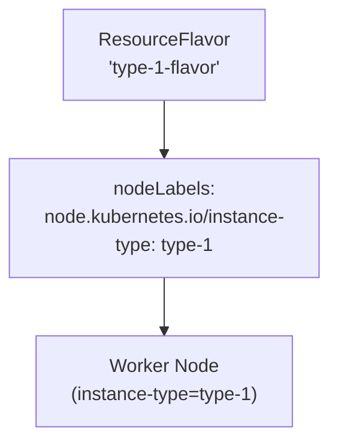
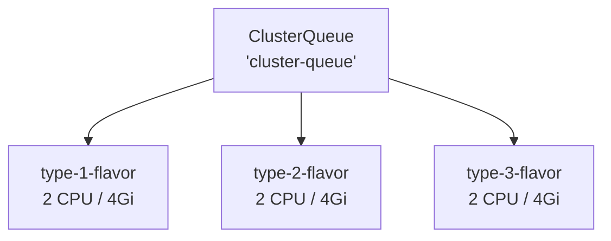
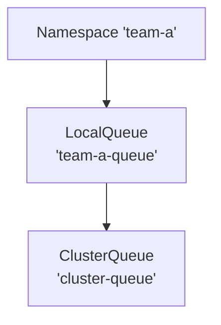
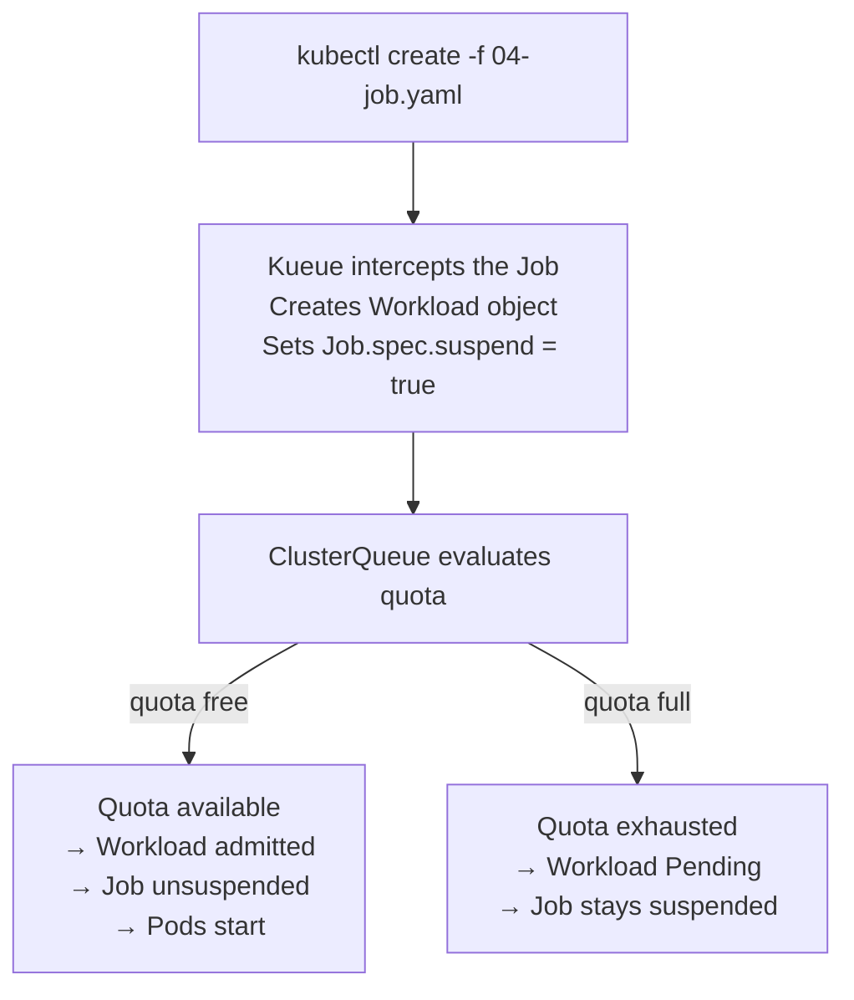
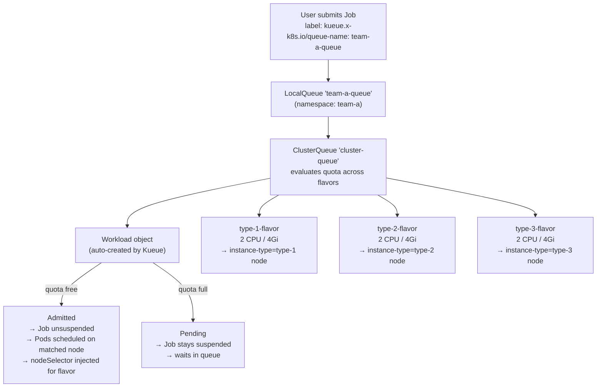

# Basic Job Experiment

A hands-on experiment to understand the core concepts of [Kueue](https://kueue.sigs.k8s.io/) — a Kubernetes-native job queuing system — by running real workloads on a local Kind cluster.

---

## Table of Contents

- [Basic Job Experiment](#basic-job-experiment)
  - [Table of Contents](#table-of-contents)
  - [Overview](#overview)
  - [Prerequisites](#prerequisites)
  - [Cluster Architecture](#cluster-architecture)
  - [Concepts](#concepts)
    - [ResourceFlavor](#resourceflavor)
    - [ClusterQueue](#clusterqueue)
    - [LocalQueue](#localqueue)
    - [Workload](#workload)
  - [Experiment Steps](#experiment-steps)
    - [Step 1 — Create ResourceFlavors](#step-1--create-resourceflavors)
    - [Step 2 — Create ClusterQueue](#step-2--create-clusterqueue)
    - [Step 3 — Create Namespace and LocalQueue](#step-3--create-namespace-and-localqueue)
    - [Step 4 — Submit a Job and Observe Admission](#step-4--submit-a-job-and-observe-admission)
    - [Step 5 — Observe the Workload Object](#step-5--observe-the-workload-object)
    - [Step 6 — Quota Enforcement (Queue Multiple Jobs)](#step-6--quota-enforcement-queue-multiple-jobs)
  - [How It All Fits Together](#how-it-all-fits-together)
  - [Cleanup](#cleanup)
  - [References](#references)

---

## Overview

Kueue is a Kubernetes controller that manages **job queuing and resource sharing** across teams. Instead of letting all jobs compete for cluster resources simultaneously, Kueue:

1. **Intercepts** submitted jobs and suspends them immediately.
2. **Queues** them according to priority and available quota.
3. **Admits** jobs (unsuspends them) only when resources are available.
4. **Enforces** resource quotas per team/namespace without relying on ResourceQuota.

This experiment walks through the full lifecycle: from configuring resource pools to submitting jobs and observing how Kueue manages admission and queuing.

---

## Prerequisites

The Kind cluster must already be running with Kueue installed. If not, run:

```bash
cd kueue/01-basic-job
bash setup.sh
```

Verify the cluster and Kueue are healthy:

```bash
# Cluster nodes
kubectl get nodes

# Expected: 1 control-plane + 3 workers
# NAME                          STATUS   ROLES           AGE
# kueue-cluster-control-plane   Ready    control-plane   ...
# kueue-cluster-worker          Ready    <none>          ...
# kueue-cluster-worker2         Ready    <none>          ...
# kueue-cluster-worker3         Ready    <none>          ...

# Kueue controller
kubectl get pods -n kueue-system

# Expected: kueue-controller-manager pod Running
```

---

## Cluster Architecture

Our Kind cluster has **3 worker nodes**, each labelled with a different `instance-type`:

```
kueue-cluster-worker   → node.kubernetes.io/instance-type: type-1
kueue-cluster-worker2  → node.kubernetes.io/instance-type: type-2
kueue-cluster-worker3  → node.kubernetes.io/instance-type: type-3
```

These labels are the foundation for **ResourceFlavors** — Kueue's way of distinguishing between different hardware pools.

---

## Concepts

### ResourceFlavor

> **File:** [`01-resource-flavors.yaml`](./01-resource-flavors.yaml)

A `ResourceFlavor` represents a **specific type of node** in your cluster. It binds a logical name (e.g., `type-1-flavor`) to real Kubernetes nodes via `nodeLabels`.



**Why it matters:**

- Allows Kueue to track resource usage **per node pool** independently.
- Enables workloads to be scheduled on specific hardware (e.g., GPU nodes vs CPU nodes).
- The ClusterQueue references flavors to set per-pool quotas.

**In this experiment:** We create 3 flavors — one per worker node type.

---

### ClusterQueue

> **File:** [`02-cluster-queue.yaml`](./02-cluster-queue.yaml)

A `ClusterQueue` is a **cluster-scoped** resource that defines:

- Which `ResourceFlavors` are available.
- How much CPU/memory is available per flavor (`nominalQuota`).
- The ordering strategy for pending workloads (`queueingStrategy`).



**Key fields:**

| Field | Value | Meaning |
|-------|-------|---------|
| `namespaceSelector` | `{}` | All namespaces can submit via a LocalQueue |
| `queueingStrategy` | `StrictFIFO` | Jobs admitted in submission order |
| `nominalQuota` (cpu) | `"2"` | Max 2 CPUs in use at once per flavor |
| `nominalQuota` (memory) | `"4Gi"` | Max 4Gi memory in use at once per flavor |

**Why it matters:**

- This is the **central quota enforcer**. No workload runs unless the ClusterQueue admits it.
- Multiple teams (via different LocalQueues) share the same ClusterQueue pool.

---

### LocalQueue

> **File:** [`03-namespace-and-localqueue.yaml`](./03-namespace-and-localqueue.yaml)

A `LocalQueue` is a **namespace-scoped** resource that acts as the **submission endpoint** for a team or application.



**Why it matters:**

- Users/teams submit jobs to a `LocalQueue` — they don't interact with the `ClusterQueue` directly.
- Provides **namespace isolation**: team-a's jobs go through `team-a-queue`, team-b's through `team-b-queue`, etc.
- Both can share the same `ClusterQueue` (and thus the same resource pool).

**How to use it:** Add this label to any Job:

```yaml
labels:
  kueue.x-k8s.io/queue-name: team-a-queue
```

---

### Workload

A `Workload` is an **internal Kueue object** automatically created when you submit a Job. You never create it manually.



**Why it matters:**

- The `Workload` is the unit of admission in Kueue — not the Job itself.
- You can inspect `Workload` objects to understand why a job is queued or admitted.
- `kubectl get workloads -n team-a` is your primary debugging tool.

---

## Experiment Steps

### Step 1 — Create ResourceFlavors

```bash
kubectl apply -f 01-resource-flavors.yaml
```

Verify:

```bash
kubectl get resourceflavors
```

Expected output:

```
NAME            AGE
type-1-flavor   5s
type-2-flavor   5s
type-3-flavor   5s
```

Inspect a flavor to see its node selector:

```bash
kubectl describe resourceflavor type-1-flavor
```

```
Name:         type-1-flavor
Spec:
  Node Labels:
    node.kubernetes.io/instance-type: type-1
```

---

### Step 2 — Create ClusterQueue

```bash
kubectl apply -f 02-cluster-queue.yaml
```

Verify:

```bash
kubectl get clusterqueue
```

Expected output:

```
NAME            COHORT   PENDING WORKLOADS   ADMITTED WORKLOADS
cluster-queue            0                   0
```

Inspect the quota configuration:

```bash
kubectl describe clusterqueue cluster-queue
```

Look for the `Resource Groups` section showing 2 CPU / 4Gi per flavor.

Check the ClusterQueue status in detail:

```bash
kubectl get clusterqueue cluster-queue -o yaml | grep -A 30 "status:"
```

---

### Step 3 — Create Namespace and LocalQueue

```bash
kubectl apply -f 03-namespace-and-localqueue.yaml
```

Verify the namespace:

```bash
kubectl get namespace team-a
```

Verify the LocalQueue:

```bash
kubectl get localqueue -n team-a
```

Expected output:

```
NAME            CLUSTERQUEUE    PENDING WORKLOADS   ADMITTED WORKLOADS
team-a-queue    cluster-queue   0                   0
```

Inspect the LocalQueue:

```bash
kubectl describe localqueue team-a-queue -n team-a
```

Notice the `Cluster Queue` field pointing to `cluster-queue`.

---

### Step 4 — Submit a Job and Observe Admission

> **Important:** Use `kubectl create` (not `kubectl apply`) because the Job uses `generateName` to produce a unique name each time.

Submit one job:

```bash
kubectl create -f 04-job.yaml
```

**Immediately** watch what happens (open a second terminal):

```bash
# Watch jobs — notice it starts suspended, then unsuspends
kubectl get jobs -n team-a -w
```

```
NAME               COMPLETIONS   DURATION   AGE
sample-job-abcde   0/2                      1s    ← suspended by Kueue
sample-job-abcde   0/2           1s         2s    ← admitted, pods starting
sample-job-abcde   1/2           31s        32s   ← first pod done
sample-job-abcde   2/2           62s        63s   ← job complete
```

Watch the pods:

```bash
kubectl get pods -n team-a -w
```

```
NAME                     READY   STATUS    RESTARTS   AGE
sample-job-abcde-xxxxx   0/1     Pending   0          1s
sample-job-abcde-xxxxx   1/1     Running   0          3s
sample-job-abcde-xxxxx   0/1     Completed 0          33s
```

Check which node the pod ran on and confirm it matches a `type-*` node:

```bash
kubectl get pods -n team-a -o wide
```

---

### Step 5 — Observe the Workload Object

After submitting a job, Kueue creates a `Workload` object automatically:

```bash
kubectl get workloads -n team-a
```

```
NAME                     QUEUE          RESERVED IN     ADMITTED   FINISHED   AGE
job-sample-job-abcde-x   team-a-queue   cluster-queue   True                  10s
```

Inspect the Workload in detail:

```bash
kubectl describe workload -n team-a <workload-name>
```

Key fields to observe:

| Field | Meaning |
|-------|---------|
| `Spec.QueueName` | The LocalQueue this workload was submitted to |
| `Status.Admission.ClusterQueue` | Which ClusterQueue admitted it |
| `Status.Admission.PodSetAssignments[].Flavors` | Which ResourceFlavor was assigned |
| `Status.Conditions[Admitted]` | Whether the workload has been admitted |

Example output snippet:

```yaml
Status:
  Admission:
    Cluster Queue: cluster-queue
    Pod Set Assignments:
    - Flavors:
        cpu: type-1-flavor
        memory: type-1-flavor
      Name: main
  Conditions:
  - Type: Admitted
    Status: "True"
    Reason: Admitted
```

This tells you: the job was admitted using `type-1-flavor`, meaning its pods will run on the node with `instance-type: type-1`.

---

### Step 6 — Quota Enforcement (Queue Multiple Jobs)

Now submit **7 jobs rapidly** to exceed the quota and observe queuing:

```bash
for i in $(seq 1 7); do
  kubectl create -f 04-job.yaml
  echo "Submitted job $i"
done
```

Each job requests **1 CPU**. The ClusterQueue has **2 CPU per flavor × 3 flavors = 6 CPU total**.

Watch the LocalQueue — you'll see pending workloads accumulate:

```bash
kubectl get localqueue -n team-a -w
```

```
NAME            CLUSTERQUEUE    PENDING WORKLOADS   ADMITTED WORKLOADS
team-a-queue    cluster-queue   0                   0
team-a-queue    cluster-queue   1                   6    ← 6 admitted, 1 queued
```

Watch the ClusterQueue:

```bash
kubectl get clusterqueue -w
```

```
NAME            COHORT   PENDING WORKLOADS   ADMITTED WORKLOADS
cluster-queue            1                   6
```

List all workloads and their status:

```bash
kubectl get workloads -n team-a
```

```
NAME                     QUEUE          RESERVED IN     ADMITTED   FINISHED   AGE
job-sample-job-aaaaa-x   team-a-queue   cluster-queue   True                  30s
job-sample-job-bbbbb-x   team-a-queue   cluster-queue   True                  29s
job-sample-job-ccccc-x   team-a-queue   cluster-queue   True                  28s
job-sample-job-ddddd-x   team-a-queue   cluster-queue   True                  27s
job-sample-job-eeeee-x   team-a-queue   cluster-queue   True                  26s
job-sample-job-fffff-x   team-a-queue   cluster-queue   True                  25s
job-sample-job-ggggg-x   team-a-queue                   False                 24s  ← QUEUED
```

The 7th workload has no `RESERVED IN` and `ADMITTED=False` — it is **waiting in the queue**.

As running jobs complete and free up resources, watch the 7th workload get automatically admitted:

```bash
kubectl get workloads -n team-a -w
```

---

## How It All Fits Together



---

## Cleanup

Run the teardown script to remove all experiment resources:

```bash
bash teardown.sh
```

This removes (in order):

1. All Jobs in `team-a`
2. All Workloads in `team-a`
3. The `LocalQueue`
4. The `team-a` namespace
5. The `ClusterQueue`
6. All 3 `ResourceFlavors`

To also delete the entire Kind cluster:

```bash
kind delete cluster --name kueue-cluster
```

---

## References

- [Kueue Official Docs](https://kueue.sigs.k8s.io/docs/)
- [ResourceFlavor concept](https://kueue.sigs.k8s.io/docs/concepts/resource_flavor/)
- [ClusterQueue concept](https://kueue.sigs.k8s.io/docs/concepts/cluster_queue/)
- [LocalQueue concept](https://kueue.sigs.k8s.io/docs/concepts/local_queue/)
- [Workload concept](https://kueue.sigs.k8s.io/docs/concepts/workload/)
- [Running batch/Jobs with Kueue](https://kueue.sigs.k8s.io/docs/tasks/run/jobs/)
- [Kueue GitHub](https://github.com/kubernetes-sigs/kueue)
