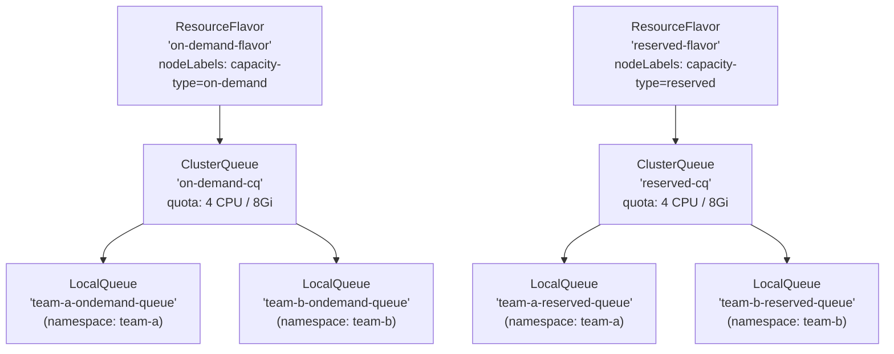
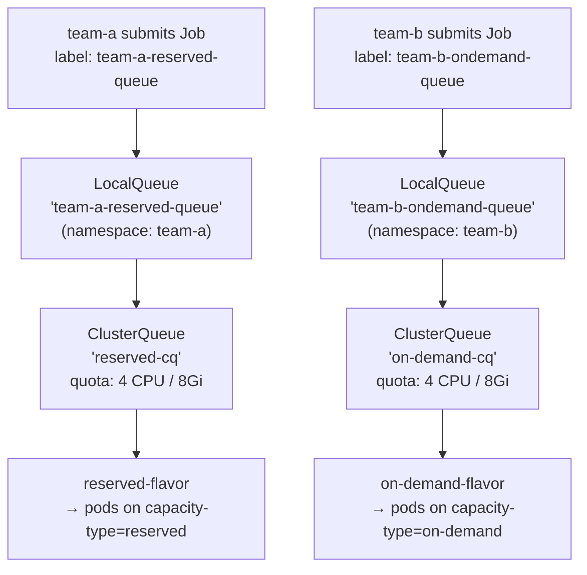

# Multi-Team Queues Experiment

A hands-on experiment demonstrating **multi-tenant resource sharing** with [Kueue](https://kueue.sigs.k8s.io/) across two teams, each with dedicated LocalQueues for two capacity tiers: **reserved** and **on-demand**.

---

## Table of Contents

- [Multi-Team Queues Experiment](#multi-team-queues-experiment)
  - [Table of Contents](#table-of-contents)
  - [Overview](#overview)
  - [Prerequisites](#prerequisites)
    - [One-time inotify fix (Ubuntu)](#one-time-inotify-fix-ubuntu)
    - [Start the cluster](#start-the-cluster)
  - [Cluster Architecture](#cluster-architecture)
  - [Kueue Object Hierarchy](#kueue-object-hierarchy)
  - [Concepts](#concepts)
    - [ResourceFlavor](#resourceflavor)
    - [ClusterQueue](#clusterqueue)
    - [LocalQueue](#localqueue)
  - [Experiment Steps](#experiment-steps)
    - [Step 1 — Create ResourceFlavors](#step-1--create-resourceflavors)
    - [Step 2 — Create ClusterQueues](#step-2--create-clusterqueues)
    - [Step 3 — Create Namespaces and LocalQueues](#step-3--create-namespaces-and-localqueues)
    - [Step 4 — Submit Jobs and Observe Routing](#step-4--submit-jobs-and-observe-routing)
    - [Step 5 — Observe Multi-Team Quota Sharing](#step-5--observe-multi-team-quota-sharing)
  - [How It All Fits Together](#how-it-all-fits-together)
  - [Cleanup](#cleanup)
  - [References](#references)

---

## Overview

This experiment extends the `basic-job` experiment by introducing:

1. **Two capacity tiers** — `reserved` (committed, lower cost) and `on-demand` (burst, higher cost).
2. **Two teams** — `team-a`, `team-b` — each in their own namespace.
3. **Two LocalQueues per team** — one per capacity tier.
4. **Shared ClusterQueues** — both teams share the same `on-demand-cq` and `reserved-cq` pools.

The goal is to understand how Kueue enables **namespace isolation** (teams submit to their own LocalQueues) while enforcing **cluster-wide quota** (both teams draw from the same ClusterQueue pools).

---

## Prerequisites

### One-time inotify fix (Ubuntu)

This experiment runs **5 Kind node containers** (1 control-plane + 4 workers). Each container's `kube-proxy`, `kubelet`, and `kindnet` open `inotify` instances that all count against the **host kernel's** per-user limit. The Ubuntu default of `fs.inotify.max_user_instances=128` can be exhausted, causing `kube-proxy` to crash with:

```
failed to create fsnotify watcher: too many open files
```

Apply this **once** on the Ubuntu host to make the fix permanent across reboots:

```bash
sudo tee /etc/sysctl.d/99-kind-inotify.conf <<'EOF'
fs.inotify.max_user_instances = 512
fs.inotify.max_user_watches   = 524288
EOF
sudo sysctl --system
```

### Start the cluster

```bash
cd kueue/02-multi-team-queues
bash setup.sh
```

Verify the cluster and Kueue are healthy:

```bash
# Cluster nodes — expect 1 control-plane + 4 workers (2 on-demand, 2 reserved)
kubectl get nodes --show-labels

# Kueue controller
kubectl get pods -n kueue-system
```

---

## Cluster Architecture

The Kind cluster has **4 worker nodes** split across two capacity pools:

```
kueue-cluster-worker    → capacity-type: on-demand
kueue-cluster-worker2   → capacity-type: on-demand
kueue-cluster-worker3   → capacity-type: reserved
kueue-cluster-worker4   → capacity-type: reserved
```

These labels are the foundation for the two **ResourceFlavors**.

---

## Kueue Object Hierarchy



---

## Concepts

### ResourceFlavor

> **File:** [`01-resource-flavors.yaml`](./01-resource-flavors.yaml)

Two flavors model the two billing tiers:

| Flavor | `nodeLabels` | Represents |
|--------|-------------|------------|
| `on-demand-flavor` | `capacity-type: on-demand` | Burst / pay-per-use nodes |
| `reserved-flavor` | `capacity-type: reserved` | Pre-purchased committed nodes |

When Kueue admits a workload it injects a `nodeSelector` matching the assigned flavor's labels, ensuring pods land on the correct node pool.

---

### ClusterQueue

> **File:** [`02-cluster-queues.yaml`](./02-cluster-queues.yaml)

Two ClusterQueues — one per capacity tier:

| ClusterQueue | Flavor | CPU quota | Memory quota | Strategy |
|---|---|---|---|---|
| `on-demand-cq` | `on-demand-flavor` | 4 | 8Gi | BestEffortFIFO |
| `reserved-cq` | `reserved-flavor` | 4 | 8Gi | BestEffortFIFO |

`BestEffortFIFO` means workloads are ordered by submission time, but the queue skips a workload that cannot be admitted (e.g. too large) and tries the next one — preventing head-of-line blocking.

Both ClusterQueues use `namespaceSelector: {}` so both teams can submit to them.

---

### LocalQueue

> **File:** [`03-namespaces-and-localqueues.yaml`](./03-namespaces-and-localqueues.yaml)

Each team namespace gets **two LocalQueues**:

| Namespace | LocalQueue | Routes to |
|---|---|---|
| `team-a` | `team-a-reserved-queue` | `reserved-cq` |
| `team-a` | `team-a-ondemand-queue` | `on-demand-cq` |
| `team-b` | `team-b-reserved-queue` | `reserved-cq` |
| `team-b` | `team-b-ondemand-queue` | `on-demand-cq` |

Teams submit jobs by setting the label:

```yaml
labels:
  kueue.x-k8s.io/queue-name: team-a-reserved-queue   # preferred — lower cost
  # or
  kueue.x-k8s.io/queue-name: team-a-ondemand-queue   # burst / overflow
```

---

## Experiment Steps

### Step 1 — Create ResourceFlavors

```bash
kubectl apply -f 01-resource-flavors.yaml
```

Verify:

```bash
kubectl get resourceflavors
```

Expected:

```
NAME               AGE
on-demand-flavor   5s
reserved-flavor    5s
```

---

### Step 2 — Create ClusterQueues

```bash
kubectl apply -f 02-cluster-queues.yaml
```

Verify:

```bash
kubectl get clusterqueue
```

Expected:

```
NAME            COHORT   PENDING WORKLOADS   ADMITTED WORKLOADS
on-demand-cq             0                   0
reserved-cq              0                   0
```

Inspect quota configuration:

```bash
kubectl describe clusterqueue on-demand-cq
kubectl describe clusterqueue reserved-cq
```

---

### Step 3 — Create Namespaces and LocalQueues

```bash
kubectl apply -f 03-namespaces-and-localqueues.yaml
```

Verify namespaces:

```bash
kubectl get namespaces -l purpose=kueue-experiment
```

Expected:

```
NAME     STATUS   AGE
team-a   Active   5s
team-b   Active   5s
```

Verify LocalQueues across all teams:

```bash
kubectl get localqueue -A
```

Expected:

```
NAMESPACE   NAME                      CLUSTERQUEUE    PENDING WORKLOADS   ADMITTED WORKLOADS
team-a      team-a-ondemand-queue     on-demand-cq    0                   0
team-a      team-a-reserved-queue     reserved-cq     0                   0
team-b      team-b-ondemand-queue     on-demand-cq    0                   0
team-b      team-b-reserved-queue     reserved-cq     0                   0
```

---

### Step 4 — Submit Jobs and Observe Routing

The sample file [`04-job.yaml`](./04-job.yaml) contains two jobs for `team-a` — one per queue type.

> **Important:** Use `kubectl create` (not `kubectl apply`) because jobs use `generateName`.

Submit both jobs:

```bash
kubectl create -f 04-job.yaml
```

Watch the jobs:

```bash
kubectl get jobs -n team-a -w
```

Check which node pool each pod landed on:

```bash
kubectl get pods -n team-a -o wide
```

The `reserved-job-*` pod should be on a node with `capacity-type=reserved`.
The `ondemand-job-*` pod should be on a node with `capacity-type=on-demand`.

Inspect the Workload to confirm flavor assignment:

```bash
kubectl get workloads -n team-a
kubectl describe workload -n team-a <workload-name>
```

Look for:

```yaml
Status:
  Admission:
    Cluster Queue: reserved-cq
    Pod Set Assignments:
    - Flavors:
        cpu: reserved-flavor
        memory: reserved-flavor
```

---

### Step 5 — Observe Multi-Team Quota Sharing

Submit jobs from **both teams** to the same ClusterQueue and watch quota enforcement.

Each ClusterQueue has **4 CPU quota**. Each job requests **1 CPU**. Submit 5 reserved jobs total (3 from team-a, 2 from team-b) to exceed the quota:

```bash
# team-a: 3 reserved jobs
for i in 1 2 3; do
  kubectl create -f - <<EOF
apiVersion: batch/v1
kind: Job
metadata:
  generateName: reserved-job-
  namespace: team-a
  labels:
    kueue.x-k8s.io/queue-name: team-a-reserved-queue
spec:
  completions: 2
  parallelism: 1
  template:
    spec:
      restartPolicy: Never
      containers:
        - name: worker
          image: busybox:1.36
          command: ["sh", "-c", "echo 'Reserved job started'; sleep 300; echo 'Reserved job done'"]
          resources:
            requests:
              cpu: "1"
              memory: "1Gi"
            limits:
              cpu: "1"
              memory: "1Gi"
EOF
  echo "Submitted team-a reserved job $i"
done

# team-b: 2 reserved jobs
for i in 1 2; do
  kubectl create -f - <<EOF
apiVersion: batch/v1
kind: Job
metadata:
  generateName: reserved-job-
  namespace: team-b
  labels:
    kueue.x-k8s.io/queue-name: team-b-reserved-queue
spec:
  completions: 2
  parallelism: 1
  template:
    spec:
      restartPolicy: Never
      containers:
        - name: worker
          image: busybox:1.36
          command: ["sh", "-c", "echo 'On-demand job started'; sleep 300; echo 'On-demand job done'"]
          resources:
            requests:
              cpu: "1"
              memory: "1Gi"
            limits:
              cpu: "1"
              memory: "1Gi"
EOF
  echo "Submitted team-b reserved job $i"
done
```

Watch the ClusterQueue — you'll see pending workloads accumulate once quota is exhausted:

```bash
kubectl get clusterqueue -w
```

```
NAME            COHORT   PENDING WORKLOADS   ADMITTED WORKLOADS
on-demand-cq             0                   0
reserved-cq              1                   4    ← 4 admitted (4 CPU used), 1 queued
```

Watch all LocalQueues simultaneously:

```bash
kubectl get localqueue -A -w
```

List all workloads across all namespaces:

```bash
kubectl get workloads -A
```

```
NAMESPACE   NAME                        QUEUE                     RESERVED IN   ADMITTED   AGE
team-a      job-reserved-job-aaaaa-x    team-a-reserved-queue     reserved-cq   True       30s
team-a      job-reserved-job-bbbbb-x    team-a-reserved-queue     reserved-cq   True       28s
team-a      job-reserved-job-ccccc-x    team-a-reserved-queue     reserved-cq   True       26s
team-b      job-reserved-job-ddddd-x    team-b-reserved-queue     reserved-cq   True       24s
team-b      job-reserved-job-eeeee-x    team-b-reserved-queue                   False      22s  ← QUEUED
```

As running jobs complete and free up resources, queued workloads are automatically admitted — no manual intervention needed.

---

## How It All Fits Together



**Key insight:** `team-a` and `team-b` both draw from `reserved-cq`. Their combined usage is measured against the single 4 CPU quota. When that quota is full, workloads from *either* team queue up — demonstrating true multi-tenant quota enforcement.

---

## Cleanup

Run the teardown script to remove all experiment resources:

```bash
bash teardown.sh
```

This removes (in order, for each team):

1. All Jobs in `team-a`, `team-b`
2. All Workloads in each namespace
3. Both LocalQueues per namespace
4. The namespace itself

Then removes:

1. Both ClusterQueues (`on-demand-cq`, `reserved-cq`)
2. Both ResourceFlavors (`on-demand-flavor`, `reserved-flavor`)

To also delete the entire Kind cluster:

```bash
kind delete cluster --name kueue-cluster
```

---

## References

- [Kueue Official Docs](https://kueue.sigs.k8s.io/docs/)
- [ResourceFlavor concept](https://kueue.sigs.k8s.io/docs/concepts/resource_flavor/)
- [ClusterQueue concept](https://kueue.sigs.k8s.io/docs/concepts/cluster_queue/)
- [LocalQueue concept](https://kueue.sigs.k8s.io/docs/concepts/local_queue/)
- [Workload concept](https://kueue.sigs.k8s.io/docs/concepts/workload/)
- [Running batch/Jobs with Kueue](https://kueue.sigs.k8s.io/docs/tasks/run/jobs/)
- [Kueue GitHub](https://github.com/kubernetes-sigs/kueue)
