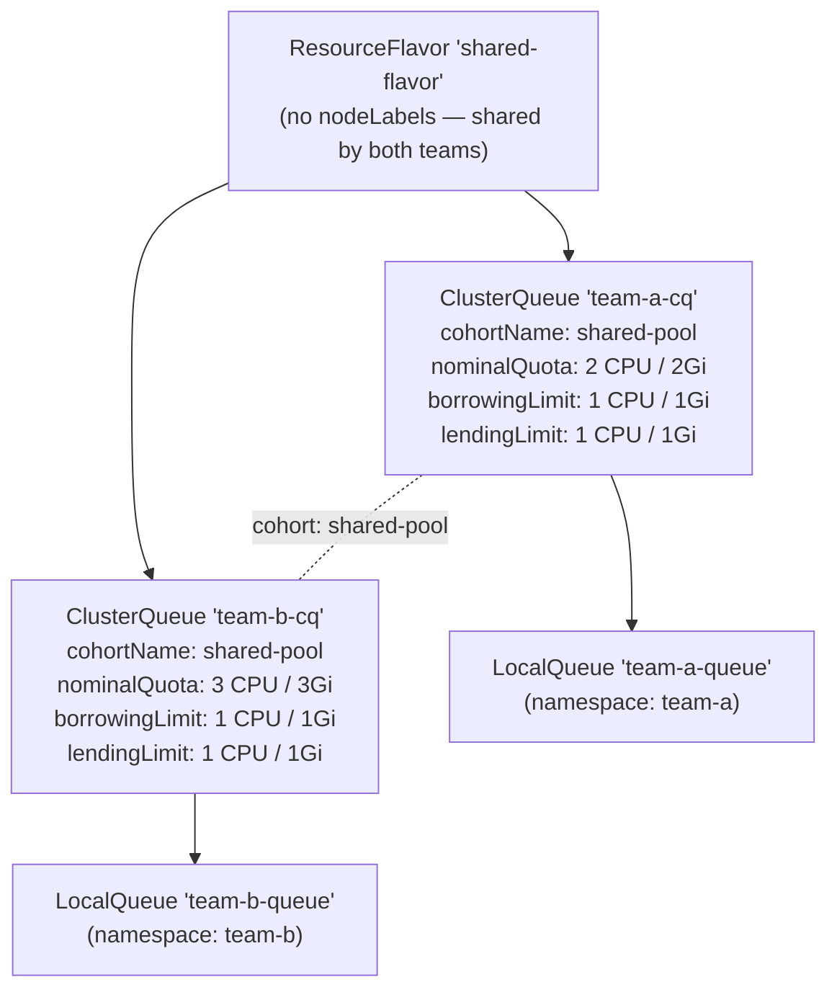
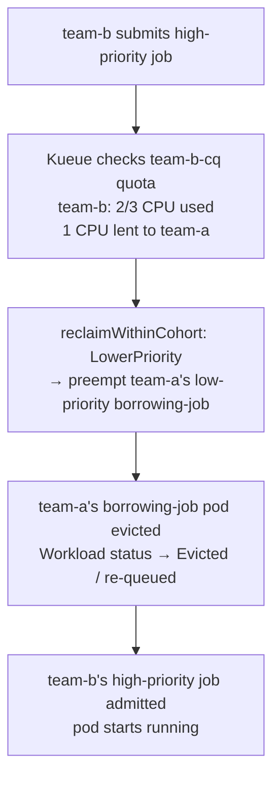
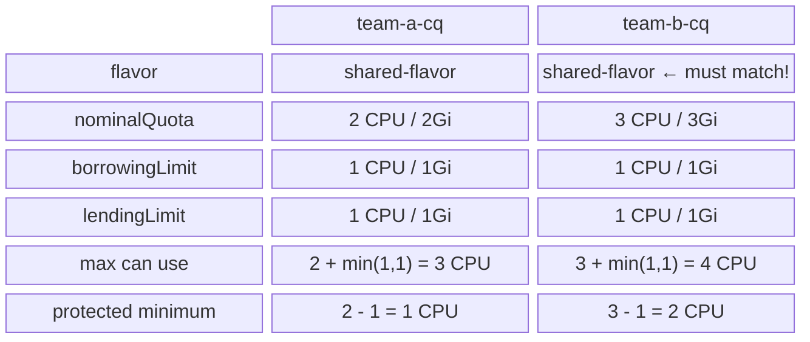
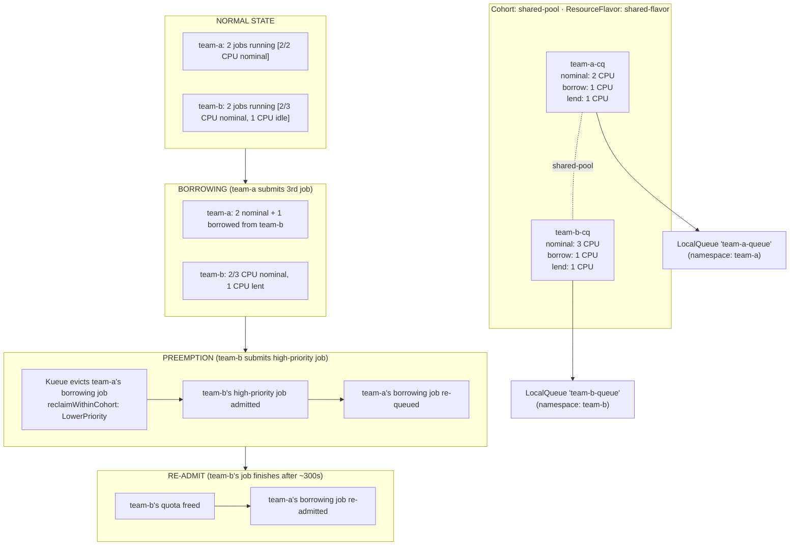

# Borrowing, Lending & Preemption Experiment

A hands-on experiment demonstrating **resource sharing between teams** with [Kueue](https://kueue.sigs.k8s.io/) — covering Cohorts, borrowing, lending limits, and priority-based preemption.

---

## Table of Contents

- [Borrowing, Lending \& Preemption Experiment](#borrowing-lending--preemption-experiment)
  - [Table of Contents](#table-of-contents)
  - [Overview](#overview)
  - [Prerequisites](#prerequisites)
    - [One-time inotify fix (Ubuntu)](#one-time-inotify-fix-ubuntu)
    - [Start the cluster](#start-the-cluster)
  - [Cluster Architecture](#cluster-architecture)
  - [Kueue Object Hierarchy](#kueue-object-hierarchy)
  - [Concepts](#concepts)
    - [Cohort](#cohort)
    - [Borrowing](#borrowing)
    - [Lending Limit](#lending-limit)
    - [Preemption](#preemption)
    - [PriorityClass](#priorityclass)
  - [Quota Reference Card](#quota-reference-card)
  - [Experiment Steps](#experiment-steps)
    - [Step 1 — Create ResourceFlavors](#step-1--create-resourceflavors)
    - [Step 2 — Create ClusterQueues](#step-2--create-clusterqueues)
    - [Step 3 — Create Namespaces, PriorityClasses, and LocalQueues](#step-3--create-namespaces-priorityclasses-and-localqueues)
    - [Step 4 — Fill Each Team's Nominal Quota](#step-4--fill-each-teams-nominal-quota)
    - [Step 5 — Observe Borrowing](#step-5--observe-borrowing)
    - [Step 6 — Trigger Preemption](#step-6--trigger-preemption)
    - [Step 7 — Watch the Borrower Re-Queue and Re-Admit](#step-7--watch-the-borrower-re-queue-and-re-admit)
  - [How It All Fits Together](#how-it-all-fits-together)
  - [Cleanup](#cleanup)
  - [References](#references)

---

## Overview

The previous experiments covered basic queuing and multi-team quota isolation. This experiment goes further and teaches how Kueue enables **cooperative resource sharing** between teams through a mechanism called a **Cohort**.

Key behaviours demonstrated:

| Behaviour | What you will see |
|---|---|
| **Borrowing** | team-a submits more jobs than its quota allows; Kueue admits them using team-b's idle capacity |
| **Lending limit** | team-b caps how much of its quota it will lend, keeping a safety margin for itself |
| **Preemption (reclaim)** | team-b submits a high-priority job; Kueue evicts team-a's borrowing job to reclaim team-b's quota |
| **Re-queuing** | After preemption, team-a's evicted job automatically re-queues and is re-admitted once quota is free |

---

## Prerequisites

### One-time inotify fix (Ubuntu)

This experiment runs **5 Kind node containers** (1 control-plane + 4 workers). Apply this **once** on the Ubuntu host:

```bash
sudo tee /etc/sysctl.d/99-kind-inotify.conf <<'EOF'
fs.inotify.max_user_instances = 512
fs.inotify.max_user_watches   = 524288
EOF
sudo sysctl --system
```

### Start the cluster

```bash
cd kueue/03-borrowing-and-preemption
bash setup.sh
```

Verify the cluster and Kueue are healthy:

```bash
# Cluster nodes — expect 1 control-plane + 4 workers (2 team-a, 2 team-b)
kubectl get nodes --show-labels

# Kueue controller
kubectl get pods -n kueue-system
```

---

## Cluster Architecture

The Kind cluster has **4 worker nodes** split between two teams:

```
kueue-cluster-worker    → label: team=team-a
kueue-cluster-worker2   → label: team=team-a
kueue-cluster-worker3   → label: team=team-b
kueue-cluster-worker4   → label: team=team-b
```

The node labels exist for reference and can be used in Job `nodeSelector` / `nodeAffinity` specs, but Kueue quota tracking is done at the **ResourceFlavor** level. Both teams share a single `shared-flavor` with no `nodeLabels`, so Kueue can match quota across both ClusterQueues in the cohort.

---

## Kueue Object Hierarchy



Both ClusterQueues share the cohort `shared-pool` **and** reference the same `shared-flavor`. Both conditions are required for borrowing to work: the cohort enables quota sharing, and the shared flavor name allows Kueue to match lending headroom across queues.

> **Note:** `borrowingLimit` is explicitly set to `1 CPU / 1Gi` on both ClusterQueues. This caps how much each queue can borrow from the cohort, working in conjunction with the lender's `lendingLimit`.

---

## Concepts

### Cohort

> **Field:** `spec.cohortName` in [`02-cluster-queues.yaml`](./02-cluster-queues.yaml)

A **Cohort** is a named group of ClusterQueues that pool their unused quota together. Any ClusterQueue that sets the same `cohortName` string becomes a member.

```yaml
spec:
  cohortName: shared-pool   # ← both team-a-cq and team-b-cq set this
```

**Why it matters:**

- Without a cohort, each ClusterQueue is completely isolated — a team cannot use another team's idle capacity.
- With a cohort, idle quota is automatically available to other members, maximising cluster utilisation.
- Cohort membership does **not** remove quota guarantees — each team still has its `nominalQuota` reserved.

---

### Borrowing

> **Field:** `spec.resourceGroups[].flavors[].resources[].borrowingLimit`

`borrowingLimit` sets the **maximum extra quota** a ClusterQueue can consume beyond its `nominalQuota` by drawing from other cohort members' idle capacity. In this experiment `borrowingLimit` is set to `1 CPU / 1Gi` on both ClusterQueues, capping how much each team can borrow.


**How borrowing works:**

1. team-a submits a 3rd job (exceeding its 2 CPU nominal quota).
2. Kueue checks the cohort — team-b has idle capacity in `shared-flavor`.
3. Kueue admits the job using team-b's lending headroom (same `shared-flavor`).
4. The Workload's `RESERVED IN` still shows `team-a-cq` — borrowing is tracked at the ClusterQueue level (`Borrowed` field in `team-a-cq` status), not on the individual Workload.

**Key insight:** Borrowing is **opportunistic**. It is only possible when the lender has idle quota. If team-b is fully utilised, team-a cannot borrow.

> **⚠ Flavor name must match:** Both ClusterQueues must reference the **same flavor name** for borrowing to work. Kueue matches lending headroom by `(cohort, flavor)` pair. If `team-a-cq` uses `team-a-flavor` and `team-b-cq` uses `team-b-flavor`, Kueue cannot find cross-queue capacity and workloads stay `Pending`.

---

### Lending Limit

> **Field:** `spec.resourceGroups[].flavors[].resources[].lendingLimit`

`lendingLimit` caps how much of a ClusterQueue's `nominalQuota` other cohort members may borrow.


**Why it matters:**

- Without `lendingLimit`, a team's entire idle quota could be borrowed, leaving nothing for the team's own sudden burst.
- With `lendingLimit: 1`, team-b always keeps 2 CPU protected — even if team-b has zero running jobs, team-a can only borrow 1 CPU, not 3.

```
lendingLimit vs borrowingLimit — they work together:

  team-a can borrow:  min(team-a.borrowingLimit, team-b.lendingLimit - team-b.usage)
  (both limits are 1 CPU here, so: min(1, 1 - 0) = 1 CPU)
```

---

### Preemption

> **Fields:** `spec.preemption` in [`02-cluster-queues.yaml`](./02-cluster-queues.yaml)

Preemption is how a ClusterQueue **reclaims** its nominal quota from borrowers when it needs the capacity back.

```yaml
preemption:
  reclaimWithinCohort: LowerPriority
  withinClusterQueue: LowerPriority
  borrowWithinCohort:
    policy: LowerPriority
```

| Policy field | Value | Meaning |
|---|---|---|
| `reclaimWithinCohort` | `LowerPriority` | Preempt borrowers with **lower priority** to reclaim nominal quota |
| `withinClusterQueue` | `LowerPriority` | Preempt lower-priority workloads within the same ClusterQueue |
| `borrowWithinCohort.policy` | `LowerPriority` | Only borrow capacity from queues where running workloads have lower priority |

**Preemption flow:**



**What happens to the preempted workload?**

The evicted Workload is **not deleted** — it is re-queued in team-a's LocalQueue. As soon as team-b's quota becomes free again (e.g. when team-b's high-priority job finishes), Kueue will re-admit team-a's borrowing job automatically.

---

### PriorityClass

> **File:** [`03-namespaces-and-localqueues.yaml`](./03-namespaces-and-localqueues.yaml)

Kueue uses Kubernetes `PriorityClass` to determine which workloads can preempt others.

| PriorityClass | Value | Use |
|---|---|---|
| `high-priority` | 1000 | Production / urgent jobs — can preempt borrowers |
| `low-priority` | 100 | Batch / best-effort jobs — may be preempted |

Set priority on a Job via:

```yaml
spec:
  template:
    spec:
      priorityClassName: high-priority
```

---

## Quota Reference Card



---

## Experiment Steps

### Step 1 — Create ResourceFlavors

```bash
kubectl apply -f 01-resource-flavors.yaml
```

Verify:

```bash
kubectl get resourceflavors
```

Expected:

```
NAME             AGE
shared-flavor    5s
```

Inspect the flavor:

```bash
kubectl describe resourceflavor shared-flavor
```

```
Spec: {}
```

The flavor has no `nodeLabels` — it is a shared pool. Both `team-a-cq` and `team-b-cq` reference `shared-flavor`, which is what enables cohort borrowing.

---

### Step 2 — Create ClusterQueues

```bash
kubectl apply -f 02-cluster-queues.yaml
```

Verify:

```bash
kubectl get clusterqueue -o wide
```

Expected:

```
NAME         COHORT        PENDING WORKLOADS   ADMITTED WORKLOADS
team-a-cq    shared-pool   0                   0
team-b-cq    shared-pool   0                   0
```

Notice the `COHORT` column — both queues are in `shared-pool`. This is what enables borrowing.

Inspect the quota and preemption configuration:

```bash
kubectl describe clusterqueue team-a-cq
kubectl describe clusterqueue team-b-cq
```

Look for:

- `Resource Groups` → `nominalQuota`, `lendingLimit`
- `Preemption` → `reclaimWithinCohort`, `withinClusterQueue`, `borrowWithinCohort`

---

### Step 3 — Create Namespaces, PriorityClasses, and LocalQueues

```bash
kubectl apply -f 03-namespaces-and-localqueues.yaml
```

Verify namespaces:

```bash
kubectl get namespaces -l purpose=kueue-experiment
```

Expected:

```
NAME     STATUS   AGE
team-a   Active   5s
team-b   Active   5s
```

Verify PriorityClasses:

```bash
kubectl get priorityclass high-priority low-priority
```

Expected:

```
NAME            VALUE   GLOBAL-DEFAULT   AGE
high-priority   1000    false            5s
low-priority    100     false            5s
```

Verify LocalQueues:

```bash
kubectl get localqueue -A
```

Expected:

```
NAMESPACE   NAME            CLUSTERQUEUE   PENDING WORKLOADS   ADMITTED WORKLOADS
team-a      team-a-queue    team-a-cq      0                   0
team-b      team-b-queue    team-b-cq      0                   0
```

---

### Step 4 — Fill Each Team's Nominal Quota

Submit 2 low-priority jobs for each team (4 jobs total). This fills team-a's ClusterQueue to its `nominalQuota` of 2 CPU and team-b's ClusterQueue to 2 of its 3 CPU nominal quota.

> **Important:** Use `kubectl create` (not `kubectl apply`) because jobs use `generateName`.

```bash
kubectl create -f 04-jobs.yaml
```

Watch the jobs start:

```bash
kubectl get jobs -A -w
```

Watch the ClusterQueues fill up:

```bash
kubectl get clusterqueue -w
```

Expected (once all 4 jobs are admitted):

```
NAME         COHORT        PENDING WORKLOADS   ADMITTED WORKLOADS
team-a-cq    shared-pool   0                   2
team-b-cq    shared-pool   0                   2
```

Check the Workload objects to confirm flavor assignment:

```bash
kubectl get workloads -A
```

```
NAMESPACE   NAME                        QUEUE           RESERVED IN   ADMITTED   AGE
team-a      job-normal-job-a-1-xxxxx    team-a-queue    team-a-cq     True       10s
team-a      job-normal-job-a-2-xxxxx    team-a-queue    team-a-cq     True       10s
team-b      job-normal-job-b-1-xxxxx    team-b-queue    team-b-cq     True       10s
team-b      job-normal-job-b-2-xxxxx    team-b-queue    team-b-cq     True       10s
```

**State summary:** team-a is at 100% nominal utilisation (2/2 CPU). team-b is at 2/3 CPU — it has 1 CPU idle that can be lent. Any new team-a workload must borrow from the cohort or wait.

---

### Step 5 — Observe Borrowing

Submit a **3rd job for team-a** — this exceeds team-a's 2 CPU nominal quota:

```bash
kubectl create -f 05-borrowing-job.yaml
```

Watch the workload get admitted:

```bash
kubectl get workloads -n team-a -w
```

Expected:

```
NAME                          QUEUE           RESERVED IN   ADMITTED   AGE
job-normal-job-a-1-xxxxx      team-a-queue    team-a-cq     True       2m
job-normal-job-a-2-xxxxx      team-a-queue    team-a-cq     True       2m
job-borrowing-job-a-3-xxxxx   team-a-queue    team-a-cq     True       5s
```

**Key observation:** All three team-a workloads — including the borrowing job — show `RESERVED IN: team-a-cq`. This is correct and expected.

`RESERVED IN` identifies **which ClusterQueue owns and accounts for the workload**, not which queue's quota is being consumed. `team-a-cq` submitted and admitted the workload; it just happens to be drawing on borrowed capacity from the cohort to do so.

The borrowing is visible at the **ClusterQueue level**, not the workload level. Check it with:

```bash
kubectl describe clusterqueue team-a-cq
```

Look for the `Flavors Reservation` / `Flavors Usage` section:

```
Flavors Reservation:
  Name:  shared-flavor
  Resources:
    Borrowed:  1        ← team-a-cq is borrowing 1 CPU from the cohort
    Total:     3        ← 2 nominal + 1 borrowed
    Borrowed:  1Gi
    Name:      memory
    Total:     3Gi
```

And confirm team-b is lending (not borrowing):

```bash
kubectl describe clusterqueue team-b-cq
```

```
Flavors Reservation:
  Name:  shared-flavor
  Resources:
    Borrowed:  0        ← team-b-cq is not borrowing
    Total:     2        ← only 2 of its 3 CPU nominal are in use (1 CPU is lent out)
```

Inspect the borrowing workload to confirm the flavor and ClusterQueue assignment:

```bash
kubectl describe workload -n team-a job-borrowing-job-a-3-xxxxx
```

Look for:

```yaml
Status:
  Admission:
    Cluster Queue: team-a-cq          ← owned by team-a-cq (which is borrowing)
    Pod Set Assignments:
    - Flavors:
        cpu: shared-flavor            ← using the shared flavor
        memory: shared-flavor
```

**Lending limit in action:** Try submitting a second borrowing job for team-a:

```bash
kubectl create -f 05-borrowing-job.yaml
```

Watch the workloads:

```bash
kubectl get workloads -n team-a
```

This second borrowing job will remain **Pending** (not admitted) because team-b's `lendingLimit` is 1 CPU — already fully lent. The job waits in the queue until capacity is freed.

---

### Step 6 — Trigger Preemption

Now submit a **high-priority job for team-b**. team-b currently has 2 jobs running (2/3 CPU) and 1 CPU lent to team-a. Kueue will preempt team-a's low-priority borrowing job to reclaim team-b's lent quota.

```bash
kubectl create -f 06-preemption-trigger.yaml
```

**Immediately** watch what happens in a second terminal:

```bash
# Watch all workloads across both namespaces
kubectl get workloads -A -w
```

You will observe the sequence:

```
NAMESPACE   NAME                            QUEUE           RESERVED IN   ADMITTED   AGE
team-a      job-borrowing-job-a-3-xxxxx     team-a-queue    team-a-cq     True       3m    ← about to be preempted
team-b      job-preemption-trigger-b-3-yyy  team-b-queue                  False      2s    ← pending, waiting

# Kueue detects: team-b has a high-priority pending workload and team-a is borrowing
# reclaimWithinCohort: LowerPriority → preempt the lower-priority borrower

team-a      job-borrowing-job-a-3-xxxxx     team-a-queue                  False      3m    ← PREEMPTED (evicted)
team-b      job-preemption-trigger-b-3-yyy  team-b-queue    team-b-cq     True       3s    ← ADMITTED
```

Watch the pods:

```bash
kubectl get pods -A -w
```

You will see:

1. team-a's `borrowing-job-a-3-*` pod transitions to `Terminating` → disappears.
2. team-b's `preemption-trigger-b-3-*` pod starts `Running`.

Inspect the preempted Workload's events:

```bash
kubectl describe workload -n team-a job-borrowing-job-a-3-xxxxx
```

Look for an event like:

```
Events:
  Type    Reason     Message
  ──────  ──────     ───────
  Normal  Preempted  Preempted to accommodate a higher priority workload in ClusterQueue team-b-cq
```

Check the ClusterQueue status:

```bash
kubectl get clusterqueue
```

```
NAME         COHORT        PENDING WORKLOADS   ADMITTED WORKLOADS
team-a-cq    shared-pool   1                   2    ← borrowing-job is now pending
team-b-cq    shared-pool   0                   3    ← preemption-trigger admitted
```

---

### Step 7 — Watch the Borrower Re-Queue and Re-Admit

After team-b's `preemption-trigger` job finishes (it sleeps 300 seconds), team-b's quota is freed. Kueue will automatically re-admit team-a's borrowing job.

Watch the workloads:

```bash
kubectl get workloads -A -w
```

After ~300 seconds, you will see:

```
team-a   job-borrowing-job-a-3-xxxxx   team-a-queue   team-a-cq   True   ← RE-ADMITTED
```

The borrowing job restarts from scratch (Kubernetes Jobs restart on eviction). This is the full borrowing → preemption → re-queue → re-admit cycle.

---

## How It All Fits Together



**Key insights:**

1. **Cohort = cooperative pool.** Teams share idle quota automatically — no manual intervention needed.
2. **lendingLimit protects owners.** A team can always keep a safety margin of its own quota, even when idle.
3. **borrowingLimit = 1 CPU / 1Gi.** Both queues explicitly cap how much they can borrow. Combined with the lender's `lendingLimit`, the effective borrow cap is `min(borrowingLimit, lendingLimit) = 1 CPU / 1Gi`.
4. **Preemption is priority-driven.** High-priority workloads can reclaim quota from lower-priority borrowers.
5. **Preemption is non-destructive.** Evicted workloads are re-queued and re-admitted automatically — no data loss, no manual re-submission.

---

## Cleanup

Run the teardown script to remove all experiment resources:

```bash
bash teardown.sh
```

This removes (in order, for each team):

1. All Jobs in `team-a`, `team-b`
2. All Workloads in each namespace
3. The LocalQueue per namespace
4. The namespace itself

Then removes:

1. Both ClusterQueues (`team-a-cq`, `team-b-cq`)
2. ResourceFlavor (`shared-flavor`)
3. Both PriorityClasses (`high-priority`, `low-priority`)

To also delete the entire Kind cluster:

```bash
kind delete cluster --name kueue-cluster
```

---

## References

- [Kueue Official Docs](https://kueue.sigs.k8s.io/docs/)
- [Cohort concept](https://kueue.sigs.k8s.io/docs/concepts/cluster_queue/#cohort)
- [Borrowing and lending](https://kueue.sigs.k8s.io/docs/concepts/cluster_queue/#borrowinglimit)
- [Preemption](https://kueue.sigs.k8s.io/docs/concepts/preemption/)
- [ResourceFlavor concept](https://kueue.sigs.k8s.io/docs/concepts/resource_flavor/)
- [ClusterQueue concept](https://kueue.sigs.k8s.io/docs/concepts/cluster_queue/)
- [LocalQueue concept](https://kueue.sigs.k8s.io/docs/concepts/local_queue/)
- [Workload concept](https://kueue.sigs.k8s.io/docs/concepts/workload/)
- [Running batch/Jobs with Kueue](https://kueue.sigs.k8s.io/docs/tasks/run/jobs/)
- [Kueue GitHub](https://github.com/kubernetes-sigs/kueue)
