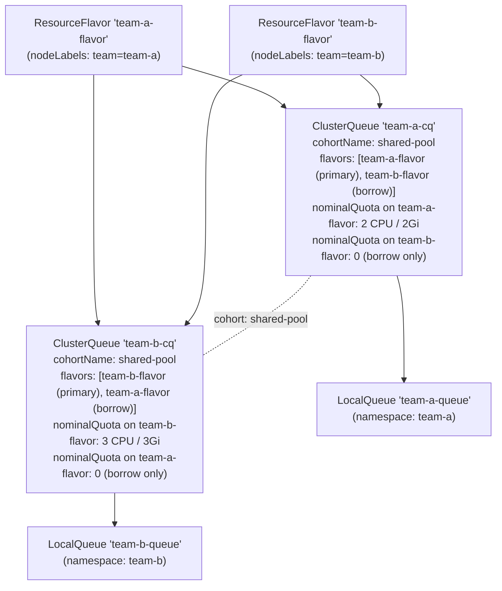
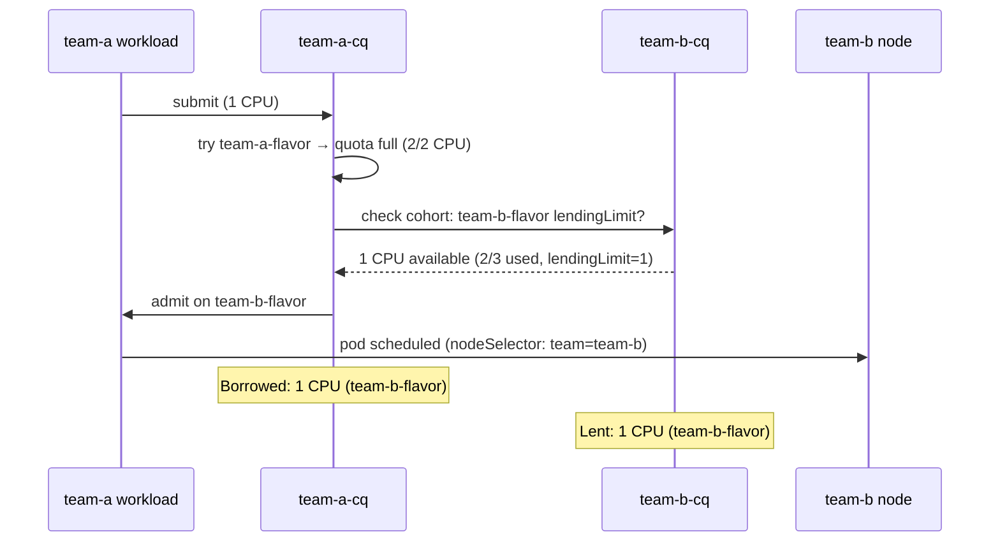
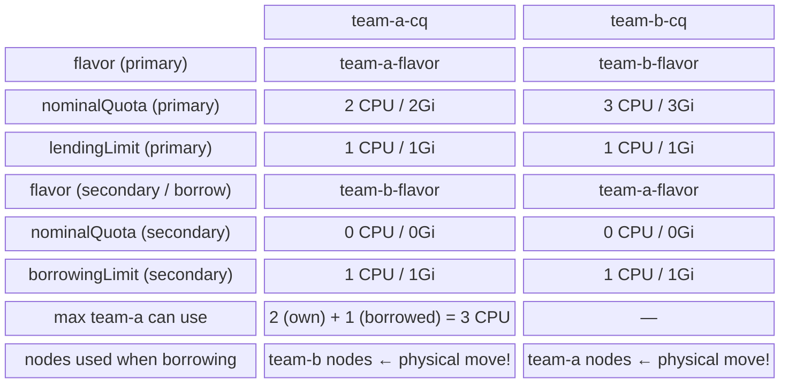
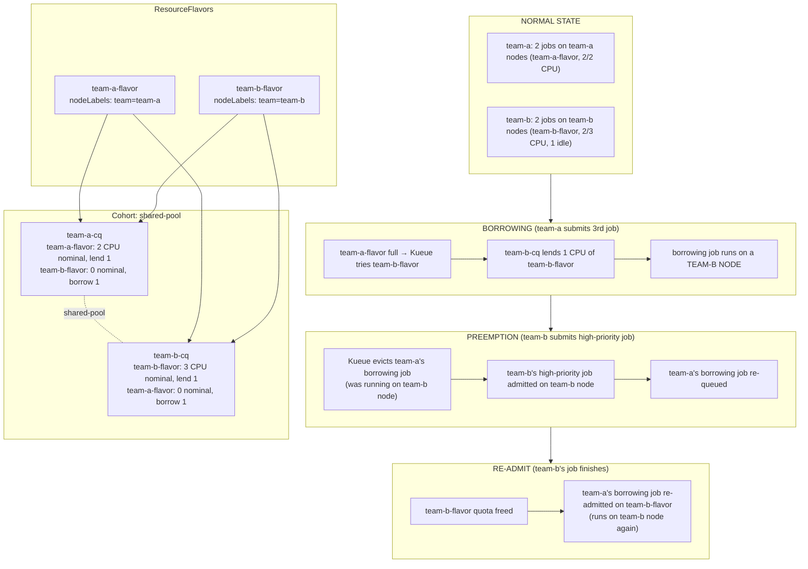

# Borrowing & Preemption with Distinct Resource Flavors

A hands-on experiment demonstrating **resource sharing between teams using two separate ResourceFlavors** with [Kueue](https://kueue.sigs.k8s.io/) — covering per-flavor quota, flavor-selection order, cross-flavor borrowing, and priority-based preemption.

This is a direct follow-up to [experiment 03](../03-borrowing-and-preemption/README.md). The core borrowing/preemption mechanics are identical; the key difference is that **each team now owns a distinct ResourceFlavor** tied to its own physical nodes, rather than sharing a single flavor.

---

## Table of Contents

- [Borrowing \& Preemption with Distinct Resource Flavors](#borrowing--preemption-with-distinct-resource-flavors)
  - [Table of Contents](#table-of-contents)
  - [Overview](#overview)
  - [What's Different from Experiment 03](#whats-different-from-experiment-03)
  - [Prerequisites](#prerequisites)
    - [One-time inotify fix (Ubuntu)](#one-time-inotify-fix-ubuntu)
    - [Start the cluster](#start-the-cluster)
  - [Cluster Architecture](#cluster-architecture)
  - [Kueue Object Hierarchy](#kueue-object-hierarchy)
  - [Concepts](#concepts)
    - [Two Distinct Flavors](#two-distinct-flavors)
    - [Flavor-Selection Order](#flavor-selection-order)
    - [Cross-Flavor Borrowing](#cross-flavor-borrowing)
    - [Preemption](#preemption)
  - [Quota Reference Card](#quota-reference-card)
  - [Experiment Steps](#experiment-steps)
    - [Step 1 — Create ResourceFlavors](#step-1--create-resourceflavors)
    - [Step 2 — Create ClusterQueues](#step-2--create-clusterqueues)
    - [Step 3 — Create Namespaces, PriorityClasses, and LocalQueues](#step-3--create-namespaces-priorityclasses-and-localqueues)
    - [Step 4 — Fill Each Team's Nominal Quota](#step-4--fill-each-teams-nominal-quota)
    - [Step 5 — Observe Cross-Flavor Borrowing](#step-5--observe-cross-flavor-borrowing)
    - [Step 6 — Trigger Preemption](#step-6--trigger-preemption)
    - [Step 7 — Watch the Borrower Re-Queue and Re-Admit](#step-7--watch-the-borrower-re-queue-and-re-admit)
  - [How It All Fits Together](#how-it-all-fits-together)
  - [Cleanup](#cleanup)
  - [References](#references)

---

## Overview

Key behaviours demonstrated:

| Behaviour | What you will see |
|---|---|
| **Distinct flavors** | Each team has its own ResourceFlavor with `nodeLabels` pinning workloads to that team's nodes |
| **Flavor-selection order** | team-a workloads prefer `team-a-flavor`; only fall through to `team-b-flavor` when quota is exhausted |
| **Cross-flavor borrowing** | team-a's borrowing job is admitted on `team-b-flavor` and physically runs on a team-b node |
| **Lending limit** | team-b caps how much of its `team-b-flavor` quota it will lend |
| **Preemption (reclaim)** | team-b submits a high-priority job; Kueue evicts team-a's borrowing job to reclaim the lent `team-b-flavor` quota |
| **Re-queuing** | After preemption, team-a's evicted job automatically re-queues and is re-admitted once quota is free |

---

## What's Different from Experiment 03

| Aspect | Experiment 03 | Experiment 04 (this one) |
|---|---|---|
| ResourceFlavors | 1 × `shared-flavor` (no nodeLabels) | 2 × `team-a-flavor` + `team-b-flavor` (each with nodeLabels) |
| Node targeting | None — pods land anywhere | Pods land on the flavor's matching nodes |
| ClusterQueue flavor list | Single flavor per CQ | Both flavors listed in each CQ |
| Borrowing mechanism | Quota accounting only | Quota accounting **+** physical node change |
| Borrowed workload runs on | Any available node | The **lender's** nodes |

The critical insight: with distinct flavors, borrowing is not just a quota accounting exercise — the workload physically moves to the lender's node pool.

---

## Prerequisites

### One-time inotify fix (Ubuntu)

This experiment runs **5 Kind node containers** (1 control-plane + 4 workers). Apply this **once** on the Ubuntu host:

```bash
sudo tee /etc/sysctl.d/99-kind-inotify.conf <<'EOF'
fs.inotify.max_user_instances = 512
fs.inotify.max_user_watches   = 524288
EOF
sudo sysctl --system
```

### Start the cluster

```bash
cd kueue/04-borrowing-with-distinct-flavors
bash setup.sh
```

Verify the cluster and Kueue are healthy:

```bash
# Cluster nodes — expect 1 control-plane + 4 workers (2 team-a, 2 team-b)
kubectl get nodes --show-labels

# Kueue controller
kubectl get pods -n kueue-system
```

---

## Cluster Architecture

The Kind cluster has **4 worker nodes** split between two teams:

```
kueue-cluster-worker    → label: team=team-a  ← targeted by team-a-flavor
kueue-cluster-worker2   → label: team=team-a  ← targeted by team-a-flavor
kueue-cluster-worker3   → label: team=team-b  ← targeted by team-b-flavor
kueue-cluster-worker4   → label: team=team-b  ← targeted by team-b-flavor
```

Unlike experiment 03, the `nodeLabels` on each ResourceFlavor are **active**: Kueue injects a `nodeSelector` into admitted pods so they land on the correct node pool.

---

## Kueue Object Hierarchy



Both ClusterQueues list **both** flavors. This is what enables cross-flavor borrowing: Kueue can match lending headroom in `team-b-flavor` from `team-b-cq` to satisfy a `team-a-cq` workload that has exhausted its `team-a-flavor` quota.

---

## Concepts

### Two Distinct Flavors

> **File:** [`01-resource-flavors.yaml`](./01-resource-flavors.yaml)

Each ResourceFlavor carries `nodeLabels` that Kueue injects as a `nodeSelector` into admitted pods:

```yaml
# team-a-flavor — workloads admitted on this flavor land on team-a nodes
spec:
  nodeLabels:
    team: team-a

# team-b-flavor — workloads admitted on this flavor land on team-b nodes
spec:
  nodeLabels:
    team: team-b
```

This is the fundamental difference from experiment 03's `shared-flavor` (which had `spec: {}`). Here, flavor selection has a **physical consequence**: the node a pod runs on depends on which flavor Kueue selects.

---

### Flavor-Selection Order

> **Field:** order of entries in `spec.resourceGroups[].flavors[]`

Kueue evaluates flavors in the order they appear in the `flavors` list — first-fit wins:

```yaml
# team-a-cq — team-a-flavor is tried first
flavors:
  - name: team-a-flavor   # ← preferred: team-a's own nodes
    resources:
      - name: cpu
        nominalQuota: 2
        borrowingLimit: 0
        lendingLimit: 1
  - name: team-b-flavor   # ← fallback: borrow from team-b's nodes
    resources:
      - name: cpu
        nominalQuota: 0   # no nominal quota here — pure borrow
        borrowingLimit: 1
```

**Selection logic for a team-a workload:**

1. Try `team-a-flavor` — does `team-a-cq` have headroom? If yes → admit on team-a nodes.
2. If `team-a-flavor` is exhausted → try `team-b-flavor` — does the cohort have lendable `team-b-flavor` capacity? If yes → admit on team-b nodes (borrowing).
3. If neither flavor has capacity → workload stays Pending.

---

### Cross-Flavor Borrowing

> **Fields:** `borrowingLimit` on the borrower's secondary flavor, `lendingLimit` on the lender's primary flavor

With two distinct flavors, borrowing means:

- The **borrower** (`team-a-cq`) has `nominalQuota: 0` on `team-b-flavor` but `borrowingLimit: 1`.
- The **lender** (`team-b-cq`) has `lendingLimit: 1` on `team-b-flavor`.
- Kueue matches: `team-a-cq` can borrow up to `min(borrowingLimit=1, lendingLimit=1) = 1 CPU` of `team-b-flavor` from the cohort.
- The admitted workload gets `nodeSelector: team=team-b` injected → runs on a team-b node.



**Key observation:** Check the admitted workload's flavor assignment:

```bash
kubectl describe workload -n team-a job-borrowing-job-a-3-xxxxx
```

```yaml
Status:
  Admission:
    Cluster Queue: team-a-cq
    Pod Set Assignments:
    - Flavors:
        cpu: team-b-flavor      ← admitted on team-b-flavor (not team-a-flavor!)
        memory: team-b-flavor
```

And verify the pod runs on a team-b node:

```bash
kubectl get pod -n team-a -o wide
# NODE column should show kueue-cluster-worker3 or worker4 (team=team-b)
```

---

### Preemption

> **Fields:** `spec.preemption` in [`02-cluster-queues.yaml`](./02-cluster-queues.yaml)

Preemption works identically to experiment 03, but now the preempted pod was running on a **team-b node** (because it was admitted on `team-b-flavor`). When team-b reclaims its quota:

1. team-b submits a high-priority job → needs 1 CPU on `team-b-flavor`.
2. `team-b-cq` has 2/3 CPU used + 1 CPU lent to team-a on `team-b-flavor`.
3. `reclaimWithinCohort: LowerPriority` → preempt team-a's low-priority borrowing job.
4. team-a's pod (on a team-b node) is evicted.
5. team-b's high-priority pod starts on the same team-b node.

```yaml
preemption:
  reclaimWithinCohort: LowerPriority   # reclaim lent quota from lower-priority borrowers
  withinClusterQueue: LowerPriority    # preempt lower-priority jobs within own queue
  borrowWithinCohort:
    policy: LowerPriority              # only borrow from queues with lower-priority workloads
```

---

## Quota Reference Card



---

## Experiment Steps

### Step 1 — Create ResourceFlavors

```bash
kubectl apply -f 01-resource-flavors.yaml
```

Verify:

```bash
kubectl get resourceflavors
```

Expected:

```
NAME             AGE
team-a-flavor    5s
team-b-flavor    5s
```

Inspect the node labels on each flavor:

```bash
kubectl describe resourceflavor team-a-flavor
kubectl describe resourceflavor team-b-flavor
```

```
# team-a-flavor
Spec:
  Node Labels:
    team: team-a

# team-b-flavor
Spec:
  Node Labels:
    team: team-b
```

> **Compare with experiment 03:** `shared-flavor` had `Spec: {}` — no node targeting. Here each flavor is pinned to a specific node pool.

---

### Step 2 — Create ClusterQueues

```bash
kubectl apply -f 02-cluster-queues.yaml
```

Verify:

```bash
kubectl get clusterqueue -o wide
```

Expected:

```
NAME         COHORT        PENDING WORKLOADS   ADMITTED WORKLOADS
team-a-cq    shared-pool   0                   0
team-b-cq    shared-pool   0                   0
```

Inspect the multi-flavor configuration:

```bash
kubectl describe clusterqueue team-a-cq
```

Look for the `Resource Groups` section — you should see **both** `team-a-flavor` and `team-b-flavor` listed, with `team-a-flavor` having `nominalQuota: 2` and `team-b-flavor` having `nominalQuota: 0` (borrow-only).

```bash
kubectl describe clusterqueue team-b-cq
```

Similarly, `team-b-flavor` has `nominalQuota: 3` and `team-a-flavor` has `nominalQuota: 0`.

---

### Step 3 — Create Namespaces, PriorityClasses, and LocalQueues

```bash
kubectl apply -f 03-namespaces-and-localqueues.yaml
```

Verify:

```bash
kubectl get namespaces -l purpose=kueue-experiment
kubectl get priorityclass high-priority low-priority
kubectl get localqueue -A
```

Expected:

```
NAMESPACE   NAME            CLUSTERQUEUE   PENDING WORKLOADS   ADMITTED WORKLOADS
team-a      team-a-queue    team-a-cq      0                   0
team-b      team-b-queue    team-b-cq      0                   0
```

Create ImagePullSecrets in both namespaces (used by the Job pods), to avoid issues related to image pull throttling on Docker Hub.
:

```bash
kubectl create secret generic regcred \
  --from-file=.dockerconfigjson=$HOME/.docker/config.json \
  --type=kubernetes.io/dockerconfigjson \
  -n team-a

kubectl create secret generic regcred \
  --from-file=.dockerconfigjson=$HOME/.docker/config.json \
  --type=kubernetes.io/dockerconfigjson \
  -n team-b

kubectl patch serviceaccount default \
  -n team-b \
  -p '{"imagePullSecrets": [{"name": "regcred"}]}'

kubectl patch serviceaccount default \
  -n team-a \
  -p '{"imagePullSecrets": [{"name": "regcred"}]}'
```

---

### Step 4 — Fill Each Team's Nominal Quota

Submit 2 low-priority jobs for each team (4 jobs total). This fills team-a's `team-a-flavor` quota (2/2 CPU) and partially fills team-b's `team-b-flavor` quota (2/3 CPU).

> **Important:** Use `kubectl create` (not `kubectl apply`) because jobs use `generateName`.

```bash
kubectl create -f 04-jobs.yaml
```

Watch the jobs start:

```bash
kubectl get jobs -A -w
```

Once all 4 jobs are admitted, verify they landed on the correct nodes:

```bash
kubectl get pods -A -o wide
```

Expected — all pods on their team's nodes:

```
NAMESPACE   NAME                      NODE                        ...
team-a      normal-job-a-1-xxxxx-yyy  kueue-cluster-worker        ← team-a node
team-a      normal-job-a-2-xxxxx-yyy  kueue-cluster-worker2       ← team-a node
team-b      normal-job-b-1-xxxxx-yyy  kueue-cluster-worker3       ← team-b node
team-b      normal-job-b-2-xxxxx-yyy  kueue-cluster-worker4       ← team-b node
```

Check the Workload flavor assignments:

```bash
kubectl get workloads -A
```

Describe a team-a workload to confirm it used `team-a-flavor`:

```bash
kubectl describe workload -n team-a job-normal-job-a-1-xxxxx
```

```yaml
Status:
  Admission:
    Pod Set Assignments:
    - Flavors:
        cpu: team-a-flavor      ← correct: team-a's own flavor
        memory: team-a-flavor
```

**State summary:**

- `team-a-cq`: 2/2 CPU on `team-a-flavor` — fully utilised.
- `team-b-cq`: 2/3 CPU on `team-b-flavor` — 1 CPU idle and lendable.

---

### Step 5 — Observe Cross-Flavor Borrowing

Submit a **3rd job for team-a** — this exceeds team-a's `team-a-flavor` quota:

```bash
kubectl create -f 05-borrowing-job.yaml
```

Watch the workload get admitted:

```bash
kubectl get workloads -n team-a -w
```

Expected:

```
NAME                          QUEUE           RESERVED IN   ADMITTED   AGE
job-normal-job-a-1-xxxxx      team-a-queue    team-a-cq     True       2m
job-normal-job-a-2-xxxxx      team-a-queue    team-a-cq     True       2m
job-borrowing-job-a-3-xxxxx   team-a-queue    team-a-cq     True       5s
```

**Now inspect which flavor was selected:**

```bash
kubectl describe workload -n team-a job-borrowing-job-a-3-xxxxx
```

```yaml
Status:
  Admission:
    Cluster Queue: team-a-cq
    Pod Set Assignments:
    - Flavors:
        cpu: team-b-flavor      ← KEY DIFFERENCE: team-b-flavor, not team-a-flavor!
        memory: team-b-flavor
```

**Verify the pod runs on a team-b node:**

```bash
kubectl get pods -n team-a -o wide
```

```
NAME                          NODE                      ...
normal-job-a-1-xxxxx-yyy      kueue-cluster-worker      ← team-a node (team-a-flavor)
normal-job-a-2-xxxxx-yyy      kueue-cluster-worker2     ← team-a node (team-a-flavor)
borrowing-job-a-3-xxxxx-yyy   kueue-cluster-worker3     ← team-b node! (team-b-flavor borrowed)
```

This is the key observable difference from experiment 03: the borrowing workload physically runs on the **lender's node**.

Check the borrowing is reflected in ClusterQueue status:

```bash
kubectl describe clusterqueue team-a-cq
```

```
Flavors Reservation:
  Name: team-a-flavor
    cpu:    Total: 2, Borrowed: 0
    memory: Total: 2Gi, Borrowed: 0
  Name: team-b-flavor
    cpu:    Total: 1, Borrowed: 1   ← borrowing 1 CPU on team-b-flavor
    memory: Total: 1Gi, Borrowed: 1Gi
```

```bash
kubectl describe clusterqueue team-b-cq
```

```
Flavors Reservation:
  Name: team-b-flavor
    cpu:    Total: 2, Borrowed: 0   ← only 2 of 3 CPU nominal used; 1 CPU lent
    memory: Total: 2Gi, Borrowed: 0
```

---

### Step 6 — Trigger Preemption

Submit a **high-priority job for team-b**. team-b has 2/3 CPU used on `team-b-flavor` and 1 CPU lent to team-a. Kueue will preempt team-a's borrowing job to reclaim the lent `team-b-flavor` quota.

```bash
kubectl create -f 06-preemption-trigger.yaml
```

Watch what happens:

```bash
kubectl get workloads -A -w
```

You will observe:

```
NAMESPACE   NAME                            QUEUE           RESERVED IN   ADMITTED   AGE
team-a      job-borrowing-job-a-3-xxxxx     team-a-queue    team-a-cq     True       3m    ← about to be preempted
team-b      job-preemption-trigger-b-3-yyy  team-b-queue                  False      2s    ← pending

# Kueue: reclaimWithinCohort: LowerPriority → preempt the lower-priority borrower

team-a      job-borrowing-job-a-3-xxxxx     team-a-queue                  False      3m    ← PREEMPTED
team-b      job-preemption-trigger-b-3-yyy  team-b-queue    team-b-cq     True       3s    ← ADMITTED
```

Watch the pods:

```bash
kubectl get pods -A -w
```

1. team-a's `borrowing-job-a-3-*` pod (on a team-b node) transitions to `Terminating` → disappears.
2. team-b's `preemption-trigger-b-3-*` pod starts `Running` on the same team-b node.

Inspect the preempted Workload's events:

```bash
kubectl describe workload -n team-a job-borrowing-job-a-3-xxxxx
```

```
Events:
  Type    Reason     Message
  ──────  ──────     ───────
  Normal  Preempted  Preempted to accommodate a higher priority workload in ClusterQueue team-b-cq
```

---

### Step 7 — Watch the Borrower Re-Queue and Re-Admit

After team-b's `preemption-trigger` job finishes (~300 seconds), team-b's `team-b-flavor` quota is freed. Kueue will automatically re-admit team-a's borrowing job.

```bash
kubectl get workloads -A -w
```

After ~300 seconds:

```
team-a   job-borrowing-job-a-3-xxxxx   team-a-queue   team-a-cq   True   ← RE-ADMITTED
```

The re-admitted workload will again be placed on `team-b-flavor` (team-a-flavor is still full) and run on a team-b node.

---

## How It All Fits Together



**Key insights:**

1. **Distinct flavors = physical node targeting.** Unlike a shared flavor, each flavor's `nodeLabels` determines which nodes workloads land on. Borrowing means running on the lender's hardware.
2. **Both CQs must list both flavors.** Kueue matches lending headroom by `(cohort, flavor)` pair. If `team-a-cq` only listed `team-a-flavor`, it could never borrow `team-b-flavor` capacity from `team-b-cq`.
3. **Flavor-selection order is first-fit.** Listing `team-a-flavor` first in `team-a-cq` ensures team-a workloads prefer their own nodes. The secondary flavor is only tried when the primary is exhausted.
4. **`nominalQuota: 0` on the secondary flavor is intentional.** team-a has no guaranteed quota on team-b nodes — it can only use them by borrowing. Setting `nominalQuota: 0` makes this explicit.
5. **Preemption reclaims the specific flavor.** When team-b reclaims its `team-b-flavor` quota, the preempted workload was physically on a team-b node. The high-priority replacement job takes that node.

---

## Cleanup

```bash
bash teardown.sh
```

To also delete the entire Kind cluster:

```bash
kind delete cluster --name kueue-cluster
```

---

## References

- [Kueue Official Docs](https://kueue.sigs.k8s.io/docs/)
- [ResourceFlavor concept](https://kueue.sigs.k8s.io/docs/concepts/resource_flavor/)
- [Cohort concept](https://kueue.sigs.k8s.io/docs/concepts/cluster_queue/#cohort)
- [Borrowing and lending](https://kueue.sigs.k8s.io/docs/concepts/cluster_queue/#borrowinglimit)
- [Preemption](https://kueue.sigs.k8s.io/docs/concepts/preemption/)
- [ClusterQueue concept](https://kueue.sigs.k8s.io/docs/concepts/cluster_queue/)
- [LocalQueue concept](https://kueue.sigs.k8s.io/docs/concepts/local_queue/)
- [Workload concept](https://kueue.sigs.k8s.io/docs/concepts/workload/)
- [Running batch/Jobs with Kueue](https://kueue.sigs.k8s.io/docs/tasks/run/jobs/)
