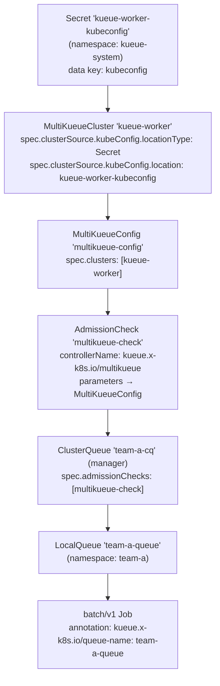
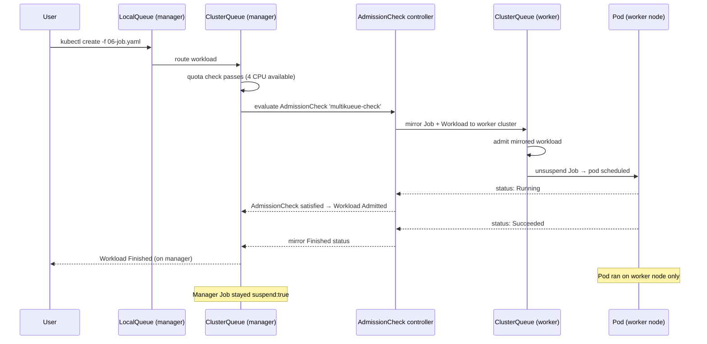

# MultiKueue — Multi-Cluster Job Federation

A hands-on experiment demonstrating **MultiKueue**: Kueue's built-in multi-cluster federation mechanism. A **manager cluster** holds the queue and dispatches admitted workloads to a **worker cluster** for execution, with status mirrored back to the manager.

---

## Table of Contents

- [MultiKueue — Multi-Cluster Job Federation](#multikueue--multi-cluster-job-federation)
  - [Table of Contents](#table-of-contents)
  - [Overview](#overview)
  - [Prerequisites](#prerequisites)
    - [One-time inotify fix (Ubuntu)](#one-time-inotify-fix-ubuntu)
    - [Start both clusters](#start-both-clusters)
  - [Cluster Architecture](#cluster-architecture)
  - [MultiKueue Object Hierarchy](#multikueue-object-hierarchy)
  - [Concepts](#concepts)
    - [MultiKueueCluster](#multikueuecluster)
    - [MultiKueueConfig](#multikueueconfig)
    - [AdmissionCheck (MultiKueue)](#admissioncheck-multikueue)
    - [How the Manager ClusterQueue differs from previous experiments](#how-the-manager-clusterqueue-differs-from-previous-experiments)
    - [The Worker Cluster's Role](#the-worker-clusters-role)
    - [Job Mirroring and Status Sync](#job-mirroring-and-status-sync)
  - [Experiment Steps](#experiment-steps)
    - [Step 1 — Apply MultiKueue objects on the manager](#step-1--apply-multikueue-objects-on-the-manager)
    - [Step 2 — Apply the manager ClusterQueue](#step-2--apply-the-manager-clusterqueue)
    - [Step 3 — Apply the worker ClusterQueue](#step-3--apply-the-worker-clusterqueue)
    - [Step 4 — Apply Namespace and LocalQueues on both clusters](#step-4--apply-namespace-and-localqueues-on-both-clusters)
    - [Step 5 — Verify the AdmissionCheck is Active](#step-5--verify-the-admissioncheck-is-active)
    - [Step 6 — Submit a Job to the manager](#step-6--submit-a-job-to-the-manager)
    - [Step 7 — Observe dispatch to the worker cluster](#step-7--observe-dispatch-to-the-worker-cluster)
    - [Step 8 — Observe status mirroring back to the manager](#step-8--observe-status-mirroring-back-to-the-manager)
    - [Step 9 — Submit multiple jobs and observe load distribution](#step-9--submit-multiple-jobs-and-observe-load-distribution)
  - [How It All Fits Together](#how-it-all-fits-together)
  - [Key Observations Summary](#key-observations-summary)
  - [Cleanup](#cleanup)
  - [Future Experiment: Advanced MultiKueue](#future-experiment-advanced-multikueue)
  - [References](#references)

---

## Overview

Key behaviours demonstrated:

| Behaviour | What you will see |
|---|---|
| **Job submission on manager** | User submits a Job to the manager cluster's LocalQueue |
| **AdmissionCheck gate** | Workload stays `QuotaReserved` until the MultiKueue AdmissionCheck is satisfied |
| **Job mirroring** | MultiKueue controller copies the Job + Workload to the worker cluster |
| **Execution on worker** | Pod actually runs on the worker cluster's nodes |
| **Status mirroring** | `Running` → `Succeeded` status flows back from worker to manager |
| **Manager Workload** | Manager Workload shows `Admitted: True` and eventually `Finished` — without a pod ever running on the manager |

---

## Prerequisites

### One-time inotify fix (Ubuntu)

This experiment runs **6 Kind node containers** (2 control-planes + 4 workers across 2 clusters). Apply this **once** on the Ubuntu host:

```bash
sudo tee /etc/sysctl.d/99-kind-inotify.conf <<'EOF'
fs.inotify.max_user_instances = 512
fs.inotify.max_user_watches   = 524288
EOF
sudo sysctl --system
```

### Start both clusters

```bash
cd kueue/05-multikueue
bash setup.sh
```

`setup.sh` does the following automatically:

1. Creates the `kueue-manager` Kind cluster.
2. Creates the `kueue-worker` Kind cluster.
3. Installs cert-manager + Kueue (with `MultiKueue` feature gate enabled) on both clusters.
4. Extracts the worker cluster's kubeconfig, rewrites the API server address to the worker control-plane container's Docker IP (so the manager's Kueue controller can reach it), and stores it as a Secret in the **`kueue-system`** namespace on the manager (Kueue always looks for the Secret in its own config namespace).

Verify both clusters and Kueue are healthy:

```bash
# Manager cluster
kubectl get nodes --context kind-kueue-manager
kubectl get pods -n kueue-system --context kind-kueue-manager

# Worker cluster
kubectl get nodes --context kind-kueue-worker
kubectl get pods -n kueue-system --context kind-kueue-worker

# Worker kubeconfig Secret (created by setup.sh)
kubectl get secret kueue-worker-kubeconfig -n kueue-system --context kind-kueue-manager
```

---

## Cluster Architecture

```
┌─────────────────────────────────────────────────────────────────┐
│  Manager Cluster  (kind-kueue-manager)                          │
│                                                                 │
│  ┌──────────────┐   ┌──────────────────────────────────────┐   │
│  │ control-plane│   │  Kueue (MultiKueue feature gate ON)  │   │
│  └──────────────┘   │  ┌────────────────────────────────┐  │   │
│  ┌──────────────┐   │  │ MultiKueueCluster: kueue-worker │  │   │
│  │   worker-1   │   │  │ MultiKueueConfig                │  │   │
│  └──────────────┘   │  │ AdmissionCheck: multikueue-check│  │   │
│  ┌──────────────┐   │  │ ClusterQueue: team-a-cq         │  │   │
│  │   worker-2   │   │  │   (has admissionChecks)         │  │   │
│  └──────────────┘   │  └────────────────────────────────┘  │   │
│                     └──────────────────────────────────────┘   │
│  Jobs submitted here. Pods do NOT run here.                     │
└─────────────────────────────────────────────────────────────────┘
                              │
                    kubeconfig Secret
                    (Docker network)
                              │
                              ▼
┌─────────────────────────────────────────────────────────────────┐
│  Worker Cluster  (kind-kueue-worker)                            │
│                                                                 │
│  ┌──────────────┐   ┌──────────────────────────────────────┐   │
│  │ control-plane│   │  Kueue (standard, no MultiKueue CRDs)│   │
│  └──────────────┘   │  ┌────────────────────────────────┐  │   │
│  ┌──────────────┐   │  │ ClusterQueue: team-a-cq         │  │   │
│  │   worker-1   │   │  │   (NO admissionChecks)          │  │   │
│  └──────────────┘   │  └────────────────────────────────┘  │   │
│  ┌──────────────┐   └──────────────────────────────────────┘   │
│  │   worker-2   │                                               │
│  └──────────────┘                                               │
│  Mirrored Jobs run here. Pods actually execute here.            │
└─────────────────────────────────────────────────────────────────┘
```

---

## MultiKueue Object Hierarchy



---

## Concepts

### MultiKueueCluster

> **File:** [`02-multikueue-objects.yaml`](./02-multikueue-objects.yaml)

A `MultiKueueCluster` represents a single worker cluster. It tells the MultiKueue controller how to connect to that cluster:

```yaml
apiVersion: kueue.x-k8s.io/v1beta2
kind: MultiKueueCluster
metadata:
  name: kueue-worker
spec:
  clusterSource:
    kubeConfig:
      locationType: Secret          # read kubeconfig from a Secret
      location: kueue-worker-kubeconfig   # just the Secret NAME — Kueue looks in kueue-system
```

`locationType: Secret` means the kubeconfig is stored in a Kubernetes Secret on the manager cluster. The `location` field is **just the Secret name** — Kueue always looks in its own config namespace (`kueue-system`). The Secret must have a data key named exactly `kubeconfig`.

Check the connection status:

```bash
kubectl describe multikueuecluster kueue-worker --context kind-kueue-manager
```

Look for the `Status.Conditions` — `Active: True` means the manager can reach the worker API server.

---

### MultiKueueConfig

> **File:** [`02-multikueue-objects.yaml`](./02-multikueue-objects.yaml)

A `MultiKueueConfig` groups one or more `MultiKueueCluster` objects. The `AdmissionCheck` references this config:

```yaml
apiVersion: kueue.x-k8s.io/v1beta2
kind: MultiKueueConfig
metadata:
  name: multikueue-config
spec:
  clusters:
    - kueue-worker
```

When multiple worker clusters are listed, MultiKueue picks one to dispatch each workload to (currently first-available selection). This is the foundation for multi-worker-cluster federation.

---

### AdmissionCheck (MultiKueue)

> **File:** [`02-multikueue-objects.yaml`](./02-multikueue-objects.yaml)

An `AdmissionCheck` is a **gate** that must reach `Ready` before Kueue fully admits a workload. The MultiKueue controller satisfies this gate by successfully mirroring the workload to a worker cluster:

```yaml
apiVersion: kueue.x-k8s.io/v1beta2
kind: AdmissionCheck
metadata:
  name: multikueue-check
spec:
  controllerName: kueue.x-k8s.io/multikueue   # built-in MultiKueue controller
  parameters:
    apiGroup: kueue.x-k8s.io
    kind: MultiKueueConfig
    name: multikueue-config
```

The `controllerName` must be exactly `kueue.x-k8s.io/multikueue`. This is the name the built-in MultiKueue admission-check controller registers under.

---

### How the Manager ClusterQueue differs from previous experiments

> **File:** [`03-manager-clusterqueue.yaml`](./03-manager-clusterqueue.yaml)

The only new field is `spec.admissionChecksStrategy.admissionChecks`:

```yaml
spec:
  admissionChecksStrategy:
    admissionChecks:
    - name: multikueue-check   # ← this is what makes it a MultiKueue queue
```

Without this field the ClusterQueue behaves exactly like in experiments 01–04: workloads are admitted locally and pods run on the manager cluster. With it, every admitted workload is dispatched to a worker cluster.

---

### The Worker Cluster's Role

> **File:** [`04-worker-clusterqueue.yaml`](./04-worker-clusterqueue.yaml)

The worker cluster needs:

- The **same** `ResourceFlavor` name (`default-flavor`).
- The **same** `ClusterQueue` name (`team-a-cq`) — MultiKueue mirrors the workload to a queue with the same name.
- The **same** `LocalQueue` name in the **same** namespace — the mirrored Job carries the `kueue.x-k8s.io/queue-name` **label**.
- **No** `admissionChecks` on the worker's ClusterQueue — the worker runs jobs locally.

```yaml
# Worker ClusterQueue — identical name, NO admissionChecks
apiVersion: kueue.x-k8s.io/v1beta2
kind: ClusterQueue
metadata:
  name: team-a-cq
spec:
  # ... quota ...
  # admissionChecks: []  ← intentionally absent
```

---

### Job Mirroring and Status Sync

When a workload is admitted on the manager:

1. **MultiKueue controller** (on manager) picks a worker cluster from the `MultiKueueConfig`.
2. It **mirrors** the `batch/v1 Job` and a corresponding `Workload` object to the worker cluster (same namespace, same name with a generated suffix).
3. The worker's Kueue **admits** the mirrored workload and unsuspends the mirrored Job.
4. The pod runs on the worker's nodes.
5. The MultiKueue controller **watches** the mirrored Workload's status on the worker and **copies** it back to the manager's Workload.
6. When the mirrored Job finishes, the manager's Workload transitions to `Finished`.

The manager's Job object itself stays `suspend: true` throughout — it never runs locally.

---

## Experiment Steps

### Step 1 — Apply MultiKueue objects on the manager

```bash
kubectl apply -f 02-multikueue-objects.yaml --context kind-kueue-manager
```

Verify:

```bash
kubectl get multikueuecluster --context kind-kueue-manager
kubectl get multikueueconfig --context kind-kueue-manager
kubectl get admissioncheck --context kind-kueue-manager
kubectl describe multikueuecluster kueue-worker --context kind-kueue-manager
```

Expected:

```
NAME           ACTIVE   AGE
kueue-worker   True     10s
```

```
NAME                AGE
multikueue-config   10s
```

```
NAME               CONTROLLER                      ACTIVE   AGE
multikueue-check   kueue.x-k8s.io/multikueue       True     10s
```

> **If `MultiKueueCluster` shows `Active: False`:** The manager cannot reach the worker API server. Check that `setup.sh` completed successfully and the Docker network is intact:
>
> ```bash
> kubectl describe multikueuecluster kueue-worker --context kind-kueue-manager
> # Look at Status.Conditions for the error message
> ```

---

### Step 2 — Apply the manager ClusterQueue

```bash
kubectl apply -f 03-manager-clusterqueue.yaml --context kind-kueue-manager
```

Verify:

```bash
kubectl get clusterqueue -o wide --context kind-kueue-manager
```

Expected:

```
NAME        COHORT   STRATEGY         PENDING WORKLOADS   ADMITTED WORKLOADS
team-a-cq            BestEffortFIFO   0                   0
```

Inspect the AdmissionCheck reference:

```bash
kubectl describe clusterqueue team-a-cq --context kind-kueue-manager
```

Look for `Admission Checks: multikueue-check` in the spec output.

---

### Step 3 — Apply the worker ClusterQueue

```bash
kubectl apply -f 04-worker-clusterqueue.yaml --context kind-kueue-worker
```

Verify:

```bash
kubectl get clusterqueue -o wide --context kind-kueue-worker
kubectl get resourceflavor --context kind-kueue-worker
```

Expected:

```
NAME        COHORT   STRATEGY         PENDING WORKLOADS   ADMITTED WORKLOADS
team-a-cq            BestEffortFIFO   0                   0
```

---

### Step 4 — Apply Namespace and LocalQueues on both clusters

The namespace and LocalQueue must exist on **both** clusters:

```bash
kubectl apply -f 05-namespace-and-localqueue.yaml --context kind-kueue-manager
kubectl apply -f 05-namespace-and-localqueue.yaml --context kind-kueue-worker
```

Verify:

```bash
kubectl get localqueue -n team-a -o wide --context kind-kueue-manager
kubectl get localqueue -n team-a -o wide --context kind-kueue-worker
```

Expected on both:

```
NAME           CLUSTERQUEUE   PENDING WORKLOADS   ADMITTED WORKLOADS
team-a-queue   team-a-cq      0                   0
```

Create ImagePullSecrets in the `team-a` namespace on the worker & manager clusters (to avoid Docker Hub rate limiting):

```bash
kubectl create secret generic regcred \
  --from-file=.dockerconfigjson=$HOME/.docker/config.json \
  --type=kubernetes.io/dockerconfigjson \
  -n team-a \
  --context kind-kueue-worker

kubectl patch serviceaccount default \
  -n team-a \
  -p '{"imagePullSecrets": [{"name": "regcred"}]}' \
  --context kind-kueue-worker

kubectl create secret generic regcred \
  --from-file=.dockerconfigjson=$HOME/.docker/config.json \
  --type=kubernetes.io/dockerconfigjson \
  -n team-a \
  --context kind-kueue-manager

kubectl patch serviceaccount default \
  -n team-a \
  -p '{"imagePullSecrets": [{"name": "regcred"}]}' \
  --context kind-kueue-manager
```

---

### Step 5 — Verify the AdmissionCheck is Active

Before submitting jobs, confirm the AdmissionCheck is ready:

```bash
kubectl describe admissioncheck multikueue-check --context kind-kueue-manager
```

Look for:

```yaml
Status:
  Conditions:
    Last Transition Time:  2026-04-21T05:05:04Z
    Message:               The admission check is active
    Observed Generation:   1
    Reason:                Active
    Status:                True
    Type:                  Active
```

Also confirm the MultiKueueCluster is connected:

```bash
kubectl describe multikueuecluster kueue-worker --context kind-kueue-manager
```

Look for:

```yaml
Status:
  Conditions:
    Last Transition Time:  2026-04-21T05:05:04Z
    Message:               Connected
    Observed Generation:   1
    Reason:                Active
    Status:                True
    Type:                  Active
```

---

### Step 6 — Submit a Job to the manager

```bash
#verify cluster resources before submitting job

kubectl get clusterqueues team-a-cq -o jsonpath="{range .status.conditions[?(@.type == \"Active\")]}CQ - Active: {@.status} Reason: {@.reason} Message: {@.message}{'\n'}{end}" --context kind-kueue-manager

CQ - Active: True Reason: Ready Message: Can admit new workloads

kubectl get admissionchecks multikueue-check -o jsonpath="{range .status.conditions[?(@.type == \"Active\")]}AC - Active: {@.status} Reason: {@.reason} Message: {@.message}{'\n'}{end}" --context kind-kueue-manager

AC - Active: True Reason: Active Message: The admission check is active

kubectl get multikueuecluster kueue-worker -o jsonpath="{range .status.conditions[?(@.type == \"Active\")]}MC - Active: {@.status} Reason: {@.reason} Message: {@.message}{'\n'}{end}" --context kind-kueue-manager

MC - Active: True Reason: Active Message: Connected
```

```bash
kubectl create -f 06-job.yaml -n team-a --context kind-kueue-manager
```

Watch the workload on the manager:

```bash
kubectl get workloads -n team-a --context kind-kueue-manager -w
```

You will see the workload progress through states:

```
# manager
watch -n 1 kubectl get workload -o wide -A --context kind-kueue-manager

NAMESPACE   NAME                                    QUEUE          RESERVED IN   ADMITTED   FINISHED   AGE
team-a      job-multikueue-sample-job-c5bpr-c5adb   team-a-queue   team-a-cq     True                  32s

# worker
kubectl get workload -o wide -A --context kind-kueue-worker

NAMESPACE   NAME                                    QUEUE          RESERVED IN   ADMITTED   FINISHED   AGE
team-a      job-multikueue-sample-job-c5bpr-c5adb   team-a-queue   team-a-cq     True                  43s
```

> **Key observation:** `ADMITTED: True` appears quickly — but no pod runs on the manager. The AdmissionCheck was satisfied by the MultiKueue controller mirroring the job to the worker.

---

### Step 7 — Observe dispatch to the worker cluster

Check that the Job was mirrored to the worker cluster:

```bash
kubectl get jobs -n team-a --context kind-kueue-worker
```

Expected:

```
NAME                          STATUS    COMPLETIONS   DURATION   AGE
multikueue-sample-job-c5bpr   Running   0/1           2m3s       2m3s
```

Check the pod is running on the worker:

```bash
kubectl get pods -n team-a --context kind-kueue-worker -o wide
```

Expected:

```
NAME                                READY   STATUS    RESTARTS   AGE     IP           NODE                   NOMINATED NODE   READINESS GATES
multikueue-sample-job-c5bpr-shczv   1/1     Running   0          2m34s   10.244.2.5   kueue-worker-worker2   <none>           <none>
```

**The pod is on the worker cluster, not the manager.** This is the fundamental MultiKueue behaviour.

Check the mirrored Workload on the worker:

```bash
kubectl get workload -o wide -A --context kind-kueue-worker -n team-a
```

```
NAMESPACE   NAME                                    QUEUE          RESERVED IN   ADMITTED   FINISHED   AGE
team-a      job-multikueue-sample-job-c5bpr-c5adb   team-a-queue   team-a-cq     True                  3m55s
```

---

### Step 8 — Observe status mirroring back to the manager

While the job is running, compare the Workload status on both clusters:

```bash
# Manager — status is mirrored FROM the worker
kubectl describe workload -n team-a --context kind-kueue-manager \
  $(kubectl get workloads -n team-a --context kind-kueue-manager -o name | head -1)
```

Look for the `Status` section — it will show the same conditions as the worker's Workload.

After ~300 seconds (the job sleeps for 300s), the job completes:

```bash
kubectl get jobs -n team-a --context kind-kueue-worker
```

```
NAME                              COMPLETIONS   DURATION   AGE
multikueue-sample-job-xxxxx       1/1           65s        70s
```

Check the manager's Workload is now Finished:

```bash
kubectl get workloads -n team-a --context kind-kueue-manager
```

```
NAME                                    QUEUE          RESERVED IN   ADMITTED   FINISHED   AGE
job-multikueue-sample-job-c5bpr-c5adb   team-a-queue   team-a-cq     True       True       7m6s
```

**The manager's Workload shows `FINISHED: True` even though no pod ran on the manager.**

---

### Step 9 — Submit multiple jobs and observe load distribution

Submit 3 jobs at once:

```bash
kubectl create -f 06-job.yaml --context kind-kueue-manager
kubectl create -f 06-job.yaml --context kind-kueue-manager
kubectl create -f 06-job.yaml --context kind-kueue-manager
```

Watch workloads on the manager:

```bash
kubectl get workloads -n team-a --context kind-kueue-manager -w
```

Watch pods on the worker:

```bash
kubectl get pods -n team-a --context kind-kueue-worker -w
```

All pods run on the worker cluster. The manager cluster's nodes remain idle (no job pods scheduled there).

Check ClusterQueue usage on both clusters:

```bash
# Manager — shows quota reserved for dispatched workloads
kubectl describe clusterqueue team-a-cq --context kind-kueue-manager

# Worker — shows actual running workloads
kubectl describe clusterqueue team-a-cq --context kind-kueue-worker
```

---

## How It All Fits Together



**Key insights:**

1. **The manager never runs pods.** Its ClusterQueue tracks quota for dispatched workloads, but the actual execution happens on the worker.
2. **Names must match across clusters.** The `ClusterQueue` name, `LocalQueue` name, `ResourceFlavor` name, and namespace must be identical on both manager and worker — MultiKueue uses these names to route mirrored objects.
3. **`admissionChecks` is the only difference** between a regular ClusterQueue and a MultiKueue ClusterQueue. Remove it and jobs run locally.
4. **The worker's ClusterQueue must NOT have `admissionChecks`.** If it did, the worker would try to dispatch further — creating an infinite mirror loop.
5. **The kubeconfig Secret must use the container IP, not `127.0.0.1`.** Kind clusters use `127.0.0.1` in their kubeconfigs for local access. Inside the Docker network, the manager's Kueue controller must use the worker control-plane container's IP instead. `setup.sh` handles this automatically.

---

## Key Observations Summary

| What to observe | Where to look |
|---|---|
| Workload admitted on manager | `kubectl get workloads -n team-a --context kind-kueue-manager` |
| Job mirrored to worker | `kubectl get jobs -n team-a --context kind-kueue-worker` |
| Pod running on worker node | `kubectl get pods -n team-a --context kind-kueue-worker -o wide` |
| Manager Job stays suspended | `kubectl get job <name> -n team-a --context kind-kueue-manager -o jsonpath='{.spec.suspend}'` |
| Status mirrored back | `kubectl describe workload <name> -n team-a --context kind-kueue-manager` |
| MultiKueueCluster connection | `kubectl describe multikueuecluster kueue-worker --context kind-kueue-manager` |
| AdmissionCheck active | `kubectl describe admissioncheck multikueue-check --context kind-kueue-manager` |

---

## Cleanup

```bash
bash teardown.sh
```

To also delete both Kind clusters:

```bash
kind delete cluster --name kueue-manager
kind delete cluster --name kueue-worker
```

---

## Future Experiment: Advanced MultiKueue

This experiment covers the core MultiKueue flow with a single worker cluster. A follow-up experiment (`06-multikueue-advanced`) could cover:

- **Multiple worker clusters** — add a second `MultiKueueCluster` to the `MultiKueueConfig` and observe how MultiKueue distributes workloads across workers.
- **Worker cluster failure** — delete a worker cluster and observe how MultiKueue re-dispatches pending workloads to a healthy worker.
- **Cohort + MultiKueue** — combine MultiKueue dispatch with cohort borrowing so the manager can borrow quota from another manager-side ClusterQueue before dispatching.
- **`MultiKueueCluster` status conditions** — observe `Active: False` when the worker is unreachable and `Active: True` when it recovers.
- **Namespace isolation** — restrict which namespaces can submit to a MultiKueue ClusterQueue using `spec.namespaceSelector`.

> 📝 **Tracked in [`kueue/README.md`](../README.md)** under "Pending Concepts & Future Experiments".

---

## References

- [MultiKueue concept](https://kueue.sigs.k8s.io/docs/concepts/multikueue/)
- [MultiKueue setup guide](https://kueue.sigs.k8s.io/docs/tasks/manage/setup_multikueue/)
- [AdmissionCheck concept](https://kueue.sigs.k8s.io/docs/concepts/admission_check/)
- [MultiKueueCluster API reference](https://kueue.sigs.k8s.io/docs/reference/kueue.v1beta2/#kueue-x-k8s-io-v1beta2-MultiKueueCluster)
- [MultiKueueConfig API reference](https://kueue.sigs.k8s.io/docs/reference/kueue.v1beta2/#kueue-x-k8s-io-v1beta2-MultiKueueConfig)
- [Kueue Official Docs](https://kueue.sigs.k8s.io/docs/)
- [Kueue Helm Chart](https://github.com/kubernetes-sigs/kueue/blob/main/charts/kueue/README.md)
- [Kueue GitHub](https://github.com/kubernetes-sigs/kueue)
