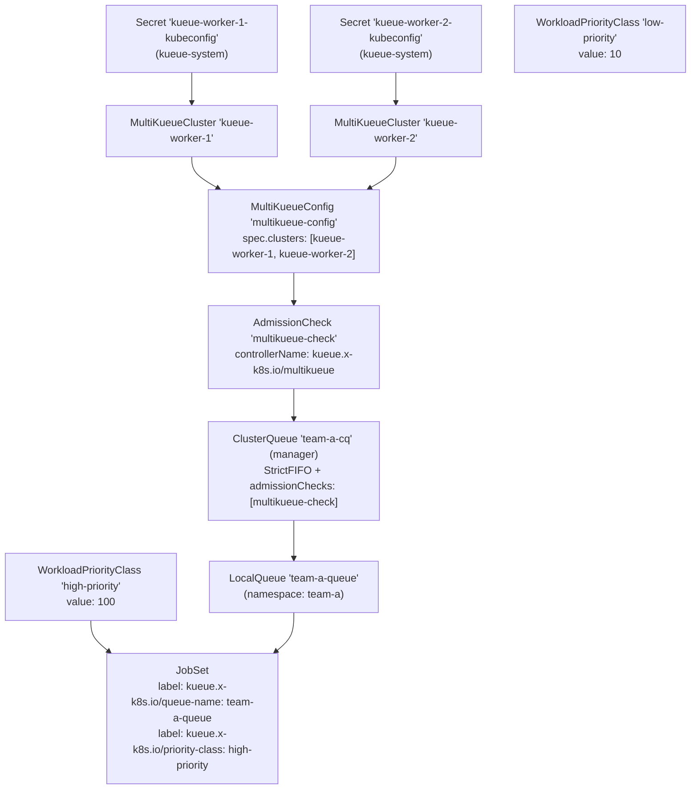
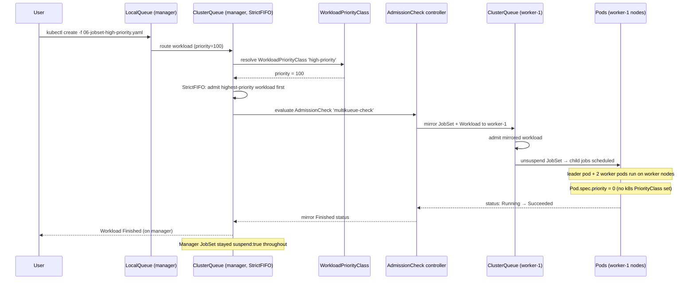

# MultiKueue + JobSet + WorkloadPriorityClass

A hands-on experiment demonstrating three concepts together:

1. **JobSet with Kueue** — Kueue admits a multi-job workload (`leader` + `worker` child jobs) as a single atomic unit.
2. **Advanced MultiKueue (2 workers)** — A manager cluster dispatches JobSets to one of two registered worker clusters.
3. **WorkloadPriorityClass** — Kueue-native priority objects that control admission ordering, decoupled from Kubernetes `PriorityClass`.

---

## Table of Contents

- [Overview](#overview)
- [Prerequisites](#prerequisites)
- [Cluster Architecture](#cluster-architecture)
- [Object Hierarchy](#object-hierarchy)
- [Concepts](#concepts)
  - [JobSet integration](#jobset-integration)
  - [WorkloadPriorityClass](#workloadpriorityclass)
  - [WorkloadPriorityClass vs Kubernetes PriorityClass](#workloadpriorityclass-vs-kubernetes-priorityclass)
  - [StrictFIFO — required for priority ordering](#strictfifo--required-for-priority-ordering)
  - [Two worker clusters in MultiKueueConfig](#two-worker-clusters-in-multikueueconfig)
- [Experiment Steps](#experiment-steps)
  - [Step 1 — Apply MultiKueue federation objects](#step-1--apply-multikueue-federation-objects)
  - [Step 2 — Apply ClusterQueues](#step-2--apply-clusterqueues)
  - [Step 3 — Apply Namespace, LocalQueue, and WorkloadPriorityClasses](#step-3--apply-namespace-localqueue-and-workloadpriorityclasses)
  - [Step 4 — Verify setup](#step-4--verify-setup)
  - [Step 5 — Submit a JobSet and observe multi-cluster dispatch](#step-5--submit-a-jobset-and-observe-multi-cluster-dispatch)
  - [Step 6 — Priority-based admission ordering](#step-6--priority-based-admission-ordering)
  - [Step 7 — WorkloadPriorityClass decoupled from Kubernetes PriorityClass](#step-7--workloadpriorityclass-decoupled-from-kubernetes-priorityclass)
- [How It All Fits Together](#how-it-all-fits-together)
- [Key Observations Summary](#key-observations-summary)
- [Cleanup](#cleanup)
- [References](#references)

---

## Overview

| Behaviour | What you will see |
|---|---|
| **Atomic JobSet admission** | A single `Workload` is created for the entire JobSet (not one per child job) |
| **JobSet mirroring** | The `leader` + `worker` child jobs appear on the worker cluster |
| **Two workers in MultiKueueConfig** | Both `MultiKueueCluster` objects show `Active: True` |
| **Priority ordering** | High-priority workloads are admitted before low-priority ones (with StrictFIFO) |
| **Decoupled priorities** | Pods from high/low WorkloadPriorityClass have identical Kubernetes scheduling priority |

---

## Prerequisites

### One-time inotify fix (Ubuntu)

This experiment runs **9 Kind node containers** (3 control-planes + 6 workers across 3 clusters). Apply this **once** on the Ubuntu host:

```bash
sudo tee /etc/sysctl.d/99-kind-inotify.conf <<'EOF'
fs.inotify.max_user_instances = 512
fs.inotify.max_user_watches   = 524288
EOF
sudo sysctl --system
```

### Start all three clusters

```bash
cd kueue/06-multikueue-jobset-priority
bash setup.sh
```

`setup.sh` does the following automatically:

1. Creates the `kueue-manager` Kind cluster.
2. Creates the `kueue-worker-1` Kind cluster.
3. Creates the `kueue-worker-2` Kind cluster.
4. Installs cert-manager + Kueue (with `MultiKueue` feature gate enabled) + JobSet CRDs on all three clusters.
5. Extracts each worker cluster's kubeconfig, rewrites the API server address to the worker control-plane container's Docker IP, and stores it as a Secret in the `kueue-system` namespace on the manager.

Verify all clusters and Kueue are healthy:

```bash
# Manager cluster
kubectl get nodes --context kind-kueue-manager
kubectl get pods -n kueue-system --context kind-kueue-manager

# Worker cluster 1
kubectl get nodes --context kind-kueue-worker-1
kubectl get pods -n kueue-system --context kind-kueue-worker-1

# Worker cluster 2
kubectl get nodes --context kind-kueue-worker-2
kubectl get pods -n kueue-system --context kind-kueue-worker-2

# Worker kubeconfig Secrets (created by setup.sh)
kubectl get secret kueue-worker-1-kubeconfig kueue-worker-2-kubeconfig \
  -n kueue-system --context kind-kueue-manager
```

---

## Cluster Architecture

```
┌─────────────────────────────────────────────────────────────────┐
│  Manager Cluster  (kind-kueue-manager)                          │
│                                                                 │
│  ┌──────────────┐   ┌──────────────────────────────────────┐   │
│  │ control-plane│   │  Kueue (MultiKueue feature gate ON)  │   │
│  └──────────────┘   │  MultiKueueCluster: kueue-worker-1   │   │
│  ┌──────────────┐   │  MultiKueueCluster: kueue-worker-2   │   │
│  │   worker-1   │   │  MultiKueueConfig (both workers)     │   │
│  └──────────────┘   │  AdmissionCheck: multikueue-check    │   │
│  ┌──────────────┐   │  ClusterQueue: team-a-cq (StrictFIFO)│   │
│  │   worker-2   │   │  WorkloadPriorityClass: high-priority │   │
│  └──────────────┘   │  WorkloadPriorityClass: low-priority  │   │
│                     └──────────────────────────────────────┘   │
│  JobSets submitted here. Pods do NOT run here.                  │
└─────────────────────────────────────────────────────────────────┘
              │                           │
    kubeconfig Secret          kubeconfig Secret
    (Docker network)           (Docker network)
              │                           │
              ▼                           ▼
┌─────────────────────────┐   ┌─────────────────────────┐
│  Worker Cluster 1       │   │  Worker Cluster 2       │
│  (kind-kueue-worker-1)  │   │  (kind-kueue-worker-2)  │
│                         │   │                         │
│  Kueue (standard)       │   │  Kueue (standard)       │
│  ClusterQueue: team-a-cq│   │  ClusterQueue: team-a-cq│
│  (no admissionChecks)   │   │  (no admissionChecks)   │
│                         │   │                         │
│  Mirrored JobSets run   │   │  Mirrored JobSets run   │
│  here.                  │   │  here.                  │
└─────────────────────────┘   └─────────────────────────┘
```

---

## Object Hierarchy



---

## Concepts

### JobSet integration

> **File:** [`06-jobset-high-priority.yaml`](./06-jobset-high-priority.yaml)

A `JobSet` is a single logical workload composed of multiple `batch/v1 Job` objects. Kueue treats the entire `JobSet` as **one admission unit** — it creates a single `Workload` object for the whole set, and all child jobs are admitted or queued atomically.

This means you will **not** see two separate `Workload` objects (one per child job). You will see one `Workload` whose `spec.podSets` describes the resource requirements of all child jobs combined.

The `jobset.x-k8s.io/jobset` integration must be listed in `integrations.frameworks` in the Kueue Helm values (it is — see `values.yaml`).

```yaml
apiVersion: jobset.x-k8s.io/v1alpha2
kind: JobSet
metadata:
  labels:
    kueue.x-k8s.io/queue-name: team-a-queue      # label, not annotation
    kueue.x-k8s.io/priority-class: high-priority  # label, not annotation
spec:
  suspend: true   # Kueue controls when the JobSet starts
  replicatedJobs:
    - name: leader
      replicas: 1
      template:
        spec:
          completionMode: Indexed
          parallelism: 1
          completions: 1
          # ...
    - name: worker
      replicas: 1
      template:
        spec:
          completionMode: Indexed
          parallelism: 2
          completions: 2
          # ...
```

**Important:** `kueue.x-k8s.io/queue-name` and `kueue.x-k8s.io/priority-class` must be **labels**, not annotations. Kueue reads them via `object.GetLabels()`.

---

### WorkloadPriorityClass

> **File:** [`05-namespace-localqueue-priority.yaml`](./05-namespace-localqueue-priority.yaml)

A `WorkloadPriorityClass` is a Kueue-native priority object, separate from the Kubernetes `PriorityClass`. It controls the **Kueue admission priority** of a workload — i.e., which workloads Kueue admits first when quota is limited.

```yaml
apiVersion: kueue.x-k8s.io/v1beta2
kind: WorkloadPriorityClass
metadata:
  name: high-priority
value: 100
```

Assign it to a `JobSet` via the `kueue.x-k8s.io/priority-class` label:

```yaml
labels:
  kueue.x-k8s.io/priority-class: high-priority
```

Kueue sets the `Workload.spec.priorityClassName` and `Workload.spec.priority` fields accordingly. The higher the `value`, the earlier the workload is admitted.

---

### WorkloadPriorityClass vs Kubernetes PriorityClass

This is the key decoupling this experiment demonstrates.

| | `WorkloadPriorityClass` | Kubernetes `PriorityClass` |
|---|---|---|
| **Scope** | Kueue admission | Pod scheduling |
| **Object** | `kueue.x-k8s.io/v1beta2 WorkloadPriorityClass` | `scheduling.k8s.io/v1 PriorityClass` |
| **Assigned via** | `kueue.x-k8s.io/priority-class` label on workload | `spec.priorityClassName` on Pod template |
| **Effect** | Controls which workload Kueue admits first | Controls which pod the scheduler preempts others for |
| **Visible in** | `Workload.spec.priority` | `Pod.spec.priority` |

In this experiment, both the high- and low-priority JobSets have **no** Kubernetes `PriorityClass` set. Their pods have the same scheduling priority (`0`). Only Kueue admission order differs.

---

### StrictFIFO — required for priority ordering

> **File:** [`03-manager-clusterqueue.yaml`](./03-manager-clusterqueue.yaml)

The manager ClusterQueue uses `queueingStrategy: StrictFIFO`.

With `StrictFIFO`, Kueue respects the workload queue order strictly — it will not admit a lower-priority workload even if it fits within the available quota, as long as a higher-priority workload is waiting ahead of it.

With `BestEffortFIFO` (the default in earlier experiments), Kueue may skip a pending workload and admit a later one that fits — making priority ordering invisible.

---

### Two worker clusters in MultiKueueConfig

> **File:** [`02-multikueue-objects.yaml`](./02-multikueue-objects.yaml)

The `MultiKueueConfig` lists both worker clusters:

```yaml
apiVersion: kueue.x-k8s.io/v1beta2
kind: MultiKueueConfig
metadata:
  name: multikueue-config
spec:
  clusters:
    - kueue-worker-1
    - kueue-worker-2
```

MultiKueue uses **first-available** cluster selection — it picks the first worker in the list that is reachable and has the required resources. This is not round-robin load balancing. The value of two workers here is federation resilience: if `kueue-worker-1` goes `Active: False`, MultiKueue can dispatch to `kueue-worker-2`.

---

## Experiment Steps

### Step 1 — Apply MultiKueue federation objects

```bash
kubectl apply -f 02-multikueue-objects.yaml --context kind-kueue-manager
```

Verify both MultiKueueClusters and the AdmissionCheck are active:

```bash
kubectl get multikueuecluster --context kind-kueue-manager
```

Expected:
```
NAME             ACTIVE   AGE
kueue-worker-1   True     10s
kueue-worker-2   True     10s
```

```bash
kubectl get admissioncheck --context kind-kueue-manager
```

Expected:
```
NAME               CONTROLLER                      ACTIVE   AGE
multikueue-check   kueue.x-k8s.io/multikueue       True     10s
```

> **If a MultiKueueCluster shows `Active: False`:** The manager cannot reach the worker API server. Check that `setup.sh` completed successfully:
> ```bash
> kubectl describe multikueuecluster kueue-worker-1 --context kind-kueue-manager
> # Look at Status.Conditions for the error message
> ```

---

### Step 2 — Apply ClusterQueues

```bash
# Manager ClusterQueue (StrictFIFO + admissionChecks)
kubectl apply -f 03-manager-clusterqueue.yaml --context kind-kueue-manager

# Worker ClusterQueues (no admissionChecks — same file for both workers)
kubectl apply -f 04-worker-clusterqueue.yaml --context kind-kueue-worker-1
kubectl apply -f 04-worker-clusterqueue.yaml --context kind-kueue-worker-2
```

Verify:

```bash
kubectl get clusterqueue -o wide --context kind-kueue-manager
kubectl get clusterqueue -o wide --context kind-kueue-worker-1
kubectl get clusterqueue -o wide --context kind-kueue-worker-2
```

Expected on manager:
```
NAME        COHORT   STRATEGY     PENDING WORKLOADS   ADMITTED WORKLOADS
team-a-cq            StrictFIFO   0                   0
```

---

### Step 3 — Apply Namespace, LocalQueue, and WorkloadPriorityClasses

```bash
# Apply to all three clusters (Namespace + LocalQueue needed on all)
kubectl apply -f 05-namespace-localqueue-priority.yaml --context kind-kueue-manager
kubectl apply -f 05-namespace-localqueue-priority.yaml --context kind-kueue-worker-1
kubectl apply -f 05-namespace-localqueue-priority.yaml --context kind-kueue-worker-2
```

Verify WorkloadPriorityClasses on the manager:

```bash
kubectl get workloadpriorityclass --context kind-kueue-manager
```

Expected:
```
NAME            VALUE   AGE
high-priority   100     5s
low-priority    10      5s
```

Verify LocalQueues:

```bash
kubectl get localqueue -n team-a -o wide --context kind-kueue-manager
kubectl get localqueue -n team-a -o wide --context kind-kueue-worker-1
kubectl get localqueue -n team-a -o wide --context kind-kueue-worker-2
```

Expected on all three:
```
NAME           CLUSTERQUEUE   PENDING WORKLOADS   ADMITTED WORKLOADS
team-a-queue   team-a-cq      0                   0
```

Create ImagePullSecrets in the `team-a` namespace on all clusters (to avoid Docker Hub rate limiting):

```bash
for ctx in kind-kueue-manager kind-kueue-worker-1 kind-kueue-worker-2; do
  kubectl create secret generic regcred \
    --from-file=.dockerconfigjson=$HOME/.docker/config.json \
    --type=kubernetes.io/dockerconfigjson \
    -n team-a \
    --context "${ctx}"

  kubectl patch serviceaccount default \
    -n team-a \
    -p '{"imagePullSecrets": [{"name": "regcred"}]}' \
    --context "${ctx}"
done
```

---

### Step 4 — Verify setup

Before submitting workloads, confirm everything is ready:

```bash
# Check ClusterQueue is active on manager
kubectl get clusterqueues team-a-cq \
  -o jsonpath="{range .status.conditions[?(@.type == \"Active\")]}CQ - Active: {@.status} Reason: {@.reason}{'\n'}{end}" \
  --context kind-kueue-manager

# Check AdmissionCheck is active
kubectl get admissionchecks multikueue-check \
  -o jsonpath="{range .status.conditions[?(@.type == \"Active\")]}AC - Active: {@.status} Reason: {@.reason}{'\n'}{end}" \
  --context kind-kueue-manager

# Check both MultiKueueClusters are connected
kubectl get multikueuecluster kueue-worker-1 \
  -o jsonpath="{range .status.conditions[?(@.type == \"Active\")]}MC kueue-worker-1 - Active: {@.status} Reason: {@.reason}{'\n'}{end}" \
  --context kind-kueue-manager

kubectl get multikueuecluster kueue-worker-2 \
  -o jsonpath="{range .status.conditions[?(@.type == \"Active\")]}MC kueue-worker-2 - Active: {@.status} Reason: {@.reason}{'\n'}{end}" \
  --context kind-kueue-manager
```

All four checks should return `Active: True`.

---

### Step 5 — Submit a JobSet and observe multi-cluster dispatch

```bash
kubectl create -f 06-jobset-high-priority.yaml -n team-a --context kind-kueue-manager
```

Watch the workload on the manager:

```bash
watch -n 1 kubectl get workload -o wide -n team-a --context kind-kueue-manager
```

Expected — **one** Workload object for the entire JobSet:
```
NAMESPACE   NAME                             QUEUE          RESERVED IN   ADMITTED   FINISHED   AGE
team-a      jobset-high-xxxxx-<hash>         team-a-queue   team-a-cq     True                  15s
```

> **Key observation:** There is ONE Workload for the entire JobSet, not one per child job. This is Kueue's atomic admission unit.

Check the mirrored JobSet on the worker cluster:

```bash
kubectl get jobsets -n team-a --context kind-kueue-worker-1
```

Expected:
```
NAME              RESTARTS   COMPLETED   AGE
jobset-high-xxxxx 0                      20s
```

Check the child jobs on the worker:

```bash
kubectl get jobs -n team-a --context kind-kueue-worker-1
```

Expected — two child jobs (leader + worker):
```
NAME                               STATUS    COMPLETIONS   DURATION   AGE
jobset-high-xxxxx-leader-0         Running   0/1           10s        10s
jobset-high-xxxxx-worker-0         Running   0/2           10s        10s
```

Check that pods are running on the worker:

```bash
kubectl get pods -n team-a --context kind-kueue-worker-1 -o wide
```

Expected — 3 pods (1 leader + 2 worker pods):
```
NAME                                    READY   STATUS    NODE
jobset-high-xxxxx-leader-0-0-xxxxx      1/1     Running   kueue-worker-1-worker
jobset-high-xxxxx-worker-0-0-xxxxx      1/1     Running   kueue-worker-1-worker
jobset-high-xxxxx-worker-0-1-xxxxx      1/1     Running   kueue-worker-1-worker2
```

Confirm the manager's JobSet stays suspended (pods never run on manager):

```bash
kubectl get jobset -n team-a --context kind-kueue-manager -o jsonpath='{.items[0].spec.suspend}'
```

Expected: `true`

After ~60 seconds, observe the JobSet completing and status mirroring back:

```bash
kubectl get workload -n team-a --context kind-kueue-manager
```

Expected:
```
NAME                          QUEUE          RESERVED IN   ADMITTED   FINISHED   AGE
jobset-high-xxxxx-<hash>      team-a-queue   team-a-cq     True       True       75s
```

---

### Step 6 — Priority-based admission ordering

This step demonstrates that with `StrictFIFO` and `WorkloadPriorityClass`, high-priority workloads jump the queue ahead of low-priority ones.

The manager ClusterQueue quota is `cpu: 300m / memory: 256Mi` — exactly enough for one JobSet (300m CPU total: 1 leader + 2 worker pods × 100m each). This ensures workloads queue up and priority becomes observable.

**Part A: Fill the quota with low-priority JobSets**

Submit several low-priority JobSets. The first will be admitted immediately; subsequent ones queue up waiting for quota:

```bash
# Submit 3 low-priority JobSets — first admitted, rest pending
for i in 1 2 3; do
  kubectl create -f 07-jobset-low-priority.yaml -n team-a --context kind-kueue-manager
done
```

Watch workloads — one is admitted, others are pending:

```bash
watch -n 1 kubectl get workload -o wide -n team-a --context kind-kueue-manager
```

**Part B: Submit a high-priority JobSet while queue is non-empty**

```bash
kubectl create -f 06-jobset-high-priority.yaml -n team-a --context kind-kueue-manager
```

Watch the workloads and observe their priority values:

```bash
kubectl get workloads -n team-a --context kind-kueue-manager \
  -o custom-columns="NAME:.metadata.name,PRIORITY:.spec.priority,ADMITTED:.status.conditions[?(@.type=='Admitted')].status"
```

Expected output (approximate):
```
NAME                               PRIORITY   ADMITTED
jobset-low-xxxxx1-<hash>           10         True
jobset-low-xxxxx2-<hash>           10         False
jobset-low-xxxxx3-<hash>           10         False
jobset-high-xxxxx-<hash>           100        False
```

Once the running low-priority workload finishes (~60s) and quota is freed, Kueue admits the high-priority workload **before** the remaining low-priority ones:

```bash
# After ~60s, watch workloads again
watch -n 1 kubectl get workload -o wide -n team-a --context kind-kueue-manager
```

The `jobset-high-*` workload transitions to `ADMITTED: True` before the remaining `jobset-low-*` ones.

> **What you are seeing:** `StrictFIFO` causes Kueue to treat the `high-priority` workload (value 100) as higher in the queue than the pending `low-priority` workloads (value 10), even though the low-priority ones were submitted first.

---

### Step 7 — WorkloadPriorityClass decoupled from Kubernetes PriorityClass

This step shows that `WorkloadPriorityClass` affects only Kueue admission order — **not** pod scheduling priority.

**Part A: Clean up previous workloads**

```bash
kubectl delete jobsets --all -n team-a --context kind-kueue-manager
kubectl delete workloads --all -n team-a --context kind-kueue-manager
```

When a JobSet is deleted on the manager, MultiKueue's garbage collector automatically cleans up the mirrored JobSet and Workload on the worker cluster. Wait a moment then verify the manager is clear:

```bash
kubectl get workloads -n team-a --context kind-kueue-manager
```

Expected: `No resources found in team-a namespace.`

**Part B: Submit high and low priority JobSets with no Kubernetes PriorityClass**

Both `06-jobset-high-priority.yaml` and `07-jobset-low-priority.yaml` have **no** `spec.priorityClassName` in their pod templates. Their pods will have Kubernetes scheduling priority `0` (default).

```bash
# Submit low-priority first to fill quota
kubectl create -f 07-jobset-low-priority.yaml -n team-a --context kind-kueue-manager
kubectl create -f 07-jobset-low-priority.yaml -n team-a --context kind-kueue-manager
# Then submit high-priority
kubectl create -f 06-jobset-high-priority.yaml -n team-a --context kind-kueue-manager
```

**Part C: Check pod scheduling priority on the worker**

Wait for at least one workload to be admitted and pods to run on a worker:

```bash
kubectl get pods -n team-a --context kind-kueue-worker-1 -o wide
```

Then check the `priority` field on both a high-priority and a low-priority pod:

```bash
# Pick a pod name from the output above, then:
kubectl get pod <pod-name> -n team-a --context kind-kueue-worker-1 \
  -o jsonpath='{"priority: "}{.spec.priority}{"\n"}'
```

Expected for **both** high-priority and low-priority pods: `priority: 0` (or empty, which also means 0).

**Part D: Check the Workload priority on the manager**

```bash
kubectl get workloads -n team-a --context kind-kueue-manager \
  -o custom-columns="NAME:.metadata.name,WPC:.spec.priorityClassName,KUEUE_PRIORITY:.spec.priority,ADMITTED:.status.conditions[?(@.type=='Admitted')].status"
```

Expected:
```
NAME                              WPC            KUEUE_PRIORITY   ADMITTED
jobset-low-xxxxx1-<hash>          low-priority   10               True
jobset-low-xxxxx2-<hash>          low-priority   10               False
jobset-high-xxxxx-<hash>          high-priority  100              False
```

> **Key observation:** `KUEUE_PRIORITY` differs (100 vs 10) — Kueue admission order is affected.
> The pods have `priority: 0` regardless — Kubernetes scheduling is unaffected.
> This is the decoupling: you can prioritise Kueue admission without affecting node-level pod scheduling preemption.

---

## How It All Fits Together



---

## Key Observations Summary

| What to observe | Where to look |
|---|---|
| One Workload for entire JobSet | `kubectl get workloads -n team-a --context kind-kueue-manager` |
| Child jobs on worker cluster | `kubectl get jobs -n team-a --context kind-kueue-worker-1` |
| 3 pods on worker (1 leader + 2 worker) | `kubectl get pods -n team-a --context kind-kueue-worker-1 -o wide` |
| Manager JobSet stays suspended | `kubectl get jobset -n team-a --context kind-kueue-manager -o jsonpath='{.items[0].spec.suspend}'` |
| WorkloadPriorityClass admission order | `kubectl get workloads -n team-a --context kind-kueue-manager -o custom-columns=NAME:.metadata.name,PRIORITY:.spec.priority,ADMITTED:.status.conditions[?(@.type=='Admitted')].status` |
| Pod scheduling priority (default 0) | `kubectl get pod <name> -n team-a --context kind-kueue-worker-1 -o jsonpath='{.spec.priority}'` |
| Both workers Active | `kubectl get multikueuecluster --context kind-kueue-manager` |
| Status mirrored back to manager | `kubectl describe workload <name> -n team-a --context kind-kueue-manager` |

---

## Cleanup

```bash
bash teardown.sh
```

To also delete all three Kind clusters:

```bash
kind delete cluster --name kueue-manager
kind delete cluster --name kueue-worker-1
kind delete cluster --name kueue-worker-2
```

---

## References

- [JobSet documentation](https://jobset.sigs.k8s.io/docs/)
- [Kueue JobSet integration](https://kueue.sigs.k8s.io/docs/tasks/run/jobsets/)
- [WorkloadPriorityClass concept](https://kueue.sigs.k8s.io/docs/concepts/workload_priority_class/)
- [MultiKueue concept](https://kueue.sigs.k8s.io/docs/concepts/multikueue/)
- [MultiKueue setup guide](https://kueue.sigs.k8s.io/docs/tasks/manage/setup_multikueue/)
- [AdmissionCheck concept](https://kueue.sigs.k8s.io/docs/concepts/admission_check/)
- [Kueue Official Docs](https://kueue.sigs.k8s.io/docs/)
- [Kueue Helm Chart](https://github.com/kubernetes-sigs/kueue/blob/main/charts/kueue/README.md)
