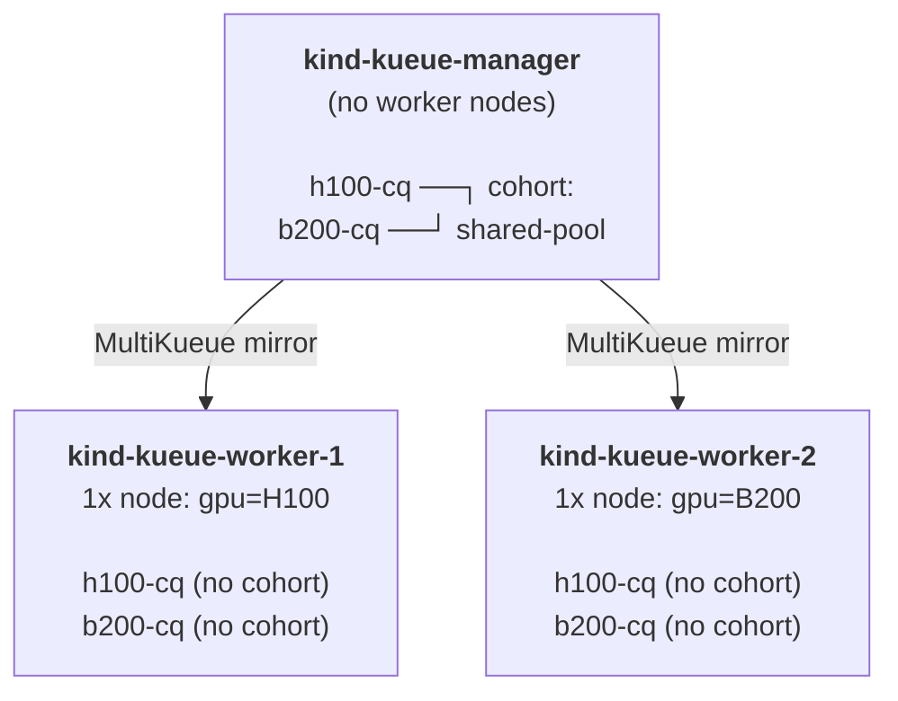
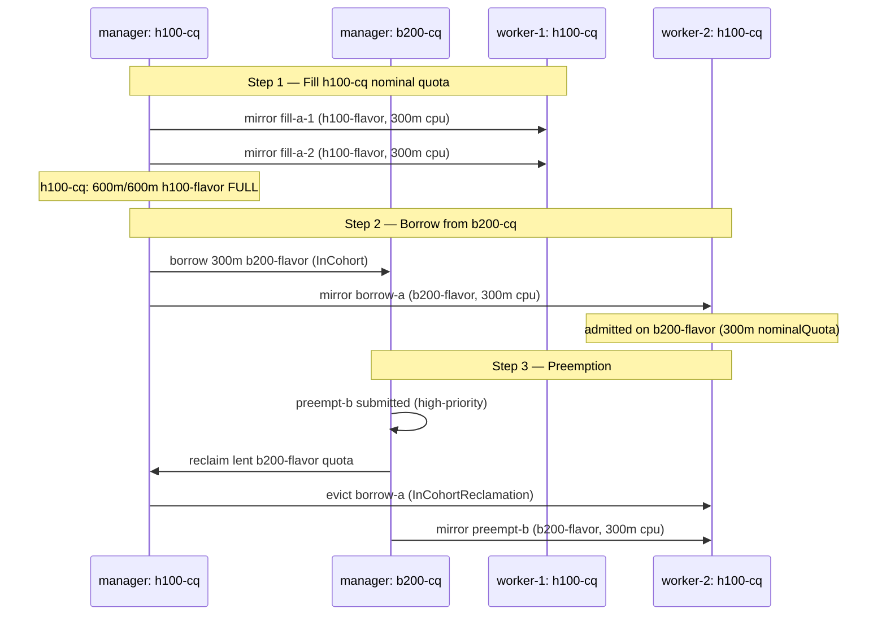

# MultiKueue + Cohort + Distinct Flavors + Preemption

Demonstrates MultiKueue with a cohort across two worker clusters with **different GPU types**. `team-a` (H100) can borrow B200 capacity from `team-b` when its H100 quota is full, and `team-b` can preempt that borrowed workload when it needs its quota back.

---

## Cluster Layout



---

## Mental Model: Manager Policy vs. Worker Capacity

| Layer | Mechanism | Purpose |
|-------|-----------|---------|
| Manager | `cohortName` + `borrowingLimit` / `lendingLimit` | Policy — who may borrow what from whom |
| Worker | `nominalQuota` (no cohort) | Capacity — what physical resources exist |

**The contract:**

```
Manager h100-cq  b200-flavor  borrowingLimit  ==  Worker-2 h100-cq  b200-flavor  nominalQuota
        "300m"                                                        "300m"
```

These are **not automatically synchronized**. Changing one requires manually updating the other.

### Why `nominalQuota` on workers, not `borrowingLimit`?

Workers have no cohort — there is no borrowing peer. `nominalQuota` correctly expresses "this flavor physically exists here with this much capacity." The manager has already enforced the borrowing cap before dispatching; the worker just needs capacity to honor it.

---

## Experiment Flow



---

## Preemption Details

When `team-b` submits a high-priority job (`07-jobset-preemption-trigger.yaml`):

1. `b200-cq` triggers `reclaimWithinCohort: LowerPriority` — needs its lent quota back
2. `h100-cq`'s borrow job (low-priority, using borrowed `b200-flavor`) is evicted: `InCohortReclamation`
3. `preempt-b` is admitted to `b200-cq` and dispatched to worker-2's `b200-cq`

Preemptor path: `/shared-pool/b200-cq` → Preemptee path: `/shared-pool/h100-cq`  
Priorities: preemptor=100, preemptee=10

---

## Experiment Steps

### Step 1 — Bootstrap clusters

```bash
bash setup.sh
```

Creates three Kind clusters (`kueue-manager`, `kueue-worker-1`, `kueue-worker-2`), installs cert-manager + Kueue + JobSet on all, and stores worker kubeconfigs as Secrets in `kueue-system` on the manager.

---

### Step 2 — Apply MultiKueue federation objects

```bash
kubectl apply -f 01-multikueue-objects.yaml --context kind-kueue-manager
```

Verify both clusters are connected and the AdmissionCheck is active:

```bash
❯ kubectl get multikueuecluster --context kind-kueue-manager
NAME             CONNECTED   AGE
kueue-worker-1   True        9s
kueue-worker-2   True        9s

❯ kubectl get admissioncheck --context kind-kueue-manager
NAME               AGE
multikueue-check   39s
```

---

### Step 3 — Apply ClusterQueues

```bash
# Manager — h100-cq and b200-cq in cohort shared-pool
kubectl apply -f 02-manager-clusterqueues.yaml --context kind-kueue-manager

# Workers — no cohort, nominalQuota only
kubectl apply -f 03-worker-1-clusterqueues.yaml --context kind-kueue-worker-1
kubectl apply -f 03-worker-2-clusterqueues.yaml --context kind-kueue-worker-2
```

Verify cohort is visible on manager, absent on workers:

```bash
❯ kubectl get clusterqueue -o wide --context kind-kueue-manager
NAME      COHORT        STRATEGY         PENDING WORKLOADS   ADMITTED WORKLOADS
b200-cq   shared-pool   BestEffortFIFO   0                   0
h100-cq   shared-pool   BestEffortFIFO   0                   0

❯ kubectl get clusterqueue -o wide --context kind-kueue-worker-1
NAME      COHORT   STRATEGY         PENDING WORKLOADS   ADMITTED WORKLOADS
b200-cq            BestEffortFIFO   0                   0
h100-cq            BestEffortFIFO   0                   0
```

Verify worker ResourceFlavors have correct nodeLabels:

```bash
❯ kubectl describe resourceflavor h100-flavor --context kind-kueue-worker-1 | grep -A 2 'Spec'
Spec:
  Node Labels:
    Gpu:  H100

❯ kubectl describe resourceflavor b200-flavor --context kind-kueue-worker-2 | grep -A 2 'Spec'
Spec:
  Node Labels:
    Gpu:  B200
```

---

### Step 4 — Apply namespaces, LocalQueues, and WorkloadPriorityClasses

```bash
# Must be applied to all three clusters — workers need the namespace and LocalQueue
# to accept mirrored workloads
kubectl apply -f 04-namespaces-localqueues.yaml --context kind-kueue-manager
kubectl apply -f 04-namespaces-localqueues.yaml --context kind-kueue-worker-1
kubectl apply -f 04-namespaces-localqueues.yaml --context kind-kueue-worker-2
```

Verify:

```bash
❯ kubectl get workloadpriorityclass --context kind-kueue-manager
NAME            VALUE
high-priority   100
low-priority    10

❯ kubectl get localqueue -A -o wide --context kind-kueue-manager
NAMESPACE   NAME         CLUSTERQUEUE   PENDING WORKLOADS   ADMITTED WORKLOADS
team-a      h100-queue   h100-cq        0                   0
team-b      b200-queue   b200-cq        0                   0
```

Create ImagePullSecrets in both namespaces on all clusters (avoids Docker Hub rate limiting):

```bash
for ctx in kind-kueue-manager kind-kueue-worker-1 kind-kueue-worker-2; do
  for ns in team-a team-b; do
    kubectl create secret generic regcred \
      --from-file=.dockerconfigjson=$HOME/.docker/config.json \
      --type=kubernetes.io/dockerconfigjson \
      -n "${ns}" --context "${ctx}"
    kubectl patch serviceaccount default -n "${ns}" \
      -p '{"imagePullSecrets": [{"name": "regcred"}]}' \
      --context "${ctx}"
  done
done
```

---

### Step 5 — Verify setup

```bash
kubectl get clusterqueues -o jsonpath=\
"{range .items[*]}{.metadata.name}: Active={range .status.conditions[?(@.type=='Active')]}{.status}{end}{'\n'}{end}" \
  --context kind-kueue-manager

kubectl get admissionchecks multikueue-check \
  -o jsonpath="{range .status.conditions[?(@.type=='Active')]}AC - Active: {@.status} Reason: {@.reason}{'\n'}{end}" \
  --context kind-kueue-manager

kubectl get multikueuecluster \
  -o jsonpath="{range .items[*]}{.metadata.name}: Active={range .status.conditions[?(@.type=='Active')]}{.status}{end}{'\n'}{end}" \
  --context kind-kueue-manager
```

Expected output:

```
b200-cq: Active=True
h100-cq: Active=True
AC - Active: True Reason: Active
kueue-worker-1: Active=True
kueue-worker-2: Active=True
```

---

### Step 6 — Fill h100-cq nominal quota

Submit two low-priority JobSets that together consume exactly `600m cpu / 384Mi memory` — team-a's full h100-cq nominal quota:

```bash
kubectl create -f 05-jobsets-fill-quota.yaml -n team-a --context kind-kueue-manager
```

Verify both workloads are admitted and dispatched to worker-1 (the H100 cluster):

```bash
❯ kubectl get workload -o wide -A --context kind-kueue-manager
NAMESPACE   NAME                                 QUEUE        RESERVED IN   ADMITTED   FINISHED   AGE
team-a      jobset-jobset-fill-a-1-nnrst-275cc   h100-queue   h100-cq       True                  38s
team-a      jobset-jobset-fill-a-2-gfnhd-19bed   h100-queue   h100-cq       True                  38s
```

```bash
❯ kubectl get pods -n team-a -o wide --context kind-kueue-worker-1
NAME                                     READY   STATUS    RESTARTS   AGE
jobset-fill-a-1-nnrst-leader-0-0-wmkzj   1/1     Running   0          7m43s
jobset-fill-a-1-nnrst-worker-0-0-4qwzm   1/1     Running   0          7m43s
jobset-fill-a-1-nnrst-worker-0-1-k75gn   1/1     Running   0          7m43s
jobset-fill-a-2-gfnhd-leader-0-0-cxv6m   1/1     Running   0          7m43s
jobset-fill-a-2-gfnhd-worker-0-0-5l8vj   1/1     Running   0          7m43s
jobset-fill-a-2-gfnhd-worker-0-1-2b5j5   1/1     Running   0          7m43s
```

`h100-cq` is now full: `600m/600m` on `h100-flavor`.

---

### Step 7 — Submit a borrowing JobSet

With h100-cq full, team-a submits another low-priority job. Kueue tries `h100-flavor` first (no quota), then falls back to `b200-flavor` (borrowing from b200-cq):

```bash
kubectl create -f 06-jobset-borrowing.yaml -n team-a --context kind-kueue-manager
```

The manager admits the job using borrowed `b200-flavor` quota and MultiKueue dispatches it to worker-2 (the only worker with non-zero `b200-flavor` nominalQuota):

```bash
❯ kubectl describe workload jobset-jobset-borrow-a-...-... -n team-a --context kind-kueue-manager
# Admission.Pod Set Assignments[*].Flavors.Cpu: b200-flavor
# Cluster Name: kueue-worker-2
```

Verify the job runs on worker-2's B200 node:

```bash
❯ kubectl get pods -n team-a -o wide --context kind-kueue-worker-2
# Pods running on the gpu=B200 node
```

> **Key observation:** The flavor decision (`b200-flavor`) is made by the manager cohort policy. Worker-2's `h100-cq` just has `nominalQuota: 300m` for `b200-flavor` — no cohort or borrowing logic needed on the worker.

---

### Step 8 — Trigger preemption

Submit a high-priority job from team-b. `b200-cq` needs its lent quota back:

```bash
kubectl create -f 07-jobset-preemption-trigger.yaml -n team-b --context kind-kueue-manager
```

Watch the borrow job get evicted and the preemption job take its place:

```bash
❯ kubectl describe workload -n team-a jobset-jobset-borrow-a-...-... --context kind-kueue-manager
# Type: Evicted, Reason: Preempted
# Type: Preempted, Reason: InCohortReclamation
# preemptor path: /shared-pool/b200-cq; preemptee path: /shared-pool/h100-cq
# preemptor effective priority: 100; preemptee effective priority: 10

❯ kubectl describe workload -n team-b jobset-jobset-preempt-b-...-... --context kind-kueue-manager
# Admission.ClusterQueue: b200-cq
# Cluster Name: kueue-worker-2
# Type: Admitted
```

The borrow job is requeued (pending until quota is freed). The preemption job runs on worker-2.

---

## Cleanup

```bash
bash teardown.sh
```

To also delete all three Kind clusters:

```bash
kind delete cluster --name kueue-manager
kind delete cluster --name kueue-worker-1
kind delete cluster --name kueue-worker-2
```
