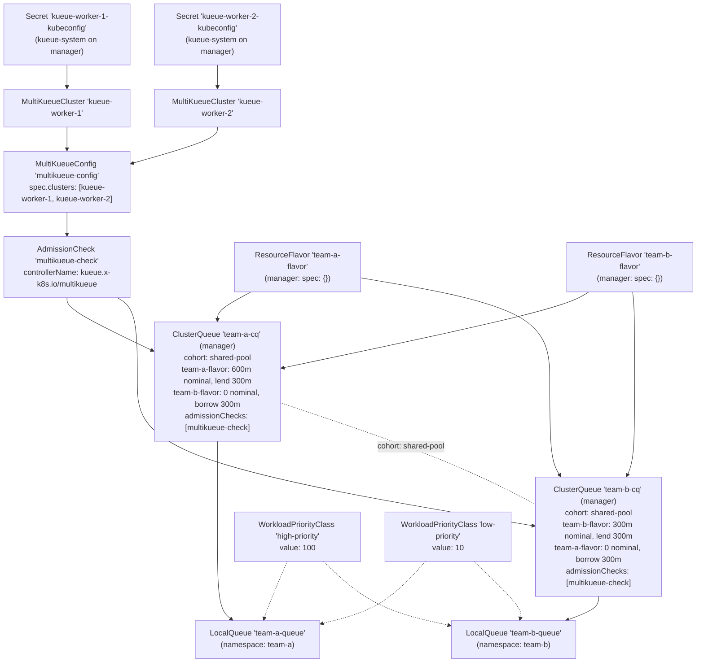
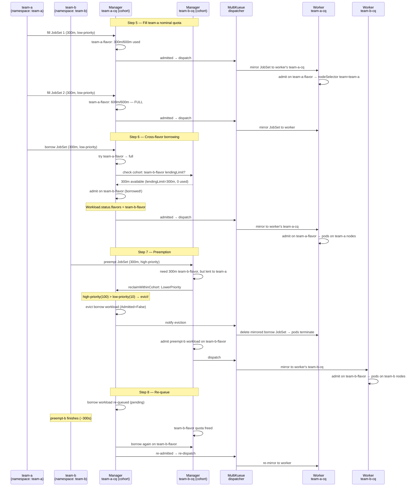

# MultiKueue + JobSet + Cohort Borrowing with Distinct Flavors + Preemption

A hands-on experiment combining four advanced Kueue concepts into a single setup:

1. **MultiKueue (multi-cluster federation)** — a manager cluster dispatches `JobSet` workloads to one of two registered worker clusters.
2. **Cohort with two ClusterQueues** — `team-a-cq` and `team-b-cq` join a shared cohort on the manager so each can borrow the other's idle quota.
3. **Distinct ResourceFlavors** — each team owns a separate flavor. On the manager, flavors act as quota accounting buckets. On the workers, flavors carry `nodeLabels` that physically pin pods to the correct node pool.
4. **WorkloadPriorityClass-driven preemption** — when team-b submits a high-priority `JobSet`, Kueue evicts team-a's low-priority borrowing workload to reclaim the lent quota, cascading the eviction to the worker cluster via MultiKueue.

This is the synthesis of [experiment 04](../04-borrowing-with-distinct-flavors/README.md) (cohort + distinct flavors + preemption) and [experiment 06](../06-multikueue-jobset-priority/README.md) (MultiKueue + JobSet + WorkloadPriorityClass).

---

## Table of Contents

- [MultiKueue + JobSet + Cohort Borrowing with Distinct Flavors + Preemption](#multikueue--jobset--cohort-borrowing-with-distinct-flavors--preemption)
  - [Table of Contents](#table-of-contents)
  - [Overview](#overview)
  - [Prerequisites](#prerequisites)
    - [One-time inotify fix (Ubuntu)](#one-time-inotify-fix-ubuntu)
    - [Start all three clusters](#start-all-three-clusters)
  - [Cluster Architecture](#cluster-architecture)
  - [Object Hierarchy](#object-hierarchy)
  - [Concepts](#concepts)
    - [Cohort + MultiKueue](#cohort--multikueue)
    - [Two-plane Flavor Design: Manager vs Worker](#two-plane-flavor-design-manager-vs-worker)
    - [Cross-Flavor Cohort Borrowing at the Manager Level](#cross-flavor-cohort-borrowing-at-the-manager-level)
    - [WorkloadPriorityClass-Driven Cohort Preemption](#workloadpriorityclass-driven-cohort-preemption)
    - [Preemption Cascades to the Worker via MultiKueue](#preemption-cascades-to-the-worker-via-multikueue)
  - [Quota Reference Card](#quota-reference-card)
  - [Experiment Steps](#experiment-steps)
    - [Step 1 — Apply MultiKueue federation objects](#step-1--apply-multikueue-federation-objects)
    - [Step 2 — Apply ClusterQueues](#step-2--apply-clusterqueues)
    - [Step 3 — Apply Namespaces, LocalQueues, and WorkloadPriorityClasses](#step-3--apply-namespaces-localqueues-and-workloadpriorityclasses)
    - [Step 4 — Verify setup](#step-4--verify-setup)
    - [Step 5 — Fill team-a's nominal quota](#step-5--fill-team-as-nominal-quota)
    - [Step 6 — Observe cross-flavor cohort borrowing](#step-6--observe-cross-flavor-cohort-borrowing)
    - [Step 7 — Trigger preemption across the cohort](#step-7--trigger-preemption-across-the-cohort)
    - [Step 8 — Watch the borrower re-queue and re-admit](#step-8--watch-the-borrower-re-queue-and-re-admit)
  - [How It All Fits Together](#how-it-all-fits-together)
  - [Key Observations Summary](#key-observations-summary)
  - [Cleanup](#cleanup)
  - [References](#references)

---

## Overview

| Behaviour | What you will see |
|---|---|
| **Cohort + MultiKueue** | Two ClusterQueues in a cohort on the manager, both with MultiKueue AdmissionChecks — borrowing and lending happen at the manager level before dispatch |
| **Two-plane flavor design** | Manager flavors have no `nodeLabels` (quota buckets only); worker flavors have `nodeLabels` (physical node targeting) |
| **Cross-flavor cohort borrowing** | team-a's 3rd JobSet is admitted on `team-b-flavor` (borrowed) — visible in `Workload.status.admission` on the manager |
| **WorkloadPriorityClass preemption** | team-b's `high-priority` (value=100) JobSet evicts team-a's `low-priority` (value=10) borrowing workload via `reclaimWithinCohort: LowerPriority` |
| **Multi-cluster eviction cascade** | Manager eviction → MultiKueue deletes the mirrored JobSet from the worker → pods stop |
| **Automatic re-queuing** | After preemption, team-a's evicted workload is automatically re-queued and re-admitted once quota is freed |
| **Distinct node targeting on workers** | team-a pods land on `team=team-a` nodes; team-b pods land on `team=team-b` nodes — enforced by flavor `nodeLabels` |

---

## Prerequisites

### One-time inotify fix (Ubuntu)

This experiment runs **13 Kind node containers** (3 control-planes + 10 workers across 3 clusters). Apply this **once** on the Ubuntu host:

```bash
sudo tee /etc/sysctl.d/99-kind-inotify.conf <<'EOF'
fs.inotify.max_user_instances = 512
fs.inotify.max_user_watches   = 524288
EOF
sudo sysctl --system
```

### Start all three clusters

```bash
cd kueue/07-multikueue-cohort-distinct-flavors
bash setup.sh
```

`setup.sh` does the following automatically:

1. Creates the `kueue-manager` Kind cluster (1 control-plane + 2 workers).
2. Creates the `kueue-worker-1` Kind cluster (1 control-plane + 2 `team=team-a` nodes + 2 `team=team-b` nodes).
3. Creates the `kueue-worker-2` Kind cluster (same structure as worker-1).
4. Installs cert-manager + Kueue (with `MultiKueue` feature gate) + JobSet and Kubeflow CRDs on all three clusters.
5. Extracts each worker's kubeconfig, rewrites the API server address to the worker control-plane container's Docker IP, and stores it as a Secret in `kueue-system` on the manager.

Verify all clusters and Kueue are healthy:

```bash
# Manager
kubectl get nodes --context kind-kueue-manager
kubectl get pods -n kueue-system --context kind-kueue-manager

# Worker 1 — should show 4 worker nodes with team labels
 kubectl get nodes -L team -L node.kubernetes.io/instance-type --context kind-kueue-worker-1
NAME                           STATUS   ROLES           AGE     VERSION   TEAM     INSTANCE-TYPE
kueue-worker-1-control-plane   Ready    control-plane   9m10s   v1.35.0
kueue-worker-1-worker          Ready    <none>          8m59s   v1.35.0   team-a   standard-1
kueue-worker-1-worker2         Ready    <none>          8m59s   v1.35.0   team-a   standard-2
kueue-worker-1-worker3         Ready    <none>          8m59s   v1.35.0   team-b   standard-3
kueue-worker-1-worker4         Ready    <none>          8m59s   v1.35.0   team-b   standard-4

# Worker 2 — same structure as worker 1
 kubectl get nodes -L team -L node.kubernetes.io/instance-type --context kind-kueue-worker-2
NAME                           STATUS   ROLES           AGE     VERSION   TEAM     INSTANCE-TYPE
kueue-worker-2-control-plane   Ready    control-plane   8m41s   v1.35.0
kueue-worker-2-worker          Ready    <none>          8m30s   v1.35.0   team-a   standard-1
kueue-worker-2-worker2         Ready    <none>          8m30s   v1.35.0   team-a   standard-2
kueue-worker-2-worker3         Ready    <none>          8m30s   v1.35.0   team-b   standard-3
kueue-worker-2-worker4         Ready    <none>          8m30s   v1.35.0   team-b   standard-4

# Worker kubeconfig Secrets (created by setup.sh)
kubectl get secret kueue-worker-1-kubeconfig kueue-worker-2-kubeconfig \
  -n kueue-system --context kind-kueue-manager
```

---

## Cluster Architecture

```
┌──────────────────────────────────────────────────────────────────────────┐
│  Manager Cluster  (kind-kueue-manager)                                   │
│                                                                          │
│  ┌──────────────┐   ┌────────────────────────────────────────────────┐  │
│  │ control-plane│   │  Kueue (MultiKueue feature gate ON)            │  │
│  └──────────────┘   │                                                │  │
│  ┌──────────────┐   │  Cohort: shared-pool                           │  │
│  │   worker-1   │   │  ┌──────────────────┐  ┌──────────────────┐   │  │
│  └──────────────┘   │  │ team-a-cq        │  │ team-b-cq        │   │  │
│  ┌──────────────┐   │  │ team-a-flavor    │  │ team-b-flavor    │   │  │
│  │   worker-2   │   │  │  nominal: 600m   │  │  nominal: 300m   │   │  │
│  └──────────────┘   │  │  lend:    300m   │  │  lend:    300m   │   │  │
│                     │  │ team-b-flavor    │  │ team-a-flavor    │   │  │
│  Jobs submitted     │  │  borrow:  300m   │  │  borrow:  300m   │   │  │
│  here. Pods do      │  │ AdmissionCheck ✓ │  │ AdmissionCheck ✓ │   │  │
│  NOT run here.      │  └──────────────────┘  └──────────────────┘   │  │
│                     └────────────────────────────────────────────────┘  │
└──────────────────────────────────────────────────────────────────────────┘
              │                                    │
    kubeconfig Secret                   kubeconfig Secret
    (Docker network)                    (Docker network)
              │                                    │
              ▼                                    ▼
┌──────────────────────────────┐   ┌──────────────────────────────┐
│  Worker Cluster 1            │   │  Worker Cluster 2            │
│  (kind-kueue-worker-1)       │   │  (kind-kueue-worker-2)       │
│                              │   │                              │
│  Kueue (standard, no MK)     │   │  Kueue (standard, no MK)     │
│  team-a-cq (team-a-flavor)   │   │  team-a-cq (team-a-flavor)   │
│  team-b-cq (team-b-flavor)   │   │  team-b-cq (team-b-flavor)   │
│                              │   │                              │
│  ┌──────────┐ ┌──────────┐   │   │  ┌──────────┐ ┌──────────┐  │
│  │team-a    │ │team-b    │   │   │  │team-a    │ │team-b    │  │
│  │nodes ×2  │ │nodes ×2  │   │   │  │nodes ×2  │ │nodes ×2  │  │
│  │(team=    │ │(team=    │   │   │  │(team=    │ │(team=    │  │
│  │ team-a)  │ │ team-b)  │   │   │  │ team-a)  │ │ team-b)  │  │
│  └──────────┘ └──────────┘   │   │  └──────────┘ └──────────┘  │
│                              │   │                              │
│  JobSets run here.           │   │  JobSets run here.           │
└──────────────────────────────┘   └──────────────────────────────┘
```

---

## Object Hierarchy



---

## Concepts

### Cohort + MultiKueue

> **Files:** [`02-manager-clusterqueues.yaml`](./02-manager-clusterqueues.yaml), [`01-multikueue-objects.yaml`](./01-multikueue-objects.yaml)

This is the core new concept introduced by this experiment: **two ClusterQueues sharing a cohort, both of which also have MultiKueue `admissionChecks`**.

In earlier experiments:
- Experiment 04 used a cohort with two CQs — but on a single cluster with no MultiKueue.
- Experiments 05 and 06 used MultiKueue — but with a single CQ, no cohort.

Here, the **cohort lives entirely on the manager**. The manager is where Kueue performs quota accounting, borrowing decisions, and preemption. Once a workload is admitted (including any borrowed quota), the AdmissionCheck hands it off to MultiKueue for dispatch.

```
Manager side (quota plane):
  team-a-cq  ←──── cohort: shared-pool ────→  team-b-cq
     ↕ borrowing / lending on team-b-flavor         ↕
  AdmissionCheck (multikueue-check)           AdmissionCheck (multikueue-check)
     ↓ dispatch                                    ↓ dispatch
Worker clusters (execution plane):
  worker's team-a-cq (local admit)           worker's team-b-cq (local admit)
     ↓ nodeSelector injection                      ↓ nodeSelector injection
  team=team-a pods                            team=team-b pods
```

The key insight: **borrowing and preemption are manager-side events**. The workers just receive workloads and run them. The workers don't need cohorts.

---

### Two-Plane Flavor Design: Manager vs Worker

> **Files:** [`02-manager-clusterqueues.yaml`](./02-manager-clusterqueues.yaml), [`03-worker-clusterqueues.yaml`](./03-worker-clusterqueues.yaml)

ResourceFlavors serve different purposes on the manager vs the workers:

| Cluster | Flavor `spec` | Purpose |
|---|---|---|
| Manager | `spec: {}` (no nodeLabels) | Quota accounting bucket only — the manager doesn't run job pods |
| Worker | `spec.nodeLabels: {team: team-a}` | Physical node targeting — Kueue injects this as a `nodeSelector` into admitted pods |

This two-plane design means:
- The **manager** uses flavors to track how much quota each team is using across `team-a-flavor` vs `team-b-flavor` pools.
- The **workers** use the same flavor names but add `nodeLabels` — so when team-a-cq admits a workload on `team-a-flavor`, the pod gets `nodeSelector: {team: team-a}` injected and lands on a `team=team-a` node.

The flavor names must match between manager and worker (`team-a-flavor`, `team-b-flavor`) because MultiKueue mirrors the Workload to the worker's CQ of the same name, and the worker's Kueue looks up the flavor by name.

---

### Cross-Flavor Cohort Borrowing at the Manager Level

> **Fields:** `borrowingLimit` in the borrower's secondary flavor entry, `lendingLimit` in the lender's primary flavor entry

Both ClusterQueues on the manager list **both** flavors:

```yaml
# team-a-cq
flavors:
  - name: team-a-flavor   # PRIMARY: team-a's own pool (600m nominal)
    resources:
      - name: cpu
        nominalQuota: "600m"
        lendingLimit: "300m"   # team-b may borrow up to 1 JobSet worth
  - name: team-b-flavor   # SECONDARY: borrow-only (0 nominal)
    resources:
      - name: cpu
        nominalQuota: "0"
        borrowingLimit: "300m" # team-a can borrow 1 extra JobSet

# team-b-cq
flavors:
  - name: team-b-flavor   # PRIMARY: team-b's own pool (300m nominal = 1 JobSet)
    resources:
      - name: cpu
        nominalQuota: "300m"
        lendingLimit: "300m"   # team-b lends its ENTIRE quota to team-a
  - name: team-a-flavor   # SECONDARY: borrow-only
    resources:
      - name: cpu
        nominalQuota: "0"
        borrowingLimit: "300m"
```

**Why team-b's nominal quota must be exactly 300m (not more):**

Preemption only fires when the incoming workload **cannot be admitted** without reclaiming lent quota. With `nominalQuota: 300m` and `lendingLimit: 300m`, team-b lends its entire quota to team-a. When team-b's high-priority job arrives needing 300m and all 300m is lent out, there is no headroom → `reclaimWithinCohort` fires.

If `nominalQuota` were `900m` with `lendingLimit: 300m`, team-b would still have `600m` free after lending. The high-priority job (300m) fits in that 600m — no preemption is triggered at all.

**Borrowing sequence for a team-a workload when team-a-flavor is full:**

1. Kueue tries `team-a-flavor` first (it's listed first in team-a-cq's flavors).
2. `team-a-cq` has `600m/600m` used on `team-a-flavor` — no headroom.
3. Kueue tries `team-b-flavor` next.
4. The cohort (`shared-pool`) has lendable headroom: `team-b-cq` has idle `team-b-flavor` capacity within its `lendingLimit`.
5. Workload admitted on `team-b-flavor` → `Workload.spec.podSetAssignments[].flavors: {cpu: team-b-flavor}`.
6. MultiKueue dispatches the workload to a worker's `team-a-cq`.

The cross-flavor borrowing is **visible in the manager's Workload status** — the `flavors` field shows which flavor was assigned:

```bash
kubectl describe workload <borrow-a-name> -n team-a --context kind-kueue-manager
```

```yaml
Status:
  Admission:
    Cluster Queue: team-a-cq
    Pod Set Assignments:
    - Flavors:
        cpu: team-b-flavor      ← borrowed! not team-a-flavor
        memory: team-b-flavor
```

---

### WorkloadPriorityClass-Driven Cohort Preemption

> **File:** [`04-namespaces-localqueues.yaml`](./04-namespaces-localqueues.yaml), `preemption` field in [`02-manager-clusterqueues.yaml`](./02-manager-clusterqueues.yaml)

`WorkloadPriorityClass` (introduced in experiment 06 for admission ordering) also drives **cohort preemption**. Kueue's `reclaimWithinCohort: LowerPriority` compares `Workload.spec.priority` values when deciding which workload to evict.

When a `JobSet` carries `kueue.x-k8s.io/priority-class: high-priority`, Kueue sets:
- `Workload.spec.priorityClassName: high-priority`
- `Workload.spec.priority: 100` (from `WorkloadPriorityClass.value`)

The preemption trigger condition:
```
incoming priority (100) > borrower's priority (10)
AND
reclaimWithinCohort: LowerPriority is set on the lender's CQ
```
→ Kueue evicts the borrower to reclaim the lent quota for the higher-priority workload.

**Important: WorkloadPriorityClass does NOT affect pod scheduling priority.** The pods from both high- and low-priority JobSets have `spec.priority: 0` (no Kubernetes `PriorityClass` set). Only Kueue admission and cohort eviction are affected.

---

### Preemption Cascades to the Worker via MultiKueue

When Kueue on the manager evicts a workload that was dispatched via MultiKueue:

1. Manager: Kueue sets `Workload.spec.active = false` on the borrowing workload.
2. Manager: The workload's `AdmissionCheck` status transitions to indicate eviction.
3. MultiKueue garbage collector: detects the eviction and **deletes the mirrored JobSet** from the worker cluster.
4. Worker: Kueue on the worker sees the JobSet deleted → cleans up child jobs and pods.
5. Manager: The evicted workload is re-queued (status transitions back to `Admitted: False`).
6. Manager: The high-priority team-b workload is admitted and dispatched to a worker.

This cascade means the eviction you observe on the manager has a **real consequence on the worker cluster** — running pods are terminated.

---

## Quota Reference Card

```
Manager — Cohort: shared-pool
═════════════════════════════════════════════════════════════════════════════
                   team-a-cq                 team-b-cq
─────────────────────────────────────────────────────────────────────────────
Primary flavor     team-a-flavor             team-b-flavor
Nominal quota      600m CPU / 384Mi          300m CPU / 192Mi
Lending limit      300m CPU / 192Mi          300m CPU / 192Mi
─────────────────────────────────────────────────────────────────────────────
Secondary flavor   team-b-flavor             team-a-flavor
Nominal quota      0 (borrow only)           0 (borrow only)
Borrowing limit    300m CPU / 192Mi          300m CPU / 192Mi
─────────────────────────────────────────────────────────────────────────────
Max team-a can use 600m (own) + 300m (borrow) = 900m CPU
Max team-b can use 300m (own) + 300m (borrow) = 600m CPU
─────────────────────────────────────────────────────────────────────────────

WHY team-b has nominalQuota=300m (not more):
  team-b lends ALL 300m of its nominal quota to team-a (lendingLimit=300m).
  When team-b then submits its high-priority job (300m), team-b has 0m left.
  Kueue must reclaim the lent quota → reclaimWithinCohort fires → preempts
  team-a's low-priority borrowing workload.

  If team-b had nominalQuota=900m, it would have 600m unused even after lending
  300m. The high-priority job (300m) would fit in the 600m headroom — no
  preemption needed, no eviction triggered. That is the bug this fixes.

Per-JobSet resource cost: 300m CPU / 192Mi
  leader:  1 pod × 100m CPU / 64Mi
  worker:  2 pods × 100m CPU / 64Mi each

Fill state after Step 5 (2 fill JobSets):
  team-a-cq: 600m/600m on team-a-flavor  ← FULL
  team-b-cq: 0m/300m on team-b-flavor    ← 300m idle (all lendable)

After Step 6 (borrowing):
  team-a-cq: 600m/600m on team-a-flavor + 300m borrowed on team-b-flavor
  team-b-cq: 0m/300m on team-b-flavor + 300m lent to team-a  ← 0m headroom!

Workers — per cluster (mirrors manager quotas exactly)
═════════════════════════════════════════════════════════════════════════════
  team-a-cq / team-a-flavor:  900m CPU / 576Mi  (fill×2 + borrow job)
  team-b-cq / team-b-flavor:  300m CPU / 192Mi  (preemption trigger job)
```

---

## Experiment Steps

### Step 1 — Apply MultiKueue federation objects

```bash
kubectl apply -f 01-multikueue-objects.yaml --context kind-kueue-manager
```

Verify both `MultiKueueCluster` objects are active:

```bash
 kubectl get multikueuecluster --context kind-kueue-manager

NAME             CONNECTED   AGE
kueue-worker-1   True        32s
kueue-worker-2   True        32s
```

Verify the `AdmissionCheck`:

```bash
 kubectl get admissioncheck --context kind-kueue-manager

NAME               AGE
multikueue-check   77s
```

> **If a MultiKueueCluster shows `Active: False`:** The manager cannot reach the worker API server. Check that `setup.sh` completed without errors and inspect `kubectl describe multikueuecluster kueue-worker-1 --context kind-kueue-manager` for details.

---

### Step 2 — Apply ClusterQueues

```bash
# Manager: cohort CQs with borrowing/lending limits + AdmissionCheck
kubectl apply -f 02-manager-clusterqueues.yaml --context kind-kueue-manager

# Workers: distinct flavor CQs with nodeLabels, no AdmissionCheck
kubectl apply -f 03-worker-clusterqueues.yaml --context kind-kueue-worker-1
kubectl apply -f 03-worker-clusterqueues.yaml --context kind-kueue-worker-2
```

Verify on the manager — both CQs should be in the `shared-pool` cohort:

```bash
 kubectl get clusterqueue -o wide --context kind-kueue-manager

NAME        COHORT        STRATEGY         PENDING WORKLOADS   ADMITTED WORKLOADS
team-a-cq   shared-pool   BestEffortFIFO   0                   0
team-b-cq   shared-pool   BestEffortFIFO   0                   0
```

Verify on the workers — CQs have no cohort (standalone):

```bash
 kubectl get clusterqueue -o wide --context kind-kueue-worker-1

NAME        COHORT   STRATEGY         PENDING WORKLOADS   ADMITTED WORKLOADS
team-a-cq            BestEffortFIFO   0                   0
team-b-cq            BestEffortFIFO   0                   0

 kubectl get clusterqueue -o wide --context kind-kueue-worker-2

NAME        COHORT   STRATEGY         PENDING WORKLOADS   ADMITTED WORKLOADS
team-a-cq            BestEffortFIFO   0                   0
team-b-cq            BestEffortFIFO   0                   0
```

Inspect the ResourceFlavors on a worker to confirm `nodeLabels`:

```bash
 kubectl describe resourceflavor team-a-flavor --context kind-kueue-worker-1 | grep -A 2 'Spec'

Spec:
  Node Labels:
    Team:  team-a

 kubectl describe resourceflavor team-b-flavor --context kind-kueue-worker-1 | grep -A 2 'Spec'

Spec:
  Node Labels:
    Team:  team-b

 kubectl describe resourceflavor team-a-flavor --context kind-kueue-worker-2 | grep -A 2 'Spec'

Spec:
  Node Labels:
    Team:  team-a

 kubectl describe resourceflavor team-b-flavor --context kind-kueue-worker-2 | grep -A 2 'Spec'

Spec:
  Node Labels:
    Team:  team-b
```

> **Compare with the manager:** `kubectl describe resourceflavor team-a-flavor --context kind-kueue-manager` shows `Spec: {}` — no node labels, since the manager doesn't run job pods.

---

### Step 3 — Apply Namespaces, LocalQueues, and WorkloadPriorityClasses

```bash
# Apply to ALL three clusters
kubectl apply -f 04-namespaces-localqueues.yaml --context kind-kueue-manager
kubectl apply -f 04-namespaces-localqueues.yaml --context kind-kueue-worker-1
kubectl apply -f 04-namespaces-localqueues.yaml --context kind-kueue-worker-2
```

Verify WorkloadPriorityClasses on the manager:

```bash
 kubectl get workloadpriorityclass --context kind-kueue-manager

NAME            VALUE
high-priority   100
low-priority    10
```

Verify LocalQueues on the manager:

```bash
 kubectl get localqueue -A --context kind-kueue-manager

NAMESPACE   NAME           CLUSTERQUEUE   PENDING WORKLOADS   ADMITTED WORKLOADS
team-a      team-a-queue   team-a-cq      0                   0
team-b      team-b-queue   team-b-cq      0                   0
```

Verify LocalQueues on a worker:

```bash
 kubectl get localqueue -A --context kind-kueue-worker-1

NAMESPACE   NAME           CLUSTERQUEUE   PENDING WORKLOADS   ADMITTED WORKLOADS
team-a      team-a-queue   team-a-cq      0                   0
team-b      team-b-queue   team-b-cq      0                   0
```

Optionally create ImagePullSecrets to avoid Docker Hub rate limiting:

```bash
for ctx in kind-kueue-manager kind-kueue-worker-1 kind-kueue-worker-2; do
  for ns in team-a team-b; do
    kubectl create secret generic regcred \
      --from-file=.dockerconfigjson=$HOME/.docker/config.json \
      --type=kubernetes.io/dockerconfigjson \
      -n "${ns}" --context "${ctx}"
    kubectl patch serviceaccount default -n "${ns}" \
      -p '{"imagePullSecrets": [{"name": "regcred"}]}' \
      --context "${ctx}"
  done
done
```

---

### Step 4 — Verify setup

Confirm every component is healthy before submitting workloads:

```bash
# Manager ClusterQueues active
 kubectl get clusterqueues -o jsonpath=\
"{range .items[*]}{.metadata.name}: Active={range .status.conditions[?(@.type=='Active')]}{.status}{end}{'\n'}{end}" \
  --context kind-kueue-manager

team-a-cq: Active=True
team-b-cq: Active=True

# AdmissionCheck active
 kubectl get admissionchecks multikueue-check \
  -o jsonpath="{range .status.conditions[?(@.type=='Active')]}AC - Active: {@.status} Reason: {@.reason}{'\n'}{end}" \
  --context kind-kueue-manager

AC - Active: True Reason: Active

# Both MultiKueueClusters connected
 kubectl get multikueuecluster \
  -o jsonpath="{range .items[*]}{.metadata.name}: Active={range .status.conditions[?(@.type=='Active')]}{.status}{end}{'\n'}{end}" \
  --context kind-kueue-manager

kueue-worker-1: Active=True
kueue-worker-2: Active=True
```

All outputs should show `Active: True`. If any show `Active: False`, check the relevant object's `.status.conditions` for error details.

---

### Step 5 — Fill team-a's nominal quota

Submit two low-priority fill JobSets. Together they consume exactly 600m CPU — team-a-cq's full `nominalQuota` on `team-a-flavor`:

```bash
kubectl create -f 05-jobsets-fill-quota.yaml -n team-a --context kind-kueue-manager
```

Watch the workloads:

```bash
watch -n 1 kubectl get workload -o wide -n team-a --context kind-kueue-manager

NAME                                 QUEUE          RESERVED IN   ADMITTED   FINISHED   AGE
jobset-jobset-fill-a-1-59wkn-f8344   team-a-queue   team-a-cq     True                  13s
jobset-jobset-fill-a-2-rstjv-079d7   team-a-queue   team-a-cq     True                  13s
```

Verify the workloads were dispatched and are running on a worker:

```bash
 kubectl get jobsets -n team-a --context kind-kueue-worker-1

NAME                    TERMINALSTATE   RESTARTS   COMPLETED   SUSPENDED   AGE
jobset-fill-a-1-59wkn                   0                      false       37s
jobset-fill-a-2-rstjv                   0                      false       37s

 kubectl get pods -n team-a -o wide --context kind-kueue-worker-1

NAME                                     READY   STATUS    RESTARTS   AGE   IP           NODE                     NOMINATED NODE   READINESS GATES
jobset-fill-a-1-59wkn-leader-0-0-d826h   1/1     Running   0          55s   10.244.3.5   kueue-worker-1-worker2   <none>           <none>
jobset-fill-a-1-59wkn-worker-0-0-957dv   1/1     Running   0          55s   10.244.4.5   kueue-worker-1-worker    <none>           <none>
jobset-fill-a-1-59wkn-worker-0-1-ptwbb   1/1     Running   0          55s   10.244.3.6   kueue-worker-1-worker2   <none>           <none>
jobset-fill-a-2-rstjv-leader-0-0-h5268   1/1     Running   0          55s   10.244.3.3   kueue-worker-1-worker2   <none>           <none>
jobset-fill-a-2-rstjv-worker-0-0-gvfs7   1/1     Running   0          55s   10.244.4.4   kueue-worker-1-worker    <none>           <none>
jobset-fill-a-2-rstjv-worker-0-1-lsjgf   1/1     Running   0          55s   10.244.3.4   kueue-worker-1-worker2   <none>           <none>
```

Check the flavor assignment on the manager — both fill workloads should use `team-a-flavor`:

```bash
kubectl describe workload -n team-a <jobset-fill-a-1-name> --context kind-kueue-manager
```

```yaml
Status:
  Admission:
    Cluster Queue: team-a-cq
    Pod Set Assignments:
    - Flavors:
        cpu: team-a-flavor      ← correct: team-a's own flavor
        memory: team-a-flavor
```

Verify pods land on `team=team-a` nodes (worker-side `nodeLabels` in action):

```bash
# NODE column should show kueue-worker-1-worker or worker2 (team=team-a nodes)
 kubectl get pods -n team-a -o wide --context kind-kueue-worker-1

NAME                                     READY   STATUS    RESTARTS   AGE     IP           NODE                     NOMINATED NODE   READINESS GATES
jobset-fill-a-1-59wkn-leader-0-0-d826h   1/1     Running   0          2m42s   10.244.3.5   kueue-worker-1-worker2   <none>           <none>
jobset-fill-a-1-59wkn-worker-0-0-957dv   1/1     Running   0          2m42s   10.244.4.5   kueue-worker-1-worker    <none>           <none>
jobset-fill-a-1-59wkn-worker-0-1-ptwbb   1/1     Running   0          2m42s   10.244.3.6   kueue-worker-1-worker2   <none>           <none>
jobset-fill-a-2-rstjv-leader-0-0-h5268   1/1     Running   0          2m42s   10.244.3.3   kueue-worker-1-worker2   <none>           <none>
jobset-fill-a-2-rstjv-worker-0-0-gvfs7   1/1     Running   0          2m42s   10.244.4.4   kueue-worker-1-worker    <none>           <none>
jobset-fill-a-2-rstjv-worker-0-1-lsjgf   1/1     Running   0          2m42s   10.244.3.4   kueue-worker-1-worker2   <none>           <none>
```

Check ClusterQueue status to confirm team-a-flavor is full:

```bash
kubectl describe clusterqueue team-a-cq --context kind-kueue-manager
```

Look for:
```
Flavors Usage:
  Name: team-a-flavor
    cpu: 600m    ← full (600m/600m nominal)
```

**State:** `team-a-cq`: 600m/600m on `team-a-flavor` — fully utilised. `team-b-cq`: 0m/300m on `team-b-flavor` — all 300m idle and lendable.

---

### Step 6 — Observe cross-flavor cohort borrowing

Submit a third team-a JobSet. Since `team-a-flavor` is fully utilised, Kueue will fall through to `team-b-flavor` and borrow from the cohort:

```bash
kubectl create -f 06-jobset-borrowing.yaml -n team-a --context kind-kueue-manager
```

Watch the workload appear and get admitted:

```bash
watch -n 1 kubectl get workload -o wide -n team-a --context kind-kueue-manager

NAME                                 QUEUE          RESERVED IN   ADMITTED   FINISHED   AGE
jobset-jobset-borrow-a-nflv6-cb32d   team-a-queue   team-a-cq     True                  9s
jobset-jobset-fill-a-1-59wkn-f8344   team-a-queue   team-a-cq     True                  4m6s
jobset-jobset-fill-a-2-rstjv-079d7   team-a-queue   team-a-cq     True                  4m6s
```


**Now inspect which flavor was selected for the borrowing workload:**

```bash
kubectl describe workload -n team-a <jobset-borrow-a-name> --context kind-kueue-manager
```

```yaml
Status:
  Admission:
    Cluster Queue: team-a-cq
    Pod Set Assignments:
    - Flavors:
        cpu: team-a-flavor      ← KEY: borrowed! team-a-flavor was full
        memory: team-b-flavor
```

Check the borrowing reflected in ClusterQueue status:

```bash
kubectl describe clusterqueue team-a-cq --context kind-kueue-manager
```

```
Flavors Reservation:
  Name: team-a-flavor
    cpu: 600m (borrowed: 0)     ← full nominal, nothing borrowed here
  Name: team-b-flavor
    cpu: 300m (borrowed: 300m)  ← borrowing 300m from the cohort!
```

```bash
kubectl describe clusterqueue team-b-cq --context kind-kueue-manager
```

```
Flavors Reservation:
  Name: team-b-flavor
    cpu: 0m (borrowed: 0)       ← team-b itself has 0 usage, but 300m is lent out
                                   → team-b has 0m remaining headroom!
```

Verify the borrowing workload was dispatched to a worker and pods run on team-a nodes:

```bash
kubectl get jobsets -n team-a --context kind-kueue-worker-1
kubectl get pods -n team-a -o wide --context kind-kueue-worker-1
```

> **Why team-a nodes on the worker?** The worker's `team-a-cq` has only `team-a-flavor` (900m quota — enough for 2 fill jobs + 1 borrow job). When the borrowed workload arrives at the worker's `team-a-cq`, the worker admits it on `team-a-flavor` → Kueue injects `nodeSelector: {team: team-a}` → pods land on team-a nodes. The cross-flavor borrowing is a **manager-side quota event** — the worker runs the workload in its own team-a pool. Inspect `Workload.status` on the worker to see its independent flavor assignment:
>
> ```bash
> kubectl describe workload -n team-a <borrow-name> --context kind-kueue-worker-1
> # Flavors: {cpu: team-a-flavor}  ← worker chose team-a-flavor (it has quota)
> ```

---

### Step 7 — Trigger preemption across the cohort

Submit a **high-priority team-b JobSet**. team-b-cq has lent 300m of `team-b-flavor` to team-a. Since `reclaimWithinCohort: LowerPriority` is set and the incoming workload has higher priority (100 > 10), Kueue evicts team-a's low-priority borrowing workload:

```bash
kubectl create -f 07-jobset-preemption-trigger.yaml -n team-b --context kind-kueue-manager
```

Watch all workloads across both namespaces:

```bash
watch -n 1 kubectl get workload -A --context kind-kueue-manager
```

You will observe:

```
NAMESPACE   NAME                                  QUEUE          RESERVED IN   ADMITTED   FINISHED   AGE
team-a      jobset-jobset-borrow-a-nflv6-cb32d    team-a-queue   team-a-cq     True                  4m40s
team-a      jobset-jobset-fill-a-1-59wkn-f8344    team-a-queue   team-a-cq     True       True       8m37s
team-a      jobset-jobset-fill-a-1-x859q-5acec    team-a-queue   team-a-cq     True                  92s
team-a      jobset-jobset-fill-a-2-rstjv-079d7    team-a-queue   team-a-cq     True       True       8m37s
team-a      jobset-jobset-fill-a-2-xkwh7-d71b2    team-a-queue   team-a-cq     True                  92s
team-b      jobset-jobset-preempt-b-2zbfx-4f3b5   team-b-queue   team-b-cq     True                  75s
```

Inspect the eviction event on the preempted workload:

```bash
kubectl describe workload -n team-a <borrow-a-name> --context kind-kueue-manager
```

Look for the eviction in `Status.Conditions` and `Events`:

```
Events:
  Type    Reason     Message
  ──────  ──────     ───────
  Normal  Preempted  Preempted to accommodate a higher priority workload
```

**Observe the cascade on the worker** — the mirrored borrowing JobSet should disappear:

```bash
# Before: borrowing JobSet present
kubectl get jobsets -n team-a --context kind-kueue-worker-1

# After: MultiKueue garbage-collects the mirrored JobSet
kubectl get jobsets -n team-a --context kind-kueue-worker-1
# → No resources found (or the JobSet is in Terminating state)
```

**Observe the team-b preemption-trigger JobSet dispatched to a worker:**

```bash
kubectl get jobsets -n team-b --context kind-kueue-worker-1
kubectl get pods -n team-b -o wide --context kind-kueue-worker-1
# NODE column should show team-b nodes (team=team-b label)
```

Confirm team-b workload uses `team-b-flavor` on the worker:

```bash
kubectl describe workload -n team-b <preempt-b-name> --context kind-kueue-worker-1
```

```yaml
Status:
  Admission:
    Cluster Queue: team-b-cq
    Pod Set Assignments:
    - Flavors:
        cpu: team-b-flavor      ← runs on team-b nodes, as expected
```

---

### Step 8 — Watch the borrower re-queue and re-admit

After team-b's preemption-trigger JobSet completes (~300 seconds), its `team-b-flavor` quota is freed. Kueue will automatically re-admit team-a's evicted borrowing workload.

```bash
watch -n 1 kubectl get workload -A --context kind-kueue-manager
```

After ~300 seconds, the borrowing workload transitions back to `ADMITTED: True`:

```
team-a   jobset-jobset-borrow-a-xxxxx   team-a-queue   team-a-cq   True   ← RE-ADMITTED
```

It will again be admitted on `team-b-flavor` (since `team-a-flavor` is still full from the two fill JobSets) and dispatched to a worker cluster.

Verify the re-admitted workload's flavor on the manager:

```bash
kubectl describe workload -n team-a <borrow-a-name> --context kind-kueue-manager
# Flavors: {cpu: team-b-flavor} ← borrowed again after re-admission
```

---

## How It All Fits Together



**Key insights:**

1. **Cohort borrowing is a manager-side event.** The workers don't know about borrowing or lending — they just receive dispatched workloads and admit them against their own (generous) local quota.
2. **The manager's flavor assignment is the authoritative record.** `Workload.status.admission.podSetAssignments[].flavors` on the manager tells you which quota pool was used, regardless of what the worker independently selects.
3. **Preemption cascades cleanly through MultiKueue.** When the manager evicts a workload, MultiKueue automatically deletes the mirrored objects on the worker. There is no orphaned state.
4. **Worker NodeLabels are the physical enforcement layer.** They ensure team-a workloads always run on `team=team-a` nodes and team-b workloads always run on `team=team-b` nodes, regardless of what borrowing happened at the manager level.
5. **WorkloadPriorityClass works for both admission ordering AND cohort preemption.** The `value` field is used by `reclaimWithinCohort: LowerPriority` to compare incoming vs borrowing workload priorities.

---

## Key Observations Summary

| What to observe | Where to look |
|---|---|
| Cohort borrowing flavor assignment | `kubectl describe workload <borrow-a-name> -n team-a --context kind-kueue-manager` → `Flavors: {cpu: team-b-flavor}` |
| Manager CQ borrowing state | `kubectl describe clusterqueue team-a-cq --context kind-kueue-manager` → `Flavors Reservation: team-b-flavor borrowed: 300m` |
| Manager flavor (no nodeLabels) | `kubectl describe resourceflavor team-a-flavor --context kind-kueue-manager` → `Spec: {}` |
| Worker flavor (with nodeLabels) | `kubectl describe resourceflavor team-a-flavor --context kind-kueue-worker-1` → `Node Labels: team=team-a` |
| Pods on team-a nodes | `kubectl get pods -n team-a -o wide --context kind-kueue-worker-1` → NODE has `team=team-a` label |
| Pods on team-b nodes | `kubectl get pods -n team-b -o wide --context kind-kueue-worker-1` → NODE has `team=team-b` label |
| Preemption event | `kubectl describe workload <borrow-a-name> -n team-a --context kind-kueue-manager` → Events: Preempted |
| Workload priority values | `kubectl get workloads -A --context kind-kueue-manager -o custom-columns=NAME:.metadata.name,PRIORITY:.spec.priority` |
| MultiKueue eviction cascade | `kubectl get jobsets -n team-a --context kind-kueue-worker-1` → borrow JobSet disappears after preemption |
| Re-queued workload | `kubectl get workload -A --context kind-kueue-manager` → borrow-a-* transitions from `Admitted=False` back to `Admitted=True` |
| Both workers active | `kubectl get multikueuecluster --context kind-kueue-manager` → `CONNECTED: True` |

---

## Cleanup

```bash
bash teardown.sh
```

To also delete all three Kind clusters:

```bash
kind delete cluster --name kueue-manager
kind delete cluster --name kueue-worker-1
kind delete cluster --name kueue-worker-2
```

---

## References

- [Kueue Official Docs](https://kueue.sigs.k8s.io/docs/)
- [Cohort concept](https://kueue.sigs.k8s.io/docs/concepts/cluster_queue/#cohort)
- [Borrowing and lending limits](https://kueue.sigs.k8s.io/docs/concepts/cluster_queue/#borrowinglimit)
- [Preemption](https://kueue.sigs.k8s.io/docs/concepts/preemption/)
- [ResourceFlavor concept](https://kueue.sigs.k8s.io/docs/concepts/resource_flavor/)
- [WorkloadPriorityClass concept](https://kueue.sigs.k8s.io/docs/concepts/workload_priority_class/)
- [MultiKueue concept](https://kueue.sigs.k8s.io/docs/concepts/multikueue/)
- [MultiKueue setup guide](https://kueue.sigs.k8s.io/docs/tasks/manage/setup_multikueue/)
- [JobSet documentation](https://jobset.sigs.k8s.io/docs/)
- [Kueue JobSet integration](https://kueue.sigs.k8s.io/docs/tasks/run/jobsets/)
- [AdmissionCheck concept](https://kueue.sigs.k8s.io/docs/concepts/admission_check/)
- [Kueue Helm Chart](https://github.com/kubernetes-sigs/kueue/blob/main/charts/kueue/README.md)
