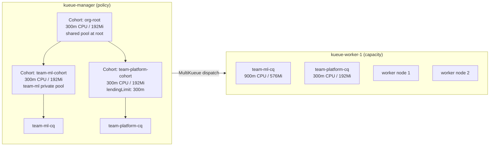
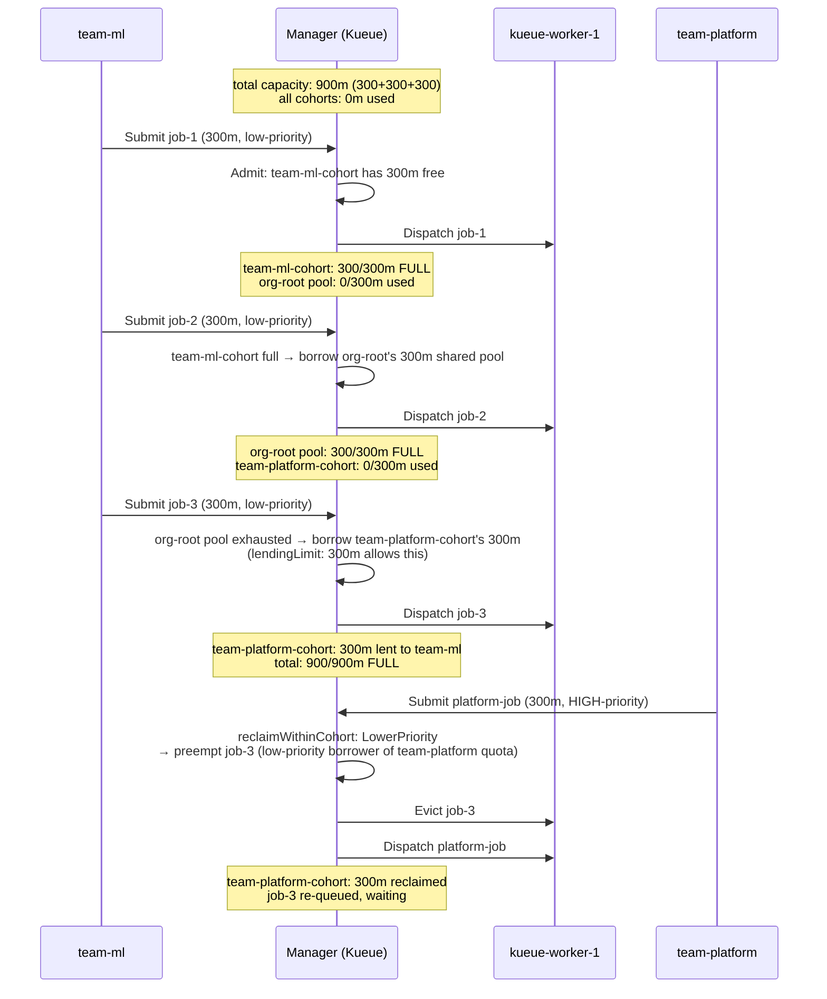

# MultiKueue + Cohort Tree + Single Cluster

## What This Experiment Demonstrates

This experiment shows how Kueue's **Cohort CRD** (v1beta2) enables hierarchical quota management through a **cohort tree**, where all resource quotas live in `Cohort` objects rather than in `ClusterQueue` objects.

Key concepts demonstrated:

- **MultiKueue** with 1 manager + 1 worker cluster
- **Cohort tree**: `org-root` → `team-ml-cohort`, `team-platform-cohort` → `ClusterQueues`
- **Resources defined in Cohort objects** (not in ClusterQueues) — the key difference from experiment 07
- **Hierarchical borrowing**: team-ml borrows up through the cohort tree
- **Preemption via `reclaimWithinCohort`**: team-platform reclaims its lent quota

---

## Cluster Layout



---

## Cohort Tree

```
org-root  (300m CPU / 192Mi)  ← shared pool at root level
├── team-ml-cohort  (300m CPU / 192Mi)  ← team-ml's private pool
│   └── team-ml-cq  ← resourceGroups with nominalQuota: "0"; quota from cohort
└── team-platform-cohort  (300m CPU / 192Mi, lendingLimit: 300m)
    └── team-platform-cq  ← resourceGroups with nominalQuota: "0"; quota from cohort

Total capacity = 300m (org-root) + 300m (team-ml-cohort) + 300m (team-platform-cohort) = 900m

IMPORTANT: Cohort nominalQuota is ADDITIVE, not a hierarchical cap.
Each Cohort's quota is additional capacity on top of its children's quota.
Setting org-root to 900m would mean total = 900m + 300m + 300m = 1500m (WRONG).

team-platform-cohort sets lendingLimit: 300m so its entire quota is available
to org-root, allowing team-ml-cohort to borrow it (via org-root) for jobs 2 & 3.
```

---

## Mental Model: Cohort vs ClusterQueue

| Object | Role | Where resources live |
|--------|------|---------------------|
| `Cohort` | Defines quota pool for a subtree | `spec.resourceGroups` with real `nominalQuota` |
| Manager `ClusterQueue` | Policy: preemption, admission checks, routing | `spec.resourceGroups` with `nominalQuota: "0"` (flavor declaration only) |
| Worker `ClusterQueue` | Capacity: how much the worker can admit | `spec.resourceGroups` with real `nominalQuota` |

**Key insight — two separate roles for `resourceGroups`**:

1. **Flavor declaration** (required on every ClusterQueue): Kueue's admission scheduler maps a pod's resource requests to a flavor by scanning the ClusterQueue's own `resourceGroups`. Without a flavor entry, the scheduler emits `resource cpu unavailable in ClusterQueue` and never admits the workload — even if the Cohort has ample quota. This is why manager ClusterQueues must declare `resourceGroups` with `default-flavor`, even though they hold no local quota.

2. **Quota accounting** (where the numbers live): The `nominalQuota` values in `Cohort.spec.resourceGroups` define how much each subtree can use and lend. Manager ClusterQueues set `nominalQuota: "0"` — meaning "no local quota; all capacity is inherited from the Cohort tree." Worker ClusterQueues set real values (e.g. `900m`) because they are the actual compute capacity.

**Manager = policy** (cohort tree + preemption rules; CQ `nominalQuota: "0"`)
**Worker = capacity** (real `nominalQuota` in worker ClusterQueues, no cohort)

---

## Resource Layout

Each JobSet requests **300m CPU / 192Mi memory**:

- leader: 1 replica × 1 pod × 100m CPU / 64Mi = 100m / 64Mi
- worker: 1 replica × 2 pods × 100m CPU / 64Mi = 200m / 128Mi

```
org-root:              300m CPU / 192Mi  (shared pool at root — Cohort, additive)
  team-ml-cohort:      300m CPU / 192Mi  (team-ml's private pool — Cohort, additive)
    team-ml-cq         nominalQuota: "0" — flavor declared, quota from cohort
  team-platform-cohort: 300m CPU / 192Mi (team-platform's pool — Cohort, additive)
                        lendingLimit: 300m CPU / 192Mi  ← lends all to org-root
    team-platform-cq   nominalQuota: "0" — flavor declared, quota from cohort

Total = 300m + 300m + 300m = 900m  ✓

Why lendingLimit on team-platform-cohort?
  By default a Cohort lends its full quota to its parent. Setting lendingLimit
  explicitly documents the intent: team-platform-cohort's 300m is available
  for team-ml to borrow (via org-root) in steps 3 and 4 of the simulation.
  When team-platform submits its high-priority job, reclaimWithinCohort kicks
  in and preempts the lower-priority team-ml job-3 that was using that quota.
```

---

## Experiment Flow



---

## Step-by-Step Instructions

### Step 1: Bootstrap

```bash
cd kueue/08-multikueue-cohort-tree-single-cluster
bash setup.sh
```

This creates:

- `kueue-manager` Kind cluster (control-plane only)
- `kueue-worker-1` Kind cluster (control-plane + 2 worker nodes)
- Installs cert-manager, Kueue, and JobSet CRDs on both clusters
- Creates `kueue-worker-1-kubeconfig` Secret in `kueue-system` on the manager

Verify clusters:

```bash
kubectl get nodes --context kind-kueue-manager
kubectl get nodes --context kind-kueue-worker-1
```

### Step 2: Apply MultiKueue Objects (manager only)

```bash
kubectl apply -f 01-multikueue-objects.yaml --context kind-kueue-manager
```

Verify the worker cluster is reachable:

```bash
kubectl get multikueuecluster -o wide --context kind-kueue-manager
# Expected: kueue-worker-1   Active=True
```

### Step 3: Apply ClusterQueues and Cohorts

**Manager** (Cohort tree + ClusterQueues with `nominalQuota: "0"` resourceGroups):

```bash
kubectl apply -f 02-manager-clusterqueues.yaml --context kind-kueue-manager
```

Verify Cohorts and ClusterQueues:

```bash
kubectl get cohorts --context kind-kueue-manager
# NAME                   AGE
# org-root               2m16s
# team-ml-cohort         2m51s
# team-platform-cohort   2m51s

kubectl get clusterqueues -o wide --context kind-kueue-manager
# NAME               COHORT                 STRATEGY         PENDING WORKLOADS   ADMITTED WORKLOADS
# team-ml-cq         team-ml-cohort         BestEffortFIFO   0                   0
# team-platform-cq   team-platform-cohort   BestEffortFIFO   0                   0
```

**Worker** (ClusterQueues with nominalQuota, no cohort):

```bash
kubectl apply -f 03-worker-1-clusterqueues.yaml --context kind-kueue-worker-1
```

### Step 4: Apply Namespaces and LocalQueues (all clusters)

```bash
kubectl apply -f 04-namespaces-localqueues.yaml --context kind-kueue-manager
kubectl apply -f 04-namespaces-localqueues.yaml --context kind-kueue-worker-1
```

Verify:

```bash
kubectl get localqueue -n team-ml --context kind-kueue-manager
kubectl get localqueue -n team-platform --context kind-kueue-manager
```

### Step 5: Verify Setup

```bash
# Check ClusterQueue status on manager
kubectl get clusterqueues -o wide --context kind-kueue-manager

# Check AdmissionCheck is Ready
kubectl get admissioncheck multikueue-check --context kind-kueue-manager

# Check cohort quota (requires kueuectl or describe)
kubectl describe clusterqueue team-ml-cq --context kind-kueue-manager
kubectl describe clusterqueue team-platform-cq --context kind-kueue-manager
```

Create ImagePullSecrets in both namespaces on all clusters (avoids Docker Hub rate limiting):

```bash
for ctx in kind-kueue-manager kind-kueue-worker-1; do
  for ns in team-ml team-platform; do
    kubectl create secret generic regcred \
      --from-file=.dockerconfigjson=$HOME/.docker/config.json \
      --type=kubernetes.io/dockerconfigjson \
      -n "${ns}" --context "${ctx}"
    kubectl patch serviceaccount default -n "${ns}" \
      -p '{"imagePullSecrets": [{"name": "regcred"}]}' \
      --context "${ctx}"
  done
done
```

---

### Step 6: Submit job-1 — Fill team-ml-cohort's Quota

```bash
kubectl create -f 05-jobset-fill-ml-quota.yaml --context kind-kueue-manager
```

Expected state:

- job-1 admitted immediately (team-ml-cohort has 300m free)
- Dispatched to kueue-worker-1

```bash
# Check admission on manager
kubectl get workloads -n team-ml --context kind-kueue-manager

# Check pods running on worker
kubectl get pods -n team-ml --context kind-kueue-worker-1

# Check cohort usage
kubectl describe clusterqueue team-ml-cq --context kind-kueue-manager | grep -A 20 'Status'
# flavorsUsage: cpu: 300m (team-ml-cohort is FULL)
```

---

### Step 7: Submit job-2 — Borrow from org-root's Unallocated 300m

```bash
kubectl create -f 06-jobset-ml-borrow-root.yaml --context kind-kueue-manager
```

Expected state:

- team-ml-cohort is full (300m/300m)
- Kueue walks up: team-ml-cohort → org-root → finds 300m unallocated
- job-2 admitted by borrowing from org-root

```bash
kubectl get workloads -n team-ml --context kind-kueue-manager
# Both job-1 and job-2 should be Admitted

kubectl get pods -n team-ml --context kind-kueue-worker-1
# 6 pods total (2 jobs × 3 pods each)
```

---

### Step 8: Submit job-3 — Borrow team-platform-cohort's Quota via org-root

```bash
kubectl create -f 07-jobset-ml-borrow-platform.yaml --context kind-kueue-manager
```

Expected state:

- org-root's unallocated pool is exhausted (used by job-2)
- Kueue walks up: org-root → borrows from team-platform-cohort's idle 300m
- job-3 admitted; org-root is now fully utilized (900m/900m)

```bash
kubectl get workloads -n team-ml --context kind-kueue-manager
# All 3 jobs Admitted

kubectl get pods -n team-ml --context kind-kueue-worker-1
# 9 pods total (3 jobs × 3 pods each)

# Verify org-root is fully utilized
kubectl describe clusterqueue team-ml-cq --context kind-kueue-manager | grep -A 20 'Status'
```

---

### Step 9: Submit platform-job — Trigger Preemption of job-3

```bash
kubectl create -f 08-jobset-platform-preempt.yaml --context kind-kueue-manager
```

Expected state:

- team-platform-cq needs 300m from team-platform-cohort
- team-platform-cohort's 300m is lent to team-ml (job-3)
- `reclaimWithinCohort: LowerPriority` → job-3 (low-priority) is preempted
- platform-job (high-priority) is admitted
- job-3 is re-queued and waits

```bash
# Watch the preemption happen
kubectl get workloads -n team-ml --context kind-kueue-manager -w
# job-3 transitions: Admitted → Evicted → Pending

kubectl get workloads -n team-platform --context kind-kueue-manager
# platform-job: Admitted

kubectl get pods -n team-platform --context kind-kueue-worker-1
# 3 pods running (platform-job)

kubectl get pods -n team-ml --context kind-kueue-worker-1
# 6 pods running (job-1 + job-2), job-3 pods terminated
```

After ~5 minutes (sleep 300), the platform-job completes and job-3 is re-admitted:

```bash
kubectl get workloads -n team-ml --context kind-kueue-manager
# job-3 transitions back to Admitted
```

#### Verify preemption — ClusterQueue status

Check `team-platform-cq` after the platform job is admitted:

```bash
kubectl describe clusterqueue team-platform-cq --context kind-kueue-manager | grep -A 20 'Status'
```

```
Status:
  Admitted Workloads:  1
  Conditions:
    Last Transition Time:  2026-05-11T09:59:05Z
    Message:               Can admit new workloads
    Observed Generation:   3
    Reason:                Ready
    Status:                True
    Type:                  Active
  Flavors Reservation:
    Name:  default-flavor
    Resources:
      Borrowed:  300m
      Name:      cpu
      Total:     300m
      Borrowed:  192Mi
      Name:      memory
      Total:     192Mi
  Flavors Usage:
    Name:  default-flavor
    Resources:
      Borrowed:         300m
      Name:             cpu
      Total:            300m
      Borrowed:         192Mi
      Name:             memory
      Total:            192Mi
  Pending Workloads:    0
```

> **Note**: `team-platform-cq` shows `Borrowed: 300m` — it borrowed back its own lent quota from the cohort tree (reclaimed from `team-ml`). The `Borrowed` field here reflects that `team-platform-cq` itself has `nominalQuota: "0"` and all its quota comes from `team-platform-cohort` via the cohort tree.

Check `team-ml-cq` to confirm job-3 was preempted and is pending:

```bash
kubectl describe clusterqueue team-ml-cq --context kind-kueue-manager | grep -A 20 'Status'
```

```
Status:
  Admitted Workloads:  2
  Conditions:
    Last Transition Time:  2026-05-11T09:59:05Z
    Message:               Can admit new workloads
    Observed Generation:   3
    Reason:                Ready
    Status:                True
    Type:                  Active
  Flavors Reservation:
    Name:  default-flavor
    Resources:
      Borrowed:  600m
      Name:      cpu
      Total:     600m
      Borrowed:  384Mi
      Name:      memory
      Total:     384Mi
  Flavors Usage:
    Name:  default-flavor
    Resources:
      Borrowed:         600m
      Name:             cpu
      Total:            600m
      Borrowed:         384Mi
      Name:             memory
      Total:            384Mi
  Pending Workloads:    1
```

> **Note**: `team-ml-cq` now has 2 admitted workloads (was 3) and 1 pending — that is the preempted job-3 waiting to be re-admitted. It is still borrowing 600m total (300m from `team-ml-cohort` + 300m from `org-root`).

#### Verify preemption — Preempted workload conditions

Inspect the evicted workload to see the full preemption audit trail:

```bash
kubectl describe workload jobset-jobset-ml-borrow-platform-<hash> -n team-ml --context kind-kueue-manager
```

Key status conditions on the preempted workload:

```yaml
# Condition: Evicted
Type:    Evicted
Status:  True
Reason:  Preempted
Message: >
  Preempted to accommodate a workload (UID: ...) due to reclamation within the cohort;
  preemptor path: /org-root/team-platform-cohort/team-platform-cq;
  preemptee path: /org-root/team-ml-cohort/team-ml-cq

# Condition: Preempted
Type:    Preempted
Status:  True
Reason:  InCohortReclamation   # ← cohort reclamation, not within-queue preemption

# Condition: Requeued
Type:    Requeued
Status:  True                  # ← job-3 is back in the queue, waiting for quota
```

Key events on the preempted workload:

```
Normal   QuotaReserved          ...  kueue-admission            Quota reserved in ClusterQueue team-ml-cq; Flavors considered: leader: default-flavor(Fit;borrow=2) | worker: default-flavor(Fit;borrow=2)
Normal   Admitted               ...  kueue-workload-controller  Admitted by ClusterQueue team-ml-cq
Normal   MultiKueue             ...  kueue-workload-controller  The workload got reservation on "kueue-worker-1"
Normal   EvictedDueToPreempted  ...  kueue-admission            Preempted to accommodate a workload ... due to reclamation within the cohort; preemptor path: /org-root/team-platform-cohort/team-platform-cq; preemptee path: /org-root/team-ml-cohort/team-ml-cq
Normal   Preempted              ...  kueue-admission            ... preemptor effective priority: 100 (base: 100, boost: 0); preemptee effective priority: 10 (base: 10, boost: 0)
Warning  Pending                ...  kueue-admission            couldn't assign flavors to pod set leader: insufficient unused quota for cpu in flavor default-flavor, 100m more needed
```

#### What the output proves

| Evidence | What it confirms |
|----------|-----------------|
| `preemptor path: /org-root/team-platform-cohort/team-platform-cq` | The full cohort tree path is visible in the audit trail — Kueue tracks the exact node in the hierarchy that triggered reclamation |
| `preemptee path: /org-root/team-ml-cohort/team-ml-cq` | Confirms the correct queue's workload was targeted — the one that was borrowing `team-platform-cohort`'s quota |
| `Reason: InCohortReclamation` | The reason code distinguishes this from within-queue preemption (`WithinClusterQueue`) or cross-queue preemption (`InCohortFairSharing`) |
| `preemptor effective priority: 100; preemptee effective priority: 10` | The priority difference (100 vs 10) is what satisfied the `reclaimWithinCohort: LowerPriority` policy — only lower-priority borrowers are eligible for eviction |
| `team-ml-cq: Admitted Workloads: 2, Pending Workloads: 1` | job-3 was evicted and re-queued; job-1 and job-2 (which were not borrowing `team-platform-cohort`'s quota) continue running |

---

## Cleanup

```bash
bash teardown.sh
```

To also delete the Kind clusters:

```bash
kind delete cluster --name kueue-manager
kind delete cluster --name kueue-worker-1
```

---

## Key Differences from Experiment 07

| Feature | Exp 07 (Distinct Flavors) | Exp 08 (Cohort Tree) |
|---------|--------------------------|----------------------|
| Quota location | `ClusterQueue.spec.resourceGroups` | `Cohort.spec.resourceGroups` |
| Manager CQ `resourceGroups` | Has real `nominalQuota`, borrowingLimit, lendingLimit | Flavor declared with `nominalQuota: "0"` (quota lives in Cohort) |
| Cohort structure | Flat (single cohort `shared-pool`) | Tree (`org-root` → children) |
| Flavors | Multiple (h100-flavor, b200-flavor) | Single (default-flavor) |
| Worker clusters | 2 (one per flavor) | 1 (general compute) |
| Borrowing mechanism | Cross-flavor borrowing via lendingLimit | Hierarchical cohort tree |

> **Note**: Even when quota lives entirely in Cohort objects, the manager ClusterQueue must still declare a `resourceGroups` entry for each flavor it uses. Kueue's flavor-assignment step (which maps pod resource requests to a flavor) reads the ClusterQueue's own `resourceGroups`, not the Cohort's. Setting `nominalQuota: "0"` in the CQ satisfies this requirement while keeping all real quota numbers in the Cohort.

---

## References

- [Kueue Cohort concept](https://kueue.sigs.k8s.io/docs/concepts/cohort/)
- [Kueue v1beta2 CohortSpec API reference](https://kueue.sigs.k8s.io/docs/reference/kueue.v1beta2/#kueue-x-k8s-io-v1beta2-CohortSpec)
- [MultiKueue overview](https://kueue.sigs.k8s.io/docs/concepts/multikueue/)
- [Preemption](https://kueue.sigs.k8s.io/docs/concepts/preemption/)
