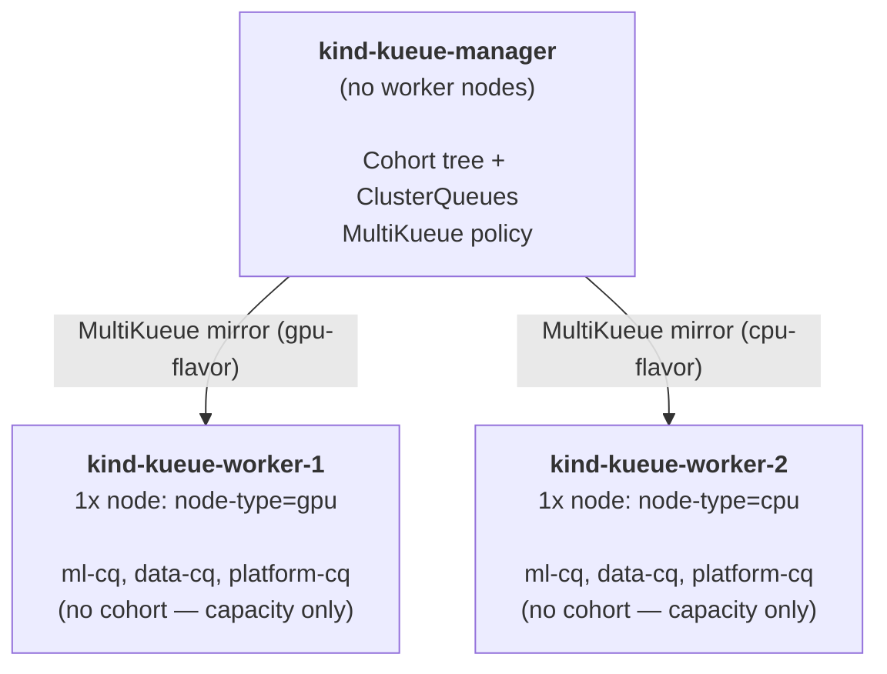
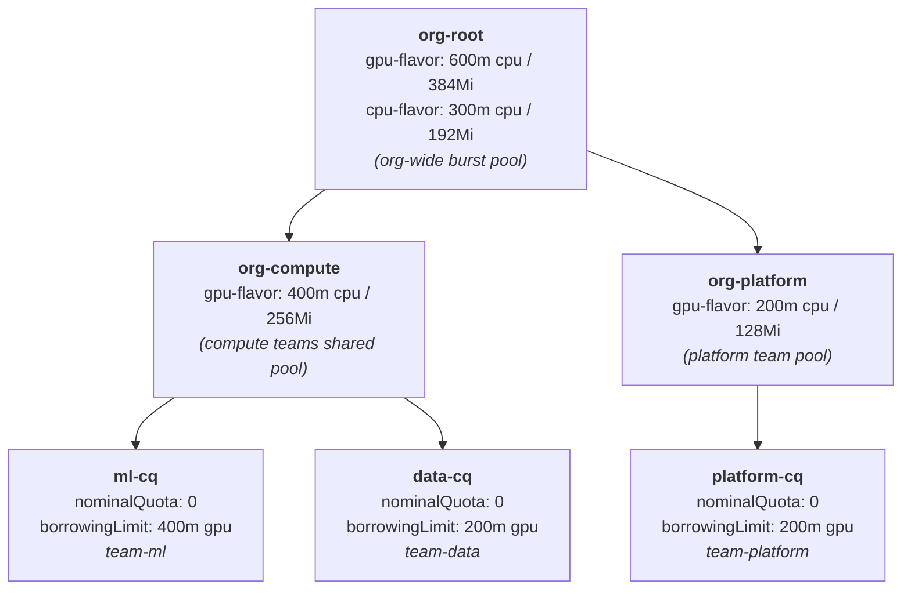
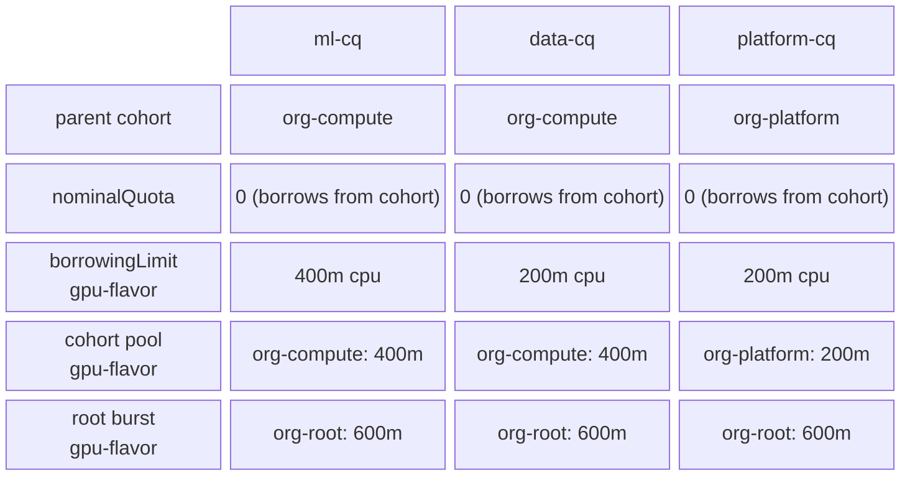
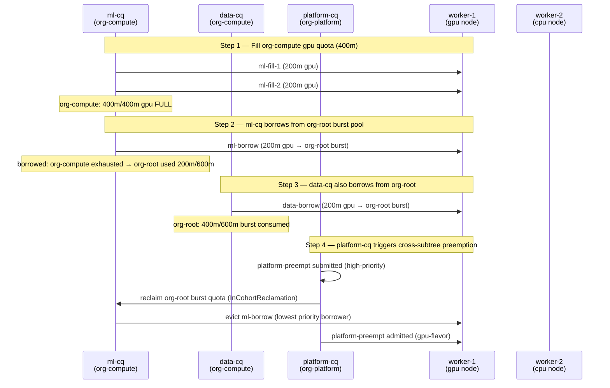
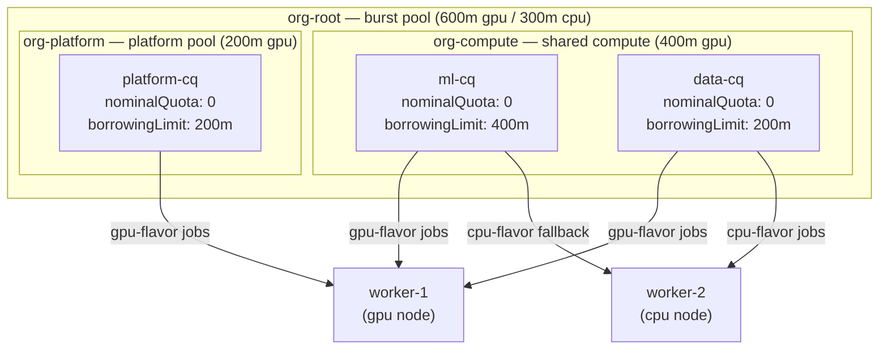

# MultiKueue + Cohort Trees + Quotas in Cohorts + Borrowing & Preemption

Demonstrates MultiKueue with a **hierarchical Cohort tree** where resource quotas are defined on Cohort objects (not on ClusterQueues). Three teams (`team-ml`, `team-data`, `team-platform`) share resources through a two-level cohort tree, with borrowing that propagates up the tree and preemption that operates across subtree boundaries.

---

## Concepts Demonstrated

| Concept | What you will see |
|---|---|
| **Cohort object** | Standalone `Cohort` resources with their own `resourceGroups` and `nominalQuota` |
| **Cohort tree (hierarchical)** | `org-root` → `org-compute` + `org-platform` parent/child cohorts |
| **Quotas in cohorts, not ClusterQueues** | All ClusterQueues have `nominalQuota: 0` — they borrow 100% from their parent Cohort |
| **Multi-level borrowing** | `ml-cq` exhausts `org-compute` → borrows upward from `org-root`'s burst pool |
| **Cross-subtree preemption** | `platform-cq` (in `org-platform`) preempts borrowers in `org-compute` subtree via `org-root` |
| **MultiKueue dispatch** | GPU workloads → worker-1; CPU workloads → worker-2; policy on manager only |

---

## Cluster Layout



---

## Cohort Tree Structure



### Key Design: Quotas in Cohorts, not ClusterQueues

In all previous experiments, `nominalQuota` was defined on `ClusterQueue.spec.resourceGroups`. Here, `nominalQuota` is defined on `Cohort.spec.resourceGroups` and ClusterQueues use `nominalQuota: 0`:

```yaml
# Cohort defines the pool:
apiVersion: kueue.x-k8s.io/v1beta2
kind: Cohort
metadata:
  name: org-compute
spec:
  parentName: org-root
  resourceGroups:
    - coveredResources: ["cpu", "memory"]
      flavors:
        - name: gpu-flavor
          resources:
            - name: cpu
              nominalQuota: "400m"   # ← quota lives HERE

# ClusterQueue borrows from the pool:
apiVersion: kueue.x-k8s.io/v1beta2
kind: ClusterQueue
metadata:
  name: ml-cq
spec:
  cohortName: org-compute
  resourceGroups:
    - coveredResources: ["cpu", "memory"]
      flavors:
        - name: gpu-flavor
          resources:
            - name: cpu
              nominalQuota: "0"          # ← zero nominal quota
              borrowingLimit: "400m"     # ← borrows from cohort
```

This pattern centralises quota management at the organisational level. Teams adjust their consumption via `borrowingLimit`, not by owning `nominalQuota`.

---

## Mental Model: Manager Policy vs. Worker Capacity

| Layer | Mechanism | Purpose |
|---|---|---|
| Manager | `Cohort.spec.resourceGroups.nominalQuota` | Quota definition — where the resources live |
| Manager | `ClusterQueue.borrowingLimit` | Policy — how much each team can consume |
| Worker | `ClusterQueue.nominalQuota` (no cohort) | Capacity — what physical resources exist |

The cohort tree and all borrowing/preemption logic **only exists on the manager**. Workers have flat ClusterQueues with no cohort relationship.

---

## Quota Reference



---

## Experiment Flow



---

## Experiment Steps

### Step 1 — Bootstrap clusters

```bash
bash setup.sh
```

Creates three Kind clusters, installs cert-manager + Kueue + JobSet on all.

---

### Step 2 — Apply MultiKueue federation objects

```bash
kubectl apply -f 01-multikueue-objects.yaml --context kind-kueue-manager
```

Verify both worker clusters are connected:

```bash
kubectl get multikueuecluster --context kind-kueue-manager
# NAME             CONNECTED   AGE
# kueue-worker-1   True        9s
# kueue-worker-2   True        9s

kubectl get admissioncheck --context kind-kueue-manager
# NAME               AGE
# multikueue-check   39s
```

---

### Step 3 — Apply the Cohort tree

```bash
kubectl apply -f 02-cohorts.yaml --context kind-kueue-manager
```

Verify the three Cohorts are created:

```bash
kubectl get cohort --context kind-kueue-manager
# NAME           AGE
# org-compute    5s
# org-platform   5s
# org-root       5s
```

Inspect the tree structure:

```bash
kubectl describe cohort org-compute --context kind-kueue-manager
# spec.parentName: org-root
# spec.resourceGroups[0].flavors[0].resources[0].nominalQuota: 400m
```

---

### Step 4 — Apply manager ClusterQueues

```bash
kubectl apply -f 03-manager-clusterqueues.yaml --context kind-kueue-manager
```

Verify ClusterQueues are active and show their cohort:

```bash
kubectl get clusterqueue -o wide --context kind-kueue-manager
# NAME          COHORT        STRATEGY         PENDING   ADMITTED
# data-cq       org-compute   BestEffortFIFO   0         0
# ml-cq         org-compute   BestEffortFIFO   0         0
# platform-cq   org-platform  BestEffortFIFO   0         0
```

**Key observation:** All three ClusterQueues show `COHORT` but have `nominalQuota: 0` on all flavors. The quota lives in the Cohort objects.

---

### Step 5 — Apply worker ClusterQueues

```bash
# Worker-1 (GPU)
kubectl apply -f 04-worker-1-clusterqueues.yaml --context kind-kueue-worker-1

# Worker-2 (CPU)
kubectl apply -f 05-worker-2-clusterqueues.yaml --context kind-kueue-worker-2
```

Verify workers have NO cohort (flat, capacity-only):

```bash
kubectl get clusterqueue -o wide --context kind-kueue-worker-1
# NAME          COHORT   STRATEGY         PENDING   ADMITTED
# data-cq                BestEffortFIFO   0         0
# ml-cq                  BestEffortFIFO   0         0
# platform-cq            BestEffortFIFO   0         0
```

---

### Step 6 — Apply namespaces, LocalQueues, and WorkloadPriorityClasses

```bash
# Must be applied to all three clusters
kubectl apply -f 06-namespaces-localqueues.yaml --context kind-kueue-manager
kubectl apply -f 06-namespaces-localqueues.yaml --context kind-kueue-worker-1
kubectl apply -f 06-namespaces-localqueues.yaml --context kind-kueue-worker-2
```

Verify:

```bash
kubectl get localqueue -A -o wide --context kind-kueue-manager
# NAMESPACE      NAME             CLUSTERQUEUE   PENDING   ADMITTED
# team-data      data-queue       data-cq        0         0
# team-ml        ml-queue         ml-cq          0         0
# team-platform  platform-queue   platform-cq    0         0
```

Create ImagePullSecrets in all namespaces on all clusters:

```bash
for ctx in kind-kueue-manager kind-kueue-worker-1 kind-kueue-worker-2; do
  for ns in team-ml team-data team-platform; do
    kubectl create secret generic regcred \
      --from-file=.dockerconfigjson=$HOME/.docker/config.json \
      --type=kubernetes.io/dockerconfigjson \
      -n "${ns}" --context "${ctx}"
    kubectl patch serviceaccount default -n "${ns}" \
      -p '{"imagePullSecrets": [{"name": "regcred"}]}' \
      --context "${ctx}"
  done
done
```

---

### Step 7 — Verify setup

```bash
kubectl get clusterqueues -o jsonpath=\
"{range .items[*]}{.metadata.name}: Active={range .status.conditions[?(@.type=='Active')]}{.status}{end}{'\n'}{end}" \
  --context kind-kueue-manager

kubectl get admissionchecks multikueue-check \
  -o jsonpath="{range .status.conditions[?(@.type=='Active')]}AC - Active: {@.status} Reason: {@.reason}{'\n'}{end}" \
  --context kind-kueue-manager

kubectl get multikueuecluster \
  -o jsonpath="{range .items[*]}{.metadata.name}: Active={range .status.conditions[?(@.type=='Active')]}{.status}{end}{'\n'}{end}" \
  --context kind-kueue-manager
```

Expected:

```
data-cq: Active=True
ml-cq: Active=True
platform-cq: Active=True
AC - Active: True Reason: Active
kueue-worker-1: Active=True
kueue-worker-2: Active=True
```

---

### Step 8 — Fill org-compute's gpu quota

Submit two low-priority JobSets from `team-ml` that together consume `400m cpu / 256Mi` — exactly `org-compute`'s full `gpu-flavor` quota:

```bash
kubectl create -f 07-jobsets-fill-compute-quota.yaml -n team-ml --context kind-kueue-manager
```

Verify both workloads are admitted and dispatched to worker-1 (the GPU cluster):

```bash
kubectl get workload -o wide -A --context kind-kueue-manager
# NAMESPACE   NAME                                 QUEUE      RESERVED IN   ADMITTED
# team-ml     jobset-jobset-ml-fill-1-xxxxx        ml-queue   ml-cq         True
# team-ml     jobset-jobset-ml-fill-2-xxxxx        ml-queue   ml-cq         True

kubectl get pods -n team-ml -o wide --context kind-kueue-worker-1
# All pods running on the gpu node (node-type=gpu)
```

Verify `org-compute`'s gpu quota is exhausted:

```bash
kubectl describe cohort org-compute --context kind-kueue-manager
# Status.Usage should show 400m/400m for gpu-flavor
```

---

### Step 9 — team-ml borrows from org-root (multi-level borrowing)

With `org-compute` full, submit another `team-ml` job. Kueue exhausts `org-compute` and borrows upward from `org-root`'s burst pool:

```bash
kubectl create -f 08-jobset-ml-borrow-from-root.yaml -n team-ml --context kind-kueue-manager
```

Verify the workload is admitted using borrowed quota:

```bash
kubectl get workload -o wide -n team-ml --context kind-kueue-manager
# Shows 3 admitted workloads — 3rd one uses org-root's burst

kubectl describe clusterqueue ml-cq --context kind-kueue-manager
# Flavors Reservation → Borrowed > 0  (ml-cq is borrowing from org-root)
```

**Key observation:** `ml-borrow` is admitted even though both `ml-cq.nominalQuota = 0` and `org-compute.nominalQuota` is exhausted. The CohortTree lookup continues upward to `org-root`.

---

### Step 10 — team-data borrows from org-root (sibling borrowing same tree)

`team-data` (in `org-compute`, sibling of `ml-cq`) submits a gpu workload. `org-compute` is exhausted, so it also borrows from `org-root`:

```bash
kubectl create -f 09-jobset-data-borrow-from-root.yaml -n team-data --context kind-kueue-manager
```

```bash
kubectl get workload -o wide -A --context kind-kueue-manager
# Both team-ml and team-data have borrowers running on worker-1 via org-root's burst
```

**Key observation:** Two ClusterQueues in different subtree positions (both children of `org-compute`) can both borrow from the common ancestor `org-root` simultaneously. The burst pool is shared across the entire CohortTree.

---

### Step 11 — team-platform triggers cross-subtree preemption

Submit a high-priority job from `team-platform`. `platform-cq` is in `org-platform` (a different subtree from `org-compute`), but both share the common `org-root` ancestor. The preemption targets the lowest-priority borrower in the entire CohortTree that is using `org-root`'s burst pool:

```bash
kubectl create -f 10-jobset-platform-preemption-trigger.yaml -n team-platform --context kind-kueue-manager
```

Watch preemption happen:

```bash
kubectl get workloads -A -w --context kind-kueue-manager
# team-ml's ml-borrow workload transitions from Admitted → Evicted → re-queued
# team-platform's platform-preempt workload transitions from Pending → Admitted
```

Inspect the preempted workload:

```bash
kubectl describe workload -n team-ml jobset-jobset-ml-borrow-xxxxx --context kind-kueue-manager
# Type: Evicted, Reason: Preempted
# Type: Preempted, Reason: InCohortReclamation
# preemptor path: /org-root/org-platform/platform-cq
# preemptee path: /org-root/org-compute/ml-cq
```

**Key observation:** Preemption crosses subtree boundaries (`org-compute` ↔ `org-platform`) because both share the common ancestor `org-root`. The preemptor is in a completely different branch of the tree from the preemptee.

---

## Cleanup

```bash
bash teardown.sh
```

To also delete all three Kind clusters:

```bash
kind delete cluster --name kueue-manager
kind delete cluster --name kueue-worker-1
kind delete cluster --name kueue-worker-2
```

---

## How It All Fits Together



**Key insights:**

1. **Cohort as quota bank.** `nominalQuota` on a `Cohort` is a shared pool usable by any ClusterQueue in its subtree. ClusterQueues with `nominalQuota: 0` are pure borrowers.

2. **Multi-level borrowing.** When a child cohort's pool is exhausted, borrowing propagates to the parent cohort automatically. A ClusterQueue in `org-compute` can draw from `org-root`'s burst pool without any additional configuration.

3. **Subtree isolation.** `org-compute` and `org-platform` are separate subtrees. A ClusterQueue in one cannot borrow from the other's cohort quota directly — only from their shared ancestor (`org-root`).

4. **Cross-subtree preemption.** `reclaimWithinCohort` scans the entire CohortTree for lower-priority borrowers, not just the same Cohort. A high-priority job in `org-platform` can preempt a low-priority borrower in `org-compute` if they are both drawing from `org-root`'s burst pool.

5. **Workers stay flat.** The cohort tree lives entirely on the manager. Worker ClusterQueues have no cohort and no Cohort objects — they express physical capacity via `nominalQuota` only.

6. **The manager-worker capacity contract.** A worker's `nominalQuota` must be ≥ the maximum quota any workload routed to it can consume (the manager's `borrowingLimit`). Changing one requires updating the other manually.

---

## References

- [Cohort concept](https://kueue.sigs.k8s.io/docs/concepts/cohort/)
- [Hierarchical Cohorts](https://kueue.sigs.k8s.io/docs/concepts/cohort/#hierarchical-cohorts)
- [ClusterQueue concept](https://kueue.sigs.k8s.io/docs/concepts/cluster_queue/)
- [Preemption](https://kueue.sigs.k8s.io/docs/concepts/preemption/)
- [MultiKueue concept](https://kueue.sigs.k8s.io/docs/concepts/multikueue/)
- [Kueue v1beta2 API](https://kueue.sigs.k8s.io/docs/reference/kueue.v1beta2/)
