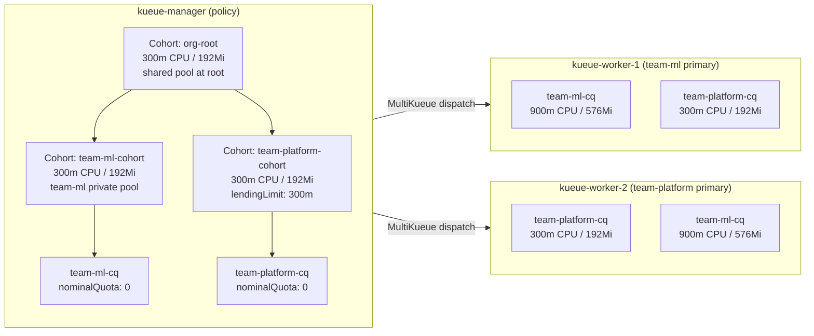
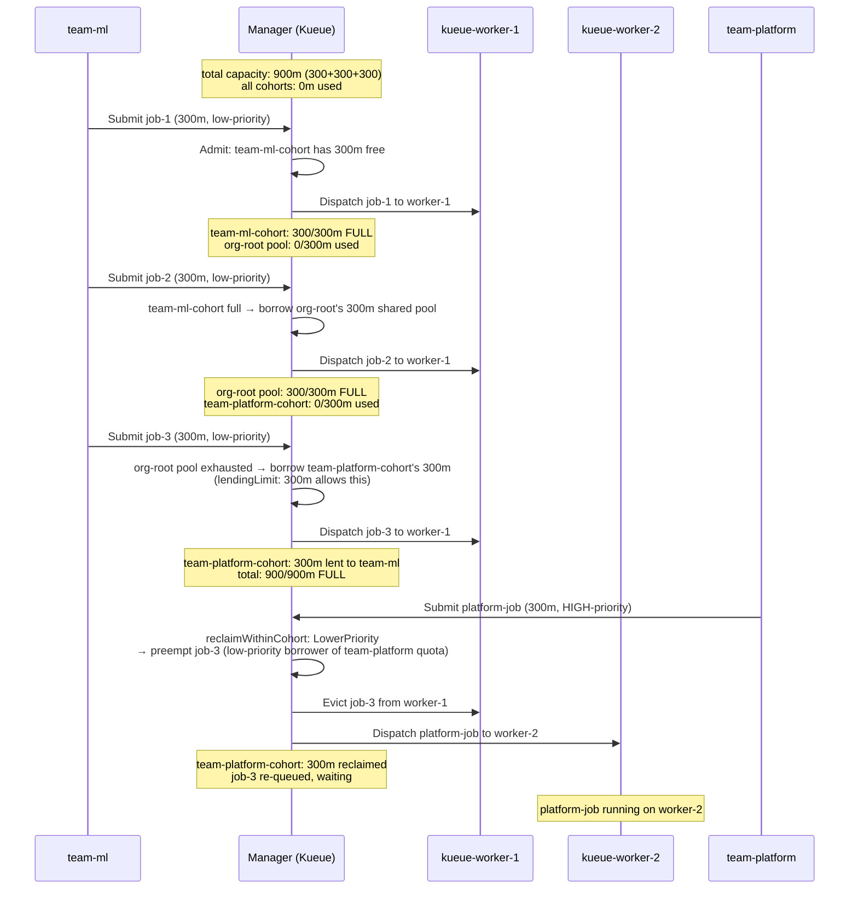

# MultiKueue + Cohort Tree + Multi Cluster

## What This Experiment Demonstrates

This experiment extends experiment 08 to **two worker clusters**, showing how Kueue's **Cohort CRD** (v1beta2) hierarchical quota management works when workloads are dispatched across multiple workers via MultiKueue.

Key concepts demonstrated:

- **MultiKueue** with 1 manager + **2 worker clusters**
- **Cohort tree**: `org-root` → `team-ml-cohort`, `team-platform-cohort` → `ClusterQueues`
- **Resources defined in Cohort objects** (not in ClusterQueues) — same as experiment 08
- **Hierarchical borrowing**: team-ml borrows up through the cohort tree
- **Preemption via `reclaimWithinCohort`**: team-platform reclaims its lent quota
- **Multi-cluster dispatch**: the manager picks the best available worker for each workload

---

## Cluster Layout



---

## Cohort Tree

```
org-root  (300m CPU / 192Mi)  ← shared pool at root level
├── team-ml-cohort  (300m CPU / 192Mi)  ← team-ml's private pool
│   └── team-ml-cq  ← nominalQuota: "0"; quota from cohort
└── team-platform-cohort  (300m CPU / 192Mi, lendingLimit: 300m)
    └── team-platform-cq  ← nominalQuota: "0"; quota from cohort

Total capacity = 300m (org-root) + 300m (team-ml-cohort) + 300m (team-platform-cohort) = 900m

IMPORTANT: Cohort nominalQuota is ADDITIVE, not a hierarchical cap.
Each Cohort's quota is additional capacity on top of its children's quota.

team-platform-cohort sets lendingLimit: 300m so its entire quota is available
to org-root, allowing team-ml-cohort to borrow it (via org-root) for jobs 2 & 3.
```

---

## Mental Model: Cohort vs ClusterQueue

| Object | Role | Where resources live |
|--------|------|---------------------|
| `Cohort` | Defines quota pool for a subtree | `spec.resourceGroups` with real `nominalQuota` |
| Manager `ClusterQueue` | Policy: preemption, admission checks, routing | `spec.resourceGroups` with `nominalQuota: "0"` (flavor declaration only) |
| Worker `ClusterQueue` | Capacity: how much the worker can admit | `spec.resourceGroups` with real `nominalQuota` |

**Key insight — two separate roles for `resourceGroups`**:

1. **Flavor declaration** (required on every ClusterQueue): Kueue's admission scheduler maps a pod's resource requests to a flavor by scanning the ClusterQueue's own `resourceGroups`. Without a flavor entry, the scheduler emits `resource cpu unavailable in ClusterQueue` and never admits the workload — even if the Cohort has ample quota. This is why manager ClusterQueues must declare `resourceGroups` with `default-flavor`, even though they hold no local quota.

2. **Quota accounting** (where the numbers live): The `nominalQuota` values in `Cohort.spec.resourceGroups` define how much each subtree can use and lend. Manager ClusterQueues set `nominalQuota: "0"` — meaning "no local quota; all capacity is inherited from the Cohort tree."

**Manager = policy** (cohort tree + preemption rules; CQ `nominalQuota: "0"`)
**Workers = capacity** (real `nominalQuota` in worker ClusterQueues, no cohort)

---

## Difference from Experiment 08 (Single Cluster)

| Feature | Exp 08 (single worker) | Exp 09 (two workers) |
|---------|------------------------|----------------------|
| Worker clusters | 1 (`kueue-worker-1`) | 2 (`kueue-worker-1` + `kueue-worker-2`) |
| MultiKueueConfig | `clusters: [kueue-worker-1]` | `clusters: [kueue-worker-1, kueue-worker-2]` |
| Worker-1 role | All capacity | team-ml primary (900m ml + 300m platform) |
| Worker-2 role | — | team-platform primary (300m platform + 900m ml overflow) |
| Cohort tree | Identical | Identical — cohort tree lives only on manager |
| Preemption flow | Same | Same — preemption is decided by manager; eviction dispatched to whichever worker holds the job |

Both workers carry ClusterQueues for both teams. MultiKueue will pick the first available worker that has capacity for the admitted workload.

---

## Resource Layout

Each JobSet requests **300m CPU / 192Mi memory**:

- leader: 1 replica × 1 pod × 100m CPU / 64Mi = 100m / 64Mi
- worker: 1 replica × 2 pods × 100m CPU / 64Mi = 200m / 128Mi

```
org-root:               300m CPU / 192Mi  (shared pool at root — Cohort, additive)
  team-ml-cohort:       300m CPU / 192Mi  (team-ml's private pool — Cohort, additive)
    team-ml-cq          nominalQuota: "0" — flavor declared, quota from cohort
  team-platform-cohort: 300m CPU / 192Mi  (team-platform's pool — Cohort, additive)
                         lendingLimit: 300m CPU / 192Mi  ← lends all to org-root
    team-platform-cq    nominalQuota: "0" — flavor declared, quota from cohort

Total = 300m + 300m + 300m = 900m  ✓
```

---

## Experiment Flow



---

## Step-by-Step Instructions

### Step 1: Bootstrap

```bash
cd kueue/09-mulitkueue-cohort-tree-multi-cluster
bash setup.sh
```

This creates:

- `kueue-manager` Kind cluster (control-plane only)
- `kueue-worker-1` Kind cluster (control-plane + 2 worker nodes)
- `kueue-worker-2` Kind cluster (control-plane + 2 worker nodes)
- Installs cert-manager, Kueue, and JobSet CRDs on all three clusters
- Creates `kueue-worker-1-kubeconfig` and `kueue-worker-2-kubeconfig` Secrets in `kueue-system` on the manager

Verify clusters:

```bash
kubectl get nodes --context kind-kueue-manager
kubectl get nodes --context kind-kueue-worker-1
kubectl get nodes --context kind-kueue-worker-2
```

### Step 2: Apply MultiKueue Objects (manager only)

```bash
kubectl apply -f 01-multikueue-objects.yaml --context kind-kueue-manager
```

Verify both worker clusters are reachable:

```bash
kubectl get multikueuecluster -o wide --context kind-kueue-manager
# Expected:
# NAME             ACTIVE
# kueue-worker-1   True
# kueue-worker-2   True
```

### Step 3: Apply ClusterQueues and Cohorts

**Manager** (Cohort tree + ClusterQueues with `nominalQuota: "0"` resourceGroups):

```bash
kubectl apply -f 02-manager-clusterqueues.yaml --context kind-kueue-manager
```

Verify Cohorts and ClusterQueues:

```bash
kubectl get cohorts --context kind-kueue-manager
# NAME                   AGE
# org-root               ...
# team-ml-cohort         ...
# team-platform-cohort   ...

kubectl get clusterqueues -o wide --context kind-kueue-manager
# NAME               COHORT                 STRATEGY         PENDING   ADMITTED
# team-ml-cq         team-ml-cohort         BestEffortFIFO   0         0
# team-platform-cq   team-platform-cohort   BestEffortFIFO   0         0
```

**Worker 1** (ClusterQueues with real capacity):

```bash
kubectl apply -f 03-worker-1-clusterqueues.yaml --context kind-kueue-worker-1
```

**Worker 2** (ClusterQueues with real capacity):

```bash
kubectl apply -f 04-worker-2-clusterqueues.yaml --context kind-kueue-worker-2
```

### Step 4: Apply Namespaces and LocalQueues (all clusters)

```bash
for ctx in kind-kueue-manager kind-kueue-worker-1 kind-kueue-worker-2; do
  kubectl apply -f 05-namespaces-localqueues.yaml --context "${ctx}"
done
```

Verify:

```bash
kubectl get localqueue -n team-ml       --context kind-kueue-manager
kubectl get localqueue -n team-platform --context kind-kueue-manager
```

### Step 5: Verify Setup

```bash
# Check ClusterQueue status on manager
kubectl get clusterqueues -o wide --context kind-kueue-manager

# Check AdmissionCheck is Ready
kubectl get admissioncheck multikueue-check --context kind-kueue-manager

# Describe cohort quota
kubectl describe clusterqueue team-ml-cq     --context kind-kueue-manager
kubectl describe clusterqueue team-platform-cq --context kind-kueue-manager
```

Create ImagePullSecrets in both namespaces on all clusters (avoids Docker Hub rate limiting):

```bash
for ctx in kind-kueue-manager kind-kueue-worker-1 kind-kueue-worker-2; do
  for ns in team-ml team-platform; do
    kubectl create secret generic regcred \
      --from-file=.dockerconfigjson=$HOME/.docker/config.json \
      --type=kubernetes.io/dockerconfigjson \
      -n "${ns}" --context "${ctx}"
    kubectl patch serviceaccount default -n "${ns}" \
      -p '{"imagePullSecrets": [{"name": "regcred"}]}' \
      --context "${ctx}"
  done
done
```

---

### Step 6: Submit job-1 — Fill team-ml-cohort's Quota

```bash
kubectl create -f 06-jobset-fill-ml-quota.yaml --context kind-kueue-manager
```

Expected state:

- job-1 admitted immediately (team-ml-cohort has 300m free)
- Dispatched to one of the worker clusters (likely worker-1)

```bash
kubectl get workloads -n team-ml --context kind-kueue-manager
kubectl get pods -n team-ml --context kind-kueue-worker-1
kubectl get pods -n team-ml --context kind-kueue-worker-2
```

---

### Step 7: Submit job-2 — Borrow from org-root's Unallocated 300m

```bash
kubectl create -f 07-jobset-ml-borrow-root.yaml --context kind-kueue-manager
```

Expected state:

- team-ml-cohort is full (300m/300m)
- Kueue walks up: team-ml-cohort → org-root → finds 300m unallocated
- job-2 admitted by borrowing from org-root; dispatched to a worker

```bash
kubectl get workloads -n team-ml --context kind-kueue-manager
# Both job-1 and job-2 should be Admitted
```

---

### Step 8: Submit job-3 — Borrow team-platform-cohort's Quota via org-root

```bash
kubectl create -f 08-jobset-ml-borrow-platform.yaml --context kind-kueue-manager
```

Expected state:

- org-root's unallocated pool is exhausted (used by job-2)
- Kueue walks up: org-root → borrows from team-platform-cohort's idle 300m
- job-3 admitted; total usage is 900/900m

```bash
kubectl get workloads -n team-ml --context kind-kueue-manager
# All 3 jobs Admitted

# Check pods across both workers
kubectl get pods -n team-ml --context kind-kueue-worker-1
kubectl get pods -n team-ml --context kind-kueue-worker-2
```

---

### Step 9: Submit platform-job — Trigger Preemption of job-3

```bash
kubectl create -f 09-jobset-platform-preempt.yaml --context kind-kueue-manager
```

Expected state:

- team-platform-cq needs 300m from team-platform-cohort
- team-platform-cohort's 300m is lent to team-ml (job-3)
- `reclaimWithinCohort: LowerPriority` → job-3 (low-priority) is preempted
- platform-job (high-priority) is admitted and dispatched (may land on worker-2)
- job-3 is re-queued and waits

```bash
# Watch the preemption happen
kubectl get workloads -n team-ml --context kind-kueue-manager -w
# job-3 transitions: Admitted → Evicted → Pending

kubectl get workloads -n team-platform --context kind-kueue-manager
# platform-job: Admitted

# Check where the platform job landed
kubectl get pods -n team-platform --context kind-kueue-worker-1
kubectl get pods -n team-platform --context kind-kueue-worker-2
```

After ~5 minutes (sleep 300), the platform-job completes and job-3 is re-admitted:

```bash
kubectl get workloads -n team-ml --context kind-kueue-manager
# job-3 transitions back to Admitted
```

#### Verify preemption — ClusterQueue status

```bash
kubectl describe clusterqueue team-platform-cq --context kind-kueue-manager | grep -A 20 'Status'
# Admitted Workloads: 1
# Flavors Usage: cpu: 300m (Borrowed: 300m — reclaimed from cohort tree)

kubectl describe clusterqueue team-ml-cq --context kind-kueue-manager | grep -A 20 'Status'
# Admitted Workloads: 2, Pending Workloads: 1
# job-3 was evicted and re-queued; job-1 and job-2 continue running
```

#### Verify preemption — Workload audit trail

```bash
kubectl describe workload jobset-jobset-ml-borrow-platform-<hash> -n team-ml --context kind-kueue-manager
```

Key status conditions on the preempted workload:

```yaml
# Condition: Evicted
Type:    Evicted
Status:  True
Reason:  Preempted
Message: >
  Preempted to accommodate a workload (UID: ...) due to reclamation within the cohort;
  preemptor path: /org-root/team-platform-cohort/team-platform-cq;
  preemptee path: /org-root/team-ml-cohort/team-ml-cq

# Condition: Preempted
Type:    Preempted
Status:  True
Reason:  InCohortReclamation   # ← cohort reclamation, not within-queue preemption

# Condition: Requeued
Type:    Requeued
Status:  True                  # ← job-3 is back in the queue, waiting for quota
```

#### What the output proves

| Evidence | What it confirms |
|----------|-----------------|
| `preemptor path: /org-root/team-platform-cohort/team-platform-cq` | Full cohort tree path visible in the audit trail |
| `preemptee path: /org-root/team-ml-cohort/team-ml-cq` | Correct queue's workload was targeted |
| `Reason: InCohortReclamation` | Distinguishes from within-queue or fair-sharing preemption |
| `preemptor effective priority: 100; preemptee effective priority: 10` | Priority difference satisfied `reclaimWithinCohort: LowerPriority` |
| `team-ml-cq: Admitted: 2, Pending: 1` | job-3 evicted and re-queued; job-1 and job-2 continue |

---

## Cleanup

```bash
bash teardown.sh
```

To also delete the Kind clusters:

```bash
kind delete cluster --name kueue-manager
kind delete cluster --name kueue-worker-1
kind delete cluster --name kueue-worker-2
```

---

## Key Differences from Experiment 08

| Feature | Exp 08 (single worker) | Exp 09 (two workers) |
|---------|------------------------|----------------------|
| Worker clusters | 1 | 2 |
| MultiKueueConfig clusters | `[kueue-worker-1]` | `[kueue-worker-1, kueue-worker-2]` |
| Worker kubeconfig secrets | 1 | 2 |
| Cohort tree | `org-root` → 2 child cohorts | Identical |
| Manager ClusterQueues | Identical | Identical |
| Worker ClusterQueues | Both queues on 1 worker | Both queues on each worker (cross-dispatch possible) |
| Preemption | Decided on manager; eviction on worker-1 | Decided on manager; preempted job evicted from its worker, platform-job dispatched to available worker |

---

## References

- [Kueue Cohort concept](https://kueue.sigs.k8s.io/docs/concepts/cohort/)
- [Kueue v1beta2 CohortSpec API reference](https://kueue.sigs.k8s.io/docs/reference/kueue.v1beta2/#kueue-x-k8s-io-v1beta2-CohortSpec)
- [MultiKueue overview](https://kueue.sigs.k8s.io/docs/concepts/multikueue/)
- [Preemption](https://kueue.sigs.k8s.io/docs/concepts/preemption/)
