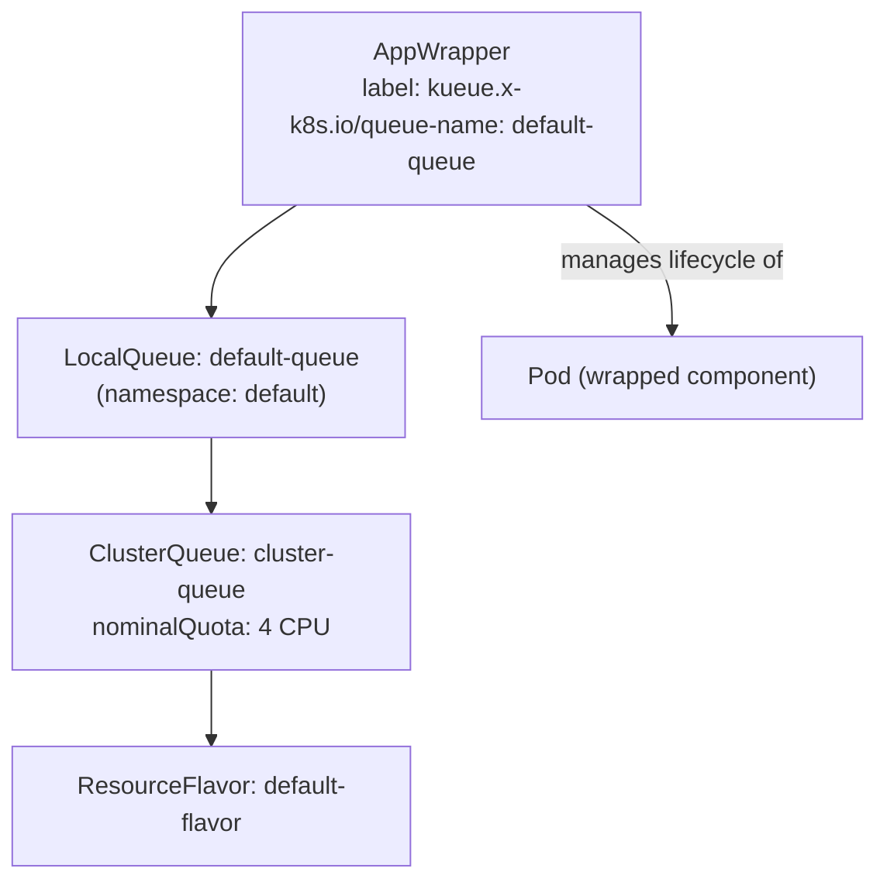
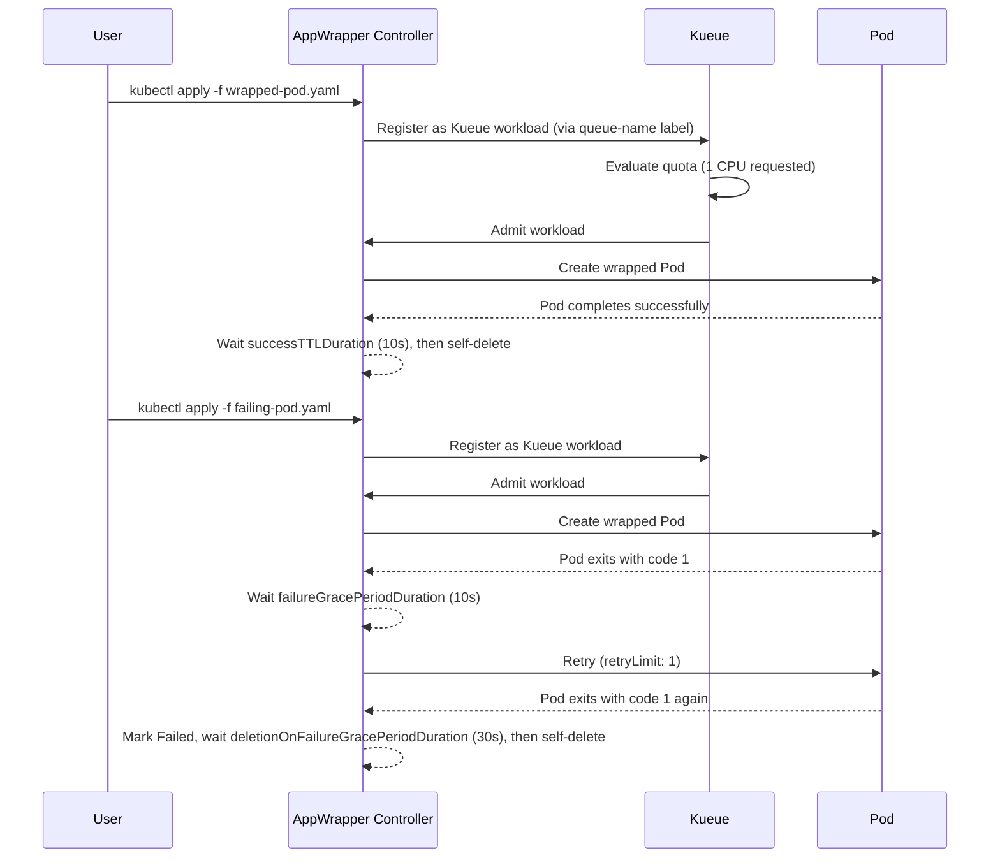

# Kueue + AppWrapper

## What This Experiment Demonstrates

[AppWrapper](https://github.com/project-codeflare/appwrapper) is a Kueue-integrated CRD from CodeFlare that wraps arbitrary Kubernetes resources into a single schedulable unit. Instead of Kueue managing Jobs directly, it manages `AppWrapper` objects — enabling Kueue admission for any resource type (Pods, custom CRDs, etc.).

Key concepts demonstrated:

- **AppWrapper as a Kueue workload** — wrap a plain Pod so it gets Kueue-managed admission
- **Retry/failure policy** — AppWrapper retries failed workloads with configurable grace periods and retry limits
- **Cleanup TTL** — successful AppWrappers auto-delete after a configurable duration

---

## Cluster Layout

Single Kind cluster (`kueue-worker-1`) with 1 control-plane + 1 worker node.



---

## Kueue Resources

**File:** [`kueue-resources.yaml`](./kueue-resources.yaml)

| Resource | Name | Config |
|----------|------|--------|
| ResourceFlavor | `default-flavor` | No node selector (matches all nodes) |
| ClusterQueue | `cluster-queue` | 4 CPU nominal quota |
| LocalQueue | `default-queue` | Namespace: `default` |

---

## AppWrapper Specs

### Successful Pod — [`wrapped-pod.yaml`](./wrapped-pod.yaml)

Wraps a Pod that runs `sleep 30` after a 10s init container stall.

```yaml
annotations:
  workload.codeflare.dev.appwrapper/successTTLDuration: "10s"  # auto-delete 10s after success
```

### Failing Pod — [`failing-pod.yaml`](./failing-pod.yaml)

Wraps a Pod that always exits with code 1. Demonstrates AppWrapper's retry/failure handling.

```yaml
annotations:
  workload.codeflare.dev.appwrapper/failureGracePeriodDuration: 10s
  workload.codeflare.dev.appwrapper/retryPausePeriodDuration: 10s
  workload.codeflare.dev.appwrapper/retryLimit: "1"
  workload.codeflare.dev.appwrapper/deletionOnFailureGracePeriodDuration: "30s"
```

---

## Experiment Flow



---

## Step-by-Step Instructions

### Step 1: Create the cluster

```bash
kind create cluster --config kind.yaml
```

### Step 2: Install Kueue + AppWrapper

```bash
# Install Kueue
kubectl apply --server-side -k "https://github.com/project-codeflare/appwrapper/hack/kueue-config?ref=v1.2.1"
kubectl -n kueue-system wait --timeout=300s --for=condition=Available deployments --all

# Apply Kueue resources
kubectl apply -f kueue-resources.yaml

# Install AppWrapper controller
kubectl apply --server-side -f https://github.com/project-codeflare/appwrapper/releases/download/v1.2.1/install.yaml
kubectl -n appwrapper-system wait --timeout=300s --for=condition=Available deployments --all
```

### Step 3: Configure image pull secrets (if needed)

```bash
for ctx in kind-kueue-worker-1; do
  for ns in default; do
    kubectl create secret generic regcred \
      --from-file=.dockerconfigjson=$HOME/.docker/config.json \
      --type=kubernetes.io/dockerconfigjson \
      -n "${ns}" --context "${ctx}"
    kubectl patch serviceaccount default -n "${ns}" \
      -p '{"imagePullSecrets": [{"name": "regcred"}]}' \
      --context "${ctx}"
  done
done
```

### Step 4: Submit the successful AppWrapper

```bash
kubectl apply -f wrapped-pod.yaml
```

Watch the AppWrapper and Pod lifecycle:

```bash
watch -n 1 kubectl get appwrapper
watch -n 1 kubectl get pods
```

Expected progression:

```
NAME         STATUS    AGE
sample-pod   Pending   1s   ← waiting for Kueue admission
sample-pod   Running   3s   ← admitted, Pod created
sample-pod   Succeeded 45s  ← Pod completed
# AppWrapper self-deletes after 10s (successTTLDuration)
```

### Step 5: Submit the failing AppWrapper

```bash
kubectl apply -f failing-pod.yaml
```

Expected progression:

```
NAME                  STATUS    AGE
sample-failing-pod    Running   3s   ← admitted, Pod created
sample-failing-pod    Failed    35s  ← Pod exited with code 1
sample-failing-pod    Running   55s  ← retry attempt (retryLimit: 1)
sample-failing-pod    Failed    90s  ← retry also failed
# AppWrapper self-deletes after 30s (deletionOnFailureGracePeriodDuration)
```

Inspect the AppWrapper status:

```bash
kubectl describe appwrapper sample-failing-pod
```

---

## Key Observations

| Behaviour | Mechanism |
|-----------|-----------|
| Pod created only after quota available | Kueue admission via `queue-name` label on AppWrapper |
| Kueue `Workload` object auto-created | AppWrapper registers itself as a Kueue workload |
| Retry on failure | `retryLimit` + `retryPausePeriodDuration` annotations |
| Auto-delete on success | `successTTLDuration` annotation |
| Auto-delete on permanent failure | `deletionOnFailureGracePeriodDuration` annotation |

---

## Cleanup

```bash
kubectl delete appwrapper --all
kubectl delete -f kueue-resources.yaml
kind delete cluster --name kueue-worker-1
```

---

## References

- [AppWrapper GitHub](https://github.com/project-codeflare/appwrapper)
- [AppWrapper + Kueue integration docs](https://project-codeflare.github.io/appwrapper/)
- [Kueue docs](https://kueue.sigs.k8s.io/docs/)
