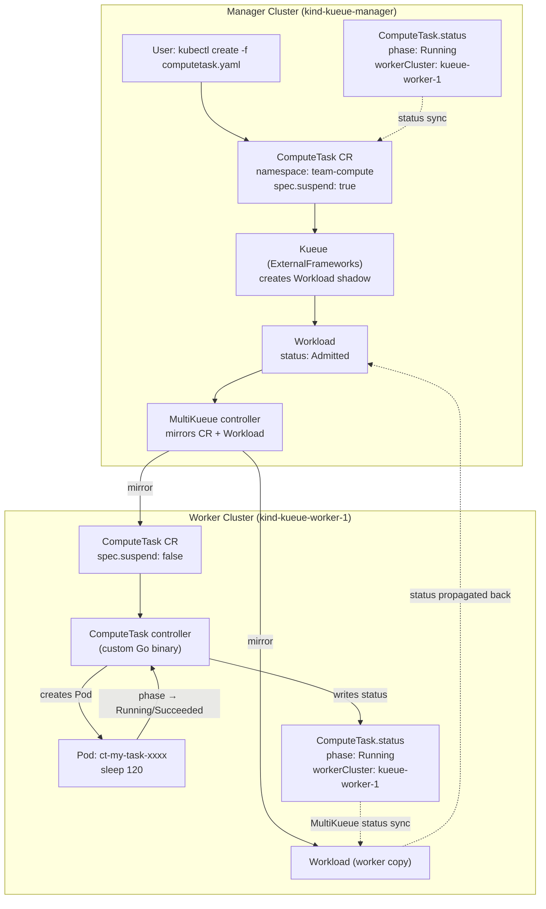

# Experiment 10 — MultiKueue with a Custom CRD (ComputeTask)

## What This Demonstrates

Previous experiments (05–09) federate built-in Kubernetes workload types (Jobs,
JobSets) via MultiKueue.  This experiment answers the question:

> **Can I use MultiKueue with my own custom CRD?**

The answer is yes, via Kueue's **ExternalFrameworks** feature gate.  This
experiment shows the complete end-to-end flow:

1. A user submits a `ComputeTask` CR to the **manager** cluster with a
   `kueue.x-k8s.io/queue-name` label.
2. Kueue on the manager creates a shadow `Workload` and gates it on quota.
3. Once admitted, **MultiKueue** mirrors both the `Workload` and the
   `ComputeTask` CR to the **worker** cluster.
4. A custom Go controller on the worker watches `ComputeTask` objects and
   creates a backing `Pod` when `spec.suspend` is cleared.
5. The worker controller writes `status.phase`, `status.workerCluster`, and
   timing fields back to the `ComputeTask` on the worker.
6. MultiKueue's built-in status-sync propagates the worker `Workload` status
   back to the manager `Workload`, which in turn updates the manager
   `ComputeTask` status.

---

## Architecture



---

## Key Concepts

### ExternalFrameworks Feature Gate

Kueue's `ExternalFrameworks` feature gate (enabled in `values.yaml`) allows
third-party CRDs to participate in Kueue's admission flow.  The CRD must be
registered in the `integrations.externalFrameworks` list in the Kueue
configuration:

```yaml
integrations:
  externalFrameworks:
  - "ComputeTask.v1alpha1.compute.example.com"
```

The format is `Kind.version.group`.

### What Kueue Does for External Frameworks

For every `ComputeTask` object with a `kueue.x-k8s.io/queue-name` label, Kueue:

1. Creates a `Workload` object in the same namespace.
2. Watches `spec.suspend` to detect when admission is granted or revoked.
3. Reads the pod-set resource requirements that the controller's `GenericJob`
   implementation declares (100m CPU / 64Mi memory per task).
4. Enforces quota via `ClusterQueue` / `LocalQueue`.

### What MultiKueue Does

MultiKueue intercepts the `Workload` once admitted (with the `multikueue-check`
`AdmissionCheck`) and:

1. Copies the `ComputeTask` CR to the worker cluster.
2. Clears `spec.suspend: false` on the worker copy (unsuspending it).
3. Watches the worker `Workload` status and propagates it back to the manager.

### What the Custom Controller Does

The `computetask-controller` binary runs only on the worker cluster.  When it
sees a `ComputeTask` with `spec.suspend: false`:

1. Creates a Pod named `ct-<computetask-name>` that sleeps for
   `spec.durationSeconds` seconds.
2. Watches the Pod and maps its phase to `status.phase`.
3. Writes `status.workerCluster` from the `WORKER_CLUSTER_NAME` env var.
4. Writes `status.startTime` and `status.completionTime`.

### Manager vs Worker ClusterQueue

| Field | Manager CQ | Worker CQ |
|---|---|---|
| `nominalQuota` (cpu) | `400m` (budget) | `3000m` (real nodes) |
| `admissionChecksStrategy` | `multikueue-check` | absent |
| Purpose | Policy + quota gate | Actual execution capacity |

---

## Prerequisites

- `kind` ≥ 0.22
- `kubectl`
- `helm` ≥ 3.14
- `docker`
- `go` ≥ 1.23

---

## Step-by-Step Walkthrough

### Step 1 — Bootstrap

```bash
bash setup.sh
```

`setup.sh` does the following in order:

1. Creates `kueue-manager` and `kueue-worker-1` Kind clusters.
2. Installs the `ComputeTask` CRD on both clusters.
3. Installs cert-manager + Kueue (with `ExternalFrameworks` gate) on both clusters.
4. Runs `go mod tidy` and `docker build` for the custom controller.
5. Loads the controller image into `kueue-worker-1` via `kind load docker-image`.
6. Extracts the worker's internal kubeconfig, rewrites the server address from
   `127.0.0.1` to the Docker bridge IP, and stores it as a Secret on the manager.

Expected: both clusters show `coredns` and `kueue-controller-manager` ready.

---

### Step 2 — Apply MultiKueue Wiring (manager only)

```bash
kubectl apply -f 01-multikueue-objects.yaml --context kind-kueue-manager
```

Creates:
- `MultiKueueCluster/kueue-worker-1` — points to the worker kubeconfig Secret.
- `MultiKueueConfig/multikueue-config` — lists the worker cluster.
- `AdmissionCheck/multikueue-check` — used by the manager ClusterQueue.

Verify the worker connection is `Ready`:

```bash
kubectl get multikueuecluster -o wide --context kind-kueue-manager
# NAME             ACTIVE   AGE
# kueue-worker-1   True     10s
```

---

### Step 3 — Apply ClusterQueues

```bash
kubectl apply -f 02-manager-clusterqueue.yaml --context kind-kueue-manager
kubectl apply -f 03-worker-clusterqueue.yaml  --context kind-kueue-worker-1
```

Verify both are `Active`:

```bash
kubectl get clusterqueue --context kind-kueue-manager
kubectl get clusterqueue --context kind-kueue-worker-1
```

---

### Step 4 — Apply Namespace + LocalQueue (both clusters)

```bash
for ctx in kind-kueue-manager kind-kueue-worker-1; do
  kubectl apply -f 04-namespace-localqueue.yaml --context $ctx
done
```

---

### Step 5 — Deploy the ComputeTask Controller (worker only)

```bash
kubectl apply -f 05-controller-worker.yaml --context kind-kueue-worker-1
kubectl wait deploy/computetask-controller \
  -n computetask-system \
  --for=condition=available --timeout=3m \
  --context kind-kueue-worker-1
```

The controller will start watching `ComputeTask` objects in all namespaces.

---

### Step 6 — Submit a ComputeTask to the Manager

```bash
kubectl create -f 06-computetask.yaml --context kind-kueue-manager
```

Because `generateName` is used, a unique name is assigned.  Capture it:

```bash
TASK=$(kubectl get computetask -n team-compute --context kind-kueue-manager \
  -o jsonpath='{.items[0].metadata.name}')
echo "Task name: $TASK"
```

---

### Step 7 — Observe Admission on the Manager

Immediately after creation, the task is suspended and a `Workload` is created:

```bash
kubectl get computetask -n team-compute --context kind-kueue-manager
# NAME             PHASE     WORKER   AGE
# my-task-xxxxx    Pending            2s

kubectl get workload -n team-compute --context kind-kueue-manager
# NAME                     QUEUE           RESERVED IN   ADMITTED   AGE
# computetask-my-task-xxx  compute-queue   compute-cq    True       5s
```

Once the `Workload` is admitted, Kueue clears `spec.suspend` on the manager
copy and MultiKueue begins mirroring.

---

### Step 8 — Observe Mirroring to the Worker

MultiKueue copies the `ComputeTask` to the worker and clears `spec.suspend`:

```bash
kubectl get computetask -n team-compute --context kind-kueue-worker-1
# NAME             PHASE     WORKER             AGE
# my-task-xxxxx    Running   kueue-worker-1     8s
```

The controller has created a Pod on the worker:

```bash
kubectl get pod -n team-compute --context kind-kueue-worker-1
# NAME                  READY   STATUS    RESTARTS   AGE
# ct-my-task-xxxxx      1/1     Running   0          6s

kubectl logs ct-${TASK} -n team-compute --context kind-kueue-worker-1
# ComputeTask team-compute/my-task-xxxxx starting
```

---

### Step 9 — Observe Status Propagation Back to Manager

The worker controller writes status to the worker ComputeTask.  MultiKueue's
status sync picks this up and reflects it on the manager:

```bash
kubectl get computetask "${TASK}" -n team-compute \
  -o jsonpath='{.status}' --context kind-kueue-manager | jq .
# {
#   "phase": "Running",
#   "workerCluster": "kueue-worker-1",
#   "podName": "ct-my-task-xxxxx",
#   "startTime": "2026-05-14T10:00:05Z"
# }
```

After `durationSeconds` (120s by default), the Pod exits and the status
transitions to `Succeeded`:

```bash
kubectl get computetask "${TASK}" -n team-compute \
  -o jsonpath='{.status.phase}' --context kind-kueue-manager
# Succeeded
```

---

## Key Observations

| Observation | Explanation |
|---|---|
| `ComputeTask` on manager has `status.workerCluster` set | The worker controller writes this; MultiKueue propagates it back via Workload status sync |
| No Pods are ever created on the manager cluster | The manager has no worker nodes; Kueue only does policy + admission there |
| The `ComputeTask` CRD must exist on both clusters before Kueue starts | MultiKueue needs to be able to create the CR on the worker at admission time |
| `spec.suspend: true` is the default | Kueue sets this to gate execution until a Workload is admitted |
| Worker ClusterQueue has no `admissionChecksStrategy` | Adding `multikueue-check` to the worker would cause an infinite dispatch loop |
| `ExternalFrameworks` gate is required on both clusters | The manager needs it to create Workload shadows; the worker needs it to recognize the CR |

---

## Directory Structure

```
10-multikueue-custom-crd/
├── controller/                       # Custom Go controller source
│   ├── api/v1alpha1/
│   │   ├── computetask_types.go      # CRD Go types (spec, status, phases)
│   │   └── computetask_kueue.go      # Kueue GenericJob adapter
│   ├── internal/controller/
│   │   └── computetask_controller.go # Reconcile loop (Pod lifecycle)
│   ├── main.go                       # Controller-manager entrypoint
│   ├── go.mod
│   └── Dockerfile
├── 00-computetask-crd.yaml           # CRD manifest (apply to both clusters)
├── 01-multikueue-objects.yaml        # MultiKueueCluster + Config + AdmissionCheck
├── 02-manager-clusterqueue.yaml      # Manager ResourceFlavor + ClusterQueue
├── 03-worker-clusterqueue.yaml       # Worker ResourceFlavor + ClusterQueue
├── 04-namespace-localqueue.yaml      # Namespace + LocalQueue (both clusters)
├── 05-controller-worker.yaml         # Controller Deployment + RBAC (worker only)
├── 06-computetask.yaml               # Sample ComputeTask workload
├── kind-manager.yaml                 # Manager Kind cluster config
├── kind-worker.yaml                  # Worker Kind cluster config
├── values.yaml                       # Kueue Helm values (ExternalFrameworks ON)
├── setup.sh                          # Automated bootstrap
├── teardown.sh                       # Resource cleanup
└── README.md                         # This file
```

---

## Cleanup

```bash
bash teardown.sh
```

To also delete the clusters:

```bash
kind delete cluster --name kueue-manager
kind delete cluster --name kueue-worker-1
```

---

## References

- [Kueue External Frameworks docs](https://kueue.sigs.k8s.io/docs/tasks/dev/integrate_a_custom_job/)
- [MultiKueue overview](https://kueue.sigs.k8s.io/docs/concepts/multikueue/)
- [Kueue GenericJob interface](https://pkg.go.dev/sigs.k8s.io/kueue/pkg/controller/jobframework#GenericJob)
- [controller-runtime](https://pkg.go.dev/sigs.k8s.io/controller-runtime)
