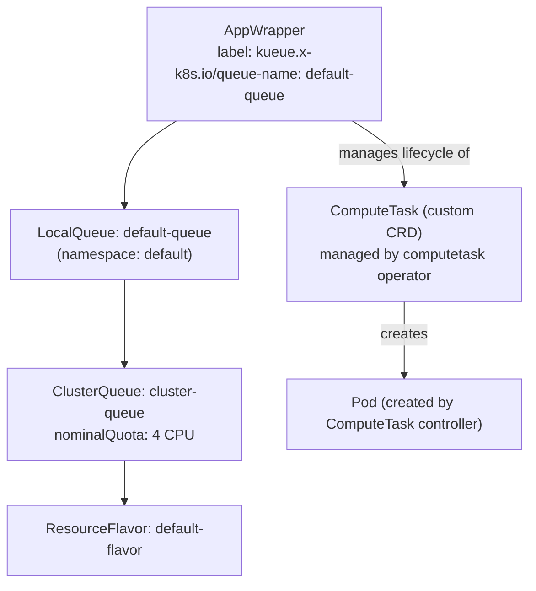
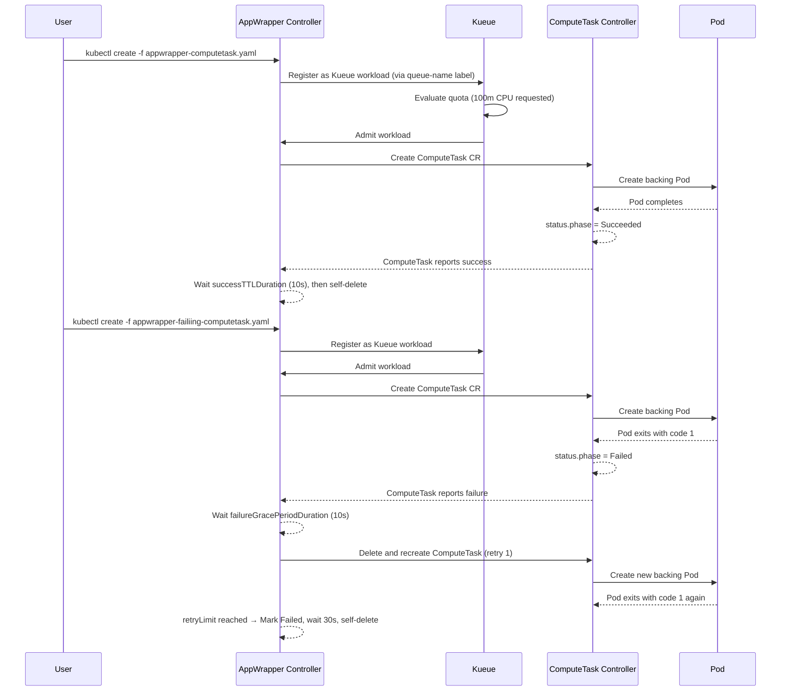

# Kueue + AppWrapper + Custom CRD

## What This Experiment Demonstrates

Extends experiment 10 by wrapping a **custom CRD** (`ComputeTask`) inside an AppWrapper instead of a plain Pod. The `ComputeTask` is a kubebuilder-scaffolded operator (from `kubebuilder/computetask/`) that manages a backing Pod and reflects its phase into `status.phase`.

Key concepts demonstrated:

- **AppWrapper wrapping a custom CRD** — AppWrapper's `podSets[].path` field teaches it where to find the Pod template inside the CRD
- **RBAC for the AppWrapper controller** — AppWrapper needs a `ClusterRole` to create/manage your CRD
- **Retry on failure** — same AppWrapper retry policy, but now exercised through the CRD lifecycle
- **Full lifecycle visibility** — watch `AppWrapper`, `Workload`, `ComputeTask`, and `Pod` all at once

---

## Cluster Layout

Single Kind cluster (`kueue-worker-1`) with 1 control-plane + 1 worker node.



---

## Kueue Resources

**File:** [`kueue-resources.yaml`](./kueue-resources.yaml)

| Resource | Name | Config |
|----------|------|--------|
| ResourceFlavor | `default-flavor` | No node selector (matches all nodes) |
| ClusterQueue | `cluster-queue` | 1 CPU, 1Gi memory nominal quota |
| LocalQueue | `default-queue` | Namespace: `default` |

---

## AppWrapper Specs

### Successful ComputeTask — [`appwrapper-computetask.yaml`](./appwrapper-computetask.yaml)

Wraps a `ComputeTask` that runs a counter loop for 30 seconds then exits successfully.

```yaml
annotations:
  workload.codeflare.dev.appwrapper/retryLimit: "0"
  workload.codeflare.dev.appwrapper/successTTLDuration: "10s"
```

The `podSets[].path` field tells AppWrapper where the Pod template lives inside the CRD:

```yaml
podSets:
  - path: "template.spec.template"
    replicas: 1
```

### Failing ComputeTask — [`appwrapper-failiing-computetask.yaml`](./appwrapper-failiing-computetask.yaml)

Wraps a `ComputeTask` that counts to 15 then exits with code 1. Demonstrates AppWrapper retry through the CRD lifecycle.

```yaml
annotations:
  workload.codeflare.dev.appwrapper/failureGracePeriodDuration: 10s
  workload.codeflare.dev.appwrapper/retryPausePeriodDuration: 10s
  workload.codeflare.dev.appwrapper/retryLimit: "1"
  workload.codeflare.dev.appwrapper/deletionOnFailureGracePeriodDuration: "30s"
```

### RBAC — [`appwrapper-rbac.yaml`](./appwrapper-rbac.yaml)

Grants the AppWrapper controller service account (`appwrapper-system/appwrapper-controller-manager`) CRUD access to `ComputeTask` resources. Required because AppWrapper creates/deletes your CRD instances directly.

---

## Experiment Flow



---

## Step-by-Step Instructions

### Step 1: Create the cluster

```bash
kind create cluster --config kind.yaml
```

### Step 2: Install Kueue + AppWrapper

```bash
kubectl apply --server-side -k "https://github.com/project-codeflare/appwrapper/hack/kueue-config?ref=v1.2.1"
kubectl -n kueue-system wait --timeout=300s --for=condition=Available deployments --all

kubectl apply -f kueue-resources.yaml

kubectl apply --server-side -f https://github.com/project-codeflare/appwrapper/releases/download/v1.2.1/install.yaml
kubectl -n appwrapper-system wait --timeout=300s --for=condition=Available deployments --all
```

### Step 3: Build and deploy the ComputeTask operator

From `kubebuilder/computetask/`:

```bash
make docker-build IMG=controller:latest
kind load docker-image controller:latest --name kueue-worker-1
make install
make deploy IMG=controller:latest
```

### Step 4: Apply RBAC for AppWrapper → ComputeTask

```bash
kubectl apply -f appwrapper-rbac.yaml
```

This grants the AppWrapper controller permission to create and manage `ComputeTask` resources.

### Step 5: Submit the successful AppWrapper

```bash
kubectl create -f appwrapper-computetask.yaml
```

Watch all layers simultaneously:

```bash
kubectl get appwrapper -w
kubectl get workload -w
kubectl get computetask -w
kubectl get pod -w
```

Expected output:

```
NAME            STATUS      QUOTA RESERVED   RESOURCES DEPLOYED   UNHEALTHY   AGE
my-task-ttnq2   Suspended                                                      0s
my-task-ttnq2   Resuming    True             True                 False        0s
my-task-ttnq2   Running     True             True                 False        0s
my-task-ttnq2   Succeeded   False            True                 False        33s
```

### Step 6: Submit the failing AppWrapper

```bash
kubectl create -f appwrapper-failiing-computetask.yaml
```

Expected output (shows retry then permanent failure):

```
NAME            STATUS      QUOTA RESERVED   RESOURCES DEPLOYED   UNHEALTHY   AGE
my-task-9k96k   Running     True             True                 False        0s
my-task-9k96k   Running     True             True                 True         65s   ← first failure
my-task-9k96k   Resetting   True             True                 True         75s   ← resetting for retry
my-task-9k96k   Resuming    True             True                 True         75s
my-task-9k96k   Running     True             True                 False        75s   ← retry running
my-task-9k96k   Running     True             True                 True         2m20s ← retry failed
my-task-9k96k   Failed      False            False                True         3m
```

---

## Key Observations

| Behaviour | Mechanism |
|-----------|-----------|
| AppWrapper wraps a custom CRD, not a plain Pod | `template.apiVersion: example.com/v1` + `kind: ComputeTask` |
| AppWrapper finds the Pod spec inside the CRD | `podSets[].path: "template.spec.template"` |
| AppWrapper controller needs extra RBAC | `appwrapper-rbac.yaml` grants `ClusterRole` on `computetasks` |
| Kueue `Workload` auto-created | AppWrapper registers itself via `queue-name` label |
| ComputeTask phase mirrors Pod phase | ComputeTask controller reflects `status.phase` from backing Pod |
| Retry recreates the ComputeTask CR entirely | AppWrapper deletes and re-creates the wrapped CRD on retry |

---

## Cleanup

```bash
kubectl delete appwrapper --all
kubectl delete -f appwrapper-rbac.yaml
kubectl delete -f kueue-resources.yaml
kind delete cluster --name kueue-worker-1
```

---

## References

- [AppWrapper GitHub](https://github.com/project-codeflare/appwrapper)
- [AppWrapper + Kueue integration docs](https://project-codeflare.github.io/appwrapper/)
- [AppWrapper CRD wrapping guide](https://project-codeflare.github.io/appwrapper/arch/wrapped-resources/)
- [ComputeTask operator](../../kubebuilder/computetask/)
- [Kueue docs](https://kueue.sigs.k8s.io/docs/)
